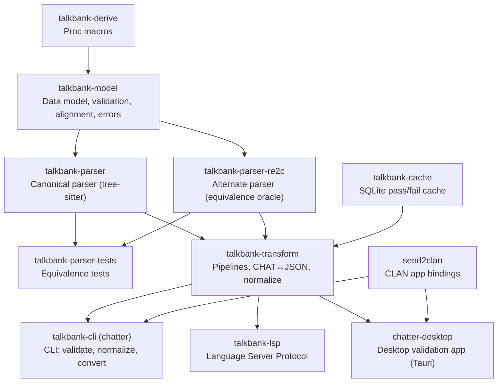

# CLAUDE.md

**Last modified:** 2026-06-23 13:31 EDT

This file provides guidance to Claude Code (claude.ai/code) when
working in this repository (`TalkBank/chatter`).

## Repo positioning (read before doing anything)

This repository is the standalone, canonical home of the TalkBank
CHAT format authority and the `chatter` tool family. **It is the
source of truth for the `chatter` binary.** The CHAT-format core is
self-contained; it builds and runs with no external TalkBank
repository, so downstream consumers (including the Batchalign ML
pipeline) depend on its crates directly.

**Scope: general-purpose CHAT tooling only.** Everything in this
repository, every subcommand, module, flag, and fixture, must be
useful to CHAT users in general, not specific to one corpus, one
data provider, or one workflow. Corpus-specific tooling belongs in
downstream projects that consume chatter. Where a general capability
needs per-corpus input, it takes a documented corpus-agnostic form,
for example the `--session-context` JSON input that supplies session
metadata to the holistic speaker-id judgment; producing that JSON
from corpus-specific sources is a downstream concern.

**Git hygiene.** Never `git push --force` and never `--no-verify`.
Do not change repository visibility or push to shared branches
without maintainer sign-off. See [`CONTRIBUTING.md`](CONTRIBUTING.md)
for the content-hygiene expectations (no secrets, internal paths, or
personal data in commits).

## Cross-Cutting Design Rules

These rules matter because contributors often read code before they
read docs.

1. **Types are the first layer of documentation.** Prefer named
   structs, enums, traits, and newtypes over raw primitives when the
   value has stable meaning.
2. **No primitive obsession at stable boundaries.** Do not introduce
   raw strings, integers, or booleans for domain concepts such as
   CHAT text, language IDs, spans, indices, counts, parser modes,
   recovery modes, or parse-health states.
3. **No tuple-packed domain seams.** If a pair or tuple has stable
   field meaning, name it with a struct or newtype.
4. **Avoid boolean blindness.** Use enums or state types when there
   are multiple meaningful states or invalid state combinations.
5. **No panic-based control flow in long-lived logic.** Do not add
   `unwrap()`, `expect()`, or equivalent panics in parser, model,
   validation, CLI, LSP, or background-tooling paths that should
   report typed failures.
6. **Use real domain errors.** Prefer `thiserror`-based error types
   and diagnostics over stringly failures.
7. **Keep modules browseable.** Split catch-all modules when they
   start combining unrelated concerns. Code organization should help
   a contributor find parser, validation, alignment, or spec logic
   quickly.
8. **Use methods when they clarify ownership.** Behavior that
   depends on a type's invariants should usually live with that
   type. Keep free functions for symmetric transforms, adapters, or
   orchestration glue.
9. **Touched docs need timestamps.** Any documentation file changed
   in a patch must update its `Last modified` field with date and
   time. **Always run `date '+%Y-%m-%d %H:%M %Z'` to get the actual
   system time**, do not guess, hardcode, or use the conversation
   date.
10. **Do not write new logic against historical CHAT options.** In
    the current grammar/model, the structured `@Options` names are
    `CA` and `NoAlign`; do not add code or tests that depend on a
    removed `dummy` option.
11. **Stack discipline: the program runs on an explicitly sized
    thread.** `chatter`'s `main()` spawns the whole program onto a
    16 MiB thread (`PROGRAM_STACK_BYTES`) because the Windows main
    thread gets only 1 MiB and debug-build clap construction outgrew
    it (2026-06-12 incident). Never move program logic back onto the
    bare OS main thread, and size any recursion-heavy worker threads
    explicitly. Details: the "CLI Startup and the Program Stack"
    architecture page; regression gate:
    `crates/talkbank-cli/tests/stack_limit_tests.rs`.

## Overview

Standalone TalkBank CHAT toolchain: tree-sitter grammar, Rust crates
(parsing, data model, validation, transformation), CLI (`chatter`),
LSP server, desktop app, and FFI bindings.

**Supported platforms:** Windows, macOS, and Linux. All code must
build and run correctly on all three platforms. CI tests on Ubuntu;
the cross-platform CI workflow exercises Ubuntu + macOS + Windows on
push to `main` and daily. Release builds will eventually target all
three (macOS ARM + Intel, Linux x86 + ARM, Windows x86), see
[`docs/strategy/distribution-and-signing.md`](docs/strategy/distribution-and-signing.md).

Data flows: **spec** (source of truth) → **grammar** (`grammar/`) →
**crates** (parsers, model, transform, cli, lsp).

## Running in Development

The CLI binary is called `chatter` (package `talkbank-cli`).

```bash
# Run chatter directly (debug build, recompiles as needed)
cargo run -p talkbank-cli -- validate path/to/file.cha
cargo run -p talkbank-cli -- to-json path/to/file.cha
cargo run -p talkbank-cli -- normalize path/to/file.cha

# Release build for large-scale work (much faster runtime)
cargo run --release -p talkbank-cli -- validate path/to/corpus/ --force

# Build the release binary once, then run it directly
cargo build --release -p talkbank-cli
./target/release/chatter validate path/to/file.cha
```

No special setup beyond a working Rust toolchain. `cargo run` handles
incremental compilation automatically.

## Build, Test, and Lint

```bash
# Rust workspace
cargo fmt
cargo check --workspace --all-targets
cargo build --workspace --all-targets --locked
cargo nextest run --workspace                # Preferred: parallel per-test
cargo nextest run -p talkbank-model          # Single crate
cargo clippy --all-targets -- -D warnings    # Periodic lint check

# Single test by name
cargo nextest run -E 'test(test_name)'

# Parser equivalence
cargo nextest run -p talkbank-parser-tests -E 'test(parser_equivalence)'

# Doctests (nextest can't run these)
cargo test --doc

# Tree-sitter grammar (intra-repo)
cd grammar && tree-sitter generate
cd grammar && tree-sitter test
cd grammar && tree-sitter parse path/to/file.cha

# Spec tools (SEPARATE Cargo workspace, must cd)
cd spec/tools && cargo test
cd spec/tools && cargo check --all-targets

# Desktop app (Tauri v2)
cd apps/chatter-desktop && npm install && cargo tauri dev   # dev mode with hot reload
cd apps/chatter-desktop && cargo tauri build                # distributable app bundle

# Shell scripts: every tracked shell script must pass shellcheck at its
# default (strictest) severity. CI enforces this (the `shellcheck` job in
# ci.yml runs the runner below); run it locally the same way:
bash scripts/lint/shellcheck-all.sh
```

**Shell scripts must pass `shellcheck` (strictest).** The `shellcheck` CI job
runs `scripts/lint/shellcheck-all.sh` over every tracked `*.sh` and shebang
script at the default severity (no `--severity` floor). Write scripts in
`bash`/`sh`, not `zsh`. Fix findings properly; only for a genuinely intentional
pattern add a line-scoped `# shellcheck disable=SCxxxx` with a reason (never a
blanket file-top disable). A comment must not begin with the word "shellcheck".

`justfile` recipes wrap the most common entry points
(`just build`, `just test`, `just clippy`, `just fmt`).

## Releases and Versioning

The version is the single `Cargo.toml [workspace.package] version`; every crate
inherits it with `version.workspace = true`, so `chatter --version` and the crates all
report the same number. Bumping it (with a matching `CHANGELOG.md` entry: the project
follows Keep a Changelog and SemVer) is the first step of any release.

Releases are produced by **cargo-dist**. Pushing a `vX.Y.Z` git tag that matches the
workspace version triggers `.github/workflows/release.yml`, which builds the signed
cross-platform CLI and desktop artifacts and creates the GitHub Release from the matching
`CHANGELOG.md` section. The desktop app (macOS signed `.dmg`, Windows, Linux) and the
self-update channels (`chatter update` for the CLI, the Tauri updater for the desktop app)
ship in that same release, so the CLI and desktop move together.

- **`release.yml` is generated by cargo-dist; do not hand-edit it.** Change release
  behavior in `dist-workspace.toml` and regenerate. Hand-edits are overwritten and have
  produced broken releases.
- **The desktop version has a single source of truth: the workspace version.**
  `apps/chatter-desktop/src-tauri/Cargo.toml` inherits it via `version.workspace = true`, and
  `apps/chatter-desktop/src-tauri/tauri.conf.json` deliberately carries NO `version` field, so
  Tauri falls back to the crate's `Cargo.toml` version (documented Tauri v2 behavior: "If
  removed the version number from `Cargo.toml` is used"). The `.dmg` and the Tauri updater
  therefore track the workspace version automatically; there is nothing to bump in lockstep.
  Do NOT re-add a literal `"version"` to `tauri.conf.json` (that reintroduces the drift this
  removal fixed).
- Signing and notarization details:
  [`docs/strategy/distribution-and-signing.md`](docs/strategy/distribution-and-signing.md).

## Architecture

**CHAT manual:** https://talkbank.org/0info/manuals/CHAT.html, the
authoritative reference for the transcript format this project
parses and validates.

```
grammar/        Tree-sitter grammar for CHAT format
  grammar.js      Grammar definition (edit this)
  src/            Generated C parser (do not edit)
  test/corpus/    Generated corpus tests (do not edit)

spec/           Source of truth: CHAT specification
  constructs/     Valid CHAT examples
  errors/         Invalid CHAT examples
  symbols/        Shared symbol registry (JSON + generators)
  tools/          Generators (separate Cargo workspace)

crates/         All Rust crates (see below)
corpus/         Reference corpus (must pass 100%)
  reference/      Sacred reference set
tests/          Integration tests and fixtures
schema/         JSON Schema for ChatFile AST
apps/chatter-desktop/   Desktop validation app (Tauri v2, React + TypeScript)
book/           Unified mdBook (user + developer + architecture docs)
docs/           Strategy, proposals, investigations (this repo only)
```

### Crate Dependency Flow



### Crate Summaries

| Crate | Key Modules | Purpose |
|-------|-------------|---------|
| `talkbank-model` | `model/`, `validation/`, `alignment/` | Data types, WriteChat, Validate trait, tier alignment, content walker |
| `talkbank-derive` | `semantic_eq.rs`, `span_shift.rs`, `error_code_enum.rs` | SemanticEq, SpanShift, ValidationTagged, error_code_enum proc macros |
| `talkbank-cache` | SQLite-backed validation + roundtrip cache | Extracted from `talkbank-transform/unified_cache/` during Session 1 |
| `talkbank-parser` | `api/`, `parser/` | CST-to-model conversion via tree-sitter |
| `talkbank-parser-re2c` | `re2c/`, `lexer.rs`, `parser.rs` | Alternate parser using re2c lexer (equivalence oracle for tree-sitter parser) |
| `talkbank-parser-tests` | golden word lists, `generated/` | Parser equivalence, roundtrip, property tests |
| `talkbank-transform` | pipelines, serialization, JSON | Parse+validate pipeline, CHAT↔JSON roundtrip |
| `talkbank-cli` | `cli/`, `commands/`, `ui/` | `chatter` binary: validate, normalize, to-json, merge |
| `talkbank-lsp` | `backend/`, `alignment/`, `graph/` | LSP server with tree-sitter incremental parsing |
| `send2clan` | `ffi.rs`, `api/` | Rust bindings around the CLAN app bridge (macOS Apple Events, Windows WM_APP) |
| `chatter-desktop` | `commands.rs`, `events.rs` | Native desktop validation app (Tauri v2, React) |

### Two Cargo Workspaces

1. **Root workspace** (`Cargo.toml`), all Rust crates under
   `crates/` + `apps/chatter-desktop/src-tauri`.
2. **Spec workspace** (`spec/Cargo.toml`), `spec/tools` for core
   generation and `spec/runtime-tools` for runtime-aware spec tooling.

Use the relevant manifest path for spec tooling:
- `spec/tools/Cargo.toml` for generation
- `spec/runtime-tools/Cargo.toml` for bootstrap/mining/runtime validation

### Shared Symbol Registry

Symbols (language codes, error markers, etc.) are defined once in
`spec/symbols/symbol_registry.json` and generated into grammar JS
and Rust code via the spec/tools generators.

## Grammar Change Workflow (Required)

**CRITICAL: `src/parser.c` (in `grammar/`) is a GENERATED artifact.**
Produced by `tree-sitter generate` from `grammar.js`. Never edit
`parser.c` directly.

**`tree-sitter test` does NOT detect stale parser.c**: it
regenerates before testing. Only `cargo test`/`cargo build` will
exhibit bugs from a stale parser.c.

When any grammar source changes (especially `grammar/grammar.js`),
run this full sequence:

1. `cd grammar && tree-sitter generate`, **MANDATORY after every
   grammar.js edit, including reverts**
2. `cd grammar && tree-sitter test`
3. Regenerate typed CST traversal, requires a local checkout of the
   `tree-sitter-grammar-utils` repository. From that checkout, run
   the `generate_traversal` example pointed at this repo's
   `grammar/src/grammar.json` + `grammar/src/node-types.json`, with
   `--skip whitespaces`, and redirect stdout into this repo's
   `crates/talkbank-parser-tests/src/generated_traversal.rs`, then
   run `cargo fmt -p talkbank-parser-tests` to normalize the output
   (the generator formats with prettyplease; this repo's CI checks
   rustfmt, so the one `cargo fmt` pass is the ONLY post-processing
   step). The generator's output is otherwise commit-ready as-is:
   it is em-dash-free, carries its own `#![allow(...)]` for the lints
   normal in generated code (including `clippy::collapsible_if`), and
   stamps a deterministic provenance header (generator identity +
   SHA-256 digests of the two input files, NO wall-clock timestamp).
   **Never hand-edit `generated_traversal.rs`** (no dash-stripping, no
   adding allows): if the output is wrong, fix the generator in
   `tree-sitter-grammar-utils` and regenerate. See that crate's
   `lib.rs` doc-comment for the exact command shape. A staleness guard
   (`generated_traversal_is_current`) recomputes the embedded digests
   from the committed grammar JSON, so a forgotten regeneration fails
   the test suite instead of shipping silently.
4. Regenerate corpus tests and error tests from specs (via the spec
   tooling, see `spec/CLAUDE.md` for the current command).
5. `cargo nextest run -p talkbank-parser && cargo nextest run -p talkbank-parser-tests`
6. Re-run at least one real-file CLI validation command covering
   the changed syntax path.

Rules:
- Do not trust parser/validator debugging output until step 1 is
  complete.
- **After reverting a grammar.js change**, you MUST re-run
  `tree-sitter generate`.
- Do not regenerate corpus expectations blindly; review failures
  first.
- `cargo nextest run -p talkbank-parser-tests` is a required
  compatibility gate.

### Grammar Design: Strict + Catch-All Pattern

For header fields with a closed set of valid values, the grammar
uses the **strict + catch-all** pattern ("parse, don't validate"):
known values as named nodes (syntax highlighting), generic catch-all
for unknown values (flagged by the Rust validator). Used by
`option_name`, `media_type`, `id_sex`, `id_ses`, and similar header
rules. See `grammar/CLAUDE.md` for details.

## Spec Change Workflow

After modifying specs in `spec/constructs/` or `spec/errors/`, run
the regeneration step described in `spec/CLAUDE.md` and then run
the parser-equivalence and reference-corpus regression gates below.

## JSON Schema Regeneration (Required)

**The canonical CHAT JSON Schema (`schema/chat-file.schema.json`) is
generated from the `talkbank-model` types and embedded into the binary
at compile time (`talkbank_transform::SCHEMA_JSON` via `include_str!`).
It does NOT regenerate itself.** Whenever you change the SHAPE of any
`ChatFile` model type, a field, a new enum variant (e.g. a new
`DependentTier`), a renamed field, a changed `#[serde]` attribute, or a
`#[doc]` comment that feeds schemars, you MUST regenerate it in the same
change, or `chatter to-json` (which validates its own output against the
embedded schema) will reject perfectly valid files with a confusing
"does not conform to schema / not valid under oneOf" error.

```bash
cargo test -p talkbank-transform --test generate_schema   # rewrites schema/chat-file.schema.json
cargo build -p talkbank-cli                                # REBUILD: the schema is include_str!-embedded
```

The rebuild is not optional: because the schema is embedded at compile
time, a stale binary keeps validating against the OLD schema until it is
rebuilt. Commit the regenerated `schema/chat-file.schema.json` alongside
the model change.

**Decision test:** "Did I change a model type's shape, fields, serde, or
doc comments?" If yes, regenerate the schema and rebuild before trusting
`to-json`. This is as mandatory as `tree-sitter generate` is after a
`grammar.js` edit.

**Automated guard:** the `committed_schema_matches_model` test (in
`crates/talkbank-transform/tests/generate_schema/generate.rs`) rebuilds the
schema from the live model and asserts it equals the committed file, so a
forgotten regeneration fails the test suite instead of shipping silently.

## Critical Policies

### Always Fix Root Causes, Never Symptoms

When a bug is found, trace it to its architectural origin and fix
it there. Do not add workarounds, "pragmatic" patches, or band-aids
that mask the real problem. "Pragmatic" is banned as a justification
for incomplete fixes.

When you discover a wrong architecture, fix it, do not perpetuate
it. If a bug reveals an incorrect architectural assumption, note the
flaw explicitly, then fix the architecture. A detection/workaround
that prevents a crash is not a fix; it is evidence the architecture
needs changing.

### Red/Green TDD: Start at the Top, Drill Down

**Every new feature and bug fix starts with a failing test, and the
first failing test MUST be the highest-level integration test you
can write for the actual boundary the bug or feature lives at.**
Unit tests on internal helpers are *additional* regression guards,
never substitutes for the top-level test.

**What counts as "highest level" depends on the bug's seam:**

| Bug lives at... | Top-level test invokes... |
|-----------------|---------------------------|
| CLI argument parsing | `Command::new("chatter")` subprocess test |
| Grammar / parser | A real CHAT fragment through `talkbank-parser::parse_*` |
| Validation rule | A real `.cha` fixture through `chatter validate` |
| LSP behavior | A real LSP request/response through the LSP backend |

**Drill down only after the top-level test is committed and failing.**
If the top-level test cannot pin the behavior precisely (e.g.
asserts the *outcome* but not which internal path produced it), add
unit tests as supplements. They are never the starter.

**The discipline:** if you find yourself writing a unit test for a
helper function as your first test, stop and ask "what's the
user-visible seam this fix sits behind?" That seam is where the
starter test goes.

### Test Failures Are Bugs Until Proven Otherwise

**When a test fails, STOP and ask the user.** Do not assume the
test expectation is wrong. Do not update test expectations to match
new behavior without explicit approval.

CHAT semantics are subtle and domain-specific. The grammar, parser,
and model encode years of decisions about how overlap markers,
lengthening, CA notation, zero-words, and other CHAT constructs
interact. An LLM cannot reliably judge whether a behavioral change
is correct by reading code alone.

**The rule:**
1. If a test fails after your change, report the failure with the
   exact `left`/`right` values and the test name.
2. Explain what your change did and why you think the behavior
   changed.
3. **Ask the user** whether the old expectation or the new behavior
   is correct. Do not guess.
4. Only update the test after the user confirms the new behavior
   is intended.

This applies especially to:
- `cleaned_text()` expectations (what counts as "spoken text")
- Overlap marker handling (⌈⌉⌊⌋, structural vs content)
- CA notation (°, ↑, ↓, ∆, etc.)
- Lengthening vs colon disambiguation
- Zero-word and omission semantics
- Any grammar change that alters the CST structure

### Grammar/Parser Bug Fixes Require Specs and Reference Corpus

**Every grammar or parser bug fix MUST be TDD'd with specs and
reference corpus entries based on actual data.** This prevents
regressions and documents the fix for successors.

**The workflow:**
1. Find the bug (error in corpus data, failing parse, wrong CST)
2. **RED:** Add a spec in `spec/constructs/` or `spec/errors/` that
   captures the exact input pattern. Add a reference corpus file in
   `corpus/reference/` using real data from the affected corpus.
3. Regenerate the test (see `spec/CLAUDE.md`). Verify it fails (or
   would fail without the fix).
4. **GREEN:** Fix the grammar/parser. Run `tree-sitter generate`,
   `tree-sitter test`, then the specific Rust parser test.
5. **REFACTOR:** Clean up. Run the full reference-corpus regression
   gate as a final check.

**Specs are permanent regression gates.** A bug that has a spec can
never silently regress. A bug fixed without a spec WILL regress
eventually.

### Exhaustive Match on Content Types

Every `match` on `UtteranceContent` or `BracketedItem` must
explicitly list all variants, no `_ =>` catch-alls that silently
discard unhandled content types. All group types must recurse into
their `BracketedContent`.

### "Consecutive" Means In-Order Traversal

When CHAT rules refer to "consecutive", "sequential", or "adjacent"
items on the main tier, this ALWAYS means **document order via
recursive traversal**, NOT adjacent indices in the flat
`Vec<UtteranceContent>`. Items inside groups (`<...>`, `"..."`,
etc.) are part of the sequence. Always use `walk_words` or
equivalent in-order walker, never raw index adjacency.

### Reference Corpus (a regression signal, NOT a validity authority)

`corpus/reference/` is a **synthesized** set of fixtures built to
exercise CHAT constructs. It is NOT real data and NOT an authority on
what is valid CHAT: any fixture in it can be wrong, including being
invalid CHAT mistakenly committed as valid. So when a parser/validation
change causes a reference file to be rejected, do NOT reflexively treat
that as a regression to suppress. Adjudicate the file against the real
authorities (CLAN `check` as a strict lower bound, and the CHAT manual);
if the file is in fact invalid, FIX THE DATA (correct it, or move it to
`spec/errors/` as an invalid example), do not weaken the parser to keep
it passing. The intent is still that every file currently in
`corpus/reference/` be valid CHAT, so the roundtrip gate stays green:

```bash
cargo nextest run -p talkbank-parser-tests --test roundtrip_reference_corpus
```

but "the gate went red" is a prompt to check the data, not proof the
change is wrong.

### Mandatory Regression Gate (Parser/Model/Alignment)

For any change touching parser, data model, validation, alignment,
serialization, or roundtrip logic:

1. `cargo nextest run -p talkbank-parser-tests -E 'test(parser_equivalence)'`
2. `cargo nextest run -p talkbank-parser-tests --test roundtrip_reference_corpus`
3. Both must pass before any commit.

### Pre-Push Gate: CI must be green before announcing

Until a workspace-level `make verify` recipe exists, the pre-push
gate is **GitHub Actions CI green on the pushed commit** (Rust +
book, plus the cross-platform workflow on `main`). The CI badges in
`README.md` are the canonical signal; don't claim a push is done
until both workflows have completed.

### Parser Recovery and Data Integrity

- Do not fabricate dummy model values during parser recovery.
- On malformed input, report diagnostics and mark parse-taint
  (`ParseHealth`).
- **Recovery is not validity.** The tree-sitter parser recovers from
  malformed input by inserting `ERROR` / `MISSING` CST nodes and
  continuing, so the LSP and downstream repair always get an AST. But a
  document that NEEDED a recovery node did not conform to the grammar
  and is invalid: a whole-tree backstop in `parse_lines_with_old_tree`
  surfaces every surviving recovery node not already covered by a
  per-region diagnostic (`ERROR` -> `UnparsableContent`/E316, `MISSING`
  -> `MissingRequiredElement`/E342). Never silently drop a recovery
  node; the AST is still produced (recovery preserved), only the
  diagnostic is added. The re2c oracle must mirror this (emit a matching
  diagnostic on the same input), per its MISSING-Token Recovery Policy.
- Lenient recovery must not fail fast on malformed existing `%mor`
  / `%gra` tiers. If the source contains a `%mor` or `%gra` line,
  the recovered AST must preserve that tier slot in place even when
  the tier contents are malformed, so downstream repair/regeneration
  can mutate in place without reordering against later dependent
  tiers such as `%wor`.
- Alignment/validation must honor parse-taint and skip
  mismatched-domain checks.
- Prefer cheap byte-oriented prefix dispatch before heavier parser
  machinery.
- Prefer shared diagnostic constructors over ad hoc
  `ParseError::new(...)`.

### CST Traversal Rules (talkbank-parser)

- `WHITESPACES` nodes: skip with comment explaining no semantic
  content.
- Unrecognized CST nodes: MUST report via `ErrorSink` using
  `unexpected_node_error()`.
- Group content dispatch: all nested content types must be
  explicitly dispatched.

### Test File Policy

Never create ad hoc `.cha` test files. Use existing files from
`corpus/reference/` or ask the user to provide test files.

### Error Code Testing Policy

All error code tests flow through `spec/errors/`. Every error code
MUST have a spec in `spec/errors/E###_*.md`. Tests are GENERATED
via the spec tooling, never hand-written.

### %mor Syntax: UD Only

**This project supports Universal Dependencies (UD) syntax for
`%mor` tiers; we deliberately do not support legacy CLAN mor
syntax.** In particular:

- **Fusional-suffix marker `&`** (as in `aux|be&PRES`,
  `verb|break&PAST`) is a CLAN mor convention. It is **not**
  parsed. If it appears in input, the `&X` portion ends up as part
  of the lemma string, that's a silent degradation, not a feature.
- All morphological features are hyphen-separated:
  `verb|break-Past`, not `verb|break&PAST`.
- Feature casing is sentence-case UD: `Past`, `Pres`, `Fin`, `Ind`,
  plus canonical combined tags like `S3` for person+number. Not
  all-caps.
- Reference corpus files must use UD syntax. Any `%mor` line with
  `&` is a fixture bug, fix it, do not introduce CLAN-mor handling
  to accommodate it.

**Rationale.** Actual TalkBank/CHILDES data in current use is
UD-tagged. CLAN mor is legacy. Our XML golden-parity target is UD
behavior on real data, not syntax-space coverage of legacy CLAN mor.
Maintaining two %mor syntaxes would double surface area for no
downstream benefit.

**Legacy CLAN-mor `&` handling.** In legacy CLAN mor, `&` is a
fusional-suffix marker that maps to an `<mk type="sfxf">PRES</mk>`
element in TalkBank XML. Rust emits nothing (the `&PRES` is already
absorbed into the lemma). This is an intentional divergence from the
legacy convention; do not "fix" Rust to reintroduce `&` handling.

### Cache Policy

The validation cache lives in the OS cache directory
(`~/Library/Caches/talkbank-chat/` on macOS, `~/.cache/talkbank-chat/`
on Linux, `%LocalAppData%\talkbank-chat\` on Windows). Use `--force`
to refresh specific paths. The `TALKBANK_CHAT_CACHE_DIR` environment
variable relocates the cache root (used verbatim, no suffix); it is
the only effective override on Windows, where the default resolves
through the Known Folder API and ignores `HOME`-style variables.
Integration tests MUST isolate the cache through the `CliHarness`,
which sets this variable; `HOME`-based isolation alone is a Windows
race (cross-platform CI incident, 2026-06-12).

## Rust Coding Standards

### Edition and Tooling

- Rust **2024 edition**.
- `cargo fmt` before committing. Use `cargo fmt` (not standalone
  `rustfmt`) for workspace-consistent formatting.
- **Prefer `cargo nextest run`** for faster parallel-per-test
  execution. Use `cargo test --doc` for doctests (nextest can't run
  those).
- CI runs **two-pass clippy**: `--lib --bins` with the strict
  per-crate `deny` lints; `--tests` with `unwrap_used`, `expect_used`,
  `panic`, `unreachable`, `todo`, `unimplemented` relaxed via
  `-A`. Production code is held to the panic-audit policy; test code
  is allowed to unwrap fixtures by convention.

### Error Handling

- **No panics for recoverable conditions.** Use typed errors
  (`thiserror`); use `miette` for rich diagnostics where appropriate.
- **No silent swallowing.** Every unexpected condition must be
  handled with explicit error reporting, no `.ok()`,
  `.unwrap_or_default()`, or silent fallbacks that hide bugs.

### Output and Logging

- **Library crates:** `tracing` macros (`tracing::info!`,
  `tracing::warn!`, etc.), never `println!`/`eprintln!`.
- **CLI binaries:** `println!`/`eprintln!` for user-facing output;
  `tracing` for debug logging.
- **Test code:** `println!` is acceptable (cargo captures it).

### Lazy Initialization

- `LazyLock<Regex>` (from `std::sync`) for constant regex patterns.
  Never call `Regex::new()` inside functions or loops.
- `OnceLock` for per-instance memoization of runtime-determined
  values.
- Prefer `const` when possible (even better than lazy).
- All lazy init via `std::sync`, no external crate dependencies
  needed.

### Type Design

- **No boolean blindness.** Enums over bools for anything beyond
  simple on/off. This is a hard rule.
  - **Banned:** 2+ bool parameters on a function, 2+ related bool
    fields on a struct, opposite bool pairs (`foo`/`no_foo`), bool
    return where meaning is unclear without reading docs.
  - `#[derive(Default, clap::ValueEnum)]` enum with named variants.
    For clap CLI args, use `#[arg(value_enum)]` instead of
    `--flag`/`--no-flag` pairs.
  - **OK as bool:** `verbose`, `force`, `quiet`, `dry_run`, single
    `include_*`/`skip_*` flags, anything where the parameter name
    fully communicates what `true` means.
- **`BTreeMap` for deterministic JSON** in tests and snapshot tests
  (not `HashMap`). Ensures consistent, reviewable diffs.
- Prefer explicit enums over ambiguous `Option` when there are
  multiple meaningful states.

### Newtypes Over Primitives

- **No primitive obsession.** Domain values must have domain types.
  Function signatures should be self-documenting through type
  names, not parameter names.
- Use newtype structs (e.g., `struct TimestampMs(u64)`,
  `struct SpeakerId(String)`) or the `interned_newtype!` /
  `string_newtype!` macros from `talkbank-model`. Newtypes should
  implement `Display`, `From`/`Into` for the underlying type, and
  derive `Clone`, `Debug`, `PartialEq`, `Eq` as appropriate.
- **Scope:** Applies to public API boundaries, struct fields, and
  function signatures. Local variables inside a function body may
  use bare primitives when the context is unambiguous.
- **Parsing boundaries:** Parse raw strings into newtypes at the
  boundary (file I/O, CLI args, IPC). Interior code should never
  handle raw strings for typed values.
- **No ad-hoc format parsing.** Use real parsers (XML: `quick-xml`,
  JSON: `serde_json`, etc.) not regex or string splitting for
  structured formats. Regex is appropriate only for flat text
  pattern matching (search, normalization, validation of simple
  formats).

### Integer Discipline

- **Distinguish meaning.** Not all `usize` values are
  interchangeable. Separate:
  - **Index**: position into a collection (`UtteranceIndex`,
    `GraIndex`)
  - **Count**: accumulated quantity (`WordCount`,
    `UtteranceCount`)
  - **Limit**: upper bound for iteration or reporting
    (`UtteranceLimit`, `WordLimit`)
  - **Threshold**: minimum value for inclusion
    (`FrequencyThreshold`)
  - **ID**: opaque identifier (`NodeId`, `SpeakerIndex`)
- Non-negative quantities use unsigned types; newtypes enforce
  domain semantics.
- **No bare numeric literals** except `0`, `1`, and simple loop
  bounds. All other numbers must be named constants. Assess whether
  each constant should be configurable.

### Closed-Set Strings and Constants

- **Closed sets must be enums.** If a string value comes from a
  known finite set (tier labels, command names, output formats),
  represent it as an `enum` with a `FromStr` parser and `Display`
  serializer. Use `Other(String)` escape hatch only when the set is
  genuinely extensible.
- **All remaining string literals must be defined constants.** No
  scattered `"mor"` or `"cod"` strings, use `TierKind::Mor` or
  `const DEFAULT_TIER: &str = "cod"`.
- **Config defaults:** Use `const` values or enum variants in
  `Default` impls, not `"string".to_owned()` (avoids runtime
  allocation, makes the default visible at the type level).

### File Path Discipline

- File paths use `PathBuf`/`&Path`, never `String`. Convert to
  strings only at display/serialization boundaries via `.display()`
  or `.to_string_lossy()`.
- Distinguish base filename (e.g., `MediaFilename` newtype, no
  extension) from full filesystem path (`PathBuf`).
- Use `.display()` for user-facing output; `.to_string_lossy()`
  only for cache keys or hashing.

### Configurability

- Hardcoded thresholds and limits belong in config struct fields
  with documented defaults.
- If a default is useful to change per-invocation → CLI flag.
- If a default is useful to change per-user → future `defaults.toml`
  file (not yet implemented).
- Config structs must be constructible in tests without filesystem
  or network access.

### Rustdoc as Primary Documentation

- **Types are the primary documentation layer.** A reader of
  crates.io rustdocs should understand the domain by reading type
  definitions alone.
- Every `pub` type and function must have a doc comment explaining
  role, ownership, invariants, and CHAT manual references where
  applicable.
- Newtypes must document valid values, units, and meaningful
  operations.
- Enum variants must document when each variant applies.

### File Size Limits

- **Recommended:** ≤400 lines per file.
- **Hard limit:** ≤800 lines per file (must be split).

### Testability

- **No global mutable state.** All command state flows through
  explicit `State` types (the `AnalysisCommand` trait pattern).
  Enforce this going forward.
- Config structs must be constructible in tests without filesystem,
  network, or environment setup.
- Stateful resources (caches, pools, registries) must accept
  injected dependencies for test control.

### Refactoring Triggers

Stop and refactor when you see:

- `x: i32, y: i32` for domain data → use domain structs
- `start_ms: u64, end_ms: u64` → use `TimestampMs` newtype or
  `TimeSpan` struct
- `fn foo(lang: &str, speaker: &str, path: &str)` → use
  `LanguageCode`, `SpeakerId`, typed path
- Multiple booleans for state → use enum with variants
- `fn foo(a: bool, b: bool)` or `--flag`/`--no-flag` pairs → use
  enum with `clap::ValueEnum`
- `fn parse() -> Option<T>` where failure reason matters → use
  `Result<T, ParseError>`
- `match s { "win" => ... }` on raw strings → parse to `enum` at
  boundary
- `"mor"` or `"cod"` string literals → use `TierKind::Mor` or
  `TierKind::Cod`
- `limit: usize` or `max_X: usize` → use domain-specific newtype
  (`UtteranceLimit`, `WordLimit`)
- Bare `0.5` or `60` in logic → named constant or config field
- Regex or `split()`/`find()` on XML, JSON, or other structured
  formats → use a proper parser

### Diagram Authoring Rules

**Architecture and design documentation MUST include Mermaid
diagrams.** GitHub renders Mermaid natively; all mdBook builds have
`mdbook-mermaid` enabled.

#### When to Create a Diagram

Add a diagram when documenting:
- Data flow pipelines (how data transforms through stages)
- Architecture boundaries (what owns what, who calls whom)
- State machines and lifecycles (valid transitions, terminal
  states)
- Decision trees (option routing, fallback paths)
- Type relationships (trait hierarchies, enum variants, ownership)
- Protocols (request/response sequences, IPC message flows)

**If a page describes a pipeline, boundary, or decision flow in
prose without a diagram, the page is incomplete.**

#### Diagram Type Selection

| Situation | Use | Not |
|-----------|-----|-----|
| Data flows through stages | `flowchart TD` or `flowchart LR` | `sequenceDiagram` (no named participants) |
| Request/response between components | `sequenceDiagram` | `flowchart` (hides back-and-forth) |
| Type hierarchies, trait impls | `classDiagram` | `flowchart` (wrong semantics) |
| State transitions, lifecycles | `stateDiagram-v2` | `flowchart` (no state semantics) |
| Decision trees, option routing | `flowchart TD` with diamond nodes | Text lists (hard to follow branches) |

#### The Seven Diagram Rules

These rules exist because a successor who has never met the team
will read these diagrams to understand the system. Every rule
directly addresses a documented failure mode that produces
misleading diagrams.

1. **Name every resource.** Every node must have a specific name
   AND its type/role. Not `"Cache"`, use
   `"SQLite cache\n(talkbank-cache crate)"`. A reader must be able
   to grep the codebase for the node label and find it.
2. **One concept per diagram.** Each diagram tells one coherent
   story. When in doubt, split.
3. **No conveyor belts for interactive flows.** If two components
   exchange messages (request/response, IPC, HTTP), use
   `sequenceDiagram`. Reserve `flowchart` for genuinely
   one-directional data pipelines.
4. **Show real decision points.** Decision diamonds must use real
   function names, flag names, and condition expressions, not
   `"check condition"`.
5. **Include error and fallback paths.** Every decision node must
   show what happens on failure. Mark optional paths with dashed
   lines (`-.->`).
6. **Anchor to source locations.** Architecture diagram nodes
   should include the crate, module, or file path in the label or
   in prose immediately below.
7. **Never generate diagrams from source code without
   verification.** Read the actual source files for every entity
   in the diagram; verify every node corresponds to a real module,
   function, or type; if you cannot verify a connection, omit it,
   gaps are better than lies.

#### Formatting Standards

- **Node labels:** `["Name\n(role or path)"]` for multi-line
- **Decision nodes:** `{"condition?\ndetail"}` diamond syntax
- **Edge labels:** `-->|"label"| target` for all non-trivial edges
- **Colors/styles:** Do not use custom colors. Default Mermaid
  themes ensure consistent rendering across GitHub and mdBook
- **Size limit:** Keep diagrams under about 30 nodes. If larger,
  split into focused diagrams.
- **Angle bracket escaping:** Raw angle brackets in Mermaid labels
  (`Arc<str>`, `Cow<str>`, `&str`) trigger mdBook "unclosed HTML
  tag" warnings. Escape as `&lt;str&gt;` inside labels.

#### Placement

- Place each diagram **inline**, immediately after the prose
  paragraph that introduces the concept it illustrates.
- Every diagram must have a prose introduction explaining what it
  shows and why the reader should care.

### Git

Conventional Commits format: `<type>[scope]: <description>`
Types: `feat`, `fix`, `docs`, `style`, `refactor`, `perf`, `test`,
`build`, `ci`, `chore`.

### Content Walker (shared primitive)

`talkbank-model` exports `walk_words()` / `walk_words_mut()`,
closure-based walkers that centralize the recursive traversal of
`UtteranceContent` and `BracketedItem` variants. Callers provide
only a leaf-handling closure receiving `WordItem` or `WordItemMut`
(Word, ReplacedWord, or Separator). Domain-aware gating is built
in: `Some(Mor)` skips retrace groups, `Some(Pho|Sin)` skips
PhoGroup/SinGroup, `None` recurses everything.

## CHAT-validity authority

**`chatter validate` is the authority on whether a given byte
sequence is valid CHAT.** When chatter rejects a file, the file is
invalid; the right response is to clean the data, not weaken the
parser.

## LSP Reliability Rules

- Backend initialization failures must surface as diagnostics, not
  panics.
- Request handlers should degrade gracefully when parser services
  are unavailable.
- Keep LSP diagnostics aligned with parser parse-health semantics.

## Large-Scale Corpus Validation

```bash
chatter validate path/to/corpus/ --force             # Validation only
chatter validate path/to/corpus/ --roundtrip --force  # + roundtrip check
chatter validate path/to/corpus/ --skip-alignment     # Faster (skip tier alignment)
```

Key flags: `--roundtrip`, `--force`, `--skip-alignment`,
`--max-errors N`, `--jobs N`, `--quiet`, `--format json`.

## Re2c Parser Parity Testing

The `talkbank-parser-re2c` crate is an independent CHAT parser used
as a **specification oracle**. Its purpose is to find gaps in specs
and reference corpus, every divergence between re2c and TreeSitter
is a missing test.

**The parser is the testing tool. Specs are the output.**

### Workflow

1. Run the full corpus comparison (release mode; can take many
   minutes):
   ```bash
   cargo test -p talkbank-parser-re2c --test full_corpus_parse_test --release -- --ignored --nocapture
   ```
2. Categorize divergences:
   ```bash
   cargo test -p talkbank-parser-re2c --test categorize_divergences --release -- --ignored --nocapture
   ```
3. For each divergence category, find a representative file, add a
   construct spec, add or update a reference corpus file,
   regenerate tests, fix the re2c parser to match.
4. Re-run the corpus comparison to verify reduction.

### Reports

Corpus tests write to `/tmp/re2c_*.json`. Always check timestamps.
Do NOT pipe corpus test output through grep, run directly and
tail the output file.

### CLI Integration

```bash
chatter validate --parser re2c corpus/reference/   # Validate with re2c parser
chatter validate --parser re2c --roundtrip corpus/  # + roundtrip test
```

TreeSitterParser is the default. Re2c is opt-in via
`--parser re2c`. LSP always uses TreeSitterParser (needs
incremental parsing).

## Status and Limitations

- Specs are the source of truth; regenerate tests/docs after spec
  changes.
- Generated artifacts should not be edited by hand.
- Tree-sitter parser is the default. Re2c parser available via
  `--parser re2c`.
- Do not delete the validation cache
  (`~/Library/Caches/talkbank-chat/` on macOS,
  `~/.cache/talkbank-chat/` on Linux,
  `%LocalAppData%\talkbank-chat\` on Windows) without explicit
  request.
- Rust edition 2024.

## Sub-Project CLAUDE.md Files

| File | Scope |
|------|-------|
| `grammar/CLAUDE.md` | Tree-sitter grammar design, 4-step verification, strict+catch-all pattern |
| `spec/CLAUDE.md` | Specification structure, templates, regeneration workflow |
| `spec/tools/CLAUDE.md` | Spec generator binaries, spec/runtime-tools sibling crate |
| `crates/talkbank-lsp/CLAUDE.md` | LSP crate: **alignment lives in `talkbank-model`, do not reimplement**; three `%mor`/`%gra` index spaces; RPC and feature handler rules |
| `crates/talkbank-parser-re2c/CLAUDE.md` | Re2c parser crate (alternate parser / spec oracle) |
| `apps/chatter-desktop/CLAUDE.md` | Desktop app (Tauri v2, React), **mandates TUI parity** |

## The unified mdBook (in this repo)

The single book at `book/` is the canonical user / developer
documentation for the toolchain, chatter, CHAT format, architecture,
and contributing guides all live there.

| Path | Title | Sections |
|------|-------|----------|
| `book/` | Chatter, TalkBank CHAT Toolchain | `chatter/`, `chat-format/`, `architecture/`, `contributing/` |

**Policy.** The book is the canonical user / developer documentation.
Keep only one top-level `README.md` per repo (for the marketplace /
GitHub landing page); everything else lives in the book. Do not add
parallel `GUIDE.md` / `DEVELOPER.md` / similar, if the book
doesn't yet cover a topic, add a book chapter.

## Relationship to batchalign3

For the batchalign3 ML pipeline (ASR, forced alignment, neural
morphotag), see the separate `TalkBank/batchalign3` repo. This repo
does not contain Batchalign code; downstream consumers (including
batchalign3) depend on chatter's crates directly.
