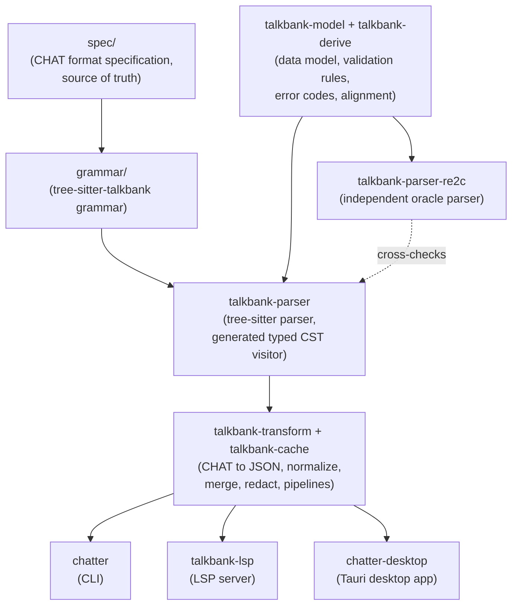

# chatter

[](https://github.com/TalkBank/chatter/actions/workflows/ci.yml)
[](https://github.com/TalkBank/chatter/actions/workflows/cross-platform.yml)
[](#license)

**chatter** is the modern toolchain for the TalkBank
[CHAT](https://talkbank.org/0info/manuals/CHAT.html) transcript format:
validate, convert, normalize, merge, and explore `.cha` files through a
desktop app, a command-line tool, and an editor language server.

## Are you a clinician or researcher? Start here

If you work with CHAT transcripts (CHILDES and the other TalkBank corpora)
and just want to use chatter, you do not need Rust or any
build tools:

- **Desktop app (no terminal needed).** Download **Chatter** for macOS,
  Windows, or Linux from the
  [latest release](https://github.com/TalkBank/chatter/releases/latest), open
  a `.cha` file or a whole folder, and read the validation results. The app
  keeps itself up to date: it checks for a new version on launch and offers
  to install it. Recommended if you do not use a command line.
- **Command line (`chatter`).** Install with one command, then validate a
  single file or a whole folder:

  ```sh
  # macOS / Linux (Windows: see Installation for the PowerShell one-liner)
  curl --proto '=https' --tlsv1.2 -LsSf https://github.com/TalkBank/chatter/releases/latest/download/chatter-installer.sh | sh

  chatter validate myfile.cha       # check one transcript
  chatter validate path/to/folder   # check an entire corpus
  chatter --help                    # list every command
  chatter update                    # update to the newest release
  ```

New to chatter? The
**[User Guide](book/src/chatter/user-guide/quick-start.md)** walks through
validating, fixing, and converting transcripts step by step, and the
[Installation](#installation) section below has full per-platform details.

## What this project is

CHAT (Codes for the Human Analysis of Transcripts) is the 40-year-old
transcription format behind every [TalkBank](https://talkbank.org) corpus.
chatter is the canonical home of the CHAT-format authority and the `chatter`
tool family, modernizing the CLAN-era workflow with typed Rust infrastructure:
a strict parser, structured validation diagnostics, programmable transforms,
and an LSP-backed editor experience.

> **Pre-1.0.** chatter is in real production use today and the CHAT-format
> core (parser, data model, validation, alignment) is mature, but public APIs
> may still change between releases until 1.0, per standard semantic
> versioning. Release history and per-release changes:
> [CHANGELOG.md](CHANGELOG.md).

## What's in this repo

### Library crates (the CHAT format authority)

| Crate | Role |
|---|---|
| [`talkbank-model`](crates/talkbank-model/) | CHAT data model, validation rules, error codes, tier-alignment primitives |
| [`talkbank-parser`](crates/talkbank-parser/) | Tree-sitter-backed primary parser (incremental, LSP-friendly), driven by a generated, exhaustive typed CST visitor |
| [`talkbank-parser-re2c`](crates/talkbank-parser-re2c/) | Independent re2c-based oracle parser that cross-checks tree-sitter on every wild-corpus file |
| [`talkbank-parser-tests`](crates/talkbank-parser-tests/) | Internal test harness: parser equivalence, reference-corpus golden tests, CLAN CHECK parity fixtures |
| [`talkbank-transform`](crates/talkbank-transform/) | CHAT to JSON, normalization, transcript merge, redaction, transform pipelines |
| [`talkbank-derive`](crates/talkbank-derive/) | Derive macros for the data model |
| [`talkbank-cache`](crates/talkbank-cache/) | SQLite-backed pass/fail cache for validation and roundtrip results |
| [`talkbank-llm`](crates/talkbank-llm/) | OpenAI-compatible HTTP judgment provider with a persistent response cache (the only network-dependent crate; backs holistic speaker-id, opt-in) |
| [`send2clan`](crates/send2clan/) | Rust bindings for "open in CLAN" (macOS Apple Events, Windows WM_APP) |

### User-facing tools

| Component | What it is |
|---|---|
| [`chatter`](crates/chatter/), the `chatter` binary | The flagship CLI: validate, normalize, convert (JSON / XML), lint, watch, plus transcript merge, speaker-id reconciliation, batch processing, and interactive adjudication |
| [`talkbank-lsp`](crates/talkbank-lsp/), the `talkbank-lsp` binary | Language Server Protocol implementation; powers real-time validation, hover, go-to-definition, and cross-tier alignment in any LSP-aware editor |
| [`apps/chatter-desktop/`](apps/chatter-desktop/) | Desktop validation app (Tauri) for researchers who do not use a terminal; runs the same validation engine as the CLI, with the same cache |

### Format authority

| Path | Role |
|---|---|
| [`grammar/`](grammar/) | The `tree-sitter-talkbank` grammar, the source of truth for CHAT syntax. Generates the parser used by `talkbank-parser`. |
| [`spec/`](spec/) | The CHAT format specification (constructs, errors, symbol registry); generates the test corpus that gates every grammar/parser change |
| [`schema/`](schema/) | JSON Schema for the typed CHAT AST emitted by `chatter to-json` |
| [`corpus/reference/`](corpus/reference/) | The reference corpus: every file must pass parser equivalence and roundtrip validation on every commit |
| [`test-fixtures/`](test-fixtures/) | Minimal `.cha` fixtures used by integration tests |

### Documentation

| Where | What |
|---|---|
| [`book/`](book/) | Comprehensive mdBook: user guides for the chatter CLI and desktop app, plus CHAT format documentation, architecture, and contributor guides |
| [`docs/strategy/`](docs/strategy/) | Strategic planning docs (distribution and signing) |
| [`docs/proposals/`](docs/proposals/) | Format-extension proposals under review |
| [`CONTRIBUTING.md`](CONTRIBUTING.md) | How to set up a fresh checkout and contribute |

## Installation

Prebuilt binaries for macOS (Apple Silicon and Intel), Linux, and
Windows are attached to every [GitHub
Release](https://github.com/TalkBank/chatter/releases). The `chatter`
CLI installs via the release's shell (macOS/Linux) or PowerShell
(Windows) installer script, or you can download the archive for your
platform directly from the release page.

- **macOS / Linux (CLI):** run the installer one-liner from the
  [latest release](https://github.com/TalkBank/chatter/releases/latest).
- **Windows (CLI):** run the PowerShell installer from the latest
  release. The downloaded binary is not yet code-signed, so SmartScreen
  may warn; choose "More info" then "Run anyway".
- **Desktop app:** download the installer for your platform from the
  release page. The macOS `.dmg` is signed and notarized; the Windows
  installer is not yet signed (same SmartScreen note as above).
- **From crates.io:** not yet published; planned to coincide with the
  1.0 release. Until then, depend on the crates via a git dependency
  pinned to a release tag.

To build the CLI from source instead, see the developer quick start
below.

## Quick start (for developers)

Prerequisites: the Rust toolchain pinned by
[`rust-toolchain.toml`](rust-toolchain.toml) (`rustup` reads it and
installs the right version automatically) and SQLite dev headers
(bundled on macOS; Linux needs `libsqlite3-dev`).

```sh
# Clone
git clone git@github.com:TalkBank/chatter.git
cd chatter

# Build the whole workspace
cargo build --workspace --all-targets --locked

# Run the full workspace test suite (cargo test --workspace also works)
cargo nextest run --workspace

# Try the chatter binary
./target/debug/chatter --help
./target/debug/chatter validate path/to/file.cha
```

Build the docs locally:

```sh
just book-install-tools
just book
# Output at book/build/html/
```

See [`CONTRIBUTING.md`](CONTRIBUTING.md) for the full development
setup and the coding conventions.

## Architecture at a glance



Detailed architecture documentation: the
[architecture overview](book/src/architecture/overview.md).

## Toolchain

- **Rust**, pinned to a specific stable release in
  [`rust-toolchain.toml`](rust-toolchain.toml) (edition 2024; no MSRV
  declared until crates.io publication)
- **Node 20+** for the desktop app's web front end
- **SQLite** dev headers (bundled on macOS; Linux `libsqlite3-dev`)

## License

Dual-licensed under your choice of:

- [MIT License](LICENSE-MIT)
- [Apache License, Version 2.0](LICENSE-APACHE)

Unless explicitly stated otherwise, any contribution intentionally
submitted for inclusion in this work shall be dual-licensed as
above, without any additional terms or conditions.

## Related projects

- [Batchalign](https://github.com/TalkBank): the neural ML pipeline
  (ASR, forced alignment, neural morphotagging) built on top of
  chatter's crates; the two projects coordinate at the CHAT-format
  boundary
- [TalkBank](https://talkbank.org): the parent project; the CHAT format
  is the data substrate for every TalkBank corpus
