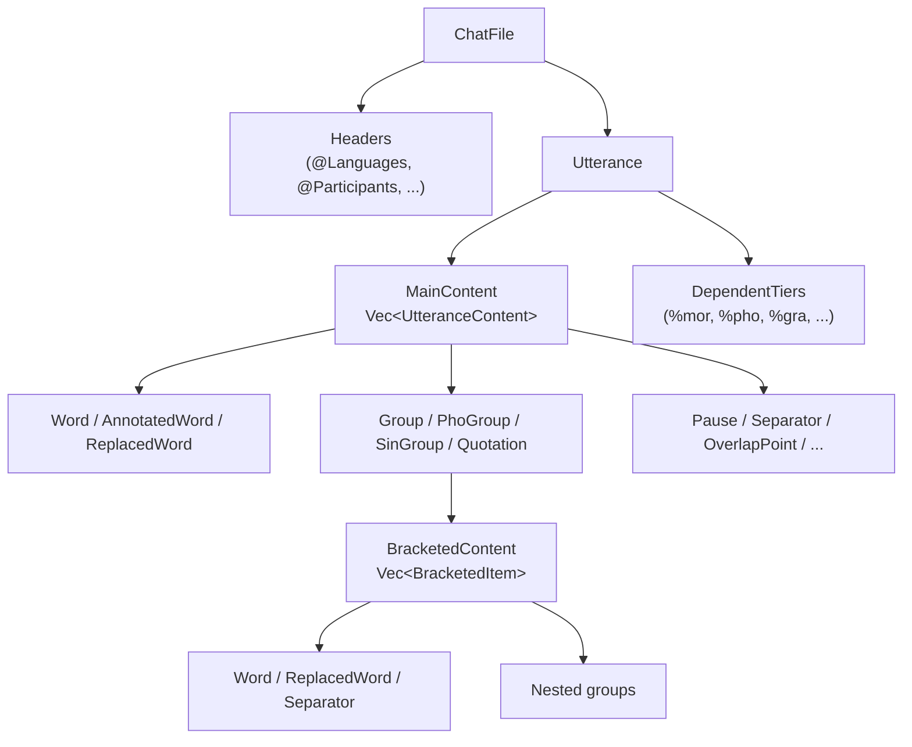
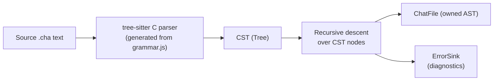

# Algorithms and Data Structures

**Status:** Current
**Last modified:** 2026-06-15 15:00 EDT

This chapter documents the key algorithms and data structure decisions across
the TalkBank Rust crates.

## CHAT AST Representation

The CHAT model is a tree of owned enums. The two central types are:

- **`UtteranceContent`**: 24 variants covering all main-tier content
- **`BracketedItem`**: 22 variants for content inside groups/brackets



**Memory layout:** Large variants (e.g., `AnnotatedWord` with scoped annotations)
are `Box`ed to keep the enum's stack size bounded.

### Content Walker

**Location:** `talkbank-model/src/alignment/helpers/walk/`

Closure-based recursive traversal centralizing the walk over all 24+22 variants:

```rust,ignore
pub fn for_each_leaf<'a>(
    content: &'a [UtteranceContent],
    domain: Option<AlignmentDomain>,
    f: &mut impl FnMut(ContentLeaf<'a>),
)
```

**Domain-aware gating:**
- `Some(Mor)`: skips retrace groups (retrace words aren't morphologically analyzed)
- `Some(Pho | Sin)`: skips PhoGroup/SinGroup (treated as atomic by those tiers)
- `None`: recurses everything unconditionally

Both immutable (`for_each_leaf`) and mutable (`for_each_leaf_mut`) versions exist.
Used by talkbank-model, talkbank-transform word extraction, and other
typed CHAT traversals across the workspace.

## Parsing Strategies

### Tree-Sitter (Canonical Parser)



- Grammar defined in `grammar/grammar.js` (source of truth)
- `parser.c` is generated, never edit directly
- CST-to-model conversion: recursive dispatch on node kind, skip `WHITESPACES`,
  report unrecognized nodes via `ErrorSink`
- **Strict + catch-all pattern:** Known header values get named grammar rules
  (syntax highlighting); unknown values hit a catch-all (flagged by validator)

### Fragment Parsing

`TreeSitterParser` provides fragment methods for parsing individual CHAT
fragments (a word, a tier line) directly. Methods like
`parser.parse_word_fragment()`, `parser.parse_main_tier_fragment()`, etc.
are used when synthesizing CHAT from non-CHAT sources (ASR output, UD
annotations).

> **Historical note:** A Chumsky-based direct parser previously provided
> combinator-based fragment parsing. It was removed in March 2026; tree-sitter
> is now the sole parser.

## Tier Alignment (1:1 Positional)

**Location:** `talkbank-model/src/alignment/traits.rs`

Generic `positional_align()` pairs main-tier words with dependent-tier items by
position (O(n)). Traits: `AlignableTier`, `TierAlignmentResult`, `AlignableContent`.

- `%pho`, `%sin`, `%wor`, use generic positional alignment
- `%mor`, `%gra`, domain-specific custom implementations
- Mismatch diagnostics via `similar` crate (Patience diff algorithm, O(n log n))

## Caching

The CHAT-core validation cache is documented separately in
[Validation Cache](parser-and-grammar/validation-cache.md). The
upstream `batchalign3` project documents its own audio-task cache
(FA / UTR ASR / media conversion) separately.

## Text Processing

### Regex Compilation

All regex patterns use `LazyLock<Regex>` from `std::sync`, compiled once at
first use, lock-free thereafter. Never call `Regex::new()` inside functions or
loops.

### Deterministic Output

- `BTreeMap` for all test/snapshot JSON (lexicographic key ordering)
- `IndexMap` for participant/speaker ordering (preserves encounter order per spec)
- Frequency results collected into `BTreeMap<NormalizedWord, Count>`
