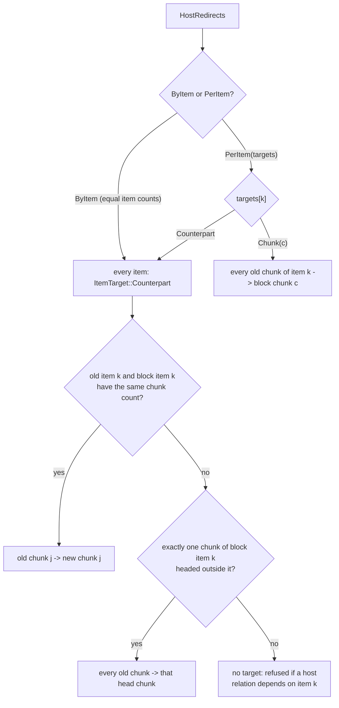

# Alignment

**Status:** Current
**Last modified:** 2026-10-02 06:50 EDT

Alignment in the toolchain operates at two structural layers, plus a
separate overlap-marker pass. Tier alignment is structural (counting and
pairing AST nodes); word extraction is positional (domain-ordered token
indices).

| Layer | Where | Purpose |
|---|---|---|
| **Tier alignment** | `talkbank-model::alignment` | 1:1 mapping between main tier and structural dependent tiers (`%mor`, `%pho`, `%sin`, `%gra`) |
| **Word timing binding** | `talkbank-model::alignment` | Count-matched positional convention between main-tier lexical slots and `%wor` timing observations |
| **Word extraction** | `talkbank-transform::extract` | Pull NLP-ready words from the AST in domain order |

## Tier Alignment

Validates that dependent tiers have the correct number and arrangement
of items relative to the main tier. Lives in
`crates/talkbank-model/src/alignment/`.

### TierDomain and PositionalDomain

```rust
enum TierDomain { Mor, Pho, Sin, Wor }        // walks, descent, word membership
enum PositionalDomain { Mor, Pho, Sin }       // counts and extraction
```

`TierDomain` is the vocabulary of the walkers and the membership rule
(`counts_for_tier`), and it has `Wor`. `PositionalDomain` is what a count or
an extraction takes (`count_tier_positions`, `collect_tier_items`,
`TierCountable`, `AlignableTier::DOMAIN`, `extract_words`), and it has no
`Wor` on purpose: the `%wor` count and pairing are
`WorMainTierProjection`'s (`MainTier::wor_projection`, then `bind_timing`
for the count and `corroborate_wor_timing` for the words), so the count and
extraction functions carry no second implementation of that count. The
overlap-marker position walk in `alignment/helpers/overlap.rs` is on
the shared walker at the `%wor` domain, the projection's own leaf set.
`PositionalDomain` converts into `TierDomain` infallibly; the reverse is a
`TryFrom` that refuses `Wor`.

Internally, the shared positional traversal carries a static domain through
both top-level and bracketed content. Its emitted payload is domain-indexed:
`%pho` positions can contain a word, a phonological group, or a pause, never a
sign group or action. `%mor` has no atomic-group payload; `%sin` can carry sign
groups and top-level actions. These are producer guarantees, not filters in a
phonology-specific second walk. Runtime-domain public APIs dispatch to this
same traversal; their signatures and alignment policies are unchanged.
Leaf admission emits the domain-typed position directly to the sink. The shared
walk does not receive an optional payload and re-test admission at each leaf;
only the policy owner decides whether a separator, pause or action contributes.

The measuring-group policy selects its atomic payload before constructing a
position. Mutable word traversal asks that same policy for the decision without
an AST payload, while immutable word traversal projects its answer to entered
content. Neither owns a second domain table. Existing spec/reference contracts
cover the container/domain matrix, grouped diagnostic presentation and shared
phonology indices; type-level exclusions do not replace those policy tests.

The same utterance produces different counts per membership domain:

| Rule | Mor | Pho | Sin | Wor |
|---|---|---|---|---|
| Skip retrace groups | Yes | No | No | No |
| Count pauses | No | Yes | No | No |
| PhoGroup | Recurse | Atomic (1) | Skip (0) | Recurse |
| SinGroup | Recurse | Skip (0) | Atomic (1) | Recurse |
| Include fragments (`&+`) | No | Yes | Yes | No |
| Include nonwords (`&~`) | No | Yes | Yes | No |
| Include fillers (`&-`) | No | Yes | Yes | Yes |
| Include untranscribed | No | Yes | Yes | No |
| Include tag-marker separators | Yes | No | No | No |
| `ReplacedWord` aligns to | Replacement | Original | Original | Original |

For the underlying word filter (`counts_for_tier`,
`should_skip_group`), the content walker, and the ChatFile model itself,
see [CHAT Data Model](chat-model/chat-model.md). The walker plus the
domain table together govern every tier-alignment count.

### Retrace handling, alignment-critical

Retraces are the most alignment-critical content type. A `Retrace` node
wraps content the speaker said then corrected.

- **Mor:** skip entirely (count `0`). The retrace was a false start;
  only the correction carries morphological analysis.
- **Pho, Sin:** recurse, words were physically produced and have
  phonological / gestural data.
- **Wor:** recurse, retrace ancestry does not change `%wor` membership.

**Critical invariant:** the parser must emit `UtteranceContent::Retrace`
for *all* retrace patterns, including single-word retraces with
replacements (`word [: repl] [* err] [//]`). If a retrace is
accidentally emitted as a bare `ReplacedWord`, it counts for `%mor`
alignment, causing false E705 errors. Enforced by
`tests/retrace_replaced_word_regression.rs`. Full data model + parsing
pipeline + CHAT examples in
[Retraces and Repetitions](../chat-format/retraces.md).

### AlignmentPair

```rust
struct AlignmentPair {
    source_index: Option<usize>,
    target_index: Option<usize>,
}
```

Universal index-pair primitive. `Some`/`Some` = matched. One `None` =
insertion / deletion placeholder for mismatch diagnostics.
`is_complete()`, both indices `Some`. `is_placeholder()`, unmatched.

### Per-domain results

| Type | Function | Source → Target |
|---|---|---|
| `MorAlignment` | `align_main_to_mor()` | Main → `%mor` items |
| `PhoAlignment` | `align_main_to_pho()` | Main → `%pho` tokens |
| `SinAlignment` | `align_main_to_sin()` | Main → `%sin` tokens |
| `GraAlignment` | `align_mor_to_gra()` | `%mor` chunks → `%gra` relations |

`%gra` aligns to `%mor` *chunks*, not items. Clitics create additional
chunks (`pro|it~v|be&PRES` = 2 chunks: pre-clitic + main).

### Trait abstractions

| Trait | Purpose | Implementors |
|---|---|---|
| `IndexPair` | `source()`/`target()` on any pair type | `AlignmentPair`, `GraAlignmentPair` |
| `TierAlignmentResult` | `pairs()`/`errors()`/`push_*()` accumulator | Structural alignment result types |
| `AlignableTier` | What a structural tier provides for generic alignment | `PhoTier`, `SinTier` |
| `TierCountable` | `count_tier_positions()` / `collect_tier_items()` methods, over a `PositionalDomain` | `[UtteranceContent]` |

The generic `positional_align()` function uses `AlignableTier` to
eliminate duplication: `align_main_to_pho()` and `align_main_to_sin()` are
thin wrappers around it. `%mor` does not use it because it has additional
terminator validation logic. `%gra` does not use it because its source is
`MorTier`, not `MainTier`.

### `%wor` is not validated

`%wor` is a timing-annotation sidecar, not a structural dependent tier.
`validate_alignments()` does **not** reject a `%wor` word-count mismatch.
Old corpus files may have `xxx`, fragments, or nonwords in `%wor`
(pre-2026-04 behavior) without producing false errors.

Consumers that need timings call `bind_wor_timing()`. Its typestate result is
one of `Missing`, `Drifted`, or `CountMatched`. A
`CountMatchedWorTimings` value exposes only the common count after equal counts have
been observed under the named `FilteredLexicalV1` membership policy. Position
permits the next comparison; it does not yet expose timing. Callers must pass
that state to `corroborate_wor_timing()`, which compares the parsed `%wor`
display tokens with the canonical display sequence derived from the main tier.
Only `CorroboratedWorTimings` exposes positional slots. Each such slot takes
lexical identity from the main tier and timing from the corresponding `%wor`
word bullet. `%wor` text may refuse unsafe reuse but cannot supply lexical
identity. A present but untimed slot is `WorSlotTiming::Unaligned`; it is not
conflated with a missing tier or count drift.

`MainTier::wor_projection()` is the single owner of current Wor-domain
selection. Both `%wor` generation and timing binding travel through that typed
projection, so membership disagreement between two implementations cannot be
represented. See
[`%wor` Timing Semantics](wor-timing.md) for the complete contract and research
boundary.

### Phon tier-to-tier alignment

A second class of alignment that operates **between dependent tiers**:

| Source | Target | Code |
|---|---|---|
| `%modsyl` | `%mod` | E725 |
| `%phosyl` | `%pho` | E726 |
| `%phoaln` | `%mod` | E727 |
| `%phoaln` | `%pho` | E728 |

Derived-view alignments: `%modsyl` is a syllabified reannotation of
`%mod`, `%phosyl` of `%pho`; those counts match directly. `%phoaln`
advances the two source tiers independently: a one-sided pause consumes a
slot only on the tier bearing it. Utterance-owned `PhoalnWordBinding` values
carry the alignment word and its bound source items. Both effective counts
and reconstruction checks consume those bindings; neither consumer indexes
the source tiers by raw alignment-word position. Missing source items remain
distinct from slots intentionally absent for an opposite-side pause.
`compute_alignments()` runs after main-tier alignment and may report E727
and E728 simultaneously. Ordinary non-pause insertions/deletions still consume
both word slots.

**Known data issue:** Phon XML source data has orthography↔IPA word
count discrepancies in ~4% of files (518 / 12,340). Expected in child
phonology data. A subset of existing corpus CHAT files handle this
inconsistently across tiers: `%mod`/`%pho` are truncated to match
orthography, one word to one word, but `%xmodsyl`/`%xphosyl`/`%xphoaln`
carry the full IPA word set, undropped. Result: E725-E728 mismatches.
As of Phon 4.0.0-beta.9 (2026-06-25), Phon reads and writes CHAT
natively; we have not seen output from that native export and do not
know whether it reproduces the inconsistency.

### Parse-health gating

Alignment diagnostics honor `ParseHealth` metadata. If a dependent
tier's domain is parse-tainted, mismatch errors for that domain pair
are suppressed. Main-tier taint blocks all main→dependent alignments.
Dependent-tier taint blocks only that tier. Phon tier-to-tier checks
have their own gates (`can_align_modsyl_to_mod`,
`can_align_phosyl_to_pho`, `can_align_phoaln`).

`ParseHealthState::Unknown`, including after JSON import, cannot authorize any
alignment. Adding one tier's taint or all dependent-tier taint preserves
`Unknown`: evidence of damage cannot establish that the remaining tiers were
parsed cleanly. Tainting an already parser-backed state only withdraws trust;
it never enables an alignment that was previously unavailable.

Explicit [checked construction](chat-model/chat-model.md#constructing-rather-than-parsing)
is a separate admission path for assembled typed documents. Its `Constructed`
state permits alignment checking but does not claim parser provenance or source
span authority. Adding recovery taint withdraws construction admission entirely;
it must never turn construction into partially clean parser evidence.

The canonical provenance workflow checks single-tier, dependent-only and
whole-utterance trust withdrawal against parsed spec/reference models. Broad
recovery must discard cached pairs and WOR timings, retain the semantic content
and tier presence, and produce stable diagnostics on repeated recomputation.
Dependent-only recovery leaves main-tier provenance clean; whole-utterance
recovery warns about both damaged alignment sides. These are public API recovery
transitions, not claims that the clean seed files contain those parse errors.

## Word Extraction

`extract_words()` (in `crates/talkbank-transform/src/extract.rs`) uses
the content walker to pull words from the AST in domain-specific order,
over a `PositionalDomain` (`%wor` words are the projection's).
Returns `Vec<ExtractedUtterance>`; each entry carries its speaker, utterance
index, and ordered `words`. Each `ExtractedWord` carries cleaned `text`,
`raw_text`, `utterance_word_index`, and `form_type`. Its governing language
mark is private: use `language_kind()` or `resolve_language()` so resolution
retains the position captured from the source during traversal. Tag-marker
separators (`,` `„` `‡`) are included as words in Mor because they have
`%mor` items (`cm|cm`, `end|end`, `beg|beg`).

Canonical replacement/retrace references verify the extracted sequences in
all three domains. Mor uses replacement words and omits retraced material;
Pho/Sin use the eligible spoken originals, including retraced words. Ordinary
explanatory annotations do not create extra extracted words. Extraction is
read-only and must preserve the original CHAT serialization.

## Overlap Marker Iteration

CA overlap markers (⌈⌉⌊⌋) appear at three content levels,
`UtteranceContent` (top-level), `BracketedItem` (inside groups), and
`WordContent` (intra-word, `butt⌈er⌉`). One API in
`talkbank-model/src/alignment/helpers/overlap.rs`, on the shared
`walk_content` at the `%wor` domain, so its word positions are the `%wor`
projection's slot indices.

### `extract_overlap_info`, region-based

The marker stream owns pairing state: opening boundaries, available closing
boundaries, and consumed closing boundaries are distinct variants. Pairing
consumes only a later closing boundary of the same kind and index; there is no
parallel bitmap whose state can drift from the markers. Unmatched openings and
closings remain explicit in the result. Opening regions retain source order,
followed by orphaned closing regions in source order. This is positional
analysis, not a validity claim or an observed acoustic onset time.

Pairs markers by (kind, index) into `OverlapRegion` structs. Each
region represents a matched ⌈...⌉ or ⌊...⌋ pair. Index-aware:
`⌈2...⌉2` forms a separate region from `⌈...⌉`. Mismatched indices
leave markers unpaired. Onset-only ⌈ (without ⌉) is a legitimate CA
convention, region has `end_at_word = None`,
`is_well_paired() = false`, but `top_onset_fraction()` still works.

### Cross-utterance, `analyze_file_overlaps`

For whole-file analysis, in `overlap_groups.rs`. 1:N matching: one
top region from speaker A can match multiple bottom regions from
speakers B, C, etc. Used by E347 and `chatter debug overlap-audit`.

### Overlap validation

| Code | Level | Check |
|---|---|---|
| E347 | Cross-utterance | Orphaned tops/bottoms with 1:N matching (warning) |
| E348 | Utterance | Unpaired markers within a single utterance (warning) |
| E373 | Utterance | Invalid overlap index values (must be 2-9) |
| E704 | Cross-utterance | Same speaker encoding both top and bottom (error) |

`chatter debug overlap-audit <path>` reports per-file statistics
(groups, bottoms, orphans, temporal consistency) in TSV format. Use
`--database <path.jsonl>` for a persistent JSON-lines database.

## Coordinated `%mor` / `%gra` replacement

`MorTier::splice_range_coordinated` (and the single-item
`splice_coordinated`) replace a contiguous range of `%mor` items and the
matching `%gra` relations in one atomic edit. Morphotag's L2 pass uses it
once per `@s` span: the span's words, reparsed in their own language,
replace the primary parse's items, and the replacement can change chunk
counts (`it's` becomes `it~'s`).

The replacement is a `SplicedBlock`, built by `SplicedBlock::new(mors,
relations)` from the items and one relation per chunk in block-relative form.
Building it is the only route to a block, and it parses the relations once:
head `0` becomes the span root and every other head a `BlockChunk` (the
block's own 1-based numbering, a different space from the host's
`SemanticWordIndex1`). A block is a tree with exactly one root; a count
mismatch, a relation out of chunk order, a head outside the block, no root or
two, or a cycle is a `SplicedBlockError`, so the splice never sees one.
`SplicedBlock::root_chunk()` returns that admitted root as a `BlockChunk`.
Callers can use it for an explicit host redirect without inspecting or
validating the block's relations again. The root and relations are immutable
after admission.

The host is admitted first: each of its relations must carry its own chunk as
its index (relation `k` of the tier, from 1, has index `k`), because every
head is read as a chunk number; a host numbered otherwise is refused
(`HostIndexOutOfOrder`). Inside the splice, the numberings it moves between
are separate private types (`host_chunks.rs` beside the splice): a host chunk
before the splice (`PreChunk`), after it (`PostChunk`), a block chunk
(`BlockChunk`), and a chunk or item of the replaced range. `Geometry::locate`
sorts a pre-splice chunk into kept or replaced, and `Geometry::translate`,
which takes only a kept chunk, is the one route from the pre-splice numbering
to the post-splice one; `Geometry::place` is the one route from a block chunk.
A post-splice number is never made from a bare integer, so a pre-splice index
cannot be written into the result. The whole new `%gra` is built from shared
borrows before either tier is written, which is what makes a refusal atomic.

Four kinds of `%gra` head are rewritten, each by its own rule:

- A head inside the block becomes the block chunk placed after the host
  chunks before the range.
- The span root attaches where the caller's `SpanRoot` says:
  `UtteranceRoot` (head `0`, relation `ROOT`), or `HostChunk { chunk,
  relation }`, a host chunk named by its index BEFORE the splice, which the
  splice translates like any host head (shifted when it lies after the
  range), with the relation the span root takes under it. That relation is
  an `AttachmentRelation`, which refuses a root label, so `ROOT` under a host
  head cannot be written. `SpanRoot::from_gra_head(head, relation)` reads the
  anchor off a host relation's `GraHeadRef`.
- A host head past the replaced range shifts by `new_chunks - old_chunks`.
- A host head INTO the replaced range depended on a word, so it must land on
  the chunk of the block that stands for that word. Only the caller knows how
  old items correspond to new ones, so it states that as a `HostRedirects`
  value, and the splice validates the statement against the admitted host
  range and the block before it changes anything.



`HostRedirects::ByItem` refuses unequal item counts
(`RedirectItemCountsDiffer`). `PerItem` with the wrong number of targets, a
`Chunk` target outside the block, or a `Counterpart` for an item the block
does not have is refused (`RedirectCountMismatch`, `RedirectOutOfBlock`,
`NoCounterpart`). A dependent of an item with no unique head chunk is refused
(`NoUniqueHeadChunk`), but only when such a dependent exists. The validated
form, one target per replaced old chunk, is private to the splice and built
from the admitted host, so it cannot be validated against one range and
applied to another.

### What the splice guarantees

The splice adds no cycle and no second root: if the host `%gra` was a tree,
the result is a tree. The block is a one-rooted tree by construction; the
span root attaches to the utterance's root only when no host relation outside
the replaced range is already a root (`UtteranceRootTaken`), and to a host
chunk only when that chunk lies outside the range (`SpanRootInReplacedRange`),
within the host (`SpanRootOutOfHost`), and its own chain of heads does not
reach the range (`SpanRootDependsOnSpan`: with `x@s y@s z .` and `z -> x`,
the span `x y` cannot hang under `z`). Every refusal leaves both tiers
unchanged. The method's rustdoc carries a worked L2 example: in `dont@s:eng
mal geh .`, the span `dont` becomes `do~n't`, `mal` (a dependent of `dont`)
moves to the span root `do`, and the span root keeps depending on `geh`,
chunk 3 before the splice and 4 after it.

## Design Principles

1. **No string hacking.** All alignment operates on typed AST
   structures (`Word`, `MorTier`, `AlignmentPair`), never on serialized
   CHAT text.
2. **Domain-aware from the start.** `TierDomain` gates traversal at the
   walker level. Downstream code never re-implements retrace / group
   skipping logic.
3. **Deterministic over approximate.** Tier alignment and word
   extraction use deterministic, positional algorithms over the typed
   AST.
4. **Dense indexed structures.** `AlignmentPair` uses `Option<usize>`
   rather than cloned data; index pairs are stored positionally, not in
   hash maps.
5. **Exhaustive matching.** Every `match` on `UtteranceContent` (24
   variants) or `BracketedItem` (22 variants) lists all variants
   explicitly. New variants are a compile error, not a silent bug.
6. **Walker as shared primitive.** `walk_words()` removed ~330 lines of
   duplicated traversal boilerplate across 7 call sites.

## Downstream Consumers

| Consumer | Crate | Usage |
|---|---|---|
| Validation | `talkbank-model` | Cross-tier checks (E714/E715, E725-E728), overlap (E347/E348/E373/E704) |
| LSP hover | `talkbank-lsp` | Show aligned tier items for word under cursor |
| Word extraction | `talkbank-transform` | NLP-ready words from utterances |
| Overlap audit | `chatter` | `chatter debug overlap-audit` |
| `%wor` generation | `talkbank-model` | Build `%wor` tier from main tier |
