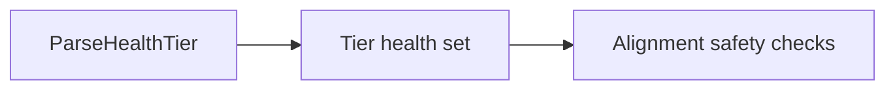

# Wide Struct Audit

**Status:** Current
**Last modified:** 2026-05-29 22:34 EDT

A repository-wide audit rule for struct shape. Applies to the crates in
`TalkBank/chatter` (model, parser, transform, CLI, CLAN, LSP, cache, and
related tooling). The rule originated in the predecessor monorepo, but this
page is scoped to the current repository rather than the old mixed
CHAT+batchalign workspace.

A struct with many fields is not automatically wrong. The smell is:

- many unrelated concerns packed into one value
- several related booleans that act like implicit policy enums
- repeated field-name prefixes that point to missing sub-structs
- parallel vectors or stringly runtime fields
- runtime code reaching into many unrelated fields of the same value

The repo therefore treats **10 or more named fields** as an audit threshold,
not as an automatic ban.

## Categories

Wide structs fall into four categories.

### 1. Boundary shim, may stay wide

CLI, JSON, or clap boundary types. Acceptable if they are converted into
typed policies or sub-structs before entering core runtime code.

Examples: `ValidateDirectoryOptions`, clap-facing CLI arg structs, JSON boundary
records.

### 2. Transport or schema record, may stay wide

DB rows, HTTP response shapes, JSON schema mirrors. Acceptable as long as
they don't become the internal runtime shape.

Examples: `WordJsonSchema`, `DbMetadata`, `CoverageReport`, `CorpusManifest`.

### 3. Real aggregate, may stay wide

Domain values whose fields all answer one coherent question and whose callers
consume the whole rather than spelunking through unrelated subsets.

Examples: metric/report records like `SpeakerEval`, `SpeakerKideval`,
`SpeakerComplexity`, and `SpeakerFluency` (report records, not runtime
coordination).

### 4. Refactor target, must be split

Mix of policy and state, multiple responsibilities, or callers needing to
know the whole subsystem to use a subset of fields.

## Design Rules

1. Treat 10 or more named fields as an audit trigger.
2. Treat 3 or more related boolean fields as a smell even below that threshold.
3. Boundary and transport records may stay wide when they mirror a real
   external shape.
4. Runtime coordination structs prefer named sub-structs over flat bags.
5. Replace parallel vectors with per-item records where possible.
6. If a wide struct stays wide, record the reason in the surrounding design
   docs, audit notes, or code review rather than letting it remain unexplained.

## Refactor Examples

### `ValidateDirectoryOptions` (chatter), was a flat bag

Used to be a flat bag of format, cache, traversal, roundtrip, parser, audit,
and TUI flags. Now grouped by concern:

- `ValidationRules`
- `ValidationExecution`
- `ValidationTraversalMode`
- `ValidationPresentation`

Shape this audit wants for policy-rich CLI boundaries: one small top-level
struct with explicit sub-objects and enums rather than a dozen flat fields.

### `ParseHealth` (talkbank-model), was a ten-boolean state vector

Now stores taint as a compact tier bitset keyed by `ParseHealthTier`, the
shape this audit expects for fixed domain sets.

## Open Hotspots

### TUI state bags

Real state owners that still want grouping by concern (selection vs. progress
vs. render flags vs. status):

- `crates/chatter/src/ui/validation_tui/state.rs` `TuiState`

### `Backend` (talkbank-lsp)

`crates/talkbank-lsp/src/backend/state.rs` is a service-root aggregate.
Defensible, but still wants grouping such as document caches, parse caches,
validation state, language services.

### Metric structs

`SpeakerEval`/`SpeakerKideval` are acceptable as report records. If output
renderers keep needing subsets (lexical metrics, morphosyntax metrics, error
counts, derived scores), those records should eventually nest along those
lines.

## Audit Guardrail

There is currently **no repo-local automated wide-struct lint** in
`TalkBank/chatter`. Treat this page as a manual review checklist and refactor
trigger: when a type grows past the threshold, decide explicitly whether it is
an acceptable boundary/schema aggregate or a real split target.
