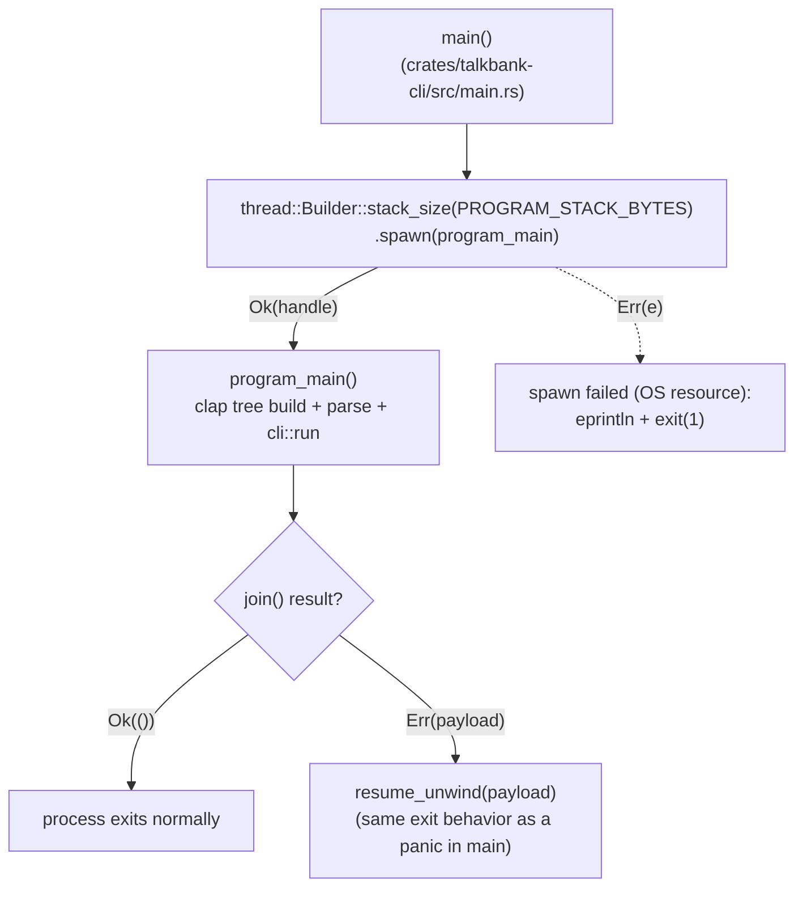

# CLI Startup and the Program Stack

**Status:** Current
**Last modified:** 2026-06-12 19:01 EDT

Why `main()` in `crates/talkbank-cli/src/main.rs` does not run the program
directly, and what every contributor adding CLI surface should know about
stack budgets.

## The incident this page exists for

From 2026-06-05 to 2026-06-12, every `chatter` invocation crashed on
Windows in debug builds with `STATUS_STACK_OVERFLOW` (exit code
`0xC00000FD`) before argument parsing even began. The crash surfaced as
four failing `adjudication_tests` subprocess tests in the windows-latest
CI job, but the faulting code was the clap-derived command-tree
construction (`Cli::augment_args` via `CommandFactory::command()`),
shared by every subcommand. The trigger was ordinary growth: the FREQ
parity work added several hundred flags across 2026-06-03/04, and the
construction path's stack needs crossed 1 MiB.

## Why stack usage is not portable

Two multipliers vary independently, and the crash happens where they
collide:

1. **Platform main-thread allowance.** There is no single default:

   | Context | Main/default stack |
   |---------|--------------------|
   | Windows main thread | 1 MiB (set in the PE header at link time) |
   | macOS main thread | 8 MiB |
   | Linux main thread | typically 8 MiB (`ulimit -s`) |
   | Rust spawned threads | 2 MiB unless `stack_size` is given |

   Shipping cross-platform means your real budget is the smallest of
   these: Windows' 1 MiB.

2. **Build profile.** At opt-level 0, rustc gives every temporary in a
   function body its own stack slot and does not coalesce them, so a
   function's frame is roughly the SUM of all its temporaries, not the
   maximum simultaneously alive. clap's derive expands to one enormous
   builder function per args struct (one multi-call chain per flag, each
   `Arg`/`Command` temporary a few hundred bytes by value), which is
   exactly the shape this penalizes. Release builds coalesce slots and
   inline, shrinking the same frames by one to two orders of magnitude.

Consequence: identical code can be fine in release on macOS (8 MiB
budget, small frames) and fatal in debug on Windows (1 MiB budget, fat
frames). Debug test binaries cross the line first, which is why CI
subprocess tests caught it and shipped release binaries never crashed.

## The design: an explicitly sized program thread

`main()` spawns the entire program onto a thread with an explicit,
documented stack size (`PROGRAM_STACK_BYTES`, 16 MiB) and only joins and
re-raises panics, so exit semantics are unchanged. This removes the
dependency on platform main-stack defaults altogether instead of
chasing the budget back under an invisible, platform-dependent line
that the CLAN parity roadmap (roughly sixty commands' worth of flags
still to come) guarantees we would cross again. rustc itself uses the
same pattern for the same reasons.

The reservation is virtual address space; physical pages are committed
only as they are touched, so the 16 MiB costs nothing measurable. The
extra thread spawn at startup is microseconds.

## Regression gates

- `crates/talkbank-cli/tests/stack_limit_tests.rs` runs the real binary
  under a Windows-sized 1 MiB stack (`sh -c 'ulimit -s 1024'`) on Unix,
  so macOS and Linux CI enforce the Windows constraint on every run.
  Without this, the constraint is tested only by the windows-latest job,
  where this incident sat unnoticed for a week.
- The windows-latest cross-platform job remains the native test of the
  real 1 MiB main stack (which no longer matters to the program thread,
  but guards the `main()` shim itself).

## Guidance for contributors

- Do not move program logic back onto the bare OS main thread; anything
  before the `spawn` runs under the platform's smallest default.
- Adding flags and subcommands is normal and expected; the budget is now
  the explicit `PROGRAM_STACK_BYTES` constant. If deep recursion or
  generated code ever approaches it, raise the constant deliberately in
  a reviewed change rather than discovering the limit in CI.
- The same two multipliers apply to any worker threads you spawn:
  Rust's 2 MiB spawned-thread default is also finite, and recursive
  parser or validation code running on worker threads should size them
  explicitly if depth is data-dependent.
