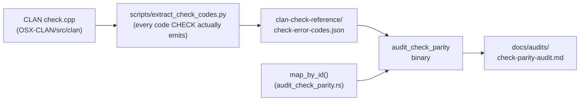

# CHECK Parity Audit

**Status:** Current
**Last updated:** 2026-06-17 11:29 EDT

CLAN's `check` (CHECK) was the long-standing validator for CHAT files. `chatter
validate` is the forward-looking replacement, and it is the **binding judgment
on whether a byte sequence is valid CHAT**: when `chatter` rejects a file, the
file is invalid and the right response is to clean the data, not to weaken the
parser. CHECK is no longer the authority on validity.

CHECK is still useful for one thing: as a **reference oracle** that helps find
validation rules `chatter` does not yet have. The CHECK Parity Audit is the
tool that compares the two systematically, so that every rule CHECK enforces is
either matched by `chatter`, or is a deliberate, documented divergence.

## What the audit answers

For every error code CLAN's `check` actually emits, the audit answers: does
`chatter` have an equivalent rule, and if not, *why not*?

- **Semantic parity**: does `chatter` enforce the same intended rule?
- **Behavioral parity**: does `chatter` match CHECK's literal runtime behavior,
  including CHECK's documented anomalies (some CHECK rules are buggy or were
  disabled in place; reproducing those bugs is not a goal)?
- **Strictness policy**: `chatter` should be *at least as strict* semantically.
  A file CHECK rejects should not silently pass `chatter` unless the divergence
  is deliberate.

## How it works



1. **The CHECK reference** is generated from CLAN's `check.cpp` by
   `scripts/extract_check_codes.py` into
   `crates/talkbank-parser-tests/clan-check-reference/check-error-codes.json`.
   It records every code CHECK *emits* (the call sites in the C source), not the
   stale subset documented in CLAN's own `CHECK-rules.md`.
2. **The mapping** lives in `map_by_id()` in
   `crates/talkbank-parser-tests/src/bin/audit_check_parity.rs`: an explicit
   CHECK-number to TalkBank-code table (for example `138 | 139 => &["E256"]`),
   with a keyword fallback for the unmapped remainder.
3. **The audit binary** joins the two and writes the report. Regenerate it with:

   ```bash
   cargo run -p talkbank-parser-tests --bin audit_check_parity
   ```

   which rewrites `docs/audits/check-parity-audit.md` (the full per-rule table
   and the executive summary). That generated file is the authoritative,
   citation-stable record; this page explains how to read it.

The current headline numbers (regenerate to refresh): of the CHECK codes that
are actually emitted, roughly two-thirds map directly to a TalkBank code, and
the audit reports semantic parity, behavioral parity, and an "enhancements
beyond CHECK" set (TalkBank codes with no CHECK equivalent, the majority).

## Triaging a gap

A CHECK rule with no TalkBank mapping is **not** automatically a `chatter` bug.
Each gap is triaged against the CLAN source (`OSX-CLAN/src/clan/check.cpp`) into
one of three buckets:

- **(a) Genuine gap.** CHECK enforces a real CHAT rule `chatter` is missing.
  *Action: implement it in `chatter`* with strict top-down TDD (a failing
  `chatter validate` test on a real `.cha` fixture first), then add the
  `map_by_id` entry. Example: curly single quotes (see below).
- **(b) Intentional divergence.** CHECK's rule is wrong, disabled, or a
  text-hack `chatter` deliberately does not reproduce. *Action: document the
  divergence, do not implement.* Examples: CHECK error 49 (uppercase-in-word)
  has been commented out in `check.cpp` since 2019, so flagging it would
  diverge from *current* CHECK; CHECK error 109 (postcodes on dependent tiers)
  is a raw character-match text-hack on `%`-tier tokens that `chatter` models as
  structured content.
- **(c) Enhancement beyond CHECK.** A TalkBank code with no CHECK counterpart.
  These are validation rules `chatter` adds; they need no CHECK mapping.

The remaining unmapped CHECK codes are an open, low-priority tail: most resolve
to bucket (b) on source examination. Closing them is not a release gate.

## Worked example: E256 (CHECK 138/139), implemented across both parsers

Curly single quotes (`U+2018`, `U+2019`) used as word characters were a genuine
gap (bucket a): CHECK errors 138/139 flag them, `chatter` previously absorbed
them silently. They are illegal CHAT word characters; CHAT uses the ASCII
apostrophe.

Because `chatter` has two parsers that must agree (the tree-sitter parser and
the re2c oracle, see [Parser Backends](../parser-backends.md)), the fix lands in
both, reaching the same recovery:

- The character is **excluded from the word token** via the shared
  [Symbol Registry](../symbol-registry.md) (so it can never be part of a word).
- The **tree-sitter grammar** recognizes it as a dedicated `illegal_curly_quote`
  node (not a generic parse error), and the parser emits `E256` with a span
  pointing at the exact character.
- The **re2c lexer** emits a recognized `IllegalCurlyQuote` token; the
  file-level parser emits `E256` and drops the token before parsing.
- In both, the offending quote is **dropped and the surrounding words survive**,
  so validation continues and reports a precise, actionable diagnostic.

This is the canonical shape of a CHECK-parity rule implemented to `chatter`'s
standards: a recognized construct (parse, don't merely fail), the same behavior
in both parsers, and a spec in `spec/errors/` that drives the tests.

## Related

- [Bullet Validation](../bullet-validation.md) documents the temporal media-bullet
  checks (CLAN errors 83/133/84 and `chatter`'s E701/E704/E729), a specific
  instance of the same "match CHECK where it is right, diverge where it is wrong"
  reconciliation this audit tracks across the whole error set.
- [Errors, CHAT core](chat-core-errors.md) describes the `ErrorCode` model and
  the parser-layer / validation-layer split.
- The spec-driven test pipeline that backs every rule is in
  [Testing](../../contributing/testing.md): rules live in `spec/errors/` and
  generate both parser tests and the validation corpus.
