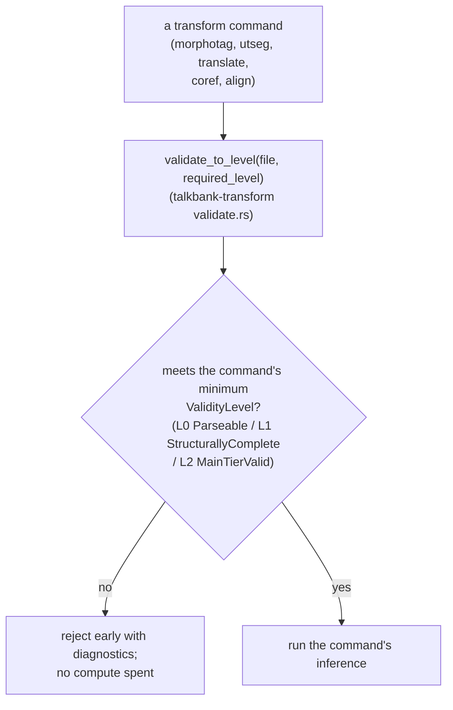

# Validation

**Status:** Current
**Last modified:** 2026-06-13 22:40 EDT

CHAT validation runs at multiple points in the processing pipeline.
All validation logic is in Rust: `talkbank-model::validation` owns
CHAT-core validation, and `talkbank_transform::validate`
(`crates/talkbank-transform/src/validate.rs`) owns the transform-side
pre/post validation gate functions (`validate_to_level`,
`validate_output`). This page covers validity levels, pre/post
validation gates, severity posture, the verification-gate set
(G0-G14), and how validation failures interact with caches and bug
reports.

For error-code infrastructure (codes, sinks, severities, layers), see
[chat-core-errors](chat-core-errors.md). For the
diagnostic UX standard, see
[error-diagnostics-ux](error-diagnostics-ux.md).

## Validity Levels

The `ValidityLevel` enum defines three cumulative validation levels.
Each level includes all checks from lower levels.

| Level | Name | Checks |
|---|---|---|
| L0 | `Parseable` | No parse errors (clean tree-sitter CST) |
| L1 | `StructurallyComplete` | `@Participants` and `@Languages` present, all speaker codes declared, every utterance has a terminator |
| L2 | `MainTierValid` | Well-formed words, valid timing bullets if present |

### Pre-validation gates

Each command requires input to meet a minimum level before
processing:

| Command | Required level |
|---|---|
| `morphotag` | `MainTierValid` |
| `utseg` | `StructurallyComplete` |
| `translate` | `StructurallyComplete` |
| `coref` | `StructurallyComplete` |
| `align` | `Parseable` (lenient, must handle messy real-world files) |

`validate_to_level()` checks the file against the required level and
returns all failures found. Invalid files are rejected early with
diagnostics, before any compute is spent on inference.



## Post-Serialization Validation

After an orchestrator injects results and serializes CHAT output, the
server runs `validate_output()`:

1. **Alignment validation**: checks that `%mor`/`%gra`/`%wor` tier
   word counts match the main tier. ParseHealth-aware: utterances
   flagged as unparseable during lenient parsing are excluded.
2. **Semantic validation**: full CHAT validation:
   - **E362**: non-monotonic timestamps (utterance bullets must
     increase).
   - **E701** / **E704**: temporal constraints (overlap rules,
     same-speaker timing).
   - Header correctness, required headers present and well-formed.
   - Cross-utterance patterns, speaker code consistency.

Only blocks on `severity="error"`, not warnings.

## Severity Posture

Validation intentionally distinguishes errors from warnings:

- **Errors** block output. The server will not write CHAT with
  error-level validation failures.
- **Warnings** are reported but do not block. Legacy corpora contain
  widespread minor violations that must remain processable.

This distinction matters especially for `%gra`:

- Existing broken `%gra` in old corpora may be accepted with warnings
  so files remain processable.
- Newly generated `%gra` from batchalign3 is validated more strictly
  before writeback.

## Bug Reports and Cache Purges

When post-serialization validation fails:

1. A structured bug report is written to
   `~/.batchalign3/bug-reports/`.
2. Cache entries that produced the invalid output are purged
   (self-correcting cache).

This prevents broken results from being served on future runs.

## Verification Contract

This repo does **not** currently expose the predecessor workspace's
`make verify` wrapper. The current local contract is the concrete command set
documented in [Developer Verification Checks](../../contributing/dev-checks.md)
and [Testing and Quality Gates](../../contributing/quality-gates.md).

Core local sweep:

```bash
cargo fmt --all -- --check
cargo build --workspace --all-targets --locked
cargo nextest run --workspace
cargo test --doc
```

Add the surface-specific checks that match the validation-affecting code you
changed:

- grammar: `cd grammar && tree-sitter generate && tree-sitter test`
- spec tools: `cargo build --manifest-path spec/tools/Cargo.toml` and
  `cargo build --manifest-path spec/runtime-tools/Cargo.toml`
- parser / model / alignment / serialization:
  `cargo nextest run -p talkbank-parser-tests -E 'test(parser_equivalence)'`
  and
  `cargo nextest run -p talkbank-parser-tests --test roundtrip_reference_corpus`

The reference corpus at `corpus/reference/` remains the sacred semantic target.
Historical labels like `G0-G14` are useful for older design notes, but they are
not the current command surface of this checkout.

## Validation at the PyO3 Boundary

There is no public Python validation API. The `ParsedChat` handle
that previously exposed `validate()` / `validate_structured()` /
`validate_chat_structured()` was retired in the 2026-03-21 PyO3
slimdown to worker-runtime-only. Validation now runs entirely on the
Rust side; when a worker invocation detects a failure it constructs
`BatchalignBoundaryError::ChatValidation { entries, … }` which the
PyO3 boundary lowers into a `CHATValidationException` carrying a
populated `errors: list[ValidationErrorEntry]` on the Python side.

Python callers that need structured validation results invoke
`batchalign3` via subprocess and catch the exception:

```python
from batchalign_core import CHATValidationException

try:
    batchalign_core.execute_v2(request)
except CHATValidationException as exc:
    for entry in exc.errors:
        print(entry.code, entry.line, entry.message)
```

Upstream batchalign runtime errors and the Python ↔ Rust boundary
contract are documented separately in the `batchalign3` project.

## Known limitations

- **Validation rules are intentionally permissive on legacy data.**
  Some checks emit warnings rather than errors so legacy corpora
  remain processable while still surfacing the issue. Examples: pre-existing
  malformed `%gra` (warned, not blocked, so files that already shipped
  with bad `%gra` round-trip cleanly); some bullet-format minor
  variants. Newly generated tiers from batchalign are validated more
  strictly before writeback.
- **`%wor` word counts are not validated against the main tier.** `%wor`
  is a timing-annotation tier with no downstream positional indexing;
  legacy files may have `xxx`, fragments, or nonwords in `%wor`
  without producing alignment errors.
- **Cross-utterance quotation validation is gated off by default**
  (`enable_quotation_validation` flag), the cross-utterance walker
  exists but is not yet wired into the standard validation gate.
- **Some error-spec / validator pairs are not yet implemented.**
  Tracked in `spec/errors/` files marked `Status: not_implemented`;
  these generate `#[ignore]` tests via the current `spec/tools`
  generators rather than
  failing CI. Run `grep -rl "Status.*not_implemented" spec/errors/`
  to enumerate.
