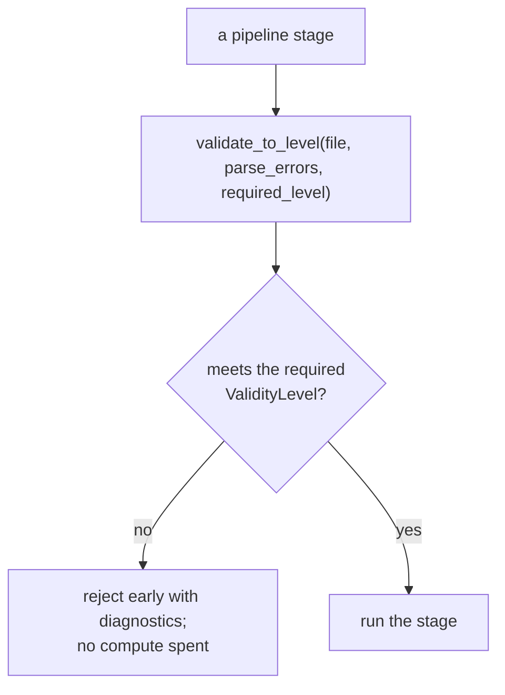

# Validation

**Status:** Current
**Last modified:** 2026-08-12 21:45 EDT

Validation levels and the pre/post gates a pipeline can build on. For the
error-code infrastructure (codes, sinks, severities, layers) see
[chat-core-errors](chat-core-errors.md); for the diagnostic UX standard see
[error-diagnostics-ux](error-diagnostics-ux.md).

All validation logic is Rust. `talkbank-model::validation` owns CHAT-core
validation; `talkbank_transform::validate` owns the gate functions
`validate_to_level` and `validate_output`.

## Validity levels

`ValidityLevel` (in `talkbank-model::pipeline`) is cumulative: each level
includes every check below it.

| Level | Name | Checks |
|---|---|---|
| L0 | `Parseable` | no parse errors |
| L1 | `StructurallyComplete` | `@Participants` and `@Languages` present, all speaker codes declared, every utterance has a terminator |
| L2 | `MainTierValid` | well-formed words, valid timing bullets if present |

The levels exist so a consumer can state the minimum quality its work needs
and reject bad input BEFORE spending compute on it, rather than discovering
the problem in the output.

```rust,ignore
use talkbank_transform::validate::validate_to_level;

// parse_errors come from the parser (typically parse_lenient).
validate_to_level(&file, &parse_errors, ValidityLevel::MainTierValid)?;
```

`validate_to_level` returns EVERY failure found up to the requested level, not
just the first. The L0 gate surfaces the first parse error's code, source
excerpt and byte span in its message, so a user can locate the problem without
reading logs.


```mermaid
flowchart TD
    cmd["a pipeline stage"]
    gate["validate_to_level(file, parse_errors, required_level)"]
    check{"meets the required\nValidityLevel?"}
    reject["reject early with diagnostics;\nno compute spent"]
    proceed["run the stage"]

    cmd --> gate --> check
    check -->|"no"| reject
    check -->|"yes"| proceed
```

**Choosing a level is a judgement about the stage, not about the data.** Work
that reads word content needs `MainTierValid`; work that only needs speakers
and utterance boundaries needs `StructurallyComplete`; work that must cope with
messy real-world files, such as forced alignment, deliberately requires only
`Parseable`.

## Post-serialization validation

`validate_output` answers a narrower question: did a transformation DEGRADE the
file? It checks that every utterance still has a terminator (CA transcripts are
exempt, since terminators are optional under `@Options: CA`) and then applies
whatever command-specific checks it knows.

**Known defect, recorded here rather than left for the next reader to
rediscover.** `validate_output` takes the command as a `&str` and dispatches
with `match command { "morphotag" => ..., "align" => ..., _ => {} }`. Two
things are wrong with that and neither is cosmetic:

- The catch-all silently skips every command-specific check. A caller passing
  a typo, or any command the match does not list, gets the terminator check
  and nothing else, with no error and no warning. It type-checks perfectly.
  `clippy::wildcard_enum_match_arm` cannot see this one, because the match is
  over an open set of strings rather than a closed enum.
- The strings name commands belonging to a downstream ML pipeline, which is
  workflow-specific knowledge embedded in a general-purpose CHAT library.

The fix is a closed enum owned by this crate, so an unhandled command is a
compile error and the general library stops naming a particular consumer's
verbs. It is left undone here only because the signature is public API with an
out-of-repo caller, so changing it is a coordinated change rather than a
drive-by.

## Severity posture

- **Errors** block output. Nothing writes CHAT that has error-level failures.
- **Warnings** are reported and do not block, because legacy corpora contain
  widespread minor violations and must remain processable.

The distinction is sharpest for `%gra`: pre-existing broken `%gra` in old
corpora is warned about rather than blocked, so files that already shipped that
way still round-trip, while newly GENERATED `%gra` is validated strictly before
writeback. The asymmetry is deliberate. Data we are responsible for producing is
held to a higher standard than data we merely have to keep readable.

## Verification

The commands are in [Developer Verification Checks](../../contributing/dev-checks.md)
and [Testing and Quality Gates](../../contributing/quality-gates.md); this page
does not duplicate them. Labels like `G0-G14` come from a predecessor workspace
and name nothing here.

The reference corpus is a synthesized regression signal, **not** a validity
authority. This page used to call it "the sacred semantic target", which is
precisely the framing that leads someone to weaken a validator so a fixture
stays green. When a change makes a reference file fail, adjudicate the FILE.

## Known limitations

- **Validation is deliberately permissive on legacy data.** Some checks warn
  rather than error so legacy corpora remain processable while the issue is
  still surfaced.
- **`%wor` word counts are not validated against the main tier.** `%wor` is a
  timing-annotation tier with no downstream positional indexing, so legacy
  files may carry `xxx`, fragments or nonwords in `%wor` without producing
  alignment errors.
- **Cross-utterance quotation validation is off by default**
  (`enable_quotation_validation`): the walker exists but is not wired into the
  standard gate.
- **Some error specs have no validator yet.** `just spec-status` is the
  authority on which, and on how many; it derives the answer from the specs
  rather than from a count written in prose.

## Consumers outside this repository

chatter contains no ML-pipeline code. Downstream consumers embed these crates
and add their own gates, bug reporting and cache invalidation; how a given
pipeline reports a validation failure, and where it writes it, is documented by
that pipeline, not here. This page previously described one such consumer's
server behaviour, PyO3 boundary types and on-disk report directory as though
they were chatter's own.
