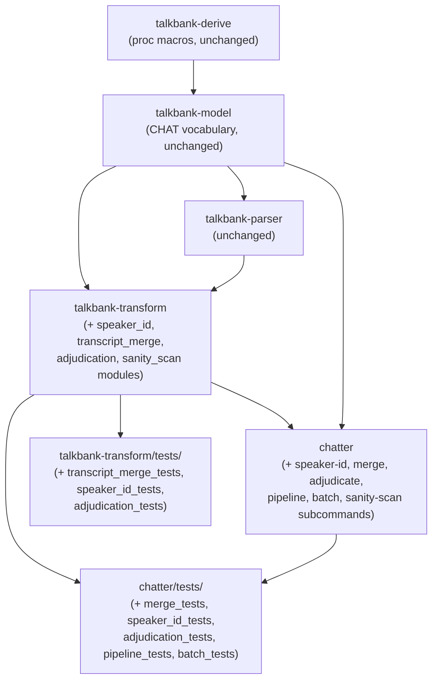
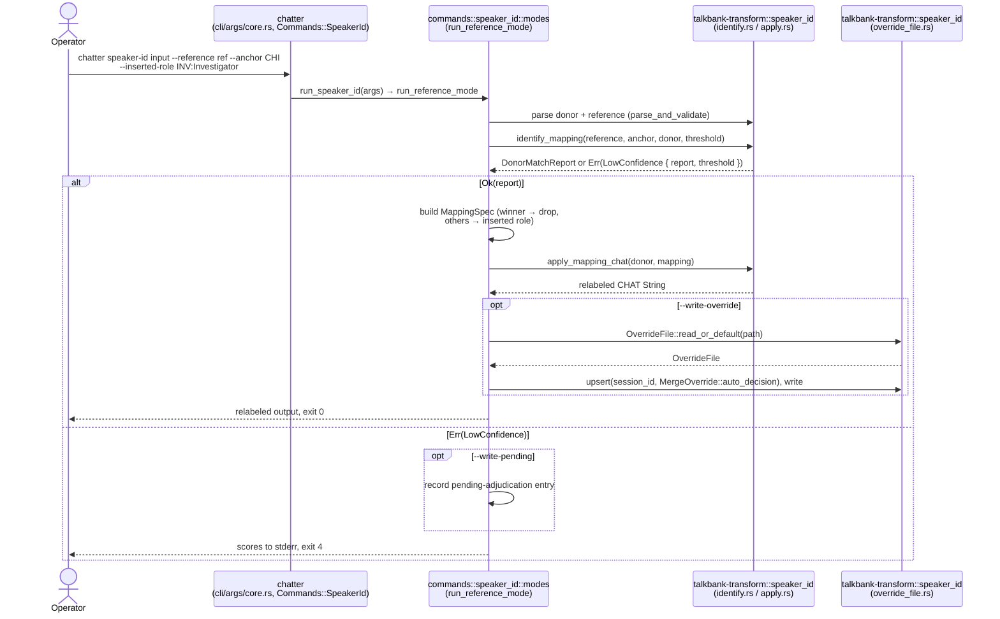
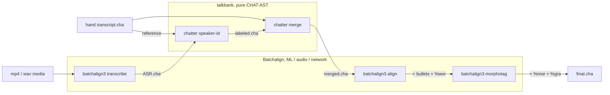

# Merge Pipeline, Crate Architecture

**Status:** Draft
**Last modified:** 2026-07-07 21:17 EDT

This page explains where the new merge-pipeline code lives in the
`chatter` workspace, which crates gain modules, what
depends on what, and which boundary each piece sits inside. The
goal is succession-readability: a contributor coming to this
work for the first time should be able to map a behavior they
read about in
[`chatter merge`](../chatter/user-guide/merge.md) or
[`chatter speaker-id`](../chatter/user-guide/speaker-id.md) to
the precise crate + module that implements it.

Companion documents:

- [Domain Types](./merge-domain-types.md): the typed vocabulary in
  `talkbank-transform::speaker_id` (and `MergeError` beside the merge
  algorithm in `talkbank-transform::transcript_merge`).
- [Test Plan](./merge-test-plan.md): what tests live where.
- [Override File Format](../chatter/integrating/merge-overrides.md),
  the on-disk format.

## Boundary decisions

Two boundary decisions govern where every new piece of code lives.
Both reference rules already documented in this repo's root `CLAUDE.md`
(workspace-root contributor guide, outside the book).

### Decision 1: talkbank-* crates, not batchalign-* crates

The merge pipeline is **pure CHAT-AST structural manipulation**,
no ML, no audio I/O, no network, no model loading, no fleet
runtime. Per the crate-boundary decision test in the workspace
CLAUDE.md:

> If code fundamentally needs ML models, audio processing, network
> services, or fleet runtime → `batchalign-*` crate. Otherwise →
> `talkbank-*` crate.

`chatter merge` and `chatter speaker-id` answer "no" to each
ML/audio/network/runtime question. They consume parsed
`ChatFile` values, manipulate them, and emit parsed-and-serialized
output. Even the speaker-id text-similarity scoring is a
deterministic function over CHAT content tokens, no ML model,
no embedding, no inference. All new merge code lives in
talkbank-* crates.

The batchalign-* crates remain the home for `batchalign3
transcribe` (ASR), `batchalign3 align` (forced alignment), and
`batchalign3 morphotag` (Stanza-based morphological tagging),
the ML-bearing stages that surround the merge in the pipeline.

### Decision 2: types and algorithms in `talkbank-transform`, CHAT vocabulary in `talkbank-model`, CLI in `chatter`

The merge pipeline's code splits across the same talkbank-* crates
that already host the parse/validate/normalize/JSON pipelines:

- **`talkbank-model`** owns the CHAT-domain vocabulary the merge
  code references (`SpeakerCode`, `ParticipantRole`,
  `ParticipantEntry`, `IDHeader`, `ChatFile`). It gained no new
  merge module.
- **`talkbank-transform`** owns both the merge-specific domain types
  (`MappingSpec`, `InsertedRoleSpec`, `SpeakerAction`,
  `OverrideMode`, `MergeOverride`, `OverrideFile`, the error enums)
  and the algorithms (token cleaning, Jaccard scoring, mapping
  application, structural merge, adjudication core). No CLI parsing,
  no clap.
- **`chatter`** owns the subcommands (`chatter speaker-id`,
  `chatter merge`, `chatter adjudicate`, plus the composing
  `pipeline` / `batch` / `sanity-scan` drivers). Thin shim layer
  that parses arguments and drives the transform layer.

**Design history.** The original design gave the domain types their
own `talkbank-model::merge` module ("types in the model crate,
algorithms in the transform crate"). As shipped, the types live with
the algorithms in `talkbank-transform::speaker_id` instead; the
`talkbank-model::merge` module was never created. See
[Domain Types §Where the types live](./merge-domain-types.md#where-the-types-live).

This mirrors how `chatter validate`, `chatter normalize`,
`chatter to-json` are wired today and keeps the crate boundaries
honest: a caller wanting the algorithms and types without CLI
machinery (e.g., a library binding, an HTTP service, an external
tool reading override files) depends on `talkbank-transform`
without pulling in `clap`.

## Crate dependency graph

The new code does not introduce any new crate-level
dependencies, every edge below already exists in the workspace
today. The merge work adds modules to existing crates.



## Module layout per affected crate

### `talkbank-model`: unchanged

`talkbank-model` gained no merge module. (The original design added
a `crates/talkbank-model/src/merge/` module with `scoring` / `role`
/ `mapping` / `retain` / `override_file` / `errors` files and
`pub use role::{InsertedRole, MappingAction}`-style re-exports; none
of that was created. The domain types shipped inside
`talkbank-transform::speaker_id` instead, with revised names; see
[Domain Types](./merge-domain-types.md).) The merge code consumes
`talkbank-model`'s existing CHAT vocabulary (`SpeakerCode`,
`ParticipantRole`, `ParticipantEntry`, `IDHeader`, `ChatFile`)
unmodified.

### `talkbank-transform`, `speaker_id/` module + `transcript_merge.rs`

Sibling top-level modules, mirroring the user-facing distinction
between the two subcommands. `speaker_id/` holds both the domain
types and the algorithms; `transcript_merge` fits in a single file:

```text
crates/talkbank-transform/src/speaker_id/
    mod.rs             pub re-exports (the crate-facing surface)
    types.rs           JaccardScore, ConfidenceMargin, ConfidenceThreshold
    mapping.rs         MappingSpec, SpeakerAssignment, parse_mapping_spec
    identify.rs        identify_mapping (token cleaning + multiset
                       Jaccard), DonorMatchReport,
                       DEFAULT_CONFIDENCE_THRESHOLD
    apply.rs           apply_mapping, apply_mapping_chat
                       (@Participants / @ID rewriting per mapping)
    override_file.rs   CURRENT_SCHEMA_VERSION, OverrideMode,
                       SpeakerAction, InsertedRoleSpec, MergeOverride,
                       OverrideFile, OverrideFileError
    provenance.rs      DecisionEngine, JudgmentProvenance, ...
    error.rs           SpeakerIdError
    judgment/          LLM holistic-judgment surface (sampling,
                       prompt rendering, provider, consume)

crates/talkbank-transform/src/transcript_merge.rs
    merge_chats (preconditions, header reconciliation, timeline
    interleave, tier strip), MergeError, DEFAULT_STRIP_TIERS

crates/talkbank-transform/src/adjudication.rs
    run_adjudication core, Prompter trait, ScriptedPrompter,
    PendingAdjudications

crates/talkbank-transform/src/sanity_scan.rs
    post-merge misclassification heuristic (scan_session)
```

All of these land alongside the existing CHAT-core transform modules
(parse, serialize, validate, normalize) in `talkbank-transform`.

Exposed via `crates/talkbank-transform/src/lib.rs`:

```rust,ignore
pub mod adjudication;
pub mod sanity_scan;
pub mod speaker_id;
pub mod transcript_merge;
```

### `chatter`, new command modules

The CLI dispatch pattern in this crate uses one directory per
multi-file command (e.g. `commands/validate/`) or one file for
single-file commands (`commands/normalize.rs`, `commands/lint.rs`).
Speaker-id warranted a directory (it has reference / explicit /
override-file operation modes plus override/pending write paths);
merge and the other pipeline commands fit in single files:

```text
crates/chatter/src/commands/speaker_id/
    mod.rs        SpeakerIdArgs + run_speaker_id entry point
    modes.rs      reference / explicit / override-file / holistic-LLM
                  mode drivers
    writes.rs     --write-override / --write-pending output paths
    support.rs    shared helpers (CODE:ROLE parsing, session-ID
                  derivation, typed error-to-exit-code mapping)

crates/chatter/src/commands/transcript_merge.rs
    run_merge: drives talkbank_transform::transcript_merge::merge_chats,
    maps MergeError to exit codes

crates/chatter/src/commands/adjudicate.rs   chatter adjudicate
crates/chatter/src/commands/pipeline.rs     chatter pipeline (speaker-id
                                            then merge, one session)
crates/chatter/src/commands/batch.rs        chatter batch (many sessions)
crates/chatter/src/commands/sanity_scan.rs  chatter sanity-scan
crates/chatter/src/commands/merge_preflight.rs  merge preflight checks
```

The CLI argument surface extends the top-level `Commands` enum in
`crates/chatter/src/cli/args/core.rs`, which carries `Merge`,
`SpeakerId`, `Adjudicate`, `Pipeline`, `Batch`, and `SanityScan`
variants with inline field definitions (not separate `*Args`
structs in the command modules). Subcommand dispatch in
`crates/chatter/src/commands/dispatch.rs` matches on the enum and
wires each arm to the respective `commands::*::run_*` entry point.

### Test crates

Per the [Test Plan](./merge-test-plan.md):

```text
crates/talkbank-transform/tests/
    speaker_id_tests.rs        L2 tests for identify_mapping /
                               apply_mapping / override-file I/O
    transcript_merge_tests.rs  L2 tests for merge invariants
    adjudication_tests.rs      L4 scripted-prompter tests

crates/chatter/tests/
    merge_tests.rs             L3 subprocess tests for chatter merge
    speaker_id_tests.rs        L3 subprocess tests for chatter speaker-id
    adjudication_tests.rs      L3 subprocess tests for chatter adjudicate
    pipeline_tests.rs          L3 composition tests (speaker-id + merge)
    batch_tests.rs             L3 batch-driver tests
    sanity_scan_tests.rs       L3 sanity-scan tests
```

(The test plan's L1 layer, `spec/constructs/speaker-id/` fragment
specs regenerated via `spec/tools`, was not created; the
token-cleaner and Jaccard behaviors are pinned by the L2 tests
instead.)

## Data flow for `chatter merge`

The full call graph when an operator runs
`chatter merge file1.cha file2.cha --retain CHI -o out.cha`:

```mermaid
sequenceDiagram
    actor Operator
    participant CLI as chatter<br/>(cli/args/core.rs, Commands::Merge)
    participant Runner as commands::transcript_merge<br/>(run_merge)
    participant Merge as talkbank-transform::transcript_merge<br/>(merge_chats)

    Operator->>CLI: chatter merge file1 file2 --retain CHI
    CLI->>Runner: run_merge(file1, file2, retain, output)
    Runner->>Merge: merge_chats(content1, content2, retain, strip_tiers, options)
    Merge->>Merge: parse_and_validate both inputs
    Merge->>Merge: preconditions (retain / timeline /<br/>languages / ambiguous / already-declared)
    Merge->>Merge: header reconcile (@Participants concat<br/>with dedupe-on-insert; @ID / @Comment injection)
    Merge->>Merge: tier strip on inserted utts · timeline sort
    Merge-->>Runner: merged CHAT String or MergeError
    alt Ok(merged)
        Runner->>Runner: write to -o path (or stdout)
        Runner-->>Operator: exit 0
    else Err(MergeError)
        Runner-->>Operator: formatted stderr + exit code 2 (Parse: exit 1)
    end
```

The CLI layer is thin: clap parses arguments into the `Commands::Merge`
variant, `run_merge` calls the transform layer's `merge_chats`
function, and translates the `Result<String, MergeError>` into
stdout/stderr/exit-code output. All algorithm logic lives in
`talkbank-transform`.

## Data flow for `chatter speaker-id`

The reference-mode call path:



The explicit-mapping and override-file modes use the same
`apply_mapping` and `--write-override` paths but skip
`identify_mapping`: the mapping comes from `parse_mapping_spec` or
from `OverrideFile::get` + `MergeOverride::to_mapping_spec`
respectively. A fourth mode (holistic LLM judgment, via the
`judgment/` submodule) produces pending-adjudication entries for
`chatter adjudicate` rather than deciding directly; see
[Adjudication Workflow](./adjudication-workflow.md).

## How this composes with the post-merge ML stages

The end-to-end pipeline `batchalign3 transcribe → chatter
speaker-id → chatter merge → batchalign3 align → batchalign3
morphotag` crosses the talkbank-* / batchalign-* boundary
twice:



Each crossing is **CHAT-file-to-CHAT-file** at a stable
serialization boundary: Batchalign emits a CHAT file, talkbank
consumes it; talkbank emits a CHAT file, Batchalign consumes
it. Neither side has a runtime dependency on the other; they
exchange data through the file system (or piped stdin/stdout)
exactly as the user-facing CLI commands do. This keeps the
boundary honest: a contributor working on the merge pipeline
never needs to load a Stanza model, and a contributor working
on `batchalign3 align` never needs to parse a speaker-id
override file.

## Public surface impact

Cumulative public API additions (the surface a downstream
library consumer would see):

| Crate | New `pub` items | Stability |
|---|---|---|
| `talkbank-model` | None; the merge work reuses the existing CHAT vocabulary (`SpeakerCode`, `ParticipantRole`, `ParticipantEntry`, `IDHeader`, `ChatFile`) unmodified | Unchanged |
| `talkbank-transform` | `speaker_id::{identify_mapping, apply_mapping, apply_mapping_chat, parse_mapping_spec, MappingSpec, SpeakerAssignment, DonorMatchReport, SpeakerIdError, CURRENT_SCHEMA_VERSION, OverrideFile, MergeOverride, OverrideMode, SpeakerAction, InsertedRoleSpec, OverrideFileError, ...}` (plus the `judgment` and provenance surfaces); `transcript_merge::{merge_chats, MergeError, DEFAULT_STRIP_TIERS}`; `adjudication::*`; `sanity_scan::*` | Stable, algorithms behind these are pinned by the test plan's L2 tests |
| `chatter` | New `Commands` enum variants (`Merge`, `SpeakerId`, `Adjudicate`, `Pipeline`, `Batch`, `SanityScan`) | Internal to the binary, not a library surface |

No existing public surface is modified or removed; this is a
purely-additive change. Existing consumers (the VS Code
extension, `talkbank-lsp`, `chatter-desktop`, `batchalign`)
continue to depend on the existing surface and can ignore the
additions until a workflow uses them.

## Where to look for things (newcomer guide)

| Question | File |
|---|---|
| "What does `chatter merge` do?" | [`book/src/chatter/user-guide/merge.md`](../chatter/user-guide/merge.md) |
| "What does `chatter speaker-id` do?" | [`book/src/chatter/user-guide/speaker-id.md`](../chatter/user-guide/speaker-id.md) |
| "What's in an override file?" | [`book/src/chatter/integrating/merge-overrides.md`](../chatter/integrating/merge-overrides.md) |
| "What types are in `talkbank-transform::speaker_id`?" | [`book/src/architecture/merge-domain-types.md`](./merge-domain-types.md) |
| "Where are the tests?" | [`book/src/architecture/merge-test-plan.md`](./merge-test-plan.md) |
| "Which crate is this code in and why?" | This page |
| "Where does the merge code live in source?" | `crates/talkbank-transform/src/speaker_id/` + `crates/talkbank-transform/src/transcript_merge.rs` + `crates/chatter/src/commands/speaker_id/` + `crates/chatter/src/commands/transcript_merge.rs` |
| "What's in an utterance / `ChatFile` / `%mor` tier?" | `talkbank-model` crate rustdoc; [`book/src/architecture/chat-model/chat-model.md`](./chat-model/chat-model.md) |
| "What's the parser do?" | [`book/src/architecture/parsing.md`](./parsing.md); [`book/src/architecture/parser-model-contracts.md`](./parser-model-contracts.md) |
