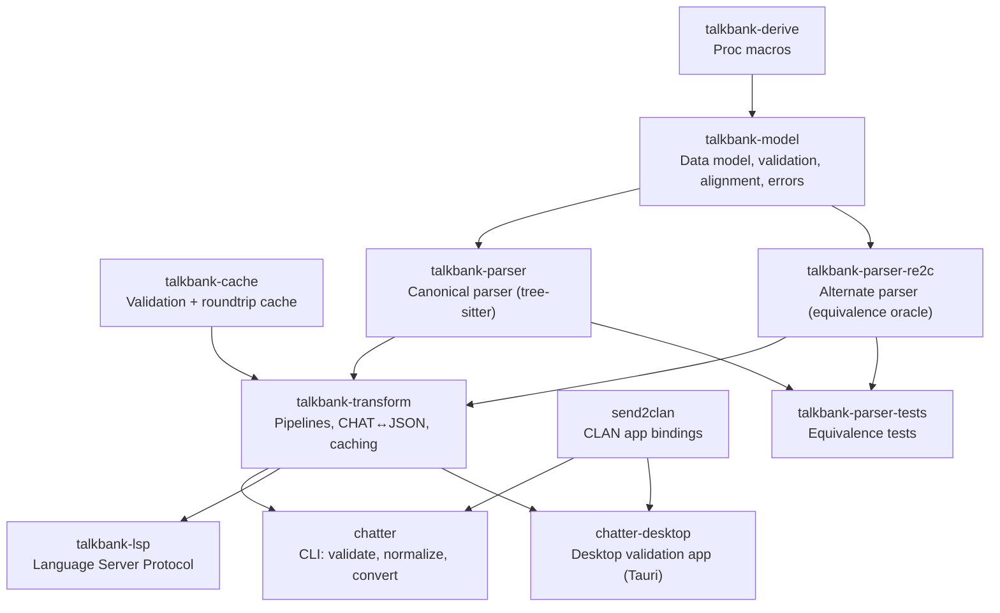

# Architecture Overview

**Status:** Current
**Last modified:** 2026-06-15 15:00 EDT

`TalkBank/chatter` is the standalone home of the TalkBank CHAT specification,
tree-sitter grammar, Rust crates, `chatter` CLI, LSP server, and desktop app.
It is self-contained: the CHAT-format core builds and runs
without any external TalkBank repository, so downstream consumers can depend on
its crates directly.

## Data Flow

Specification is the source of truth. Code is generated downstream from it.

```text
spec/           Source of truth (CHAT specification)
    ↓
grammar.js      Tree-sitter grammar (in grammar/)
    ↓
parser.c        Generated C parser (never hand-edited)
    ↓
Rust crates     Parser → Model → Validation → Transform
    ↓
Applications    chatter CLI, LSP server, desktop app
```

## Two layers

Within this repository, the architecture splits into two layers:

**Source-of-truth artifacts.** `spec/`, `spec/symbols/`, and `grammar/` define
the CHAT language and generate downstream parser tests, error docs, and shared
symbol sets.

**Consumer crates and applications.** The Rust crates under `crates/`, the
`chatter` CLI, `talkbank-lsp`, and the desktop app all consume those
source-of-truth artifacts rather than defining CHAT semantics independently.

## Crate Dependency Graph



## Repository Layout

```text
chatter/
├── grammar/                Tree-sitter grammar
├── spec/                   CHAT specification (source of truth)
│   ├── constructs/         Valid CHAT examples + expected parse trees
│   ├── errors/             Invalid CHAT examples + expected error codes
│   ├── symbols/            Shared symbol registry (JSON)
│   ├── tools/              Core spec generators
│   └── runtime-tools/      Runtime-aware spec bootstrap/validation tools
├── crates/                 Rust crates (model, parser, transform, CLI support, LSP)
├── corpus/                 Reference corpus
├── tests/                  Integration tests and fixtures
├── schema/                 JSON Schema (auto-generated)
├── apps/chatter-desktop/   Desktop validation app (Tauri v2, React)
├── fuzz/                   cargo-fuzz targets (separate workspace)
├── book/                   This documentation
└── docs/                   Strategy, proposals, investigations
```

## Cargo Workspaces

Three separate Cargo workspaces live here:

1. **Root workspace** (`Cargo.toml`), all Rust crates for parsing, model,
   transform, CLI, LSP, and `apps/chatter-desktop/src-tauri`.
2. **Spec workspace** (`spec/Cargo.toml`), `spec/tools` for core
   generation, `spec/runtime-tools` for runtime-aware spec tooling.
3. **Fuzz workspace** (`fuzz/Cargo.toml`), cargo-fuzz targets for parser and
   validation robustness checks.

Use the relevant manifest path for the workspace you mean to operate in:

- `spec/tools/Cargo.toml` for generators
- `spec/runtime-tools/Cargo.toml` for bootstrap/mining/runtime validation
- `fuzz/Cargo.toml` for cargo-fuzz targets

## Where to read next

For per-topic detail (sections being consolidated; see SUMMARY for the
authoritative current list):

- [Spec System](spec-system.md), [Grammar](grammar.md),
  [Parser Backends](parser-backends.md), how CHAT becomes typed AST.
- **CHAT model**: the AST itself, content traversal,
  [wide-struct rule](chat-model/wide-structs.md).
- [Alignment](alignment.md): tier alignment, DP, sequence alignment.
- **Errors and validation**: diagnostics, validation gates,
  and parser/model invariants.
- **Editor/runtime integration**: `talkbank-lsp` and application
  boundaries layered on top of the CHAT core.
- [Memory and Ownership](memory-and-ownership.md), Type-Driven Design
  (lands during M11 errors-and-validation work).
- [XML Emitter](xml-emitter.md): projection.

For per-crate summaries see [Crate Reference](crate-reference.md).
