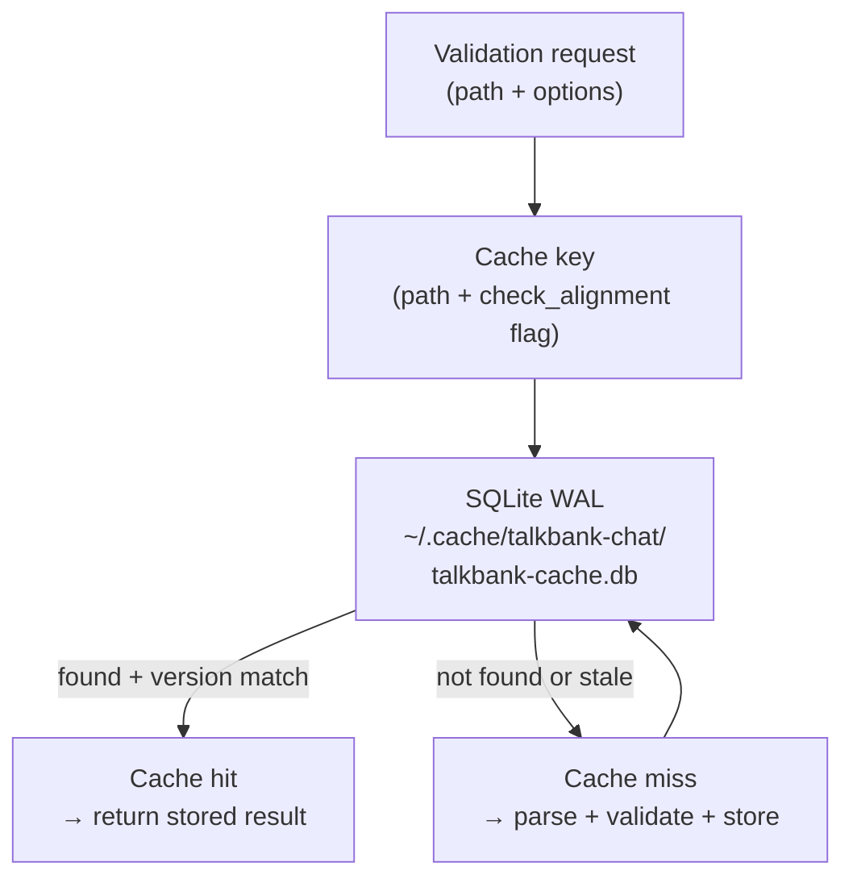

# Validation Cache

**Status:** Current
**Last modified:** 2026-05-29 22:34 EDT

The CHAT-core validation cache, used by `chatter validate` and the
LSP server. Distinct from the audio-task cache used by upstream
`batchalign3` for FA / UTR ASR / media conversion (documented
separately in that project): this cache stores **parse + validate**
results keyed by file path + options.

`crates/talkbank-cache/`.

## Architecture

## Configuration

| Config | Value | Why |
|---|---|---|
| Backend | SQLite via `sqlx` | Concurrent reads (WAL), atomic writes, zero-config |
| Pool size | 16 connections | Matches validation worker count |
| `mmap` | 256 MB | Fast random access for 95k+ entries |
| Invalidation | Version field + 30-day TTL | Schema changes auto-invalidate; stale entries pruned |
| Bridge | Embedded single-threaded tokio runtime | Sync workers call `rt.block_on()` for async SQLite |

## Schema

`file_cache` table (see
`crates/talkbank-transform/migrations/20260101000000_initial.sql`):

| Column | Role |
|---|---|
| `path_hash` | BLAKE3 hash of the resolved path (part of the lookup key) |
| `file_path` | Resolved file path, indexed for path-based maintenance ops |
| `content_hash` | Hash of the file content; mismatch invalidates the entry |
| `version` | Schema/code version, mismatch invalidates the entry |
| `cached_at` | Insertion timestamp |
| `check_alignment` | Whether alignment validation was requested |
| `is_valid` | Cached validation outcome (0/1) |
| `roundtrip_tested` | Whether roundtrip equivalence was checked |
| `roundtrip_passed` | Roundtrip result when tested |
| `parser_kind` | Parser backend (tree-sitter or re2c) |

The lookup key is the compound unique index
`(path_hash, version, check_alignment, parser_kind)`; `file_path` is a
secondary index used by maintenance operations (orphan pruning, etc.).

## Database location

| Platform | Path |
|---|---|
| macOS | `~/Library/Caches/talkbank-chat/talkbank-cache.db` |
| Linux | `~/.cache/talkbank-chat/talkbank-cache.db` |
| Windows | `%LocalAppData%\talkbank-chat\talkbank-cache.db` |

## Invalidation

- **Schema changes**: bump the `version` field; old entries become
  unreachable.
- **Time-based**: entries older than 30 days are pruned.
- **Manual**: pass `--force` to bypass cache lookups for a
  particular validation run.

Per repository policy, do not delete the cache directory without explicit
request. Use `--force` when you want fresh validation for specific paths
without destroying the whole cache.

## See also

- Upstream `batchalign3` documents its own audio-task cache for FA /
  UTR ASR / media conversion.
