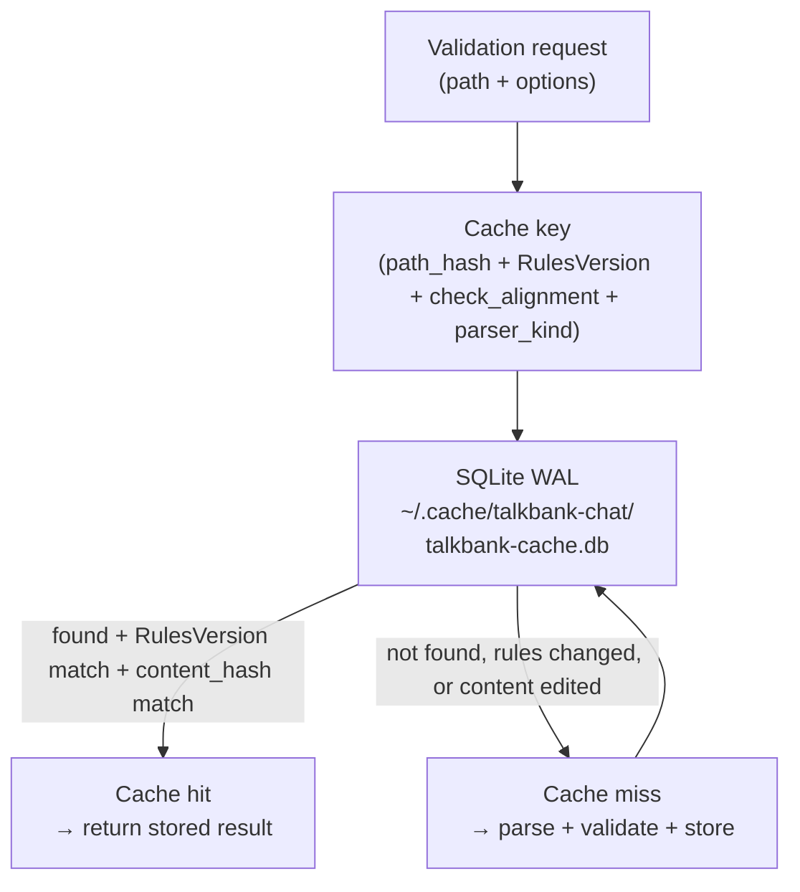
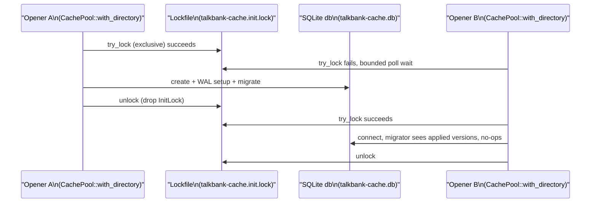

# Validation Cache

**Status:** Current
**Last modified:** 2026-07-22 11:19 EDT

The CHAT-core validation cache, used by `chatter validate` and the
LSP server. Distinct from the audio-task cache used by upstream
`batchalign3` for FA / UTR ASR / media conversion (documented
separately in that project): this cache stores **parse + validate**
results keyed by file path + options.

`crates/talkbank-cache/`.

## Architecture

## Configuration

| Config | Value | Why |
|---|---|---|
| Backend | SQLite via `sqlx` | Concurrent reads (WAL), atomic writes, zero-config |
| Pool size | 16 connections | Matches validation worker count |
| `mmap` | 256 MB | Fast random access for 95k+ entries |
| Invalidation | Rules-version field + content hash + 30-day TTL | Rule-set or schema changes auto-invalidate; content edits invalidate per-file; stale entries pruned |
| Bridge | Embedded single-threaded tokio runtime | Sync workers call `rt.block_on()` for async SQLite |
| Init serialization | Advisory file lock (`talkbank-cache.init.lock`) | Exactly one opener performs first-time create + migrate; see below |

## Schema

`file_cache` table (see
`crates/talkbank-cache/migrations/20260101000000_initial.sql`):

| Column | Role |
|---|---|
| `path_hash` | BLAKE3 hash of the resolved path (part of the lookup key) |
| `file_path` | Resolved file path, indexed for path-based maintenance ops |
| `content_hash` | Hash of the file content; mismatch invalidates the entry |
| `version` | Cache-compatibility version (`RulesVersion`): the cache crate version folded together with a fingerprint of the active validation rule set. A mismatch invalidates the entry |
| `cached_at` | Insertion timestamp |
| `check_alignment` | Whether alignment validation was requested |
| `is_valid` | Cached validation outcome (0/1) |
| `roundtrip_tested` | Whether roundtrip equivalence was checked |
| `roundtrip_passed` | Roundtrip result when tested |
| `parser_kind` | Parser backend (tree-sitter or re2c) |

The lookup key is the compound unique index
`(path_hash, version, check_alignment, parser_kind)`; `file_path` is a
secondary index used by maintenance operations (orphan pruning, etc.).

## Concurrent initialization

Multiple `chatter` processes (or test processes) can open the same cache
directory simultaneously. Steady-state reads and writes are serialized by
SQLite itself (WAL journal mode plus a `busy_timeout` on every connection),
but the one-time first-open of a FRESH database is not: sqlx's SQLite
migrator has no cross-connection lock (its `Migrate::lock` is a no-op for
SQLite), so two openers racing an empty database would both apply migration
version 1 and the loser would fail with `UNIQUE constraint failed:
_sqlx_migrations.version`; concurrent first-connection WAL setup can collide
the same way.

The cache therefore serializes initialization explicitly (fixed 2026-07-22):

- The lock (`InitLock` in `crates/talkbank-cache/src/init_lock.rs`) is an
  exclusive advisory file lock (std `File::try_lock`: `flock(2)` on Unix,
  `LockFileEx` on Windows) on `talkbank-cache.init.lock` beside the
  database. It is held only across pool connect + migrate, never across
  cache operation, so steady-state concurrency is unchanged.
- Acquisition is a bounded try-lock poll, not a blocking OS wait: if the
  deadline (10 s) expires, opening fails with the typed
  `CacheError::InitLockTimeout` instead of hanging, and callers such as the
  CLI degrade to running uncached. Cache initialization can never block a
  caller indefinitely.
- The OS releases the lock when the holder's handle closes, including on
  crash, so a dead initializer cannot strand the lock.
- A bounded retry inside the pool-open path is retained as a backstop for
  openers that do not honor the lock protocol (for example an older
  `chatter` build sharing the same cache directory): once any winner has
  migrated the database, a re-attempt connects to a ready database and the
  migrator no-ops.

Regression coverage: `tests/concurrent_open.rs` (many threads, one
process) and `tests/concurrent_process_open.rs` (many processes racing one
fresh directory, with a hard deadline so a wedge fails instead of hanging
the suite).

## Database location

| Platform | Path |
|---|---|
| macOS | `~/Library/Caches/talkbank-chat/talkbank-cache.db` |
| Linux | `~/.cache/talkbank-chat/talkbank-cache.db` |
| Windows | `%LocalAppData%\talkbank-chat\talkbank-cache.db` |

## Invalidation

- **Validation-rule changes**: the `version` column holds a `RulesVersion`,
  which folds the `talkbank-cache` crate version together with a fingerprint of
  the active validation rule set (an FNV-1a hash over every `ErrorCode` the
  validator can emit, via `talkbank_model::validation_rules_fingerprint`).
  Adding, removing, or renaming a rule (for example introducing error code
  E370, "retrace marker must be followed by material") changes the fingerprint,
  hence the `RulesVersion`, hence the lookup key, so verdicts cached under the
  old rule set become a cache MISS and are re-validated instead of served stale.
  This is the mechanism that keeps `chatter validate` (the authority on CHAT
  validity) from returning a stale "Valid" after the rules tighten. The stale
  rows stay on disk under their old version for selective re-testing; they are
  simply never served to a query carrying the new version.
- **Content changes**: each entry stores the file's `content_hash`; a mismatch
  is a per-file miss.
- **Time-based**: entries older than 30 days are pruned.
- **Manual**: pass `--force` to bypass cache lookups for a
  particular validation run.

Per repository policy, do not delete the cache directory without explicit
request. Use `--force` when you want fresh validation for specific paths
without destroying the whole cache.

## See also

- Upstream `batchalign3` documents its own audio-task cache for FA /
  UTR ASR / media conversion.
