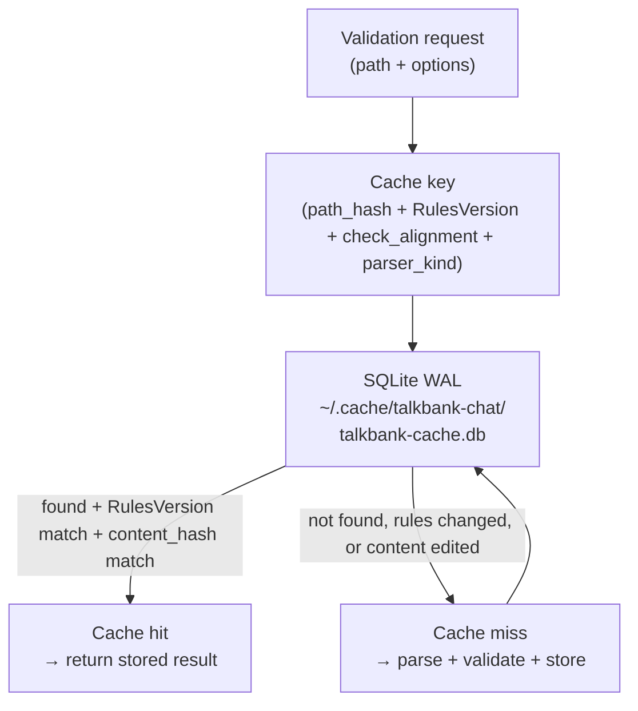
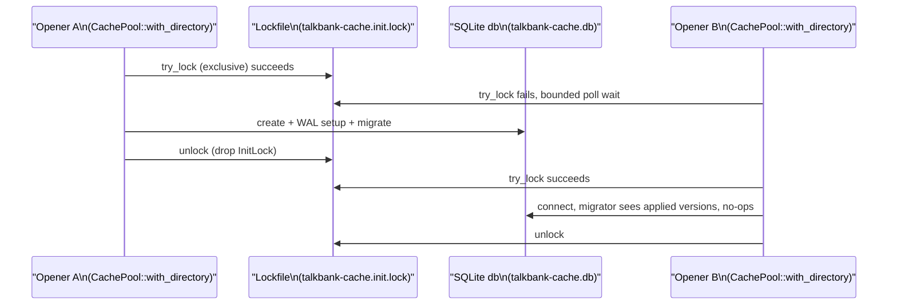

# Validation Cache

**Status:** Current
**Last modified:** 2026-08-03 14:03 EDT

The CHAT-core validation cache, used by `chatter validate` and the
LSP server. Distinct from the audio-task cache used by upstream
`batchalign3` for FA / UTR ASR / media conversion (documented
separately in that project): this cache stores **parse + validate**
results keyed by file path + options.

`crates/talkbank-cache/`.

## Architecture

```mermaid
flowchart TD
    req["Validation request\n(path + options)"]
    key["Cache key\n(path_hash + RulesVersion + check_alignment + parser_kind)"]
    db["SQLite WAL\n~/.cache/talkbank-chat/\ntalkbank-cache.db"]
    hit["Cache hit\n→ return stored result"]
    miss["Cache miss\n→ parse + validate + store"]

    req --> key --> db
    db -->|"found + RulesVersion match + content_hash match"| hit
    db -->|"not found, rules changed, or content edited"| miss
    miss --> db
```

## Configuration

| Config | Value | Why |
|---|---|---|
| Backend | SQLite via `sqlx` | Concurrent reads (WAL), atomic writes, zero-config |
| Pool size | 16 connections | Matches validation worker count |
| `mmap` | 256 MB | Fast random access for 95k+ entries |
| Invalidation | Rules-version field + content hash + 30-day TTL | Rule-set or schema changes auto-invalidate; content edits invalidate per-file; stale entries pruned |
| Reachability prune | On open: keep the opening version plus one predecessor | Rows under any other version can never be bound again; without this the file grew by a corpus per release |
| Bridge | Embedded single-threaded tokio runtime | Sync workers call `rt.block_on()` for async SQLite |
| Init serialization | Advisory file lock (`talkbank-cache.init.lock`) | Exactly one opener performs first-time create + migrate; see below |

## Schema

`file_cache` table (see
`crates/talkbank-cache/migrations/20260101000000_initial.sql`):

| Column | Role |
|---|---|
| `path_hash` | BLAKE3 hash of the resolved path (part of the lookup key) |
| `file_path` | Resolved file path, indexed for path-based maintenance ops |
| `content_hash` | Hash of the file content; mismatch invalidates the entry |
| `version` | Cache-compatibility version (`RulesVersion`): the cache crate version folded together with a fingerprint of the active validation rule set. A mismatch invalidates the entry |
| `cached_at` | Insertion timestamp |
| `check_alignment` | Whether alignment validation was requested |
| `is_valid` | Cached validation outcome (0/1) |
| `roundtrip_tested` | Whether roundtrip equivalence was checked |
| `roundtrip_passed` | Roundtrip result when tested |
| `parser_kind` | Parser backend (tree-sitter or re2c) |

The lookup key is the compound unique index
`(path_hash, version, check_alignment, parser_kind)`; `file_path` is a
secondary index used by maintenance operations (orphan pruning, etc.).

## Concurrent initialization

Multiple `chatter` processes (or test processes) can open the same cache
directory simultaneously. Steady-state reads and writes are serialized by
SQLite itself (WAL journal mode plus a `busy_timeout` on every connection),
but the one-time first-open of a FRESH database is not: sqlx's SQLite
migrator has no cross-connection lock (its `Migrate::lock` is a no-op for
SQLite), so two openers racing an empty database would both apply migration
version 1 and the loser would fail with `UNIQUE constraint failed:
_sqlx_migrations.version`; concurrent first-connection WAL setup can collide
the same way.

The cache therefore serializes initialization explicitly (fixed 2026-07-22):

```mermaid
sequenceDiagram
    participant A as "Opener A\n(CachePool::with_directory)"
    participant L as "Lockfile\n(talkbank-cache.init.lock)"
    participant D as "SQLite db\n(talkbank-cache.db)"
    participant B as "Opener B\n(CachePool::with_directory)"

    A->>L: try_lock (exclusive) succeeds
    B->>L: try_lock fails, bounded poll wait
    A->>D: create + WAL setup + migrate
    A->>L: unlock (drop InitLock)
    B->>L: try_lock succeeds
    B->>D: connect, migrator sees applied versions, no-ops
    B->>L: unlock
```

- The lock (`InitLock` in `crates/talkbank-cache/src/init_lock.rs`) is an
  exclusive advisory file lock (std `File::try_lock`: `flock(2)` on Unix,
  `LockFileEx` on Windows) on `talkbank-cache.init.lock` beside the
  database. It is held only across pool connect + migrate, never across
  cache operation, so steady-state concurrency is unchanged.
- Acquisition is a bounded try-lock poll, not a blocking OS wait: if the
  deadline (10 s) expires, opening fails with the typed
  `CacheError::InitLockTimeout` instead of hanging, and callers such as the
  CLI degrade to running uncached. Cache initialization can never block a
  caller indefinitely.
- The OS releases the lock when the holder's handle closes, including on
  crash, so a dead initializer cannot strand the lock.
- A bounded retry inside the pool-open path is retained as a backstop for
  openers that do not honor the lock protocol (for example an older
  `chatter` build sharing the same cache directory): once any winner has
  migrated the database, a re-attempt connects to a ready database and the
  migrator no-ops.

Regression coverage: `tests/concurrent_open.rs` (many threads, one
process) and `tests/concurrent_process_open.rs` (many processes racing one
fresh directory, with a hard deadline so a wedge fails instead of hanging
the suite).

## What the cached value means, and what does NOT key it

A row records ONE fact: **this file produced no diagnostics at all under this
rule selection**. That is a property of the bytes and the rules, so it is the
same answer for every run, whatever any given run chooses to display.

Only `RuleSelection` therefore reaches the key
(`RulesVersion::current_with_rule_selection`). A `PresentationPolicy`
(`--suppress`, severity remapping) never does: it is applied to diagnostics that
have already been computed and have already decided what gets cached.

This was a comment once, and the comment lost. v0.6.0 folded the suppression set
into the key, so `chatter validate` followed by `chatter validate --suppress
xphon` re-validated 106,000 files from cold instead of hitting the cache. It is
now a fact of the crate graph: `talkbank-transform` (home of
`PresentationPolicy`) depends on `talkbank-cache`, so the cache crate cannot
name the type, and folding one in is a dependency cycle rather than a judgement
call.

## Reachability pruning

Deleting by AGE and deleting by REACHABILITY are different questions, and the
cache answers both on open.

The 30-day TTL removes rows that are stale. It never removed rows that were
merely unreachable, so every release stranded a complete copy of the corpus
under its retired version: a real cache reached 464,773 rows across 88 versions
for a corpus of ~106,000 files, roughly 190 MB of a 243 MB file that no reader
could ever bind.

Opening now deletes every row whose version is outside a two-generation window:

- the version the pool binds, and
- the most recently written OTHER version.

The predecessor is kept deliberately. Pruning strictly to the current version
makes a downgrade cold, which is a real cost during a bisect or a rollback, and
it would make two chatter builds sharing a machine delete each other's rows on
every open. One generation of grace bounds the file at about two copies of the
corpus while keeping both of those cases cheap.

When rows are deleted the database is rewritten (`VACUUM`) so the space returns
to the filesystem: SQLite otherwise frees pages for reuse without shrinking the
file, and an operator checking with `du` would reasonably conclude nothing
happened. A rewrite blocked by another process is not an error (the rows are
gone either way); the pages stay reusable and the next quiet open rewrites.

The outcome is reported (`CachePool::version_prune`) rather than logged from
inside the library, and `chatter validate` prints it: reclaiming most of a
user's cache file in silence is indistinguishable from a bug.

## Database location

| Platform | Path |
|---|---|
| macOS | `~/Library/Caches/talkbank-chat/talkbank-cache.db` |
| Linux | `~/.cache/talkbank-chat/talkbank-cache.db` |
| Windows | `%LocalAppData%\talkbank-chat\talkbank-cache.db` |

## Invalidation

- **Validation-rule changes**: the `version` column holds a `RulesVersion`,
  which folds the `talkbank-cache` crate version together with a fingerprint of
  the active validation rule set (an FNV-1a hash over every `ErrorCode` the
  validator can emit, via `talkbank_model::validation_rules_fingerprint`).
  Adding, removing, or renaming a rule (for example introducing error code
  E370, "retrace marker must be followed by material") changes the fingerprint,
  hence the `RulesVersion`, hence the lookup key, so verdicts cached under the
  old rule set become a cache MISS and are re-validated instead of served stale.
  This is the mechanism that keeps `chatter validate` (the authority on CHAT
  validity) from returning a stale "Valid" after the rules tighten.

  Rows under a superseded version are then UNREACHABLE: no query any binary can
  issue will match them again. Opening the cache deletes them (see
  "Reachability pruning" below), keeping one predecessor generation.
- **Content changes**: each entry stores the file's `content_hash`; a mismatch
  is a per-file miss.
- **Time-based**: entries older than 30 days are pruned.
- **Reachability**: rows under versions outside the two-generation window are
  deleted on open (see above). This is about unbounded growth, not correctness:
  those rows were already invisible.
- **Manual**: pass `--force` to bypass cache lookups for a
  particular validation run.

Per repository policy, do not delete the cache directory without explicit
request. Use `--force` when you want fresh validation for specific paths
without destroying the whole cache.

## See also

- Upstream `batchalign3` documents its own audio-task cache for FA /
  UTR ASR / media conversion.
