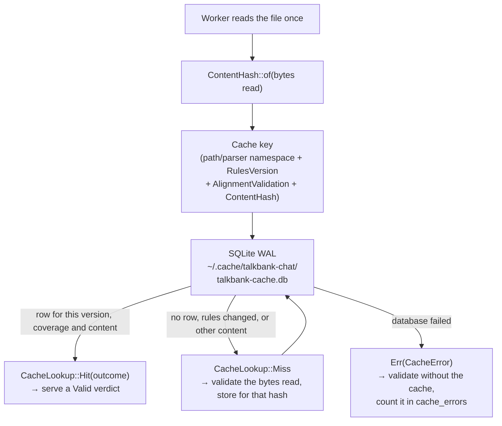
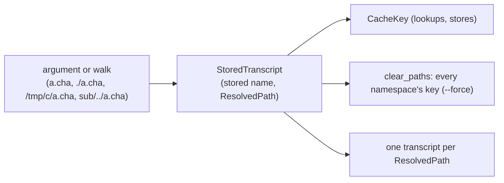
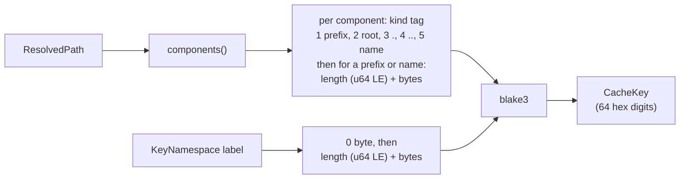
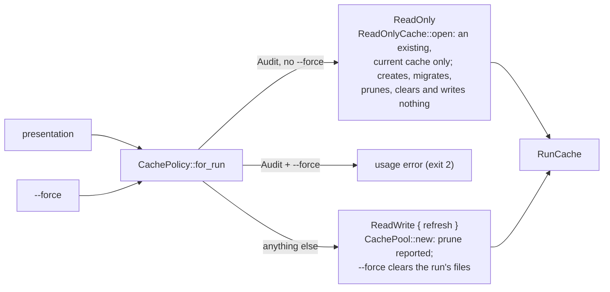
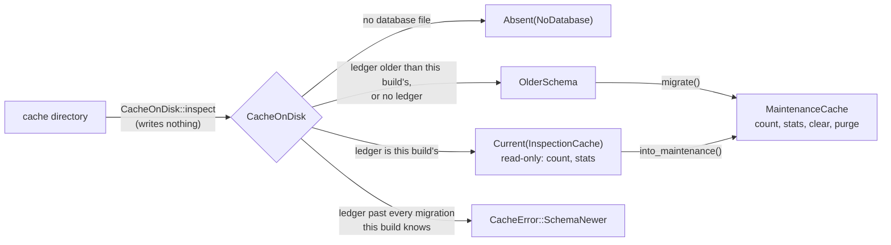
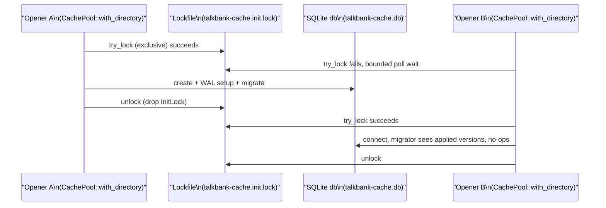
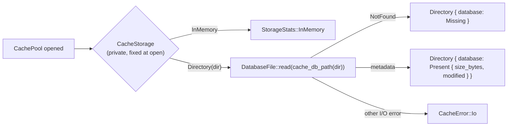

# Validation Cache

**Status:** Current
**Last modified:** {{git-dates:page}}

The persistent CHAT validation cache, used by `chatter validate` and the
desktop validation runner. The LSP maintains its own in-memory document cache. Distinct from the audio-task cache used by upstream
`batchalign3` for FA / UTR ASR / media conversion (documented
separately in that project): this cache stores **parse + validate**
results keyed by file path + options.

`crates/talkbank-cache/`.

## Architecture

```mermaid
flowchart TD
    read["Worker reads the file once"]
    hash["ContentHash::of(bytes read)"]
    key["Cache key\n(path/parser namespace + RulesVersion\n+ AlignmentValidation + ContentHash)"]
    db["SQLite WAL\n~/.cache/talkbank-chat/\ntalkbank-cache.db"]
    hit["CacheLookup::Hit(outcome)\n→ serve a Valid verdict"]
    miss["CacheLookup::Miss\n→ validate the bytes read, store for that hash"]
    err["Err(CacheError)\n→ validate without the cache,\ncount it in cache_errors"]

    read --> hash --> key --> db
    db -->|"row for this version, coverage and content"| hit
    db -->|"no row, rules changed, or other content"| miss
    db -->|"database failed"| err
    miss --> db
```

The worker hashes the bytes it is about to validate and passes that hash to
every lookup and write, so a verdict is always stored for the content that
was validated, even if the file changes during the run; the cache never
re-reads the path. A lookup returns `Result<CacheLookup<V>, CacheError>`,
`V` being the verdict's own type: `CacheOutcome { Valid, Invalid }` for
validation and `RoundtripOutcome { Passed, Failed }` for roundtrip, so a
failed roundtrip cannot be read as an invalid file. A locked or corrupt
database is an `Err`, which the runner counts in the run's
`cache_errors` and reports (stderr, the JSON summary, the desktop summary),
and the file is then validated without the cache. It is never a miss.

The methods of `VerdictReader` (`get`, `get_roundtrip`) and
`ValidationCache` (`set`, `set_roundtrip`) are all required. A cache that
keeps no roundtrip verdicts answers `Miss` and stores nothing in its own body,
rather than inheriting a silent default.

## Configuration

| Config | Value | Why |
|---|---|---|
| Backend | SQLite via `sqlx` | Concurrent reads (WAL), atomic writes, zero-config |
| Pool size | 16 connections | Matches validation worker count |
| `mmap` | 256 MB | Fast random access for 95k+ entries |
| Invalidation | Rules-version field + content hash + 30-day TTL | Rule-set or schema changes auto-invalidate; content edits invalidate per-file; stale entries pruned |
| Reachability prune | On validation open: keep the opening version plus one predecessor | Rows under any other version can never be bound again; without this the file grew by a corpus per release |
| Bridge | Embedded single-threaded tokio runtime, entered only via `blocking::block_on` | Sync workers block on async SQLite. Never `Runtime::block_on` directly: a caller that is itself driving a runtime (a Tauri `async fn` command) would nest one runtime in another and panic. Such a call is run on a thread with no ambient runtime instead |
| Init serialization | Advisory file lock (`talkbank-cache.init.lock`) | Exactly one opener performs first-time create + migrate; see below |

## Schema

`file_cache` table (see
`crates/talkbank-cache/migrations/20260101000000_initial.sql`):

| Column | Role |
|---|---|
| `path_hash` | The `CacheKey`: a blake3 hash of the path and its namespace (`validation:tree-sitter` or `validation:re2c` for validation, the parser's label for roundtrip), as 64 hex digits |
| `file_path` | The row's `ResolvedPath` as text, indexed for `cache clear --prefix` and the missing-file purge; keys never read it |
| `content_hash` | Hash of the file content; mismatch invalidates the entry |
| `version` | Cache-compatibility version (`RulesVersion`): the cache crate version folded together with a fingerprint of the active validation rule set. A mismatch invalidates the entry |
| `cached_at` | Insertion timestamp |
| `check_alignment` | The `AlignmentValidation` coverage, as 0 (`Structure`) or 1 (`IncludeTierAlignment`); the only place it is a number |
| `is_valid` | Cached validation outcome (0/1) |
| `roundtrip_tested` | Whether roundtrip equivalence was checked |
| `roundtrip_passed` | Roundtrip result when tested |
| `parser_kind` | Roundtrip backend discriminator; NULL for validation, whose parser is in `path_hash` |

Validation uses a partial unique index on `(path_hash, version, check_alignment)`
where `parser_kind IS NULL`; roundtrip uses a second partial index including
`parser_kind` where it is non-NULL. `file_path` remains a maintenance index.

### The path: one `ResolvedPath`, however it was spelled

Every cache method takes a `ResolvedPath` (`talkbank_model::resolved_path`,
re-exported by the cache): the file's parent directory resolved by the
operating system (`std::fs::canonicalize`: links, `..` and `/tmp` versus
`/private/tmp` resolved) joined with the file's own name as stored. The last
component is never resolved: a link to a transcript is a transcript under
its own name, which validation compares with `@Media`. Its only constructors
read the filesystem, so no caller can mint one from a spelling of its own.

A `StoredTranscript` makes its `ResolvedPath` when it is admitted (by the
walk that found it, from one resolution per directory, or by the argument
resolver, from one per parent), so the validation worker keys by it,
`validate --force` clears by it, `watch` keys by it, and the argument
expansion counts a transcript once by it:

```mermaid
flowchart LR
    arg["argument or walk\n(a.cha, ./a.cha, /tmp/c/a.cha, sub/../a.cha)"] --> stored["StoredTranscript\n(stored name, ResolvedPath)"]
    stored --> key["CacheKey (lookups, stores)"]
    stored --> clear["clear_paths: every namespace's key (--force)"]
    stored --> dedup["one transcript per ResolvedPath"]
```

A directory that cannot be resolved makes its transcripts unreadable inputs
when they are found, the one policy for every consumer. `cache clear
--prefix` resolves its prefix into a `ResolvedPrefix` (`ResolvedPrefix::of`,
its own type, so a `ResolvedPath` always names a file): an existing
directory resolved whole, anything else as a file; a missing directory is
resolved through its deepest existing ancestor. `--force` clears by key, in
every namespace a row can be written under, so two non-UTF-8 names that
share a lossy display spelling cannot clear each other's rows.

### The key

`path_hash` is a `CacheKey`, and `CacheKey::of(resolved_path, namespace)` in
`cache_utils.rs` is the only way to make one; validation and roundtrip both
call it, with `CacheIdentity::validation_namespace()` or
`roundtrip_namespace()`. The hash is specified, so a key computed by one
build is the key every later build computes:

```mermaid
flowchart LR
    path["ResolvedPath"] --> comps["components()"]
    comps --> enc["per component: kind tag\n1 prefix, 2 root, 3 ., 4 .., 5 name\nthen for a prefix or name:\nlength (u64 LE) + bytes"]
    ns["KeyNamespace label"] --> sep["0 byte, then\nlength (u64 LE) + bytes"]
    enc --> h["blake3"]
    sep --> h
    h --> key["CacheKey\n(64 hex digits)"]
```

A name's bytes are the raw `OsStr` bytes on Unix and the UTF-16 code units
as little-endian bytes on Windows. The length prefixes keep `ab` + `c` and
`a` + `bc` apart. The path is already resolved, so every spelling of a file
is one path; hashing its components, not the display string, keeps native path equality
beyond that (Windows `/` and `\` share a key) and keeps distinct non-Unicode
names distinct. Symlinks are not resolved and filename Unicode is not
normalized here; the stored-name resolution before it settles which name a
transcript has. Unit tests pin one key's exact digits on Unix and one on
Windows, so a change to either encoding fails.

The key is a specified hash (blake3), not `std`'s `DefaultHasher`, whose
algorithm Rust does not promise to keep: every repository tracks stable Rust,
and a toolchain update must not be able to turn the persistent cache into
misses with nothing to say so.

**The key scheme is part of the version.** `rules_version::KEY_SCHEME`
(`+keys.blake3-components-1`) is folded into every `RulesVersion`, so a change
to `CacheKey`'s encoding is a version change: rows written under another
scheme carry another version, are never served, and leave the database
through the same reachability prune as any superseded rule set (kept for one
generation, then deleted on open; the 30-day expiry removes them in any case).
Rows are retired deliberately rather than lingering as unexplained misses.

## What a run may do with the cache

A cache is one `RunCache` value: `Absent`, `ReadOnly(Arc<dyn
VerdictReader>)` or `ReadWrite(Arc<dyn ValidationCache>)`. The cache trait is
split: `VerdictReader` (`identity`, `get`, `get_roundtrip`) and
`ValidationCache: VerdictReader` (`set`, `set_roundtrip`), so a read-only run
holds a value with no write method, and whether a run may write is one value
rather than a mode beside an optional cache that could disagree with it.

Every runner entry point (`validate_directory_streaming`,
`validate_files_streaming`, `validate_arguments_streaming`) takes a
`ValidationRun`: the run's `ValidationConfig` bound to its `RunCache`. The
only routes to one are `ValidationRun::uncached(config)` and
`ValidationRun::new(config, cache)`, which refuses (`CacheIdentityMismatch`)
a cache whose `identity()` is not `config.cache_identity()`. A cache opened
for one rule set (strict linkers, another parser) therefore cannot serve its
verdicts to a run under another, and the bound configuration cannot be
changed afterwards. The CLI opens the cache from the run's configuration and
binds it (`initialize_validation_cache` returns the bound run); the desktop
binds the pool it memoized for the request's identity.

The CLI decides the mode once, as a `CachePolicy`:

```mermaid
flowchart LR
    pres["presentation"] --> pol["CachePolicy::for_run"]
    force["--force"] --> pol
    pol -->|"Audit, no --force"| ro["ReadOnly\nReadOnlyCache::open: an existing,\ncurrent cache only; creates, migrates,\nprunes, clears and writes nothing"]
    pol -->|"Audit + --force"| err["usage error (exit 2)"]
    pol -->|"anything else"| rw["ReadWrite { refresh }\nCachePool::new: prune reported;\n--force clears the run's files"]
    ro --> run["RunCache"]
    rw --> run
```

`ReadOnlyCache` (`CachePool<ReadOnlyScope>`) is the read-only typestate: it
implements `VerdictReader`, has `count` and `stats`, and has no `clear`,
`clear_paths` or `purge_nonexistent` (those exist only for scopes that may
delete). Opening it writes nothing: it creates no directory, lock file or
database, runs no migration, and connects read-only. A cache that does not
exist (`CacheError::NoCacheDatabase`), whose schema is older than this
build's (`CacheError::SchemaNotCurrent`) or that a newer build wrote
(`CacheError::SchemaNewer`) is refused, and the audit runs without a cache and
says so; a writing run creates or upgrades an older one. SQLite may create
its write-ahead-log index files beside an existing database, which any
reader of it needs.

How each file used the cache is a `CacheUse` (`Hit`, `Miss`,
`NotConsulted`) on its `FileCompleteEvent`, a fact separate from its
`FileStatus`. `Hit` means the verdict that decided the status came from the
cache: a cached Valid verdict, or a cached roundtrip verdict (also after a
fresh validation). A run with no cache consulted nothing and counts no misses,
and `cache_hit_rate()` is `None` when nothing was consulted.

## Identity and handle states

Every cache scope offers `close(self)`: a consuming transition that waits for
the pool's connections and SQLite workers to shut down. Ordinary drop may
leave background cleanup in flight. Close all handles you own before removing
their database; the consumed handle cannot be queried again. This does not
close another pool or process's handles or establish exclusive ownership of a
filesystem path. Fresh inspection, not the closed handle, admits the resulting
directory state; filesystem operations remain fallible.

Schema inspection transfers an open capability only for a current schema.
Older-schema observations and schema-read refusals await shutdown before
returning, so an observation with no handle does not leave its inspection
workers behind. Failed migration or validation-scope admission likewise closes
the unretained pool before returning its error.

`CachePool::new(identity)` returns `Result<CachePool, CacheError>`. Callers handle
that result before wrapping a successful pool in `Arc`. The CLI keeps the concrete
opening error until presentation. A failed cache open leaves validation active
and produces a structured warning in JSON mode, without writing prose to stderr.
The desktop app sends it to the frontend as a `cacheUnavailable` event before
the run's own events, and the run's summary says it.

`CacheIdentity` owns a `RulesVersion` and the shared `ParserKind` vocabulary.
`ValidationConfig::cache_identity()` derives both from the request's semantic
configuration, excluding suppression and display policy. Every validation-cache
constructor requires this identity. Validation and roundtrip operations use the
bound parser, so an independent string argument cannot select another backend.
The desktop memoizes by this complete identity, including the parser toggle.

Parser choice is in the row namespace, not the retained generation. Rotating
default/strict rules across both parsers therefore keeps four configurations
inside the two-generation window. The CLI regression reproduces a real
cross-backend cache hit; desktop and SQLite regressions verify separate hits,
contradictory stored verdicts, and repeated rotations without eviction.

Administration starts from one look at the directory, `CacheOnDisk::inspect`,
which creates, migrates and writes nothing. What it finds is the one value a
preview and the operation it previews both start from, so the two cannot
disagree about the schema:

```mermaid
flowchart LR
    dir["cache directory"] -->|"CacheOnDisk::inspect<br/>(writes nothing)"| found{"CacheOnDisk"}
    found -->|"no database file"| absent["Absent(NoDatabase)"]
    found -->|"ledger older than this build's,<br/>or no ledger"| older["OlderSchema"]
    found -->|"ledger is this build's"| current["Current(InspectionCache)<br/>read-only: count, stats"]
    found -->|"ledger past every migration<br/>this build knows"| newer["CacheError::SchemaNewer"]
    older -->|"migrate()"| maint["MaintenanceCache<br/>count, stats, clear, purge"]
    current -->|"into_maintenance()"| maint
```

`InspectionCache` (`CachePool<InspectionScope>`) is the read-only view of the
whole cache: `count` and `stats`, no verdicts (it has no identity) and no
`clear`. It is connected exactly as `ReadOnlyCache` is, through the one
read-only look: an existing database of this build's schema, connected
read-only, with nothing created, migrated or pruned (SQLite may still create
its `-shm` and `-wal` files beside it). `ReadOnlyCache` maps the two states it
cannot read to `CacheError::NoCacheDatabase` and
`CacheError::SchemaNotCurrent`.

`MaintenanceCache` is a distinct `CachePool` state. It can read statistics and
perform explicit clear/purge operations but has no validation/roundtrip
methods. It has no public constructor: it is reached only from what the look
found, by `OlderSchema::migrate` (which migrates under the initialization
lock) or `InspectionCache::into_maintenance` (which reopens a current
database writable), both without automatic expiration or generation pruning.
A directory with no database has no route to it, so maintenance never creates
a cache to act on. Reading statistics records no generation of its own, so it
cannot displace one of the real retained generations.

`chatter cache stats` and `chatter cache clear` match on the found value:

| Found | `stats` | `clear --dry-run` | `clear` |
| --- | --- | --- | --- |
| `Absent` | "No cache database at PATH", exit 0 | would clear 0, exit 0 | cleared 0, creates nothing, exit 0 |
| `OlderSchema` | says so, migrates nothing, exit 0 | says it would migrate first; no count, since migrating can remove rows | migrates, then clears |
| `Current` | the entry count and file facts | counts read-only | reopens writable, clears |
| `SchemaNewer` | exit 1 | exit 1 | exit 1 |

Rows under the unqualified `validation` suffix, which names no parser, are
never served through the parser-qualified namespace and remain eligible for
normal age/generation cleanup. No migration rewrites such a row to claim a
parser identity it does not record.

## Concurrent initialization

Multiple `chatter` processes (or test processes) can open the same cache
directory simultaneously. Steady-state reads and writes are serialized by
SQLite itself (WAL journal mode plus a `busy_timeout` on every connection),
but the one-time first-open of a FRESH database is not: sqlx's SQLite
migrator has no cross-connection lock (its `Migrate::lock` is a no-op for
SQLite), so two openers racing an empty database would both apply migration
version 1 and the loser would fail with `UNIQUE constraint failed:
_sqlx_migrations.version`; concurrent first-connection WAL setup can collide
the same way.

The cache therefore serializes initialization explicitly:

```mermaid
sequenceDiagram
    participant A as "Opener A\n(CachePool::with_directory)"
    participant L as "Lockfile\n(talkbank-cache.init.lock)"
    participant D as "SQLite db\n(talkbank-cache.db)"
    participant B as "Opener B\n(CachePool::with_directory)"

    A->>L: try_lock (exclusive) succeeds
    B->>L: try_lock fails, bounded poll wait
    A->>D: create + WAL setup + migrate
    A->>L: unlock (drop InitLock)
    B->>L: try_lock succeeds
    B->>D: connect, migrator sees applied versions, no-ops
    B->>L: unlock
```

- The lock (`InitLock` in `crates/talkbank-cache/src/init_lock.rs`) is an
  exclusive advisory file lock (std `File::try_lock`: `flock(2)` on Unix,
  `LockFileEx` on Windows) on `talkbank-cache.init.lock` beside the
  database. It is held only across pool connect + migrate, never across
  cache operation, so steady-state concurrency is unchanged.
- Acquisition is a bounded try-lock poll, not a blocking OS wait: if the
  deadline (10 s) expires, opening fails with the typed
  `CacheError::InitLockTimeout` instead of hanging, and callers such as the
  CLI degrade to running uncached. Cache initialization can never block a
  caller indefinitely.
- The OS releases the lock when the holder's handle closes, including on
  crash, so a dead initializer cannot strand the lock.
- A bounded retry inside the pool-open path is retained as a backstop for
  openers that do not honor the lock protocol (for example an older
  `chatter` build sharing the same cache directory): once any winner has
  migrated the database, a re-attempt connects to a ready database and the
  migrator no-ops.

Regression coverage: `tests/concurrent_open.rs` (many threads, one
process) and `tests/concurrent_process_open.rs` (many processes racing one
fresh directory, with a hard deadline so a wedge fails instead of hanging
the suite).

## What the cached value means, and what does NOT key it

A row records ONE fact: **this file produced no diagnostics at all under this
rule selection**. That is a property of the bytes and the rules, so it is the
same answer for every run, whatever any given run chooses to display.

Only `RuleSelection` therefore reaches the key
(`RulesVersion::current_with_rule_selection`). A `PresentationPolicy`
(`--suppress`, severity remapping) never does: it is applied to diagnostics that
have already been computed and have already decided what gets cached.

This is a fact of the crate graph, not a convention: `talkbank-transform` (home
of `PresentationPolicy`) depends on `talkbank-cache`, so the cache crate cannot
name the type, and folding one into the key is a dependency cycle rather than a
judgement call. A suppression set in the key would make `chatter validate`
followed by `chatter validate --suppress xphon` re-validate a whole corpus
from cold.

## Only a clean file skips work, and that asymmetry is deliberate

A cache hit on a VALID file skips the parse entirely: the row says the file
produced no diagnostics, and "no diagnostics" is the whole of what a caller
needs, so there is nothing left to reconstruct.

A file recorded as INVALID is re-parsed and re-validated on every run
(`worker.rs`, the `CacheOutcome::Valid` arm is the only one that short-circuits).
The row stores one bit, not the diagnostics, so the bit alone cannot produce the
codes, spans, source snippets, or suggestions the user actually asked for. The
cache can say THAT a file failed; only a real run can say HOW.

**This is intended, and it should not be "fixed" by caching diagnostics.** The
reasons, in order of weight:

1. **A diagnostic is not a fact about the file alone.** It carries spans into the
   file's bytes and rendered source context, so a cached diagnostic is only
   valid against the exact bytes that produced it. That is already what the
   content hash guarantees, but it makes the cached value large and structured
   rather than one bit, and every change to a message, a span, or a suggestion
   silently invalidates a store that has no way to know it.
2. **The bit is the part that is stable across releases; the rendering is not.**
   Diagnostics are deliberately improved release to release. A cache keyed on
   the rule selection correctly serves the verdict across such a change, but
   would serve STALE TEXT for the same key, which is worse than slow: a user
   would see last release's wording and last release's suggestion.
3. **The asymmetry costs nothing on a healthy corpus and self-corrects.** The
   kept corpus is ~106,000 files with ~141 invalid, so re-validation touches
   0.1% of the work; a full warm run is about 6 seconds. As files get fixed they
   move into the fast path on their own.

The cost is real only where MOST files are invalid, which is the case during a
cleanup campaign or when a rule has just been tightened. If that ever needs to
be fast, the answer is not to cache diagnostics but to make the invalid path
cheaper, or to give the campaign its own narrower target than the whole corpus.

**When measuring cache behaviour, do not build a synthetic corpus by copying
files under new names.** Renaming breaks the `@Media` filename check (E531), so
the copies validate as INVALID, and a benchmark built that way measures the
re-validation path while appearing to measure the hit path. Measured on a real
subtree the difference is stark: 9,263 real files take 29.0 s cold and 0.5 s
warm at a 100% hit rate, while the same files flattened under generated names
report a 28% hit rate and a warm run barely faster than cold. Use a real corpus
subtree; `scripts/debug/chatter_validate_scaling.sh` in the operator workspace
documents this and the sorted-file-list trap beside it.

## Reachability pruning

Deleting by AGE and deleting by REACHABILITY are different questions, and the
cache answers both on open.

The 30-day TTL removes rows that are stale, not rows that are merely
unreachable; without a second rule every release would strand a complete copy
of the corpus under its retired version, which no reader could ever bind.

Opening deletes every row whose version is outside a two-generation window:

- the version the pool binds, and
- the most recently written OTHER version.

The predecessor is kept deliberately. Pruning strictly to the current version
makes a downgrade cold, which is a real cost during a bisect or a rollback, and
it would make two chatter builds sharing a machine delete each other's rows on
every open. One generation of grace bounds the file at about two copies of the
corpus while keeping both of those cases cheap.

When rows are deleted the database is rewritten (`VACUUM`) so the space returns
to the filesystem: SQLite otherwise frees pages for reuse without shrinking the
file, and an operator checking with `du` would reasonably conclude nothing
happened. A rewrite blocked by another process is not an error (the rows are
gone either way); the pages stay reusable and the next quiet open rewrites.

The outcome is reported (`CachePool::version_prune`) rather than logged from
inside the library, and `chatter validate` prints it: reclaiming most of a
user's cache file in silence is indistinguishable from a bug.

## Database location

| Platform | Path |
|---|---|
| macOS | `~/Library/Caches/talkbank-chat/talkbank-cache.db` |
| Linux | `~/.cache/talkbank-chat/talkbank-cache.db` |
| Windows | `%LocalAppData%\talkbank-chat\talkbank-cache.db` |

## Statistics

`CachePool::stats` (and so `InspectionCache::stats` and
`MaintenanceCache::stats`) returns a `CacheStats`:
the entry count and a `StorageStats` that the cache crate reads itself, so a
caller renders it and never re-derives the database file from the directory.

```mermaid
flowchart LR
    open["CachePool opened"] --> storage{"CacheStorage<br/>(private, fixed at open)"}
    storage -->|InMemory| inmem["StorageStats::InMemory"]
    storage -->|"Directory(dir)"| read["DatabaseFile::read(cache_db_path(dir))"]
    read -->|NotFound| missing["Directory { database: Missing }"]
    read -->|metadata| present["Directory { database: Present { size_bytes, modified } }"]
    read -->|"other I/O error"| err["CacheError::Io"]
```

- In memory is a variant, not an absent directory, and a missing file is a
  variant, not a zero size. Only a database that exists is opened, so
  `Missing` means the file was removed after the cache opened.
- `modified` is a `jiff::Timestamp`, never optional, admitted when the file
  is read: a platform that keeps no modification time is a `CacheError::Io`
  (none of the release platforms is one), and a time outside the years -9999
  to 9999 is `CacheError::ModifiedOutOfRange`. A renderer therefore formats
  it with no failure case of its own; `chatter cache stats` renders the
  report directly, with no converted copy of it.
- `CacheStats` and the `Directory` and `Present` variants are
  `#[non_exhaustive]`, so no other crate can assemble a report from raw
  parts; tests outside the crate get one from a real cache.
- Maintenance takes a `CacheScope`: `All`, or `CacheScope::Under(prefix)`, a
  `ResolvedPrefix` (built by `ResolvedPrefix::of`, which resolves the
  directory whole), for a path and everything under it by whole components. `count(&scope)` reads
  the database alone, so `chatter cache clear --dry-run` cannot fail on the
  database file's metadata; `clear(&scope)` returns the rows its own delete
  removed. The `WHERE` clause for a scope is written in one place.
  `chatter cache clear` gets its scope and mode from clap: `ClearScope` and
  `ClearMode` implement clap's `Args` (`cli/args/cache_clear_args.rs`), so
  `--prefix` (any path the system accepts, UTF-8 or not) is resolved where
  it is parsed and the command
  matches values rather than re-deciding flags.
- The reachability prune measures the file around its `VACUUM` with the same
  `DatabaseFile::read`, from the pool's `CacheStorage`; a size it cannot read
  is `SpaceReclaimed::VacuumedSizeUnknown`, never a reported 0.

## Invalidation

- **Validation-rule changes**: the `version` column holds a `RulesVersion`,
  which folds the `talkbank-cache` crate version together with a fingerprint of
  the active validation rule set (an FNV-1a hash over every `ErrorCode` the
  validator can emit, via `talkbank_model::validation_rules_fingerprint`).
  Adding, removing, or renaming a rule (for example introducing error code
  E370, "retrace marker must be followed by material") changes the fingerprint,
  hence the `RulesVersion`, hence the lookup key, so verdicts cached under the
  old rule set become a cache MISS and are re-validated instead of served stale.
  This is the mechanism that keeps `chatter validate` (the authority on CHAT
  validity) from returning a stale "Valid" after the rules tighten.

  Rows under a superseded version are then UNREACHABLE: no query any binary can
  issue will match them again. Opening the cache deletes them (see
  "Reachability pruning" below), keeping one predecessor generation.
- **Content changes**: each entry stores the file's `content_hash`; a mismatch
  is a per-file miss.
- **Time-based**: entries older than 30 days are pruned.
- **Reachability**: rows under versions outside the two-generation window are
  deleted on open (see above). This is about unbounded growth, not correctness:
  those rows were already invisible.
- **Manual**: pass `--force` to bypass cache lookups for a
  particular validation run.

Per repository policy, do not delete the cache directory without explicit
request. Use `--force` when you want fresh validation for specific paths
without destroying the whole cache.

## See also

- Upstream `batchalign3` documents its own audio-task cache for FA /
  UTR ASR / media conversion.

## Parser implementation changes

Production cache generations include the grammar fingerprint and complete
source fingerprints from both parser crates, including recovery, conversion,
and the authored and vendored re2c lexer. The build-only `talkbank-build`
helper hashes sorted relative paths and exact bytes inside each owning package;
it never searches for a sibling checkout. The same helper fingerprints the
model source tree. Unreadable entries and symbolic links fail the build.

`parser_behavior_fingerprint()` composes both backends into one generation.
Parser selection still separates rows inside that generation, preserving the
two-generation retention budget while switching backends. The legacy
`GRAMMAR_FINGERPRINT` re-export describes grammar changes only and is not the
production cache identity. A parser-only source edit causes a cold miss
without requiring a package version bump.

These are conservative source fingerprints, not binary attestations. Comment
and test-only edits invalidate too. Compiler, dependency resolution, feature
flags, and runtime environment are not independently fingerprinted.
