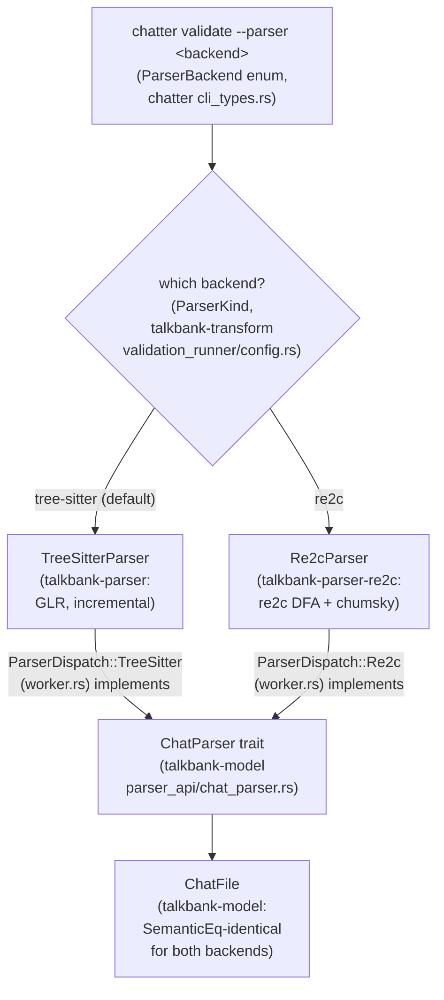

# Parser Backends

**Status:** Current
**Last updated:** 2026-08-27 17:23 EDT

TalkBank has two CHAT parser implementations. Both implement the `ChatParser`
trait and produce identical `ChatFile` model types.

The `--parser` flag selects the backend at the CLI boundary; everything
downstream consumes the identical `ChatFile` output, so the choice is
invisible past the dispatch point:



`ParserDispatch::new(kind)` (in `validation_runner/worker.rs`) is the single
place that constructs the chosen backend from a `ParserKind`; both variants
wrap a `ChatParser` implementor, so the validation runner never branches on
backend again.

## The shared `ChatParser` trait

Both backends implement `talkbank_model::ChatParser` directly (the
tree-sitter impl landed 2026-07-24 in
`talkbank-parser/src/api/chat_parser_impl.rs`; the re2c impl has carried it
from the start). The trait is the parser-agnostic API for every
granularity: whole files, headers, utterances, main tiers, `%mor`/`%gra`
and the other dependent tiers, down to single words and relations. Each
method takes `(input, offset, errors)` and returns a `ParseOutcome`;
diagnostics stream through the caller's `ErrorSink`.

Downstream consumers should bind on the trait, not on a concrete backend:

```rust,ignore
fn analyze<P: ChatParser>(parser: &P, text: &str) { /* ... */ }
```

selects the backend with one generic bound, including cross-target setups
(tree-sitter natively, pure-Rust re2c on wasm, where compiling
tree-sitter's C runtime is undesirable). No facade or cfg-gated dispatch
module is needed on the consumer side. The wasm half of that contract is
pinned in CI: the `wasm` job in `ci.yml` checks `talkbank-model` and
`talkbank-parser-re2c` for `wasm32-unknown-unknown` on every push.

Two notes on the trait's shape:

- The trait has generic methods (`errors: &impl ErrorSink`), so it is not
  dyn-compatible; runtime backend selection uses a small enum such as
  `ParserDispatch` rather than `Box<dyn ChatParser>`.
- On `TreeSitterParser`, every trait method delegates to the matching
  inherent `parse_*_fragment` method, so trait-path and inherent-path
  behavior are identical by construction. The conformance gate is
  `talkbank-parser/tests/chat_parser_trait.rs`.

## TreeSitterParser (default)

- **Crate:** `talkbank-parser`
- **Technology:** [tree-sitter](https://tree-sitter.github.io/) GLR parser
- **Grammar:** `grammar/grammar.js` → generated C parser
- **Strengths:** Incremental reparsing (LSP), robust error recovery (GLR),
  CST-level diagnostics
- **Weaknesses:** Slower on batch workloads, `!Send + !Sync` (one parser per thread)

Used by the LSP, the default CLI, and all production validation.

## Re2cParser

- **Crate:** `talkbank-parser-re2c`
- **Technology:** [re2c](https://re2c.org/) DFA lexer + [chumsky](https://docs.rs/chumsky/1.0.0-alpha.8) parser combinators
- **Grammar:** Translated from `grammar.js` rules → re2c conditions + chumsky combinators
- **Strengths:** 4-8x faster, `Send + Sync`, zero constructor cost, specification oracle
- **Weaknesses:** No incremental reparsing, `Box::leak` memory strategy, and
  **it is not ready to judge CHAT validity** (see below)

Used for parser parity testing and performance benchmarking.

### NOT READY as a validity authority (as of 0.16.0)

**A clean `--parser re2c` run is not evidence that a file is valid.** This
backend ACCEPTS constructs the default backend refuses, so it must not be used
to decide whether a transcript is good. Measured 2026-08-27:

| Input | Default backend | `--parser re2c` |
|---|---|---|
| `“hello” [qq] .` | E316 | **accepted** |
| `hello (.) [qq] .` | E316 | **accepted** |
| `[x 2] hey .` | E375 | **accepted** |

The cause is information lost before validation can see it, not a missing
rule. Both parsers build the same `talkbank_model` types and share one
validator, but each has its own intermediate parse tree, and re2c's does not
carry annotations for every construct:

```rust
// crates/talkbank-parser-re2c/src/ast.rs
pub struct Group     { contents: ..., annotations: Vec<ParsedAnnotation> }
pub struct Quotation { contents: ... }   // no annotations field
```

Six lines apart. A quotation's annotations are discarded at parse time, so no
validator can report them. The same shape covers the pause and the
utterance-initial position.

Also outstanding on this backend: many diagnostics are reported at byte 0
rather than at the construct, and E307 is reported twice where the default
backend reports it once.

Closing these is queued work. Until then, use re2c to COMPARE two
implementations, which is what a specification oracle is for, and use the
default backend to decide validity.

## CLI Usage

```bash
# Default: tree-sitter
chatter validate corpus/

# Use re2c for faster batch validation
chatter validate --parser re2c corpus/

# Roundtrip with re2c
chatter validate --parser re2c --roundtrip corpus/
```

The `--parser` flag accepts `tree-sitter` (default) or `re2c`. Cache entries
are parser-specific, switching parsers does not invalidate the other's cache.

## Parity Status

**The figures in this section were measured against an older tree and have not
been re-measured since; the table below is known to be wrong in at least one
row.** Treat them as historical until someone re-runs them.

Both parsers produce `SemanticEq`-identical output on the 87-file reference
corpus (100% match). On the ~100k-file wild corpus, parity is ~98.7%.

### Error Detection

| Metric | Value |
|--------|-------|
| Specs tested | 140 |
| Both detect error | 140/140 (100%) |
| Same error code | 79/140 (56.4%) |
| Different code, both detect | 61/140 (43.6%) |
| Re2c silent (misses error) | **0 is FALSE.** See "NOT READY" above: three constructs measured silent on 2026-08-27 |

The 61 code mismatches come from architectural differences. The claim that
both parsers report actionable diagnostics for ALL 140 specs no longer holds:
the spec corpus contains no annotation-on-a-container case, which is why this
table did not see the silences named above. A spec example for each is part of
closing them.

### Performance

| Benchmark | TreeSitter | Re2c | Speedup |
|-----------|-----------|------|---------|
| Small file (13 lines) | 44 µs | 9.6 µs | 4.6x |
| Medium file (dependent tiers) | 69 µs | 9.4 µs | 7.3x |
| Large file (complex) | 7,734 µs | 970 µs | 8.0x |
| Batch (35 files) | 21.7 ms | 3.0 ms | 7.2x |

Run benchmarks: `cargo bench -p talkbank-parser-re2c --bench parse_comparison`

## When to Use Which

| Use Case | Recommended Parser | Why |
|----------|-------------------|-----|
| LSP / editor integration | tree-sitter | Incremental reparsing |
| Batch validation (>100 files) | tree-sitter | re2c is faster but is not a validity authority |
| CI validation | tree-sitter | "both correct" was the claim; it is not currently true |
| Error diagnostics (user-facing) | tree-sitter | More specific E3xx codes |
| Parser parity testing | Both | Re2c is the specification oracle |
| Profiling / benchmarking | re2c | DFA lexer gives a performance floor |

## Shared Model Infrastructure

Both parsers convert to the same `talkbank_model::ChatFile` type and share
post-hoc promotion logic:

- `TierContent::extract_terminal_bullet()`: trailing InternalBullet → utterance bullet
- `parse_bullet_node_timestamps()`: structured bullet CST → (start_ms, end_ms)

CA intonation arrows are no longer promoted to terminators at the
parser/model boundary; both parsers leave them as `Separator` items.
See [CA Terminator Resolution](parser-and-grammar/ca-terminator-resolution.md).

## Detailed Parity Report

See [`crates/talkbank-parser-re2c/docs/parity-report.md`](https://github.com/TalkBank/chatter/blob/main/crates/talkbank-parser-re2c/docs/parity-report.md)
for the full gap analysis, divergence categories, and remaining work items.
