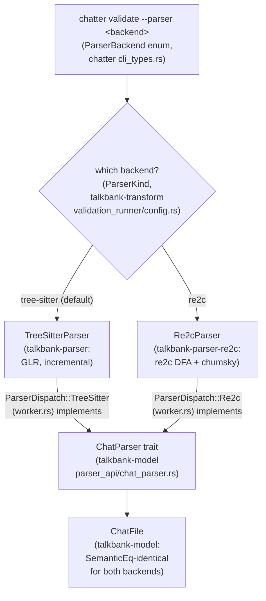

# Parser Backends

**Status:** Current
**Last modified:** 2026-07-24 23:27 EDT

TalkBank has two CHAT parser implementations. Both implement the `ChatParser`
trait and produce identical `ChatFile` model types.

The `--parser` flag selects the backend at the CLI boundary; everything
downstream consumes the identical `ChatFile` output, so the choice is
invisible past the dispatch point:



`ParserDispatch::new(kind)` (in `validation_runner/worker.rs`) is the single
place that constructs the chosen backend from a `ParserKind`; both variants
wrap a `ChatParser` implementor, so the validation runner never branches on
backend again.

## The shared `ChatParser` trait

Both backends implement `talkbank_model::ChatParser` directly (the
tree-sitter impl landed 2026-07-24 in
`talkbank-parser/src/api/chat_parser_impl.rs`; the re2c impl has carried it
from the start). The trait is the parser-agnostic API for every
granularity: whole files, headers, utterances, main tiers, `%mor`/`%gra`
and the other dependent tiers, down to single words and relations. Each
method takes `(input, offset, errors)` and returns a `ParseOutcome`;
diagnostics stream through the caller's `ErrorSink`.

Downstream consumers should bind on the trait, not on a concrete backend:

```rust,ignore
fn analyze<P: ChatParser>(parser: &P, text: &str) { /* ... */ }
```

selects the backend with one generic bound, including cross-target setups
(tree-sitter natively, pure-Rust re2c on wasm, where compiling
tree-sitter's C runtime is undesirable). No facade or cfg-gated dispatch
module is needed on the consumer side.

Two notes on the trait's shape:

- The trait has generic methods (`errors: &impl ErrorSink`), so it is not
  dyn-compatible; runtime backend selection uses a small enum such as
  `ParserDispatch` rather than `Box<dyn ChatParser>`.
- On `TreeSitterParser`, every trait method delegates to the matching
  inherent `parse_*_fragment` method, so trait-path and inherent-path
  behavior are identical by construction. The conformance gate is
  `talkbank-parser/tests/chat_parser_trait.rs`.

## TreeSitterParser (default)

- **Crate:** `talkbank-parser`
- **Technology:** [tree-sitter](https://tree-sitter.github.io/) GLR parser
- **Grammar:** `grammar/grammar.js` → generated C parser
- **Strengths:** Incremental reparsing (LSP), robust error recovery (GLR),
  CST-level diagnostics
- **Weaknesses:** Slower on batch workloads, `!Send + !Sync` (one parser per thread)

Used by the LSP, the default CLI, and all production validation.

## Re2cParser

- **Crate:** `talkbank-parser-re2c`
- **Technology:** [re2c](https://re2c.org/) DFA lexer + [chumsky](https://docs.rs/chumsky/1.0.0-alpha.8) parser combinators
- **Grammar:** Translated from `grammar.js` rules → re2c conditions + chumsky combinators
- **Strengths:** 4-8x faster, `Send + Sync`, zero constructor cost, specification oracle
- **Weaknesses:** No incremental reparsing, `Box::leak` memory strategy

Used for batch validation, parser parity testing, and performance benchmarking.

## CLI Usage

```bash
# Default: tree-sitter
chatter validate corpus/

# Use re2c for faster batch validation
chatter validate --parser re2c corpus/

# Roundtrip with re2c
chatter validate --parser re2c --roundtrip corpus/
```

The `--parser` flag accepts `tree-sitter` (default) or `re2c`. Cache entries
are parser-specific, switching parsers does not invalidate the other's cache.

## Parity Status

Both parsers produce `SemanticEq`-identical output on the 87-file reference
corpus (100% match). On the ~100k-file wild corpus, parity is ~98.7%.

### Error Detection

| Metric | Value |
|--------|-------|
| Specs tested | 140 |
| Both detect error | 140/140 (100%) |
| Same error code | 79/140 (56.4%) |
| Different code, both detect | 61/140 (43.6%) |
| Re2c silent (misses error) | 0 |

The 61 code mismatches come from architectural differences, not bugs. Both
parsers report actionable diagnostics for all 140 testable error specs.

### Performance

| Benchmark | TreeSitter | Re2c | Speedup |
|-----------|-----------|------|---------|
| Small file (13 lines) | 44 µs | 9.6 µs | 4.6x |
| Medium file (dependent tiers) | 69 µs | 9.4 µs | 7.3x |
| Large file (complex) | 7,734 µs | 970 µs | 8.0x |
| Batch (35 files) | 21.7 ms | 3.0 ms | 7.2x |

Run benchmarks: `cargo bench -p talkbank-parser-re2c --bench parse_comparison`

## When to Use Which

| Use Case | Recommended Parser | Why |
|----------|-------------------|-----|
| LSP / editor integration | tree-sitter | Incremental reparsing |
| Batch validation (>100 files) | re2c | 4-8x faster |
| CI validation | Either | Both correct; re2c saves CI time |
| Error diagnostics (user-facing) | tree-sitter | More specific E3xx codes |
| Parser parity testing | Both | Re2c is the specification oracle |
| Profiling / benchmarking | re2c | DFA lexer gives a performance floor |

## Shared Model Infrastructure

Both parsers convert to the same `talkbank_model::ChatFile` type and share
post-hoc promotion logic:

- `TierContent::extract_terminal_bullet()`: trailing InternalBullet → utterance bullet
- `parse_bullet_node_timestamps()`: structured bullet CST → (start_ms, end_ms)

CA intonation arrows are no longer promoted to terminators at the
parser/model boundary; both parsers leave them as `Separator` items.
See [CA Terminator Resolution](parser-and-grammar/ca-terminator-resolution.md).

## Detailed Parity Report

See [`crates/talkbank-parser-re2c/docs/parity-report.md`](https://github.com/TalkBank/chatter/blob/main/crates/talkbank-parser-re2c/docs/parity-report.md)
for the full gap analysis, divergence categories, and remaining work items.
