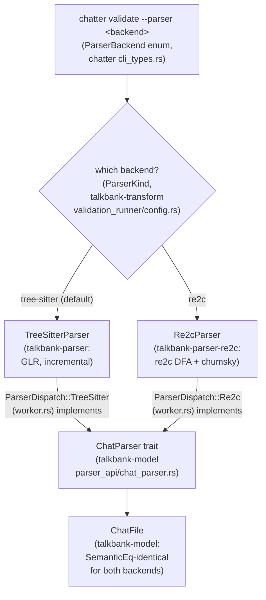
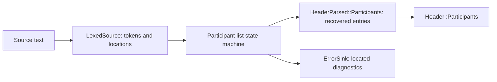

# Parser Backends

**Status:** Current
**Last updated:** 2026-09-06 00:56 EDT

TalkBank has two CHAT parser implementations. Both implement the `ChatParser`
trait and produce identical `ChatFile` model types.

The `--parser` flag selects the backend at the CLI boundary; everything
downstream consumes the identical `ChatFile` output, so the choice is
invisible past the dispatch point:



`ParserDispatch::new(kind)` (in `validation_runner/worker.rs`) is the single
place that constructs the chosen backend from a `ParserKind`; both variants
wrap a `ChatParser` implementor, so the validation runner never branches on
backend again.

## The shared `ChatParser` trait

Both backends implement `talkbank_model::ChatParser` directly (the
tree-sitter impl landed 2026-07-24 in
`talkbank-parser/src/api/chat_parser_impl.rs`; the re2c impl has carried it
from the start). The trait is the parser-agnostic API for every
granularity: whole files, headers, utterances, main tiers, `%mor`/`%gra`
and the other dependent tiers, down to single words and relations. Each
method takes `(input, offset, errors)` and returns a `ParseOutcome`;
diagnostics stream through the caller's `ErrorSink`.

Downstream consumers should bind on the trait, not on a concrete backend:

```rust,ignore
fn analyze<P: ChatParser>(parser: &P, text: &str) { /* ... */ }
```

selects the backend with one generic bound, including cross-target setups
(tree-sitter natively, pure-Rust re2c on wasm, where compiling
tree-sitter's C runtime is undesirable). No facade or cfg-gated dispatch
module is needed on the consumer side. The wasm half of that contract is
pinned in CI: the `wasm` job in `ci.yml` checks `talkbank-model` and
`talkbank-parser-re2c` for `wasm32-unknown-unknown` on every push.

Two notes on the trait's shape:

- The trait has generic methods (`errors: &impl ErrorSink`), so it is not
  dyn-compatible; runtime backend selection uses a small enum such as
  `ParserDispatch` rather than `Box<dyn ChatParser>`.
- On `TreeSitterParser`, every trait method delegates to the matching
  inherent `parse_*_fragment` method, so trait-path and inherent-path
  behavior are identical by construction. The conformance gate is
  `talkbank-parser/tests/chat_parser_trait.rs`.

## TreeSitterParser (default)

- **Crate:** `talkbank-parser`
- **Technology:** [tree-sitter](https://tree-sitter.github.io/) GLR parser
- **Grammar:** `grammar/grammar.js` → generated C parser
- **Strengths:** Incremental reparsing (LSP), robust error recovery (GLR),
  CST-level diagnostics
- **Weaknesses:** Slower on batch workloads, `!Send + !Sync` (one parser per thread)

Used by the LSP, the default CLI, and all production validation.

## Re2cParser

- **Crate:** `talkbank-parser-re2c`
- **Technology:** [re2c](https://re2c.org/) DFA lexer + [chumsky](https://docs.rs/chumsky/1.0.0-alpha.8) parser combinators
- **Grammar:** Translated from `grammar.js` rules → re2c conditions + chumsky combinators
- **Strengths:** 4-8x faster, `Send + Sync`, zero constructor cost, specification oracle
- **Weaknesses:** No incremental reparsing, incomplete diagnostic parity, and
  **it is not ready to judge CHAT validity** (see below)

Used for parser parity testing and performance benchmarking.

### Source ownership and participant recovery

As of 0.19.0, parsed values borrow the caller's source; token storage and
temporary recovery buffers are released after parsing. The former
`Box::leak` strategy is gone.

File parsing now receives a `LexedSource` that privately owns tokens and their
lexer locations alongside the borrowed source. Its only constructor lexes
that source, preventing callers from pairing unrelated token and location
arrays. Participant lists consume those located tokens through one parser
shared with the fragment entry point:



The list distinguishes its initial state, a nonempty entry, and a consumed
comma awaiting another entry. A trailing comma therefore reports E550 while
preserving the preceding participants. Conversion receives parsed entries
instead of reparsing raw header tokens, and header fragments forward the
same diagnostics with the caller's offset. The internal AST snapshot records
this distinction; it does not define a serialized CHAT format change.

The re2c newline token represents one LF, CRLF or lone CR, matching the
canonical grammar. It no longer fuses consecutive breaks and loses blank-line
structure. Source-aware file dispatch reports an unconsumed blank newline at
its lexer span. Generated error fixtures preserve their exact line-ending
bytes in Git; published Markdown normalizes display line breaks and labels
that presentation change.

### Annotation categories survive conversion

Token classification produces `ParsedAnnotation::Scoped(ScopedAnnotationParsed)`
for annotations that decorate content. Retraces, replacements, language codes
and postcodes remain distinct outer variants. The model converter accepts only
`ScopedAnnotationParsed` and returns a `ContentAnnotation` directly: structural
markers cannot enter that conversion and be silently discarded through `None`.
Replacement lookup likewise returns its payload rather than an index requiring
a second match or an unreachable branch.

The file-level E757 spacing check uses the same classified categories for
closing annotations and retraces. It reads adjacent tokens from `LexedSource`
and reports the following word's complete lexer span when the code is glued to
that word. The specification includes both glued examples and a spaced control;
the cross-backend gate checks those generated cases. The same located-token pass
rejects replacements glued to rich or reconstructed words with E375/E316, matching
`word_with_optional_annotations` and CHECK 161. The bracket-location boundary
test compares both backends against the violation and its spaced legal control.
Canonical closing-bracket recovery excludes absorbed trailing whitespace from
its highlight and builds its context from the original source. The internal AST snapshot
changes to show the category, while reference-corpus model equivalence guards
serialized CHAT behavior.

### Postcode admission and diagnostic offsets

A `PostcodeToken` owns its lexer's full span and a private payload state:
nonempty content after trimming trailing whitespace, or recoverable missing
content. The lexer preserves leading payload whitespace. `TierBody::postcodes`
contains only these tokens, so lowering cannot accidentally treat another token
kind as a postcode. Missing content emits E363 and contributes no model postcode;
valid content retains its source span. Main-tier and utterance lowering require
an error sink explicitly.

The re2c trait implementation streams diagnostics through one offset adapter.
File diagnostics, utterance fragments, main-tier lowering and header/participant
fragments therefore use the same rebasing operation as their models. This
removes temporary diagnostic collection in header fragments and the discarded
utterance diagnostics. Remaining fragment entry points that do not yet produce
diagnostics are still a separate parity gap. The postcode boundary test loads
the authored E363 examples and checks actual token spans, nonzero offsets,
recovered tier content and canonical-parser normalization.

### Dependent-tier prefix admission

The lexer distinguishes a complete `TierPrefix`, including its required colon
and tab, from an `IncompleteTierPrefix` recovered from a label. File dispatch
recognizes both forms. Dependent-tier recovery consumes this classification
rather than inferring malformed syntax from an empty body and a suffix check.
It reports E602 over the original complete line and retains the recovered
content for inspection. A complete prefix with no body remains a separate
content-validation question (E756). The E602 boundary test loads both malformed
specification examples and the valid colon-tab control and checks source spans.

### Not ready as a validity authority

**A clean `--parser re2c` run is not evidence that a file is valid.** The
backend still accepts some inputs that the default backend rejects. The
spec parity gate records these cases individually in
`tests/integration/error_parity/baseline.rs`, including:

| Spec case | Missing behavior in re2c |
|---|---|
| `E363.md#0` | Report a postcode containing only spaces |
| `E375.md#1` | Report a replacement annotation glued to its word |

These are implementation gaps, not alternate CHAT rules. Both backends feed
the shared model validator, but information discarded before model lowering
cannot be checked there. Many re2c diagnostic locations also remain dummy
spans; the located participant path above closes one family, not all spans.

The formerly documented silence on unknown quotation and pause annotations
is covered by the passing CLI regression
`unknown_annotation_every_host_tests::an_unrecognised_annotation_is_refused_on_every_host_and_backend`.
Use the named spec baseline for current gaps instead of treating those
historical examples as continuing defects.

## CLI Usage

```bash
# Default: tree-sitter
chatter validate corpus/

# Use re2c for faster batch validation
chatter validate --parser re2c corpus/

# Roundtrip with re2c
chatter validate --parser re2c --roundtrip corpus/
```

The `--parser` flag accepts `tree-sitter` (default) or `re2c`. Cache entries
are parser-specific, switching parsers does not invalidate the other's cache.

## Parity Status

The reference-corpus equivalence and roundtrip gates compare actual parsed
models and serialized output. The error-spec gate
`backends_diverge_only_where_recorded` separately compares diagnostic code
sets against a named, bidirectional baseline: a newly divergent case fails,
and a resolved case must be removed from that baseline. This change removes
E550 after file and fragment participant recovery agree. E747 is also closed:
both lexers preserve single logical line breaks, and both parsers locate a
blank line under LF, CRLF and lone-CR endings while retaining its surrounding
utterances.

A passing baseline means that disagreements are accounted for, not that
both backends meet every spec. The harness distinguishes backend agreement
from each backend's conformance to the declared spec. Run its report with:

```bash
cargo test -p talkbank-parser-re2c --test integration backends_diverge_only_where_recorded --locked -- --nocapture
```

Older wild-corpus percentages and the 140-case diagnostic table are omitted
because they do not describe the current spec suite. No new wild-corpus or
performance measurement is claimed here; the timings below are historical.

### Performance

| Benchmark | TreeSitter | Re2c | Speedup |
|-----------|-----------|------|---------|
| Small file (13 lines) | 44 µs | 9.6 µs | 4.6x |
| Medium file (dependent tiers) | 69 µs | 9.4 µs | 7.3x |
| Large file (complex) | 7,734 µs | 970 µs | 8.0x |
| Batch (35 files) | 21.7 ms | 3.0 ms | 7.2x |

Run benchmarks: `cargo bench -p talkbank-parser-re2c --bench parse_comparison`

## When to Use Which

| Use Case | Recommended Parser | Why |
|----------|-------------------|-----|
| LSP / editor integration | tree-sitter | Incremental reparsing |
| Batch validation (>100 files) | tree-sitter | re2c is faster but is not a validity authority |
| CI validation | tree-sitter | "both correct" was the claim; it is not currently true |
| Error diagnostics (user-facing) | tree-sitter | More specific E3xx codes |
| Parser parity testing | Both | Re2c is the specification oracle |
| Profiling / benchmarking | re2c | DFA lexer gives a performance floor |

## Shared Model Infrastructure

Both parsers convert to the same `talkbank_model::ChatFile` type and share
post-hoc promotion logic:

- `TierContent::extract_terminal_bullet()`: trailing InternalBullet → utterance bullet
- `parse_bullet_node_timestamps()`: structured bullet CST → (start_ms, end_ms)

CA intonation arrows are no longer promoted to terminators at the
parser/model boundary; both parsers leave them as `Separator` items.
See [CA Terminator Resolution](parser-and-grammar/ca-terminator-resolution.md).

## Detailed Parity Report

See [`crates/talkbank-parser-re2c/docs/parity-report.md`](https://github.com/TalkBank/chatter/blob/main/crates/talkbank-parser-re2c/docs/parity-report.md)
for the full gap analysis, divergence categories, and remaining work items.
