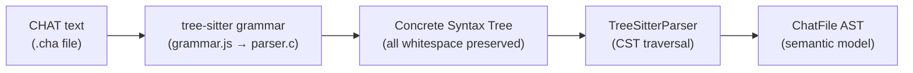
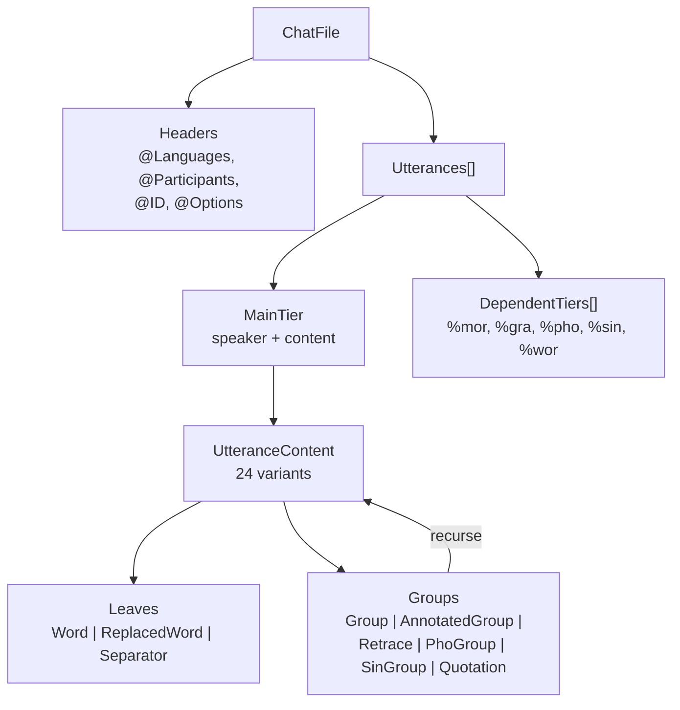

# Parsing

**Status:** Current
**Last updated:** 2026-07-07 21:17 EDT

The parsing pipeline converts CHAT text into a typed `ChatFile` AST.
The default and canonical parser is the tree-sitter parser
(`talkbank-parser`). A second implementation, `talkbank-parser-re2c`,
exists alongside it as a specification oracle and high-throughput
batch parser; it produces the same `ChatFile` model and is opt-in via
`chatter validate --parser re2c`. The LSP and all production paths
use the tree-sitter parser.

## Tree-Sitter Parser

The `talkbank-parser` crate wraps the tree-sitter C parser and converts its concrete syntax tree (CST) into the `ChatFile` model.

Full-file parsing is the canonical entry point. `TreeSitterParser` also
provides fragment methods (`parse_word_fragment()`, `parse_main_tier_fragment()`,
`parse_chat_file_fragment()`, etc.) for parsing isolated CHAT fragments
directly.

### CST → AST Pipeline



```text
Source text
    ↓ tree-sitter parse
Concrete Syntax Tree (CST), green tree with all tokens
    ↓ tree_parsing (Rust)
ChatFile AST, typed model with validation-ready data
```

The CST preserves every character of the source (whitespace, punctuation, comments). The Rust tree-parsing modules extract semantic information from the CST into the typed model through a generated typed traversal layer, described next.

### The generated typed traversal (`generated_traversal`)

The bridge between the tree-sitter CST and the typed model is a single
generated module, `crates/talkbank-parser/src/generated_traversal.rs`,
produced by the `tree-sitter-grammar-utils` generator from the grammar's
own machine-readable description (`grammar/src/grammar.json` plus
`node-types.json`). It contains one `extract_*` function per grammar
rule, each returning a typed view of that rule's children, so consumer
code dispatches on generated types rather than on `node.kind()` strings.

Every child position a grammar rule models is exposed as a `NodeSlot`
with five states:

| `NodeSlot` state | Meaning |
|---|---|
| `Present` | The expected node is there; a typed accessor is available |
| `Missing` | Tree-sitter inserted a zero-width MISSING node during recovery |
| `Error` | An ERROR subtree occupies the position |
| `Unexpected` | A node of an unmodeled kind landed here |
| `Absent` | An optional position is simply empty |

This design makes silent recovery-node loss structurally impossible at
modeled positions: `Missing` and `Error` are explicit variants every
call site must handle (they map to the E342 and E316 diagnostics), not
conditions a hand-written walk can forget to check. Hand-walking the CST
with `node.kind()` comparisons, and classifying the text of ERROR nodes
to guess what was malformed, are both banned in production parser code
for exactly this reason.

Recovery handling is two-layered by design: the per-position `NodeSlot`
states cover every position the grammar models, and a whole-tree
recovery backstop (see the recovery discussion below) surfaces recovery
nodes that land where no grammar rule models a slot, such as top-level
junk. The layers are complementary, and both are load-bearing: removing
the backstop demonstrably regresses the CHECK-parity and
recovery-is-not-validity test suites.

The module is regenerated whenever the grammar changes (the regeneration
workflow, including the staleness guard that fails the test suite if
regeneration is forgotten, is documented in the repository root
`CLAUDE.md` under "Grammar Change Workflow"). It is never edited by
hand: generator defects are fixed in `tree-sitter-grammar-utils` and
regenerated.

### Error Recovery

Tree-sitter's GLR algorithm provides automatic error recovery. When the parser encounters unexpected input, it:

1. Inserts ERROR nodes in the CST
2. Continues parsing the rest of the file
3. Reports parse errors via the `ErrorSink` trait

This means the parser always produces a result, even for malformed files, it extracts as much structure as possible.

### ParseOutcome

Individual parse functions return `ParseOutcome<T>`:
- `ParseOutcome::parsed(value)`: successfully parsed
- `ParseOutcome::rejected()`: could not parse this node (error already reported)

This allows the parser to skip individual malformed elements while continuing to parse the rest of the file.

## Parser Equivalence

The 78-file reference corpus is the primary correctness guarantee:

```bash
cargo nextest run -p talkbank-parser-tests -E 'test(parser_equivalence)'
```

Each `.cha` file is its own test, nextest runs them in parallel and reports individual failures.

## TreeSitterParser API

`TreeSitterParser` is the sole API handle for parsing. Callers create one
instance and pass `&TreeSitterParser` to all parsing call sites. There is
no trait abstraction, `TreeSitterParser` is a concrete type in the
`talkbank-parser` crate.

```rust,ignore
use talkbank_parser::TreeSitterParser;

let parser = TreeSitterParser::new()?;

// Full-file parsing (methods on TreeSitterParser).
// parse_chat_file returns ParseResult<ChatFile> with the diagnostic list
// embedded in the result envelope.
let chat_file = parser.parse_chat_file(&source)?;
// parse_chat_file_streaming pushes diagnostics into an ErrorSink as it
// goes, useful for very large files or LSP-style incremental flows.
let chat_file = parser.parse_chat_file_streaming(&source, &errors);

// Fragment parsing (methods on TreeSitterParser), used when synthesizing
// CHAT from non-CHAT sources (ASR output, UD annotations).
let word = parser.parse_word_fragment(word_text, &errors);
let main_tier = parser.parse_main_tier_fragment(tier_text, &errors);
```

### AST Structure

The resulting `ChatFile` AST has a recursive content structure:



## Parser String Handling

The tree-sitter parser constructs owned model types (e.g., `MorWord`, `GrammaticalRelation`) directly from CST text. String-heavy types like `PosCategory` and `MorStem` use `Arc<str>` interning to avoid redundant allocations for repeated values. Short strings in model newtypes use `SmolStr` for inline storage up to 23 bytes.
