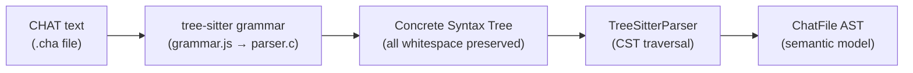
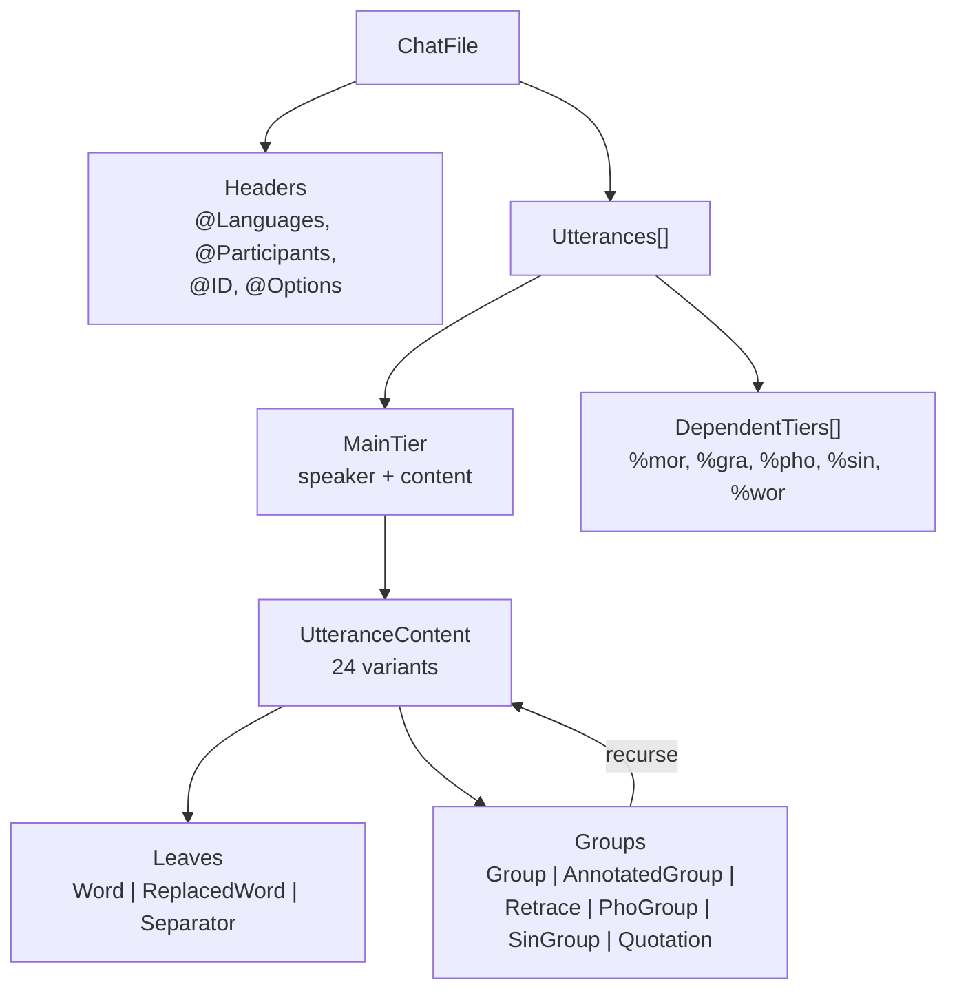

# Parsing

**Status:** Current
**Last updated:** 2026-09-24 00:21 EDT

The parsing pipeline converts CHAT text into a typed `ChatFile` AST.
The default and canonical parser is the tree-sitter parser
(`talkbank-parser`). A second implementation, `talkbank-parser-re2c`,
exists alongside it as an experimental, incomplete alternative, not an
authority for CHAT validity. It targets the same `ChatFile` model and is opt-in via
`chatter validate --parser re2c`. The LSP and all production paths
default to the tree-sitter parser.

## Tree-Sitter Parser

Generated recovery capabilities should survive through diagnostic helpers.
For example, the empty-colon reporter requires `KindMissing<ColonNode>`, not
an arbitrary colon node followed by a zero-width test. The producer already
distinguishes a present token from a missing placeholder. Retaining that state
does not establish that CHAT fixtures reach it: deleting a speaker colon still
produces generic E316 recovery, and E322 remains deferred.

The `talkbank-parser` crate wraps the tree-sitter C parser and converts its concrete syntax tree (CST) into the `ChatFile` model.

Full-file parsing is the canonical entry point. `TreeSitterParser` also
provides fragment methods (`parse_word_fragment()`, `parse_main_tier_fragment()`,
`parse_chat_file_fragment()`, etc.) for parsing isolated CHAT fragments
directly.

### CST → AST Pipeline


```mermaid
flowchart LR
    chat["CHAT text\n(.cha file)"]
    grammar["tree-sitter grammar\n(grammar.js → parser.c)"]
    cst["Concrete Syntax Tree\n(all whitespace preserved)"]
    walker["TreeSitterParser\n(CST traversal)"]
    ast["ChatFile AST\n(semantic model)"]

    chat --> grammar --> cst --> walker --> ast
```

```text
Source text
    ↓ tree-sitter parse
Concrete Syntax Tree (CST), green tree with all tokens
    ↓ tree_parsing (Rust)
ChatFile AST, typed model with validation-ready data
```

The CST preserves every character of the source (whitespace, punctuation, comments). The Rust tree-parsing modules extract semantic information from the CST into the typed model through a generated typed traversal layer, described next.

### Source-preserving document and participant lowering

Document classification retains generated source-bound capabilities for both
complete and recovered documents. Associated child projections carry the
producer's source through lines and header dispatch without repeated
root-membership searches. Header fragments use the same dispatcher with their
already admitted wrapped-source slice.

Source association is not a proof that all runtime ranges are readable. The
incremental API still accepts a raw old tree, whose caller must apply every
source edit before reuse. The finite-corpus boundary test deliberately reuses
an unedited reference tree after deleting its input: parsing completes, but
root admission rejects `InvalidRange`; a cold parse of the same empty input
has a readable root. This is an API-contract violation, not a CHAT syntax rule.
Keep range refusals until the producer models the edit/source relationship;
neither a bound parent nor unreached fixture branches establishes that proof.

The editor now uses `TreeSitterParser::parse_chat_file_revision` and its opaque
`ParsedRevision` cache. Only the parser constructs that cache from the source
it actually parsed. The next transition accepts new text and a previous
revision, derives a UTF-8-safe edit from the retained baseline, edits a cloned
tree, and parses it. The LSP no longer owns an independent edit calculator or
stores a separately replaceable source/tree pair. Detached trees remain
available for structural queries but cannot be installed back into a revision.
This closes stale pairing in the revision API, not the raw-tree compatibility
APIs described above, and does not certify recovered CHAT as valid.
The edit calculator counts shared complete Unicode scalar values, not shared
bytes requiring later UTF-8 repair. Equal characters have equal byte widths;
the resulting prefix is a boundary in both sources. The suffix is counted only
within the remainder, so it cannot overlap the prefix. This removes intermediate
split-code-point states without removing any CST recovery or range admission.

Utterance lowering also takes `SourceBound<UtteranceNode>` directly from the
document projection. Its entry point no longer accepts an independently chosen
source string. Its generated dependent-tier repeat retains `SourceField`
association until attachment admits the choice once as `SourceBound<Choice>`.
Parse-health classification and exhaustive dependent-tier dispatch select from
the generated `ChoiceBoundView`: each variant retains the same admitted range,
so dispatch does not repeat range checks in every arm. This capability exists
only for single-node choices; composite choices still require individual child
admission. Main/dependent-tier leaf adapters still take
raw typed nodes and the source borrowed from that owner; migrating their own
child projections is separate work. Association alone does not prove their
recovery or decoding branches unreachable. Missing/Error/Absent slot states
remain distinct, with conservative parse-health taint preserved.

User-defined `%x*` lowering keeps the admitted concrete tier and projects its
optional body through associated slots. Present and typed Missing bodies both
retain their own range admission; text comes from the resulting bound node,
not a second node/source decoding attempt. Empty tiers remain in the model,
and Error/Absent body states retain their existing diagnostics. Prefix handling
and other dependent-tier families remain transitional leaf adapters.

`@Participants` lowering keeps this association through contents, list groups,
speaker codes, names and roles. Generated `SourceSlotView` keeps genuine
Missing, Error and Absent outcomes distinct, with impossible payloads remaining
uninhabited. Leaf reads admit their canonical byte ranges at the shared boundary;
there is no independent source argument that can be paired with a participant
node. This removes transitional decoding from that family, not recovery.
`@Media` now keeps the same association through its body, filename, media type
and optional status group. Its payload reader borrows checked text directly
instead of allocating temporary strings or accepting an independent source.
Missing/Error/Absent slots, displaced nodes, range refusals and the validated
`MediaFilename` constructor remain. Header-level recovery still uses the shared
diagnostic site. The thirteen scalar/text headers and the single-value
`@Number`, `@Recording Quality` and `@Transcription` headers use the same
source-associated reader. Their entry points cannot take an independently
selected source, and model constructors receive borrowed checked payloads.
`HeaderSite::bound` derives diagnostic identity from that same capability.
The two-slot `@Birth of`, `@Birthplace of` and `@L1 of` headers do likewise:
their participant slot requires generated `SpeakerNode` identity, and the
admitted result distinguishes `SpeakerCode` from borrowed value text. A failed
speaker read still prevents value decoding. The old owned-string slot reader
has no callers and is removed. Comment headers retain association through body
admission too; the bullet-text adapter receives that same source-bound node,
with no separate source argument. `HeaderSite` has only the producer-bound constructor,
so diagnostic sites cannot be built from independently paired nodes and input.
Options, bullet-text internals and other structured header internals remain
transitional; this does not prove recovery states unreachable or certify
semantic validity of source-admitted values.

### The generated typed traversal (`generated_traversal`)

The bridge between the tree-sitter CST and the typed model is a single
generated module, `crates/talkbank-parser/src/generated_traversal.rs`,
produced by the `tree-sitter-grammar-utils` generator from the grammar's
own machine-readable description (`grammar/src/grammar.json` plus
`node-types.json`). It contains one `extract_*` function per grammar
rule, each returning a typed view of that rule's children, so consumer
code dispatches on generated types rather than on `node.kind()` strings.

Every child position a grammar rule models is exposed as a `NodeSlot`
with five states, of which each position's type admits only the ones that
position can produce:

| `NodeSlot` state | Meaning |
|---|---|
| `Present` | The expected node is there; a typed accessor is available |
| `Missing` | Tree-sitter inserted a zero-width MISSING node during recovery |
| `Error` | An ERROR subtree occupies the position |
| `Unexpected` | A node of an unmodeled kind landed here |
| `Absent` | An optional position is simply empty |

The generator names the position's kind in the slot's type. A `ChildSlot`
(a child taken by kind) is never `Unexpected`; a `SeqSlot` (an inline
sequence) is never `Missing` or `Unexpected`; a `ChoiceSlot` can be any of
the five; a `ClassifiedSlot` (a supertype rule's own node) is never
`Absent`. The impossible states have the uninhabited `Never` as their
payload, so an arm that reads a node out of one does not compile, and a
match by value may omit it. Every generated accessor hands out a
reference, and a match through a reference must still name every variant,
so a consumer matches `slot.view()`, which copies the recovery states out
by value and borrows only the present payload. The parser's shared verbs
(`expect_present`, `expect_structure`, `expect_delimiter`, `present`) are
generic over all four kinds.

This design makes silent recovery-node loss structurally impossible at
modeled positions: `Missing` and `Error` are explicit variants every
call site must handle, not conditions a hand-written walk can forget to
check, and a diagnostic for a state the position cannot reach cannot be
written either. `Missing` maps to E342 (a MISSING placeholder for a required
element); `Error` reaches E316, which is the generic "content could not be
parsed" catch-all.

That asymmetry matters when reading a diagnostic. E342 names a specific fact
the parser knows. E316 names the absence of one, so an E316 on input a human
can read is a standing invitation to ask whether the parser, rather than the
file, is at fault: a generic code standing in for a specific rule is one of the
documented tells of a chatter defect. Hand-walking the CST
with `node.kind()` comparisons, and classifying the text of ERROR nodes
to guess what was malformed, are both banned in production parser code
for exactly this reason.

**What to write instead, when the question really is "which alternative is
this node?"** A grammar rule whose alternatives are each a single named kind
lowers to a `<Rule>Choice` enum, and the generator emits that enum's own
classifier, `<Rule>Choice::from_node`. It returns `Option<Self>`: `None` says
the node is not one of the alternatives, which is a fact about the input, not a
default to paper over. Matching the result is exhaustive, so adding an
alternative to the grammar breaks compilation at every site that decides on it,
which a chain of `kind()` string comparisons never does.

The classifier is emitted exactly when a kind can identify an alternative. A
choice with a sequence, repeat or optional alternative is told apart by
STRUCTURE, so it deliberately gets none: there, the shape is the question, and
a kind-keyed answer would be a guess. When no classifier exists, extract the
rule and match on the carrier rather than reaching for `kind()`.

Bullet-capable free text follows that structural path: `BulletTextNode` retains
the two grammar carriers, and lowering consumes their generated first/repeated
choices and nested bullet/picture groups. The groups own trailing spaces;
recovery positions and displaced sinks remain explicit. Structured timestamp
parsing requires `BulletNode` and derives start/end fields from its generated
carrier, rather than accepting arbitrary nodes and looking up string field names.
Checked transitional text reads reject invalid ranges but do not by themselves
prove tree/source identity; the producer-owned source boundary remains distinct.
The internal bullet-text sum type exposes only source-bound carrier conversions,
not an independent raw-node classifier or raw projection. All nine bullet-text
dependent-tier adapters preserve the dispatcher's binding, and their optional
body slots retain source identity through generated projections. Present and
MISSING bodies still undergo fallible range admission; ERROR and absent bodies
retain their separate diagnostic policies. Generated choice and nested-group
projections carry source identity through the inner segment sink too; it owns
no separately supplied source. Text, inline-picture and inline-bullet leaves
accept admitted source-bound nodes. Picture delimiter/filename admission and
the inline all-zero timestamp policy remain separate from source admission.
The shared timestamp decoder still has a transitional raw interface; this
migration does not prove its recovery guards redundant. Displaced children
still use the shared recovery collector. Reference tests obtain carriers through
the producer-bound descendant API rather than pairing raw nodes with text.

Leading-zero timestamp diagnostics require an admitted `LeadingZeroTime`
spelling and stream directly to the sink. Both numeric fields must first fit
the timestamp representation; overflow takes precedence over spelling reports.
The two-component case reports start before end, retaining the bullet's source
span and numeric value. The E748 spec family and its corpus contract check
that multiplicity, ordering and precedence; the observation snapshot alone
records code sets and cannot establish diagnostic counts.

The legacy single-utterance helper probes through an admitted wrapper and the
checked parse producer, rather than calling tree-sitter directly and treating
failure as fragment shape. Its private classified-input state retains either
the complete document envelope or the exact input requiring scaffolding. A
valid no-transcription document may contain no utterance; the helper then
reports MissingMainTier without reclassifying the document as a fragment.

Inline pictures additionally admit their decoded text into a private nonempty
filename value before conversion to an owned string. Its constructor checks both
delimiters and the nonempty payload. Tests retain real picture nodes and exercise
incompatible source and delimiter boundaries; those are API admission witnesses,
not evidence that the grammar produces malformed picture tokens.

Inline bullet times likewise pass a private admission value that excludes the
all-zero pair. This is an inline-tier rule, not a time-ordering proof. Parse-backed
tests produce separate trees for zero/positive timestamp combinations; source
incompatibility is tested separately without treating it as malformed CHAT.

The ban above stood for a year with nothing to point at, which is why the
`node_types` kind-constant catalogue kept being reached for: a prohibition
loses to whatever the API actually makes easy. This is that missing
affordance, and it lives in the generator so every consuming grammar gets it.

Recovery handling is two-layered by design: the per-position `NodeSlot`
states cover every position the grammar models, and a whole-tree
recovery backstop (see the recovery discussion below) surfaces recovery
nodes that land where no grammar rule models a slot, such as top-level
junk. The layers are complementary, and both are load-bearing: removing
the backstop demonstrably regresses the CHECK-parity and
recovery-is-not-validity test suites.

Main-tier body sinks are owned by a sealed set of generated carriers. Their
reporter derives the displaced nodes from the carrier and the diagnostic context
from its owning rule's generated `NamedKind`; callers cannot supply a different
sink, region or label. ERROR children use the shared body classifier, while other
displaced nodes use the ordinary reporter. This does not prove node/source
identity or remove recovery states. Raw slot-level errors still retain their
explicit body-versus-outside-body policy.

Annotated angle-bracket, phonology and sign groups belong to this sealed body-carrier set.
Recovery can place malformed word material beside a group's contents slot;
that placement must not downgrade a missing form suffix to generic E316.
The E202 spec pairs a valid suffix with a one-character deletion inside a
retraced group after multibyte text, exercising the normal document path.
Parallel valid/deleted-suffix pairs exercise phonology and sign groups; their
displaced word faults retain the same body-owned classification.

Fragment-corpus tests also extract dependent tiers through model-owned spans
and compare public full-line and content-only APIs against file parsing.
Timing-tier payload states remain distinct during rebasing: their text and
clock values are unchanged, but the source span in every state shifts with
the owning fragment. Invalid E603/E756 fixtures cover unsupported and empty
timing content without inventing model values.

Linkers likewise use generated first/repeated groups and exhaustive concrete
alternatives, not a second kind-name catalogue. A source-ordered accumulator
keeps each token's kind and span together and reinserts displaced recovery in
source order. Normal traversal appends directly; the recovery boundary uses the
generated supertype classifier to retain any concrete linkers found in a sink.

Main-tier speaker admission retains `SpeakerNode` until checked text decoding.
Only that admission can construct the private nonempty speaker/span value, which
conversion consumes after reporting the rest of the tier's diagnostics. Missing
placeholders retain their MissingSpeaker diagnostic; unreadable source ranges
reject with TreeParsingError. This compatibility boundary does not establish
tree/source identity.

Prefix decoding retains kind-proven placeholders for star, speaker, colon and
tab through the generated `KindSlotValue` projection. Speaker and colon
diagnostics receive their respective typed nodes, rather than a raw-node
projection. Present, MISSING, ERROR and absent policies remain distinct; the
colon width check occurs inside the typed-node arm without an intermediate
optional raw node.

Malformed dependent-tier labels use a private nonempty admission value after
the leading percent sign. Only colon, tab, space, carriage return and newline
terminate a label; unknown labels remain unknown rather than matching a known
prefix. This recovery classification does not certify CHAT validity. Both
document and utterance recovery share its alignment-domain policy.

The independent re2c text-tier path admits its source-located tokens before
building recovered content. All-zero inline media bullets produce E360 at their
lexer spans and are omitted, while surrounding tokens remain. Full-file text
tiers and fragment entry points share this admission; fragment sinks rebase
diagnostic locations through the admitted fragment source. This does not change
main-tier bullet timing or establish complete backend parity.

Top-level recovery binds its node before dependent-tier diagnostics or header
recovery. Both dependent-tier handling and unknown-header recovery consume the
resulting `SourceSlice`, deriving text and location from the same producer-owned
input. Binding refusal reports a parsing error before taint or recovered lines
can be constructed from an unrelated node/source pair. Recovery precedence for
bound nodes remains dependent tier, recoverable header, then generic analysis.
Generic file-error analysis consumes that same binding instead of re-reading a
raw node against a separately supplied string. Line-slot ERROR handling also
binds before entering this analyzer; source-binding refusal is a parsing error,
not a diagnostic constructed from a mismatched source.
Both routes share the same binding/refusal function. Its regression test uses
real ERROR nodes from a retained spec fixture and a separately parsed identical
source: the producing owner admits them, while the other owner must refuse.
That is source-identity boundary evidence, not a production recovery-slot witness.

Unclosed-delimiter findings retain the node/text pair from `ReadableRecovery`.
Their consuming diagnostic conversion takes only a context label, so a caller
cannot recognize one node's text and report another node's span. This retains
the checked-range guarantee, not a new source-identity guarantee. Leading
whitespace is still outside this finding's lexical policy; later trim-based
bracket recovery remains distinct.

That bracket recovery retains the readable range in a `BracketRecovery` state.
Recognizing an annotation prefix alone cannot select missing-space advice:
`MissingSeparator` additionally requires adjacency to preceding non-whitespace
in the retained source. `InvalidFormOrPosition` preserves the same rejection
without claiming a missing separator. Neither state certifies a valid CHAT
annotation or adds a tree/source-identity guarantee.

Non-ASCII main-tier speaker recovery admits a `NonAsciiSpeaker` from one bound
node, retaining the code slice and exact span. It reports through the model's
shared speaker-syntax assessment, the same owner used by participant, ID and
main-tier model validation. Character syntax is E307, not the E522 declaration
join. Non-ASCII codes are rejected; supported ASCII forms remain unchanged.

Postcodes retain opaque labels in `Postcode`; their text is not reparsed as
quotation syntax during validation. Actual quotation delimiters, typed linkers
and terminators have their own checks. A postcode whose label resembles a
quotation marker cannot create a quotation-balance obligation.

Bracket-to-word spacing validation projects each content item's following-word
and closing-code evidence together with its enclosed sequence. One exhaustive
mapping serves both top-level and bracketed content. A private nonzero code-end
value excludes the unlocated sentinel before adjacency can be checked. Each
recursive sequence starts with no predecessor: flattening an outer wrapper and
its children would create false neighbors. E757 controls and single-space
deletions cover annotated events, actions, quotations, retraces and phonology/sign
groups; the diagnostic contract checks exact byte offsets and serialization
back to the paired control. This is source-location evidence, not a replacement
for the parser's tree/source ownership boundary.

Replacement-word producers also retain the whole typed CST wrapper's span,
including trailing scoped annotations. The shared spacing projection admits
that wrapper's code end while retaining the spoken word's own start. A dummy
replacement span previously concealed missing separators at either closing
bracket; canonical replacement pairs now exercise both endings and nested use.

Wrapped-header selection starts at `ParsedSource::root()` and carries bound
descendants through `SourceSlice::children`. Admission takes only the owning
parsed wrapper and header ordinal, so it cannot pair a selected node with another
wrapper's input mapping. Child traversal resets its cursor to the bound parent
and avoids repeated root-wide lineage searches. Header-counting policy and
complete-input checks remain separate from that source-ownership proof.
The lookup result is a privately constructed `SelectedHeader`: generated
header/pre-begin choices and anchor wrappers admit its kind, with the deliberate
Thumbnail exclusion retained. The grammar's invisible supertypes do not add
concrete wrapper nodes, so lookup traverses the real `line` wrapper but never
tries to unwrap an abstract `header` or `pre_begin_header`. A selected header
cannot be a generic ERROR node. MISSING placeholders and other lowering
failures remain recovery states, not proof that the fragment is valid.
The old handwritten header-kind predicates and their membership-only test are
removed with their last consumer. Generated choices own subtype membership;
reference/spec fragment tests continue to own behavior and recovery policy.

User-defined dependent-tier taint routing reads the generated Present prefix
slot, not a positional raw child. `%xmod` identifies the model-alignment domain;
other labels and recovered or unreadable prefixes do not identify one. When
attachment reports errors without a specific domain, all alignment dependents
remain conservatively tainted.

The module is regenerated whenever the grammar changes; the command and its
preconditions are in [Grammar Workflow](../contributing/grammar-workflow.md).
It is never edited by hand: generator defects are fixed in
`tree-sitter-grammar-utils` and regenerated.

The generated cursor owns its remaining-child iterator. Existing `AtChild` and
`AtContent` transitions govern consumption, while absolute memo indices are
derived against the stable full child slice. Exhaustion stays at EOF, and the
consuming final sweep visits the actual remaining children. This bounds cursor
movement without narrowing required-slot recovery or proving that repeat
lookahead counts agree with extraction.

Wrapper and supertype child positions use `KindSlot`: extraction matches the
concrete kind before constructing `KindMissing<T>`. The kind-preserving
`known_or_placeholder` projection therefore has no unclassified-placeholder
case. Raw partial and composite-choice slots retain their fallible projection
and recovery states. Diagnostic `view()` still exposes the raw missing node;
generic conformance observes its payload through `RecoveryNode`. Consumer
foreign-kind fallback branches are removed only for the kind-proven slots.

Generic, word and dependent-tier recovery cross a shared `ReadableRecovery` admission
boundary before examining text. The admitted value retains its node, source and
checked slice together; the classifier consumes that value instead of accepting
independent text. Its fields remain private and consumers cannot construct it
without checked slicing. This proves range compatibility, not tree/source identity.
Incompatible ranges retain each boundary's diagnostic family instead of
panicking in tree-sitter's byte indexing.
Dependent-tier classification derives both coordinates and text from that
carrier; nonempty admitted text therefore needs no second positive-span check.
Delimiter findings remain priority-sensitive: a leading space can bypass the
first-character delimiter finding, so a later trim-based bracket fallback is
not generally redundant.

Empty-POS morphology findings retain both the recognized token and its relative
byte range. Both dependent-tier analysis and whole-tree recovery use that same
occurrence; searching for the token again could select an identical split tail
that the classifier deliberately excluded. UTF-8 and Unicode whitespace retain
byte-correct spans, and there is no invented whole-node fallback range.

Language-list admission consumes the generated language-code slot through one
policy for first and repeated entries. A position enum preserves their distinct
diagnostic wording; only Present enters the fallible model constructor. Missing,
ERROR and absence retain their recovery behavior. Sequence-level Missing is
eliminated only through its generated uninhabited payload, not corpus absence.

Word-language resolution keeps explicit, mixed and ambiguous candidate sets
distinct. Each explicit resolution is consumed into an outcome carrying its
registry diagnostics, using one shared transition over every candidate code.
An ambiguous candidate is not exempt from ISO validation, and an unresolved
shortcut never invents a fallback language.

Participant-list slots use the same admission pattern, with a position type
that carries the enclosing header only for the first slot. Absence there still
reports an empty header; repeated-slot absence does not. Both positions share
entry conversion and Missing reporting while preserving their ERROR wording.

Scoped overlap indices are admitted as 1–9 at construction and JSON decoding;
the schema carries the same bounds. Unindexed markers use `None`, never a
numeric sentinel. Atomic token decoding distinguishes an absent index from a
malformed one, so malformed content cannot become an accepted unindexed marker.
The experimental backend carries the admitted index with its original lexer
slice into model conversion. CA overlap-point indices retain their separate
recovery representation and 2–9 validation policy.

CA element and delimiter nodes retain their generated kinds into a private
decoder trait. Each kind fixes its registry, diagnostic label and model output;
callers cannot mix those policies. Source admission uses checked bounds and
UTF-8 decoding before character classification. Missing placeholders remain
rejected for whole-tree recovery reporting, and unknown symbols still diagnose
TreeParsingError. Source compatibility is not proof of original-tree identity.

Utterance construction similarly consumes a private `ReadableMainTier` carrying
the generated node, source and checked line slice together. Failed admission
reports TreeParsingError and taints Main without constructing an utterance.
Successful admission preserves the existing conversion and diagnostic-taint
transition. This boundary proves readable ranges, not original-tree identity.

Utterance-level recovery consumes `ReadableRecovery` too, forwarding that
admitted value directly into dependent-tier classification when appropriate.
Unreadable input cannot select a tier: it reports TreeParsingError and taints
Main plus all alignment dependents. Valid-source recovery retains the existing
label-based taint policy; boundary tests do not imply production slot witnesses.

The generated repeat producer now retains the cursor selected by lookahead in
`RepeatSelection`. Extraction consumes that selection using the same cursor,
instead of applying a detached count after releasing it. This proves cursor
identity only: per-element boundary agreement is still a separate obligation.
No repeat recovery state is narrowed, and element-owned extras are not filtered.

Word and main-tier fragment admission stores `SourceBound<GeneratedNode>` from
`ParsedSource::bind_typed`. The binding's sealed wrapper trait prevents external
adapters from claiming a mutable node identity. Lowering obtains both the node
and source from that one value; there is no separate node field to pair with the
wrong bound slice. Existing completeness, wrapper-offset and recovery policy
checks remain independent and unchanged.

Phonology fallback accepts `PhoGroupNode` rather than an arbitrary raw node and
uses the shared checked-text admission boundary. Nonempty readable group text
still becomes one fallback word, and empty or unreadable text adds no item.
Unreadable ranges diagnose TreeParsingError. These boundary tests do not prove
that a valid corpus fixture reaches fallback through production extraction;
the recovery branches remain until the producer justifies narrowing them.

**The staleness guard proves less than its name suggests.**
`generated_traversal_is_current` recomputes the digests of `grammar.json` and
`node-types.json`, so it catches a forgotten regeneration after a grammar
change and nothing else. It cannot see which generator produced the file, so a
module emitted by an older backend passes indefinitely. The generator's name
and version are stamped in the file's own header comment; read that when the
question is which backend built it.

The compiled conformance walk checks real CSTs from the reference corpus.
Its slot-state census admits the complete reference and error populations
before reporting; discovery, read or parse failures cannot silently shrink
the measurement. Positions carry the generated carrier type and field name,
so a nested group's `child_0` cannot merge with its outer carrier's `child_0`.
A recovery observation is a reachability witness. A state absent from this
finite population is not proof that the producer cannot emit it, and is not
grounds for deleting its handling.

### Error Recovery

Tree-sitter's GLR algorithm provides automatic error recovery. When the parser encounters unexpected input, it:

1. Inserts ERROR nodes in the CST
2. Continues parsing the rest of the file
3. Reports parse errors via the `ErrorSink` trait

This means the parser always produces a result, even for malformed files, it extracts as much structure as possible.

### ParseOutcome

Individual parse functions return `ParseOutcome<T>`:
- `ParseOutcome::parsed(value)`: successfully parsed
- `ParseOutcome::rejected()`: could not parse this node (error already reported)

This allows the parser to skip individual malformed elements while continuing to parse the rest of the file.

## Parser Equivalence

The reference corpus is the primary correctness signal:

```bash
cargo test -p talkbank-parser-tests --tests reference_corpus_parses
```

Each `.cha` file is its own test, so failures are reported per file. The file
count is deliberately not stated here: this page claimed 78 for months while the
corpus grew past a hundred. Ask the tree
(`rg --files -g '*.cha' corpus/reference | wc -l`).

## TreeSitterParser API

`TreeSitterParser` is the concrete canonical parser handle. Reuse an instance
across calls. The shared `talkbank_model::ChatParser` trait also supports
generic callers and backend parity tests; both tree-sitter and re2c implement
it. Its sink methods are generic, so the trait is not a `dyn` trait object.

```rust,ignore
use talkbank_parser::TreeSitterParser;

let parser = TreeSitterParser::new()?;

// Full-file parsing (methods on TreeSitterParser).
// ParseProduct::Built retains the file and diagnostics together, even when
// recovery was necessary. Unbuildable has diagnostics without a model.
let product = parser.parse_chat_file(&source);
// parse_chat_file_streaming pushes diagnostics into an ErrorSink as it
// goes, useful for very large files or LSP-style incremental flows.
let chat_file = parser.parse_chat_file_streaming(&source, &errors);

// Fragment parsing (methods on TreeSitterParser), used when synthesizing
// CHAT from non-CHAT sources (ASR output, UD annotations).
let word = parser.parse_word_fragment(word_text, document_offset, &errors);
let main_tier = parser.parse_main_tier_fragment(tier_text, document_offset, &errors);
```

### Diagnostic coordinates

Fragment parsing adds the caller's offset to model spans and
diagnostic document locations. `FragmentSource` admits the complete input
range before parsing and owns this translation for both backends. Admission
checks `origin + input.len()` without overflowing; ranges beyond `u32::MAX`
are rejected with E310 and an unknown location, since no representable
location exists. Origins above `i32::MAX` remain supported: the existing
signed edit-shift interface receives bounded positive steps, never a wrapped
negative origin. A diagnostic's `ErrorContext` owns its own
source text, so its highlight remains relative to that text. Wrapper removal
is a separate operation owned by `WrappedFragment`; it projects the synthetic
source before applying any document origin.

Word and main-tier fragments use the multi-root grammar directly, so there is
no synthetic prefix to subtract. `MainTierFragment` admits a typed main-tier
node from a `ParsedFragment`, deriving the original input from the same owner
that assembled and parsed the newline-extended source. Capacity admission
precedes allocation; callers cannot supply an independent original input. The
node is admitted only when it covers the complete parse source and the root has no extra
or unexpected content. Lowering consumes that proof together with the original
input, clipping the aggregate tier/content spans to exclude an appended line
terminator. LF and CRLF supplied by the caller remain part of those spans.
Trailing garbage or another tier cannot be silently ignored.
Non-colon separator decoding consumes the generated `typed_or_placeholder`
view: present and kind-admitted MISSING alternatives share one semantic mapping,
while unclassified placeholders retain their distinct recovery diagnostic.
The consumer no longer reclassifies raw MISSING nodes independently.

Marked-token and typed-text decoding share checked node-text admission. Its
typed result distinguishes a range outside the supplied source from a range
that cuts a UTF-8 code point. Marker stripping receives only the admitted text
and still rejects the wrong marker. This boundary proves readable bytes, not
identity with the source that produced the tree; producer-bound slices remain
the stronger API.

Language-list recovery carries its offending node in a `LanguageListFault`
variant: an unexpected first/subsequent code or an unparsable repeated group.
Comma and post-comma whitespace faults have their own variants as well.
The consuming reporter owns the corresponding wording and shared diagnostic
location, rather than accepting arbitrary message text at separate call sites.
Participant recovery follows the same pattern with `ParticipantFault`: list
comma/whitespace/entry expectations retain E506 and list context, while malformed
entry structure retains E316 and entry context. Sharing the reporter does not
merge those policies or remove unobserved recovery states.
Sign-tier token decoding retains either a generated word or whole recovery-group
node in `SinTokenSource`, which selects its diagnostic context and shares checked
text admission. Whole-group fallback preserves the complete source text as one
token; an incompatible source reports a read failure. Its direct boundary test
does not claim that the fixture itself enters recovery during normal parsing.
Morphology feature-value decoding similarly accepts only its generated node
type, including kind-proven MISSING placeholders, and uses shared checked text
admission. Empty-value and unreadable-source refusals retain their existing
diagnostics; source compatibility is not mistaken for tree/source identity.
`ReadableRecovery::fragment_diagnostic` owns the pairing of a source-located
span with fragment-local display context. Word-error classifications supply
only their code and message; they cannot accidentally use another recovery
node's location or another fragment's context through this constructor.
The generic recovery classifier uses the same constructor for fragment-local
diagnostics. Classifications that need a subspan or full-source context remain
separate.

Main-tier conversion returns either the model or a private-constructor
`ReportedMainTierError` issued when the producer reports its rejection
diagnostic. Speaker admission retains that evidence through conversion, so the
fragment consumer needs no synthetic "failed to build" fallback. Recovery
diagnostics still precede rejection, and successful models may still carry
diagnostics; the result does not certify validity.
Header, utterance, participant-entry and dependent-tier adapters, including
the standalone `parse_header` and `parse_tiers` entry points, use an
owned `WrappedFragment`: its constructor records the actual input boundary as
it assembles the source, and both the model projection and diagnostic sink use
that boundary. Its diagnostic sink removes that prefix from both primary and
secondary spans. Context is projected only when its text exactly matches the
owned synthetic source; an independent context retains its own coordinates
regardless of length. `cargo test -p talkbank-parser --lib api::fragment::tests`
checks long inputs, related labels and independent context text. These adapters
no longer use the legacy sink's length heuristic. Header lowering consumes a
`HeaderFragment` that owns the located node together with its wrapped source.
Admission requires the node to account for all caller text: only surrounding
whitespace may lie outside it or extend into the synthetic line terminator.
The former start-only check accepted the first of two headers and discarded the
second. The public regression reproduces that refusal boundary, while controls
retain folded header content and caller-supplied LF/CRLF. Raw ordinal lookup
and document-root navigation remain separate traversal improvements.
Header lookup failures carry tree facts in `HeaderNotFound`, rather than
constructing a parse error with invented empty context. The fragment caller
attaches the real input and its full span; public fragment rebasing then adds
the document origin to the location while leaving that context local. The
`context_public_api::unlocated_header_reports_the_callers_source_and_origin`
regression exercises this failure through the public API at origins zero and
200.
Complete documents passed to the utterance adapter are recognized
through generated typed CST traversal and receive no extra document wrapper.
Main-tier recovery collection is a method of the admitted `MainTierFragment`.
The generated `SourceBound::descendants()` iterator owns its private cursor,
starts at the admitted main tier and cannot leave that subtree. Each descendant
retains its canonical source slice, including ERROR/MISSING nodes; a runtime
range refusal remains a diagnostic rather than a skipped node. Bound error
analysis consumes that slice without an independent source argument or another
UTF-8 admission. No caller supplies a separate recovery node, source or offset. Missing and error
nodes remain reported in source order. Diagnostic ranges are clipped to caller
input, excluding an appended newline, and error text uses checked UTF-8 slices.
The former raw-argument collector and its recursive wrapper are removed.

`cargo test -p talkbank-parser --test integration context_public_api` reproduces
the fragment regression checks: UTF-8 word spans, caller offsets, rejected
fragments, and utterances with or without a trailing newline or document headers.
These caught obsolete prefix subtraction that collapsed valid word spans to
zero, subtraction of caller origins from errors, and unremoved synthetic
prefixes on rejected utterances and participant entries.

The E326 boundary test exercises both parsers with LF and CRLF, UTF-8 content,
and offsets zero and 200. Unsupported-line recovery must identify each skipped
line, retain following utterances, and preserve the diagnostic's local source
highlight. The `fragment_range_tests` public-API controls exercise both
backends above 2 GiB, at the final representable byte, and with overflowing
ranges. They also verify that diagnostic context stays snippet-relative.
Synthetic terminators for morphology, phonology and grammatical-relation
fragments are parsed at local origin zero; only the extracted caller result
is moved into document coordinates. Wrapper allocation separately admits its
complete synthetic source size, and trimming a caller newline cannot bypass
admission of the original input range. This does not change the legacy
`SpanShift` edit API or `Span::from_usize` truncation for unrelated callers;
the admitted parser paths replace their raw origin casts. The legacy `OffsetAdjustingErrorSink` remains exported by the model
crate for compatibility, but the tree-sitter parser has no remaining callers.
Its eventual removal is separate from migrating these owned parser paths.

### Missing encoding declaration

The document grammar admits an absent `@UTF8` anchor as an explicit optional
slot. Lowering consumes that generated slot and retains the present headers
and utterances without inventing an encoding declaration. Shared validation
still rejects the file with E503. Previously the canonical parser discarded
the entire document and reported several required headers as missing even
though they were present. The authored E503 example and its declaration-present
control exercise this recovery; CLAN CHECK reports the corresponding CHECK (69).

The re2c file parser carries each header's lexer extent and separator together
in `HeaderProvenance`. Lowering uses that extent instead of an unknown span,
so shared missing-header diagnostics derive a real EOF from the final header.
The cross-backend `missing_encoding_keeps_the_document_and_locates_the_single_refusal`
test checks retained utterances, exact diagnostics, and EOF locations at zero,
nonzero and maximum representable document origins.

Recovery-wrapper suppression requires a private `DocumentRecoveryWrapper`
proof at the document position: every direct child must be a generated document
construct or separately reported recovery. A recognizable header beside malformed
raw tokens, or a stray header beside a complete document, cannot suppress E316.

`DocumentRoot` retains the parse owner and the selected document state. It
derives the syntax root from that owner and a complete document's raw node from
its generated typed wrapper; neither identity is stored a second time.
Lowering finds a complete document even after a recovery sibling, while the
diagnostic backstop covers the entire source. This prevents trailing text after
`@End` from validating clean and avoids missing-header cascades when a leading
error precedes an otherwise complete document. Private fields prevent callers
from combining a document with an unrelated diagnostic scope.

Lowering consumes source-ordered `DocumentPart` values, rather than extracting
document children and discarding outer recovery. ERROR siblings of a concrete
document pass through the same producer-bound diagnostic route as errors inside
it. A duplicate `@End` therefore retains E501 when omission of the final newline
moves recovery outside the document node. Reconstructed ERROR wrappers do not
establish that outer-document boundary: their siblings remain covered by the
whole-input backstop, so a lone End after a malformed Begin is not mislabeled
as a duplicate. The E501 spec supplies both final-newline regression variants.

Its input is now `ParsedSource`, created by
`TreeSitterParser::parse_source_incremental`. The generated owner retains the
exact input supplied to tree-sitter and has no independent tree/string
constructor. Document lowering consumes the classification and derives source
and capacity from it; there is no separate source parameter. `into_tree`
consumes the association for incremental editing, and reparsing produces a new
association. This also removes the former whole-document tree clone.

Recovery text uses the generated `SourceSlice` boundary. Raw node binding
checks both tree membership and canonical coordinates: a copied tree-sitter
node can be edited without editing its tree. Foreign and independently edited
nodes cannot yield a source slice. Required-slot `Absent` remains a legitimate
reconstruction result for incomplete ERROR nodes; lack of a corpus witness
does not make it impossible. Standalone word and main-tier admission now retain
checked source slices as well, with word selection driven by the generated
source-file union. Wrapped headers follow `WrappedFragment -> ParsedFragment ->
HeaderFragment`: the middle phase parses the wrapper's own source, and header
admission binds the selected node through that owner before checking complete
input coverage. Deeper token APIs still retain independent source parameters
and remain migration work.

The transitional raw-node text helper returns `ParseOutcome<&str>`, rejecting
out-of-bounds or non-boundary ranges without manufacturing empty text. Its
consumers only construct successful model values after a successful read.
This is a checked range boundary, not a substitute for source ownership.
Other-speaker event lowering uses generated required slots; the generator,
not a parallel list of child positions and kind strings, owns its CST shape.

Header fragments and full documents share the exhaustive pre-`@Begin` header
decoder. Its generated choice includes `@PID`, `@Window`, `@Color words`, and
`@Font`; routing only `@PID` through that decoder previously let the other
three fall through to successful `Unknown` values. Finite reference-corpus
tests compare header, main-tier and utterance fragment models with full-file
parsing, carrying the file's CA semantic context explicitly.
Participant entries own their `WriteChat` implementation, which the enclosing
header writer also uses. Reference-corpus entries exercise the standalone
participant fragment API through this canonical wire boundary, without a
second formatting implementation or fabricated participant models.
Error-spec documents also supply retained main-tier, header and dependent-tier
source spans to the standalone fragment APIs. Recovery tests compare local
and rebased admission, models and diagnostics, requiring evidence for rejection
and caller-owned UTF-8 ranges for diagnostic spans and labels, while leaving
diagnostic context relative to the original snippet. Full-document spec tests
independently enforce the authored diagnostic claims.
Main-tier inputs are also exercised after removing their terminal newline,
so the coordinate contract covers the adapter's synthetic newline boundary.
The legacy utterance adapter's full-document input mode is checked over the
same spec corpus, with and without terminal newlines, including documents
that cannot supply an admissible utterance. These are coordinate and recovery
contracts, not new claims about which whole-file validation rules should fire.

Nested choices receive a generated `FromNodeKind` implementation when their leaf
kind sets are disjoint. The generator retains each leaf's complete constructor
path and refuses ambiguous or composite alternatives. Content recovery uses
this classifier; it no longer maintains a parallel list of alternatives.
Present content items retain their typed wrapper through dispatch, eliminating
the raw-node conversion and impossible second kind refusal.

Syntax completeness does not establish semantic validity; shared validation
still owns required headers and other CHAT rules. The LSP owns source-bound
analysis snapshots rather than a second parser-level cache-admission API.

At EOF, lowering retains a generated `MainTierNode` stranded outside its line
wrapper by reusing the normal utterance builder and parse-health transition.
For the flattened simple terminal sequence without a final newline,
`TerminalMainTier` pairs the generated grammar tokens with the original source
range. Lowering reuses the normal main-tier fragment parser, which clips its
synthetic newline and rebases into caller coordinates. The diagnostic backstop
uses the same structural admission. The E502 example checks retained speech
and diagnostics in both newline forms, including maximum representable source
origins; leading and trailing recovery-region regressions remain separate.

### AST Structure

The resulting `ChatFile` AST has a recursive content structure:


```mermaid
flowchart TD
    cf["ChatFile"]
    hdr["Headers\n@Languages, @Participants,\n@ID, @Options"]
    utts["Utterances[]"]
    mt["MainTier\nspeaker + content"]
    dt["DependentTiers[]\n%mor, %gra, %pho, %sin, %wor"]
    uc["UtteranceContent\n24 variants"]
    leaf["Leaves\nWord | ReplacedWord | Separator"]
    group["Groups\nGroup | AnnotatedGroup |\nRetrace | PhoGroup | SinGroup | Quotation"]

    cf --> hdr & utts
    utts --> mt & dt
    mt --> uc
    uc --> leaf & group
    group -->|recurse| uc
```

## Parser String Handling

The tree-sitter parser constructs owned model types (e.g., `MorWord`, `GrammaticalRelation`) directly from CST text. String-heavy types like `PosCategory` and `MorStem` use `Arc<str>` interning to avoid redundant allocations for repeated values. Short strings in model newtypes use `SmolStr` for inline storage up to 23 bytes.


### Editor source revisions

The LSP stores one `DocumentAnalysis` owning exact source bytes, a tree-sitter
CST, the lowered model, and diagnostics. Its constructor is the only route to
those artifacts. Reusing the CST first applies an `InputEdit` computed from its
own prior source, so debounced intermediate edits cannot substitute the wrong
baseline. Both the edit boundaries and tree-sitter columns use UTF-8 bytes;
LSP wire positions remain UTF-16.

Each changed analysis lowers the model and calls `ChatFile::validate_with_alignment`
in full. Previous header errors or absolute AST spans are not copied into a new
revision. This removes the independent cache maps and custom validation sequence
that missed deleted headers and file-level checks. Tree-sitter incrementality
and whole-analysis reuse for identical source remain. More selective semantic
reuse needs an explicit dependency and span-identity design plus measurements.

Feature requests during debounce admit cached models/trees only for identical
source, otherwise parsing the requested text transiently. Pull diagnostics use
the same analysis constructor as pushed diagnostics. A replaced or closed
revision cannot commit its analysis, and push results carry the editor version.
No cache guard crosses asynchronous publication.

The existing stdio integration binary checks fresh-open/edit parity, skipped
revisions and requests during debounce. Its process owner handles shutdown and
cleanup; the message inbox preserves interleaved notifications while awaiting
responses. This catches production orchestration errors that isolated tree
splicing helpers could not.

For a local computation measurement, run the ignored `measure_analysis_latency`
library test with `--ignored --nocapture`. Optionally set
`TALKBANK_LSP_BENCH_SOURCE` to an existing transcript; it is read without changes.
Record build profile and distinguish computation from the 250 ms debounce.
The benchmark is intentionally excluded from CI and sets no timing threshold.
