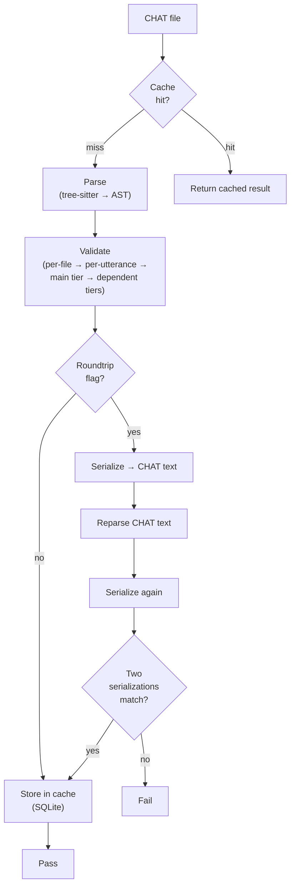

# Transform Pipeline

**Status:** Current
**Last updated:** 2026-08-03 09:06 EDT

The `talkbank-transform` crate provides high-level pipelines that compose parsing, validation, and serialization into reusable workflows.

## Core Pipelines

### Parse + Validate

The most common pipeline: parse a CHAT file and validate it.

```rust,ignore
use talkbank_transform::parse_and_validate;

let result = parse_and_validate(source, &parser, &error_collector);
```

This:
1. Parses the source text into a `ChatFile` AST
2. Runs validation (alignment checks, header consistency, etc.)
3. Collects all errors and warnings into the `ErrorSink`

### CHAT → JSON

Convert a CHAT file to its JSON representation:

```rust,ignore
use talkbank_transform::chat_to_json;

let json = chat_to_json(source, &parser)?;
```

The JSON follows the schema at `schema/chat-file.schema.json`.

### JSON → CHAT

The JSON produced by `chat_to_json` is schema-conformant and
round-trips. Deserialize it back into a `ChatFile` with `serde_json`
(the model derives `Deserialize`), then serialize through `WriteChat`
to reproduce CHAT text:

```rust,ignore
let chat_file: talkbank_model::ChatFile = serde_json::from_str(json_str)?;
let chat_text = chat_file.to_chat_string();
```

The `chatter from-json` command wraps this path
(`crates/chatter/src/commands/json.rs`, `json_to_chat`).

### CHAT → CHAT (Normalize)

Parse and reserialize to normalize formatting:

```rust,ignore
use talkbank_transform::normalize_chat;

let normalized = normalize_chat(source, &parser)?;
```

`normalize_chat` lives in
`crates/talkbank-transform/src/pipeline/convert.rs`.

## Validation + Roundtrip Cache Lifecycle

The following diagram shows the full validation and roundtrip pipeline, including the cache layer:



## Streaming Parse

For large files or interactive use, the transform crate supports streaming parse where utterances are processed incrementally rather than loading the entire AST into memory.

## The shared validation runner (every frontend, one engine)

All bulk validation, whatever the frontend, flows through the
`validation_runner` module's two streaming entry points in
`crates/talkbank-transform/src/validation_runner/`:

- `validate_directory_streaming` walks a directory and feeds every CHAT
  transcript to a worker pool;
- `validate_files_streaming` runs an explicit file list through the same
  worker pool.

Both share one worker loop, so every consumer gets identical rule
coverage (including the file-stem-dependent checks such as the `@Media`
filename match), identical stats accounting, and the same on-disk cache.
The `chatter` CLI, the TUI, and the desktop app all call these
entry points; the desktop app's single-file path was unified onto
`validate_files_streaming` in 0.3.0 after field reports showed the
previous bespoke path skipped the cache and the stem-based checks.
The invariant to preserve: no frontend grows its own validation
orchestration; a file must validate identically whether selected alone
or reached by a directory walk.

### How a run ends, and who decides

Every stream ends with exactly one terminal `ValidationEvent`, and the
runner is the only thing that decides which:

- `Finished(stats)`: every discovered file was accounted for. This is the
  ONLY warrant for a claim about the whole input ("all files valid", a
  zero exit status). A cancelled run still arrives here, carrying
  `stats.cancelled`, because its shortfall was requested.
- `FinishedIncomplete { stats, lost_files }`: the run reached its end
  without covering everything it discovered, because worker threads
  unwound and abandoned files. `stats` describes only what was
  processed.
- `Aborted(reason)`: the run died before producing totals at all. A drop
  guard on the orchestrating thread emits this during an unwind, so a
  panicking run terminates its stream instead of closing it in silence.

`ValidationEvent` is deliberately NOT `#[non_exhaustive]`. Adding a
variant breaks external consumers on purpose: a new terminal event that
a consumer silently ignores is precisely the defect these variants
exist to prevent, so a downstream crate should get a non-exhaustive
match error and decide for itself what a dead or incomplete run means.

Two design points worth keeping:

- **Incompleteness is a VARIANT, not a field.** A `lost: usize` beside
  `Finished` would be something every consumer must remember to check,
  and forgetting yields a false clean bill of health: files abandoned by
  a crashed worker contribute to no counter, so partial totals look
  immaculate. A 500-file corpus could validate 480 and report "all
  valid".
- **Loss is DERIVED, not counted.** `ValidationStatsSnapshot::coverage`
  reconciles `total_files` against the per-file counters in one place,
  so there is no third counter free to drift from the two it reconciles.
  Cancellation is distinguished there too, since a requested shortfall
  is not lost data and reporting it as such would make the incompleteness
  report routine, and therefore ignored.

## Caching

The transform layer integrates with a file-system cache. Validation results are keyed by content hash, so unchanged files skip re-validation. Cache location is platform-specific: `~/Library/Caches/talkbank-chat/` (macOS), `~/.cache/talkbank-chat/` (Linux), `%LocalAppData%\talkbank-chat\` (Windows).

Use `--force` to bypass the cache for specific paths.

## Error Collection

Pipelines use the `ErrorSink` trait for error reporting. Callers can provide:
- A collecting sink (gathers all diagnostics for batch output)
- A printing sink (writes diagnostics to stderr in real-time)
- A custom sink (for LSP diagnostics, JSON output, etc.)
