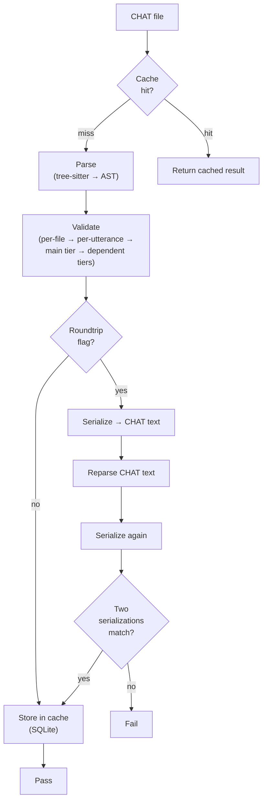
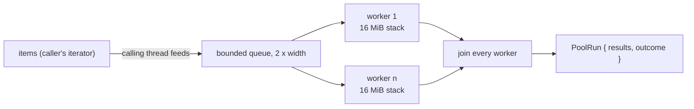
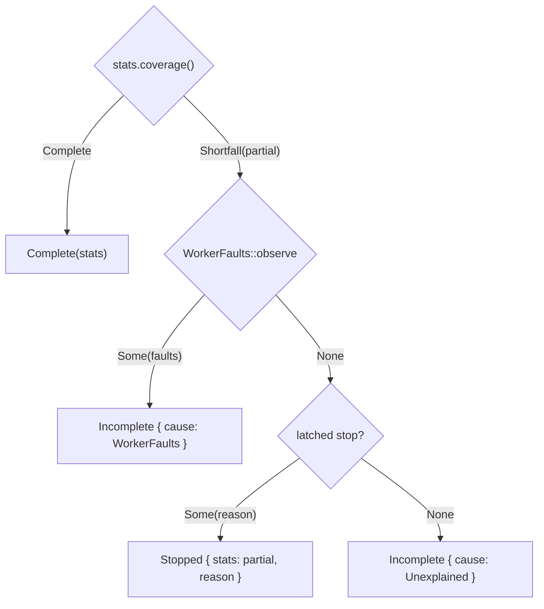

# Transform Pipeline

**Status:** Current
**Last updated:** {{git-dates:page}}

The `talkbank-transform` crate provides high-level pipelines that compose parsing, validation, and serialization into reusable workflows.

## Core Pipelines

### Transcript construction

`build_chat` assembles a typed `TranscriptDescription` into a mutable CHAT
document; validation remains a separate step. Media names accepted by
`MediaFilename` as HTTP/HTTPS references are preserved verbatim, including
quotes, extensions and Unicode spelling. They are not filesystem paths and
are never fetched. Complete input spelling must pass media representability
admission before local basename/extension reduction; malformed directory text
cannot be hidden by normalization. The resulting local stem is admitted again.

### Parse + Validate

The most common pipeline: parse a CHAT file and validate it.

```rust,ignore
use talkbank_transform::parse_and_validate;

let result = parse_and_validate(source, &parser, &error_collector);
```

This:
1. Parses the source text into a `ChatFile` AST
2. Runs validation (alignment checks, header consistency, etc.)
3. Collects all errors and warnings into the `ErrorSink`

### CHAT → JSON

Convert a CHAT file to its JSON representation:

```rust,ignore
use talkbank_model::ParseValidateOptions;
use talkbank_transform::{JsonLayout, chat_to_json};

let json = chat_to_json(source, ParseValidateOptions::default().with_validation(), JsonLayout::Pretty)?;
```

The JSON follows the schema at `schema/chat-file.schema.json`, and is checked
against it before it is returned.

`JsonLayout` is `Pretty` (indented, the CLI's default) or `Compact` (one line,
`chatter to-json --compact`, which chatter's clap parsing turns into the
value). It was a `pretty: bool`, which every caller had to
spell as a bare `true` or `false`. `chat_to_json_named` adds the transcript's
name (so E531 can run), `chat_to_json_with_schema_policy` adds a
`JsonSchemaPolicy`, and `chat_to_json_unvalidated` skips the schema check; all
four take the layout the same way, and the schema policy and the layout are
matched as one pair, so every combination has exactly one serializer.

### JSON → CHAT

The JSON produced by `chat_to_json` is schema-conformant and
round-trips. Deserialize it back into a `ChatFile` with `serde_json`
(the model derives `Deserialize`), then serialize through `WriteChat`
to reproduce CHAT text:

```rust,ignore
let chat_file: talkbank_model::ChatFile = serde_json::from_str(json_str)?;
let chat_text = chat_file.to_chat_string();
```

The `chatter from-json` command wraps this path
(`crates/chatter/src/commands/json.rs`, `json_to_chat`).

### CHAT → CHAT (Normalize)

Parse and reserialize to normalize formatting:

```rust,ignore
use talkbank_transform::normalize_chat;

let normalized = normalize_chat(source, &parser)?;
```

`normalize_chat` lives in
`crates/talkbank-transform/src/pipeline/convert.rs`.

### Selective name pseudonymization: planning API under development

`pseudonymize::NameMap` admits a private caller-supplied mapping.
`TranscriptNames::admit_document` binds that mapping to parsed, validated source,
including alignment checks. `PseudonymizationInput::plan_words` creates sensitive
review previews without mutating the input. `PseudonymizationInput::prepare_output`
can produce an admitted in-memory `PseudonymizedDocument`, but this is
**not yet a user-facing de-identification command**. Private receipt persistence,
CLI integration and broader policy/corpus acceptance remain unfinished.

Output preparation refuses unsafe lexical, morphology, timing or pronunciation
plans. It applies only their source-bound edit ranges, copying every intervening
byte unchanged; applied private receipt entries are built during that same
operation. The rewritten source must pass parsing and alignment-aware validation
under the input's filename and rule context. The output parse is reused for a
follow-up plan, which must propose no further changes. A refusal retains original
review findings but exposes no partial output text. Accepted output still is not
a promise of complete de-identification: report-only findings remain visible in
its private review and callers must protect both output and receipts.

Lexical reviews retain a producer-assigned `WordLocation`: zero-based utterance
and original-word indices, plus `WordSpelling` distinguishing spoken material
from an indexed editorial replacement target. Retraced words count; separators
and targets do not advance the original-word index. These are review coordinates,
not morphology or phonology alignment indices. Aligned morphology, corroborated
timing and pronunciation refusals carry the selecting word's location through
their existing bindings. Applied lexical edits retain it in `EditOrigin`; their
`EditKind` is derived from that origin rather than stored independently. Multiple
source fields removed from one shortening retain the same word location.
Metadata findings and edits carry `HeaderFieldLocation` (header index plus typed
field); prose uses `ProseLocation`, which distinguishes a document header from
an utterance's dependent tier. Header indices count all headers, including
structural ones; dependent-tier indices count all tier kinds. Independently
reported morphology uses `LemmaLocation`: utterance, morphology-item index and
`LemmaPart::Main` or a specific post-clitic. It never invents a main-tier match
for an unmatched lemma. Exact source ranges remain available alongside this
context. All indices are zero-based. Persistent CLI receipts are being integrated.

The CLI publication boundary is being implemented separately from the transform.
It stages only admitted `PseudonymizedDocument` bytes beside an explicit output
destination and uses no-clobber publication. Existing files, directories and
symlinks are not replaced; a collision after staging also refuses publication.
Abandoning preparation removes its temporary file, not the input or destination.
Unix staging files are owner-only; other systems require a protected destination
directory's inherited ACL. This does not establish a cross-file transaction or
crash-durable directory update.

The receipt owner encloses the low-level publisher. Its `PreparedPublication`
owns both the staged file and a committed private SQLite receipt; callers cannot
separate that evidence from its output or call the enclosed publisher directly.
The receipt records source/output BLAKE3 identities, the exact applied edits,
typed locations and report-only findings in queryable tables, not JSON blobs.
It starts as `prepared`, becomes `written` only after publication and file sync,
or records `publication_failed` on a no-clobber failure. An interruption or failed
completion update can leave `prepared`; that state means uncertain publication,
not success or proof of absence. Existing receipt files are never overwritten.
SQL dependencies live in the CLI, not the transform core. The user command
remains unavailable pending command routing and end-to-end acceptance. Refused
plans have separate `output_refused` receipts: proposals are labeled `proposed`,
never applied, and output coordinates and identity are absent. Input admission
refusals and missing map entries are distinct states. A derived summary view
distinguishes a mapped document with no findings from an unmapped document.

The authored `word-features/pseudonymizer-source.cha` / `pseudonymizer-expected.cha`
pair tests exact output, every untouched gap, cross-tier changes, metadata,
possessive retention, deterministic application and idempotence. Existing
pronunciation, morphology and timing mismatch references also exercise whole-
document refusal. A placeholder that reintroduces a mapped word at a Unicode
boundary is refused during map admission, before document planning. Placeholders
must first be plain CHAT lexical tokens; invalid tokens are refused separately.
The output stability check remains an independent boundary safeguard.

Admission retains the producer-owned `ParsedSource` alongside the validated
model. `TreeSitterParser::parse_chat_file_with_source` returns both from one
parse; its diagnostics still require review and its model still requires
validation. The retained CST enables generated source-bound field traversal
without a second parse, raw-line searches, or assuming whole-header serialization
preserves untouched formatting. CST ownership alone is not a validity proof.
Admission refuses both errors and warnings. Canonical controls exercise empty
input, missing participant roles, forbidden controls inside free text, and a
warning-only non-NFC media name paired with its canonical spelling. Even rejected
empty input can retain a CST; its existence never authorizes transformation.

Header-field review covers whole Unicode-bounded names within participant names and
typed `@ID` group, education and custom fields, including repeated names within
longer metadata text. It uses the same matcher and report-only possessive
policy as prose, not a second whole-field replacement path. Generated field
projections supply exact source ranges; a binding failure is a refusal, not
permission to search raw lines. `ParticipantWordRoles` owns the name/role
partition for both parser lowering and source-bound review. Speaker codes,
participant roles, spacing and structural pipes are not selected. Each match
has exactly one metadata or prose owner; these are still review findings, not
complete writable pseudonymization.

The current planning policy uses exact-case typed lexical components, reports
case near misses, and derives dependent-tier changes from selected main-tier
words. Main-tier previews retain exact generated text/shortening edits;
each shortening owns its parentheses and inner segment, so it cannot create
overlapping edits. Marker bytes, suffixes, annotations and unselected compound
partners remain outside those ranges. Source association and lexical-piece
corroboration are required: failure creates a refusal instead of an unbound
proposal. The `word-features/selective-name-fields.cha` reference exercises
lengthening and names on either side of a compound boundary.

Free-text planning uses `unicode-segmentation` word boundaries on typed prose
payloads, with apostrophe-s possessives such as `Rose’s` and `Rose's` reported
rather than partially rewritten. A mapped name may span several segments, such
as `Rose-Marie`. At each boundary the longest recognized spelling takes
precedence, including report-only near misses and possessives: mapping both
`Rose` and `Rose-Marie` never partly rewrites `Rose-marie` as `Rose`.
The `headers/unicode-name-boundaries.cha` reference exercises this policy in
participant names, ID metadata and prose. `LexicalPlan::free_text` returns private
source-bound exact matches, case near misses and possessive review findings.
The CST supplies prose segments within descriptive headers and free-text
dependent tiers (including user-defined tiers); timing bullets, identifiers,
configuration headers and structured tiers are not treated as prose. This does
not tokenize raw CHAT structure. Header-field review above reuses this matcher
while retaining its own typed metadata classification.
The `headers/free-text-names.cha` reference covers accented names, punctuation,
continuation lines, timing, possessives and several dependent-tier kinds.

Dependent-tier proposals are driven by the selected main-tier
words. Morphology requires established lemma correspondence. Edit locations
are not inferred from text searches: each morphology proposal retains
the generated, source-bound main-lemma field from the same admitted parse.
Tier item counts and lemma values corroborate the association; failure refuses
the proposal. Post-clitic fields are not mistaken for subsequent main items.
The canonical `tiers/mor-name-source-fields.cha` example exercises repeated
names, both shortening forms, uneven spacing and a preceding post-clitic item.
This establishes exact edit locations, not writable document output.
Unchanged mapped lemmas, including post-clitics, are reported separately as
exact matches or case near misses; the lemma scan cannot authorize an
independent replacement. Compound
components without proven lemma-part correspondence produce a refusal.
Timing uses the [`%wor` corroboration transition](wor-timing.md). Words within a
timing tier receive the selected main word's existing component decisions, not
another name-map lookup. Equal cleaned spellings with different compound
structure refuse the change. Exact timing-word lexical edits preserve markers
and leave timing bullets outside their ranges; a failure refuses the tier's
proposal rather than exposing a partial list. The selective-name reference
also covers a name that occurs only in the timing tier: it is not independently
replaced.

Words within a phonological group share the group's alignment position.
Pronunciation findings retain the
original `%pho`/`%mod` item and refuse automatic output; structured Phon
companions require correspondence review. No tier is silently dropped and no
orthographic placeholder is treated as a pronunciation. These review objects
contain protected transcript content and must not be logged by default.

## Validation + Roundtrip Cache Lifecycle

The following diagram shows the full validation and roundtrip pipeline, including the cache layer:


```mermaid
flowchart TD
    file["CHAT file"]
    cache{"Cache\nhit?"}
    parse["Parse\n(tree-sitter → AST)"]
    validate["Validate\n(per-file → per-utterance →\nmain tier → dependent tiers)"]
    rt{"Roundtrip\nflag?"}
    ser1["Serialize → CHAT text"]
    reparse["Reparse CHAT text"]
    ser2["Serialize again"]
    cmp{"Two\nserializations\nmatch?"}
    store["Store in cache\n(SQLite)"]
    pass["Pass"]
    fail["Fail"]
    cached["Return cached result"]

    file --> cache
    cache -->|miss| parse --> validate --> rt
    cache -->|hit| cached
    rt -->|yes| ser1 --> reparse --> ser2 --> cmp
    rt -->|no| store --> pass
    cmp -->|yes| store
    cmp -->|no| fail
```

## Streaming Parse

For large files or interactive use, the transform crate supports streaming parse where utterances are processed incrementally rather than loading the entire AST into memory.

## The shared validation runner (every frontend, one engine)

All bulk validation, whatever the frontend, flows through the
`validation_runner` module's two streaming entry points in
`crates/talkbank-transform/src/validation_runner/`:

- `validate_directory_streaming` walks a directory and feeds every CHAT
  transcript to a worker pool;
- `validate_files_streaming` runs an explicit file list through the same
  worker pool.

### The one worker pool and the one walk

The pool is `talkbank_transform::worker_pool::fan_out`, and it is the only
pool: `chatter to-json` fans its directory conversions out through it too.


```mermaid
flowchart LR
    items["items (caller's iterator)"] -->|"calling thread feeds"| queue["bounded queue, 2 x width"]
    queue --> w1["worker 1<br/>16 MiB stack"]
    queue --> wn["worker n<br/>16 MiB stack"]
    w1 --> join["join every worker"]
    wn --> join
    join --> run["PoolRun { results, outcome }"]
```

- Width is `--jobs`, else the machine's parallelism, never zero; serial work
  is a pool of width one, not a second code path.
- Every worker runs on a `CHAT_THREAD_STACK_BYTES` (16 MiB) stack, the size of the
  CLI's program thread, because parsing and validation recurse with the data.
- Each worker RETURNS its result (the validation runner's per-worker tally,
  to-json's counts); the caller combines them after the join. Nothing reads
  shared counters whose exactness rests on a comment. Workers borrow what
  they share (the event sender, the cancellation latch, the cache and the
  configuration) through a `WorkerContext` of references, because the
  pool's threads are scoped: no `Arc` clones, no per-worker config copy.
- A worker that unwinds is joined and counted as `PoolOutcome::SomeUnwound`;
  a thread that cannot be started is `PoolOutcome::CouldNotStart`, with
  nothing fed. The caller measures what was lost against what it fed.
- Stopping early is the caller's iterator (the runner feeds
  `take_while(not cancelled)`); workers stop by returning.

Discovery is `talkbank_transform::paths`. Every walk descends every level.
`walk_files` returns every file found WITH its path relative to the walked
root (a `FoundFile`), built as the walk descends, plus every entry that could
not be read. `keep` is given each entry's file name, so a rejected entry
never has its path built. `walk_transcripts` returns each transcript as a
`FoundTranscript`: its relative path and its `StoredTranscript`, whose name
is the listing entry that found it, so nothing lists the directory again to
learn the stored name (a stem that is not UTF-8, which validation could not
name, is a failure of the walk). What happens at a symbolic link is the
caller's choice, a `Links` value:

- `Links::Follow` (every reading walk): a link is walked as what it points
  to, a directory reached twice is walked once, and a link whose target is
  gone is a failure whatever its name: nothing says whether it was a file
  or a directory, and a link to an unmounted volume's subcorpus hides every
  transcript under it.
- `Links::Skip` (`to-json --prune`, the one walk whose results are
  deleted): links are neither walked nor kept. Following them would let
  `--prune` delete JSON outside `--output-dir` through a linked directory,
  and then remove that directory's emptied parents.

A directory the walk cannot list is always a failure, never skipped, even an
operating system's own folder at a volume root (`.Spotlight-V100`,
`System Volume Information`, `lost+found`): nothing can say whether it held
transcripts. Walk the corpus directory, not the volume root.
`expand_transcript_arguments` is the one expansion of command-line paths:
each file argument is resolved to its stored name by one
`StoredNameResolver` (each parent directory listed once), and each directory
argument contributes its walk's transcripts, so the result is
`StoredTranscript` values. The runner's work queue carries those values,
and `validate_files_streaming` resolves a plain path list the same way
before any worker starts, so no worker resolves a name. Nothing is skipped
silently, and there is one policy for what cannot be
read: it is a `FileStatus::ReadError` in the run's own results, counted in
its totals, so the run fails and says which paths. The directory entry
point does this for its walk, and `validate_arguments_streaming` for
command-line arguments (`chatter validate`), so the unreadable path reaches a
JSON consumer as a record. Commands that are not streaming runs (`fix`,
`to-json`, the `debug` commands) refuse an incomplete input before
processing anything.

Both share one worker loop, so every consumer gets identical rule
coverage (including the file-stem-dependent checks such as the `@Media`
filename match), identical stats accounting, and the same on-disk cache.
The `chatter` CLI, the TUI, and the desktop app all call these
entry points. The invariant to preserve: no frontend grows its own
validation orchestration; a file must validate identically whether
selected alone or reached by a directory walk.

### What a run checks: typed, end to end

`ValidationConfig` says what each worker checks with typed values, never
booleans: `alignment: AlignmentValidation` (`Structure` or
`IncludeTierAlignment`) and `roundtrip: RoundtripCheck` (`Skip`, the default,
or `Run`). A frontend parses its flags into these once, at its boundary:
chatter's clap arguments are `Flag<AlignmentValidation>` and
`Flag<RoundtripCheck>` (see "Flags parsed into modes" below), and the desktop
translates its request's checkbox where it deserializes it. The CLI's
`ValidationRules`, the TUI and the desktop runner then carry the same values
the worker matches on; the libraries have no bool-to-mode constructors, and
there is one roundtrip type from flag to worker.

### The CLI's side: one presentation, one renderer, one ending

`chatter validate` resolves its output flags once, in dispatch, into a
`ValidationPresentation`, then runs one event loop:

```mermaid
flowchart TD
    flags["--format, --quiet, --audit, --tui-mode"] --> resolve["ValidationPresentation::resolve\n(conflicts are usage errors)"]
    resolve -->|Tui| tui["TUI loop\n(same runner, same error limit)"]
    resolve -->|"Streamed(Lines / Json / Audit)"| renderer["one ValidationRenderer"]
    renderer --> loop["event loop: discovering, started,\none FileComplete per file (status + diagnostics)"]
    loop --> end["the run's RunEnding\n(Aborted(NoEnding) if the stream closed without one)"]
    tui --> end
    end --> finish["renderer.finish(&RunEnding): exhaustive"]
    end --> exit["ValidationOutcome::failed(): !RunEnding::passed()"]
```

The runtime holds no output channel of its own: every fact a run has to say
(a stop, a loss, an abort, an input with nothing in it) is a `RunEnding` the
renderer's `finish` matches, so JSON mode can keep stderr empty by
construction rather than by remembering to. The TUI shows the same ending
and returns it with the session (`InteractiveEnd::Closed(RunPhase)`), so
the exit status is the run's on every surface: only `RunEnding::passed`
exits 0, and a session closed before its run ended fails. The TUI lists
every file that failed (its diagnostics, or why it could not be read, why
its roundtrip failed, or the tool failure) and shows the run's notices and
cache events, as the other surfaces print them.

### Flags parsed into modes

A presence flag selects one of two values of a typed mode. chatter's
`cli/args/flag_modes.rs` has one generic clap argument, `Flag<M>`, for any
`M: FlagMode` (the flag's name, help, optional short form, and the value
when it is absent or present), so a command's field is
`#[command(flatten)] alignment: Flag<AlignmentValidation>` and its handler
receives the mode. `FlagMode` is chatter's own trait, so it can be
implemented for library types (`AlignmentValidation`, `RoundtripCheck`,
`JsonLayout`, `JsonSchemaPolicy`) as well as chatter's (`FixMode`,
`ClearMode`, `CacheRefreshMode`, `JsonRefresh`, `OrphanJson`,
`AlignmentView`). The translation from flag to mode therefore lives in the
CLI, and the library crates expose no constructor from a `bool`.

Two flags that select one value have their own `Args` impls, which refuse
the combinations that would leave one flag without effect: `ToJsonCheckArgs`
(`--skip-validation` conflicts
with `--skip-alignment`) and `NormalizeCheckArgs` (`--skip-alignment`
requires `--validate`), each yielding one `CheckLevel`.

### How a run ends, and who decides

While its receiver remains connected, every stream ends with exactly one
`ValidationEvent::Finished(RunEnding)`, and the runner decides which:

- `Complete(stats)`: at least one file was discovered and every one was
  accounted for. The only basis for a claim about the whole input, though
  still not "all files valid": `RunEnding::passed` adds that no file was
  invalid, unreadable or a tool failure. A run that was told to stop after
  its last file had already been taken also ends here, because nothing was
  left to stop.
- `NothingFound`: the input named no transcript and nothing unreadable. It
  has no counts. The runner's `NonZeroUsize::new(total_files)` is the one
  place this is recognised, so every snapshot's `total_files` is non-zero.
- `Stopped { stats, reason }`: the run was told to stop and
  left `stats.missing_files()` (non-zero) files unvalidated. `reason` is a
  `CancelReason`: `ErrorLimit { limit }` (the run's own error limit) or
  `Requested` (the caller's `Canceller`). Its `Display` is the one wording
  every surface uses.
- `Incomplete { stats, cause }`: the run reached its end
  without covering everything it discovered, and no requested stop explains
  it. `cause` is a `LossCause`: `WorkerFaults`, every worker failure the run
  observed (the pool's own `PoolFault`, `Unwound` or `ThreadRefused`, and
  `ParserUnavailable`, none hiding another), or `Unexplained`, a runner defect. `stats` describes only what
  was processed.
- `Aborted(reason)`: no totals at all. A drop guard on the orchestrating
  thread sends `Aborted(Panicked)` during an unwind, so a panicking run
  terminates its stream instead of closing it in silence; a consumer whose
  stream closes with no ending anyway reports `Aborted(NoEnding)`.

`passed()` is the single answer to "may this run be reported as a success":
the CLI's exit status, the TUI's header color and the desktop's all-valid
claim all read it. Counted endings require producer-admitted `CompleteStats`
or `PartialStats`, each exposing read-only `snapshot()` counts. A snapshot
cloned from a stopped run cannot construct `Complete`, even when every
processed file passed. The partial payload owns its derived, nonzero
`missing_files()` count; callers cannot supply a contradictory shortfall.
`RunEnding::stats()` retains the common read-only snapshot view. Text, JSON
and desktop event formats are unchanged; Rust consumers matching an ending
use the admitted payload's accessors instead of the removed count fields.

The ending of a run that reached its end is decided from three facts, each
from its owner:


```mermaid
flowchart TD
    cov{"stats.coverage()"}
    cov -->|Complete| complete["Complete(stats)"]
    cov -->|"Shortfall(partial)"| faults{"WorkerFaults::observe"}
    faults -->|"Some(faults)"| faulted["Incomplete { cause: WorkerFaults }"]
    faults -->|None| stop{"latched stop?"}
    stop -->|"Some(reason)"| stopped["Stopped { stats: partial, reason }"]
    stop -->|None| unexplained["Incomplete { cause: Unexplained }"]
```

A worker fault outranks a stop: files a worker took and never finished are
lost, and a worker that could not create its parser took none, whatever else
happened. Each worker returns its tally or a `WorkerSetupFailure`, so a
worker that could not start is a value the runner sees rather than an empty
tally indistinguishable from an idle worker. `WorkerFaults::observe`, the
one constructor, reads the pool's outcome and those setup failures and
answers `None` when every worker started and returned, so a `WorkerFaults`
is never empty.

### Stopping a run: the Canceller and the error limit

There are two ways to stop a run early, and both end in the same latch:

- the caller's `Canceller` (returned by both streaming entry points; the
  CLI's Ctrl-C handler, the TUI's `c` key and the desktop's Cancel button
  hold one), whose only operation is `cancel()`;
- the run's own `ValidationConfig::error_limit`, an `ErrorLimit`
  (`Unlimited` or `StopAfter(n)`), which the runner counts.

The error limit is the runner's, not a consumer's. Each worker spends
`FileStatus::errors_found()` from a shared `ErrorBudget` before taking its
next file: the file's `Severity::Error` diagnostics after suppression, or 1
for a failed roundtrip. Warnings never count. The addition that reaches the
limit latches `CancelReason::ErrorLimit`, so the worker that crossed it stops
at once and the others at their next file. With one worker the stop is
exact: a limit of 1 stops before the second file starts.

The count lives in the runner, not in a consumer reading rendered events,
so warnings cannot spend the limit, a run that covered every file is never
reported as stopped, and the text, JSON, audit and TUI presentations of
`chatter validate` all honour the same limit. The desktop app sets no limit.

`ValidationEvent` and `RunEnding` are deliberately NOT `#[non_exhaustive]`.
Adding a variant breaks external consumers on purpose: a new ending that a
consumer silently ignores is precisely the defect these types exist to
prevent, so a downstream crate gets a non-exhaustive match error and decides
for itself what the new ending means. The compiler-checked
`validate_directory_streaming` rustdoc example shows an exhaustive event
loop. Keep the `Canceller` alive while consuming the stream (dropping it is
not a cancel), and treat channel closure without an ending as
`Aborted(NoEnding)`, never as successful validation.

Dropping the result receiver is also a stop boundary. Once a worker fails to
deliver a file-completion event, it must not start another queued file. This
applies to fresh validation, cached results and file-read failures alike. The
already completed attempt is accounted for before delivery; disconnection does
not turn an unreadable input into a parser error or a cacheable result. With
multiple workers, other in-flight attempts may finish before observing closure.
The reference-backed lifecycle contract synchronizes at a cache lookup and
checks subsequent work counts, rather than relying on sleeps or timing.

Two design points worth keeping:

- **Every short ending is a VARIANT, not a field.** A `lost: usize` or a
  `cancelled: bool` beside the totals would be something every consumer
  must remember to check,
  and forgetting yields a false clean bill of health: files abandoned by
  a crashed worker contribute to no counter, so partial totals look
  immaculate. A 500-file corpus could validate 480 and report "all
  valid".
- **Loss is DERIVED, not counted.** `ValidationStatsSnapshot::coverage`
  reconciles `total_files` against the per-file counters in one place,
  so there is no third counter free to drift from the two it reconciles.
  Whether a shortfall was requested is not a count: the snapshot reports
  only `RunCoverage::{Complete(complete), Shortfall(partial)}`, and the runner
  decides stop versus loss from the latch and the pool. A requested
  shortfall is not lost data, and reporting it as such would make the
  incompleteness report routine, and therefore ignored.

## Caching

The transform layer integrates with a file-system cache. Validation results are keyed by content hash, so unchanged files skip re-validation. Cache location is platform-specific: `~/Library/Caches/talkbank-chat/` (macOS), `~/.cache/talkbank-chat/` (Linux), `%LocalAppData%\talkbank-chat\` (Windows).

Use `--force` to bypass the cache for specific paths.

## Error Collection

Pipelines use the `ErrorSink` trait for error reporting. Callers can provide:
- A collecting sink (gathers all diagnostics for batch output)
- A printing sink (writes diagnostics to stderr in real-time)
- A custom sink (for LSP diagnostics, JSON output, etc.)
