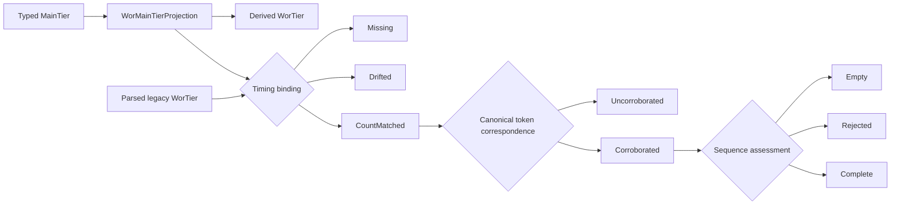

# `%wor` Timing Semantics

**Status:** Current
**Last modified:** 2026-08-30 15:23 EDT

## Purpose

`%wor` is a timing sidecar over a named subset of main-tier word slots. It is
not an independent lexical transcript and it is not a structural dependent-tier
alignment like `%mor`, `%pho`, or `%sin`.

The main tier owns lexical identity. `%wor` contributes an optional inline
media bullet for each selected position. The visible word printed on `%wor` is
display material and optional corroborating evidence. It can prevent stale
timing reuse, but it never supplies lexical identity.

Actual timing presence is a separate typed question from correspondence.
`WorTier::timing_evidence()` returns `Absent` or a `RecordedWorTiming` carrying
the first real word-level bullet. Media validation uses this state directly.
Equal counts with no bullets are not timing evidence, while a real bullet
remains timing evidence even when counts drift. Alignment processing is not
required to observe a bullet already in the typed CHAT model. A `%wor` tier
cannot carry a trailing tier-level bullet: the grammar does not permit that
state, and `WorTier` cannot construct or serialize it.

## Current membership policy

The canonical policy is `FilteredLexicalV1`. A typed
`WorMainTierProjection` is its single traversal owner. Both `%wor` generation
and timing binding consume that projection, so a policy edit cannot update one
path and leave the other behind.

| Main-tier content | Current membership |
|---|---|
| Regular word | Included |
| Filler such as `&-um` | Included |
| Retraced regular word | Included |
| Original surface of a replacement | Included when otherwise eligible |
| Phonological fragment such as `&+w` | Excluded |
| Nonword such as `&~gaga` | Excluded |
| `xxx`, `yyy`, or `www` | Excluded |
| Omission | Excluded |
| Separator or terminator | Excluded |

This policy is explicit because the meaning of one-to-one correspondence
depends on which main-tier items count. A future research policy must receive a
new name and separate evaluation. It must not silently change
`FilteredLexicalV1`.

## Typed binding and correspondence states

Consumers call `bind_wor_timing(main, wor)`. The data state is one of:

- `Missing`: no `%wor` tier exists. This is distinct from a present empty tier.
- `Drifted`: the selected main-tier slot count differs from the physical `%wor`
  word-entry count. No positional slots are exposed.
- `CountMatched`: counts match under the named policy. This state permits a
  positional comparison but exposes no timing slots. Equal counts alone do not
  prove that a parsed legacy tier and the current main tier share origin.

Consumers pass `CountMatched` to `corroborate_wor_timing`. The next state is:

- `Uncorroborated`: one or more `%wor` display tokens differ from the canonical
  display tokens generated from the current main-tier projection. The state
  exposes exhaustive mismatch diagnostics but no timing slots.
- `Corroborated`: every display token matches the canonical generated token at
  its count-matched position. Only this state exposes positional timing slots.

Each corroborated slot has:

- a borrowed typed main-tier `Word` and its `cleaned_text`, which remain the
  only lexical identity;
- `Timed(WorRecordedInterval)` when the corresponding `%wor` entry has an
  inline bullet;
- `Unaligned` when the entry exists but has no inline bullet.

This transition detects same-count edits when they change at least one
canonical display token. It cannot establish immutable common origin: repeated
tokens can be exchanged invisibly, and CHAT does not carry a generation
identifier. The state is therefore named `Corroborated`, not `Aligned` or
`Proven`.

## Temporal sequence transition

Lexical corroboration is necessary but not sufficient for algorithms that need
a word-timing hull. A corroborated tier may still contain an untimed slot, a
zero or backwards interval, or adjacent word intervals that overlap.

Consumers call `assess_wor_timing_sequence(corroborated)` for the next checked
transition. It returns one of:

- `Empty`: the sidecar is present and corroborated, but the membership
  policy selected no words. There is no hull.
- `Rejected`: the binding contains one or more `Unaligned` or
  `NonPositiveInterval` issues. The diagnostic state exposes typed slot indices
  and numeric evidence, but no partial hull.
- `Complete`: every selected word has a positive interval. Only this state
  exposes borrowed main words paired with typed recorded intervals, a min/max
  `WorTimingHull`, and every typed adjacency relation.

Each adjacency is `Gap`, `Touching`, `Overlap`, or `BackwardStart`. Overlap and
backwards starts remain visible evidence, but do not erase a hull that is still
mechanically defined by the recorded extrema. An algorithm that requires
common origin, acoustic accuracy, non-overlap, or monotonic starts must state
and enforce that later policy over additional evidence or the relation types.

The assessment transition is infallible because its control flow makes the
remaining construction failure unrepresentable. An empty binding returns
`Empty`. A nonempty binding assesses the first slot before it can construct a
complete accumulator. A first-slot failure starts a rejected accumulator; a
first complete slot is the required seed for the hull. No caller or internal
branch can construct a nonempty complete sequence without that seed.

`WorSlotIndex`, `WorMediaOffsetMs`, `WorDurationMs`, and `WorTimingHull` have
private constructors. A caller cannot mint an index for an unrelated tier,
present arithmetic as a recorded media coordinate, or label arbitrary offsets
as a hull that passed chatter's sequence assessment. Recorded offsets and the
duration derived by subtraction remain different types.

The complete state does not return the original `Bullet`. Returning it would
reopen direct access to raw integer fields and let every consumer rebuild the
same loose arithmetic. `WorRecordedInterval` is the only timing surface after
binding.

This is deliberately stricter than ordinary CHAT validation. CHAT can retain
legacy or partially aligned data. A timing-consuming algorithm needs an
explicit admission contract and must not infer one from the fact that the
file parsed.

The count types for the main sequence and the physical `%wor` sequence are
different newtypes. Callers cannot swap them accidentally. Constructors for
the proof states and counts are private.

The count-matched state is deliberately named for the fact it actually proves.
It does not claim common origin and it cannot expose timing. The corroborated
state is also deliberately limited: canonical display equality provides useful
evidence against stale reuse, but serialized CHAT carries no immutable
generation identity. Acoustic or common-origin qualification requires later
evidence and a different state.

The binding borrows both typed sequences until correspondence is decided.
Corroboration retains main-tier words as lexical identity and copies the two
recorded media offsets into private-constructor coordinate types. It does not
clone a temporary generated `%wor` tier or reduce structured lexical identity
to a string.

The main-tier projection owns word and separator selection in source order.
Its constructor is private to `MainTier::wor_projection()`. Generation derives
the visible tier from this capability, and binding consumes the same capability
to obtain lexical slots. There is no independent counter or generator whose
agreement must be tested at runtime. Count drift between a parsed legacy tier
and its main tier remains a real `Drifted` data state.

## Generation and parsing

For newly generated data, word timings are embedded on typed main-tier words.
`MainTier::generate_wor_tier()` derives the visible sidecar from those words.
It copies main-tier `cleaned_text` for display and copies the inline bullets for
timing.

For parsed legacy CHAT, the main tier and `%wor` are separate AST values. A
consumer must use the binding transition and then lexical corroboration before
recovering timing by position. Different display words produce an
`Uncorroborated` state. They do not replace main-tier lexical identity and do
not make the CHAT file invalid.

## Validation versus evidence admission

A drifted `%wor` tier does not make a legacy CHAT file invalid. Editors may
change the main tier without immediately rerunning forced alignment, and older
corpora used different membership conventions.

Evidence-consuming algorithms have a stricter contract. They must refuse
`Missing`, `Drifted`, or `Uncorroborated` when their operation requires word
timing. They must also decide whether `Unaligned` slots, empty intervals,
nonmonotonic intervals, or timings outside the main bullet are acceptable for
that specific operation. Structural and lexical admission do not prove
acoustic accuracy.

Temporal completeness does not prove acoustic accuracy either. It establishes
only coverage, positive duration, a min/max location hull, and explicit
adjacency geometry. The aligner may still place a perfectly well-formed onset
or offset too early or too late. Model score, boundary origin, human
calibration, and downstream merge outcome belong to a later evidence layer.

## Research boundary

The abandoned goal of timing every spoken main-tier item remains a legitimate
research question. It is not a correction to current semantics until the
membership question has been specified and evaluated. In particular,
fragments, nonwords, untranscribed material, interactional sounds, retraces,
and editorial replacements need explicit rules.

Confidence, acoustic quality, and provenance should remain typed internal
evidence attached to a binding or downstream decision. Chatter must not revive
public `%xalign` clutter as a side effect. A public `%wor` tier remains a
derived view unless TalkBank deliberately adopts a new visible format.

Alternative policies and acoustic qualification should be tested against
immutable evidence artifacts before changing corpus output. The relevant
questions include:

- whether the proposed policy reduces human correction time;
- whether every additional slot can receive defensible acoustic boundaries;
- whether changed timing improves MichiganChild and IISRP merge placement;
- whether confidence and provenance improve decisions without becoming public
  transcript clutter;
- whether a new policy can coexist with legacy `%wor` data without ambiguous
  automatic reinterpretation.

## Release boundary

Analysis projects that pin a released chatter tag must adopt the binding API
only after that chatter release is cut. They must not switch to a live path
dependency to test this code. Until then, they may reproduce current membership
with the released typed generator, but the first post-release change should
replace that local pairing with `bind_wor_timing` followed by
`corroborate_wor_timing`. Its regression evidence must show both that a
same-count token edit is refused and that `%wor` text never becomes lexical
authority.

Downstream code that currently derives a main-tier bullet by manually checking
every `%wor` word and taking the minimum and maximum timing should then use the
sequence transition, `WorTimingHull`, and typed adjacency relations. This
removes the repeated loose procedure while preserving the important rule that
one untimed word cannot claim a complete child-utterance span. Compatibility
with a downstream policy must be measured before replacement because the new
API reports overlap and backwards starts instead of silently ignoring them.
