# CLI Reference

**Status:** Current
**Last modified:** 2026-06-15 15:00 EDT

The `chatter` CLI is the primary command-line surface for the TalkBank CHAT toolchain.

The following diagram shows the command dispatch structure. Each
top-level command dispatches to a handler in the corresponding crate.

```mermaid
flowchart TD
    chatter(["chatter"])

    chatter --> validate["validate\n(talkbank-cli)"]
    chatter --> normalize["normalize\n(talkbank-cli)"]
    chatter --> tojson["to-json\n(talkbank-transform)"]
    chatter --> fromjson["from-json\n(talkbank-transform)"]
    chatter --> showalign["show-alignment\n(talkbank-cli)"]
    chatter --> watch["watch\n(talkbank-cli)"]
    chatter --> lint["lint\n(talkbank-cli)"]
    chatter --> clean["clean\n(talkbank-cli)"]
    chatter --> newfile["new-file\n(talkbank-cli)"]
    chatter --> cache["cache\n(stats, clear)"]
    chatter --> schema["schema\n(JSON Schema output)"]
    chatter --> debug["debug\n(overlap-audit, linker-audit,\nfind, sanitize, fix-s)"]

    chatter --> merge["merge\n(experimental)"]
    chatter --> speakerid["speaker-id\n(experimental)"]
    chatter --> adjudicate["adjudicate\n(experimental)"]
    chatter --> pipeline["pipeline\n(experimental)"]
    chatter --> batch["batch\n(experimental)"]
    chatter --> sanityscan["sanity-scan\n(experimental)"]
```



## Top-Level Commands

```bash
chatter validate PATH...
chatter normalize INPUT
chatter to-json INPUT
chatter from-json INPUT
chatter to-xml INPUT
chatter show-alignment INPUT
chatter watch PATH
chatter lint PATH
chatter clean PATH
chatter new-file
chatter cache stats
chatter cache clear --prefix PATH
chatter schema
chatter debug ...
chatter merge FILE1 FILE2          # experimental: combine two transcripts
chatter speaker-id INPUT           # experimental
chatter adjudicate ...             # experimental
chatter pipeline ...               # experimental
chatter batch ...                  # experimental
chatter sanity-scan ...            # experimental
```

Use `chatter --help` or `chatter <command> --help` for the exact live surface.

## `validate`

Validate CHAT file(s) or directory tree(s). Accepts multiple paths.

```text
Usage: chatter validate [OPTIONS] <PATH>...
```

```bash
chatter validate file.cha                         # single file
chatter validate file1.cha file2.cha file3.cha    # multiple files
chatter validate corpus/                          # directory (recursive, parallel)
chatter validate file.cha corpus/ other.cha       # mix of files and directories
chatter validate corpus/ -f json                  # structured JSON output
chatter validate corpus/ --force                  # ignore cache, revalidate everything
chatter validate corpus/ --force --audit out.jsonl # bulk audit to JSONL file
chatter validate corpus/ --suppress xphon         # suppress named error group
chatter validate corpus/ --suppress E726,E727     # suppress specific error codes
chatter validate corpus/ -j 8                     # use 8 parallel workers
chatter validate corpus/ --max-errors 50          # stop after 50 errors
```

Options:

| Flag | Description |
|------|-------------|
| `-f, --format text\|json` | Output format (default: text) |
| `--list-checks` | Print every validation check with Active/Planned status, then exit (no `<PATH>` required) |
| `--skip-alignment` | Skip dependent-tier alignment checks |
| `--force` | Ignore cache, revalidate all files |
| `-j, --jobs N` | Parallel workers for directory mode (default: CPU count) |
| `--quiet` | Only emit errors, suppress success messages |
| `--max-errors N` | Stop after N errors across all files |
| `--roundtrip` | Test serialization idempotency (developer tool) |
| `--parser tree-sitter\|re2c` | Parser backend (default: tree-sitter; re2c is opt-in for faster batch validation) |
| `--strict-linkers` | Enable strict cross-utterance linker pairing checks (E351-E355); off by default |
| `--check-xphon` | Re-enable %xphon* cross-tier alignment checks (E725-E728); skipped by default |
| `--audit FILE` | Stream errors to JSONL file (bulk audit mode) |
| `--suppress CODES` | Suppress error codes or groups (comma-separated) |

**Suppress groups:** `xphon` expands to E725/E726/E727/E728
(%xphosyl/%xphoaln/%xmodsyl cross-tier alignment). These are
**suppressed by default since 2026-04-21**; pass `--check-xphon` to
include them. The `--suppress` flag can mix groups and codes:
`--suppress xphon,E316`.

## `normalize`

Serialize a CHAT file into canonical formatting.

```bash
chatter normalize input.cha
chatter normalize input.cha -o normalized.cha
chatter normalize input.cha --validate
chatter normalize input.cha --validate --skip-alignment
```

Flags:

- `-o, --output <PATH>`: write to a file instead of stdout.
- `--validate`: validate (including alignment by default) before
  writing the normalized output.
- `--skip-alignment`: when paired with `--validate`, skip the
  dependent-tier alignment checks (still validates the rest).

`normalize` writes to stdout unless you pass `-o/--output`. There is no `--in-place` flag.

## JSON Conversion

```bash
# Single file
chatter to-json input.cha                          # pretty-printed JSON to stdout
chatter to-json input.cha --compact                # minified JSON to stdout
chatter to-json input.cha -o output.json           # JSON to file

# Directory (recursive, preserves structure)
chatter to-json corpus/ --output-dir json/          # incremental by default (mtime check)
chatter to-json corpus/ --output-dir json/ --compact # minified output (saves disk)
chatter to-json corpus/ --output-dir json/ --force   # full rebuild
chatter to-json corpus/ --output-dir json/ --prune   # remove orphaned .json files
chatter to-json corpus/ --output-dir json/ --jobs 4  # parallel workers

# Reverse and schema
chatter from-json input.json -o output.cha
chatter schema
chatter schema --url
```

**Single-file mode:** `to-json` validates by default. Use `--skip-validation`,
`--skip-alignment`, or `--skip-schema-validation` to bypass checks.

**Directory mode:** Walks recursively, converting each `.cha` to `.json` under `--output-dir`
with the same relative path. **Incremental by default**: skips files whose JSON is
already newer than the source. Use `--force` to rebuild all. Use `--prune` to remove
`.json` files with no matching `.cha` (handles renames/deletions). Use `--jobs N` for
parallel conversion (defaults to number of CPUs).

## `to-xml`

Export one CHAT transcript to TalkBank XML. The transcript is validated
before any XML is emitted, so an invalid input fails (exit 1) and writes
nothing to stdout; a failed export never leaves a partial document. This
command is export-only: XML ingest is not implemented, so there is no
`from-xml`.

```bash
chatter to-xml input.cha                  # XML to stdout
chatter to-xml input.cha -o output.xml    # XML to a file
chatter to-xml input.cha --skip-alignment # skip dependent-tier alignment checks
```

The output is TalkBank XML in the `http://www.talkbank.org/ns/talkbank`
namespace (referencing `talkbank.xsd`). Writing to `--output` prints a
one-line `✓ Converted ... to ...` confirmation on stderr; writing to
stdout prints only the XML.

Flags: `-o, --output <PATH>` (stdout if omitted); `--skip-alignment`
(disable dependent-tier alignment validation during export).

## Editing and Inspection Commands

### `show-alignment`

Print the dependent-tier alignment for a CHAT file (debugging aid).

```bash
chatter show-alignment file.cha
chatter show-alignment file.cha -t mor          # one tier type
chatter show-alignment file.cha -t gra -c       # compact one-line-per-alignment output
```

Flags: `-t/--tier <mor|gra|pho|sin>` (omit to show all available
tiers); `-c/--compact` (one line per alignment).

### `watch`

Watch a CHAT file or directory and re-validate on every save.

```bash
chatter watch file.cha
chatter watch corpus/
chatter watch corpus/ --skip-alignment --clear
```

Flags: `--skip-alignment` (faster reruns); `-c/--clear` (clear the
terminal between runs).

### `lint`

Run lint checks and optionally auto-fix.

```bash
chatter lint corpus/
chatter lint corpus/ --fix
chatter lint corpus/ --fix --dry-run         # preview without modifying files
chatter lint corpus/ --skip-alignment
```

Flags: `--fix` (apply fixes); `--dry-run` (show what would change
without writing); `--skip-alignment`.

### `clean`

Show the cleaned text for each word (a debugging aid for the
text-normalization pipeline).

```bash
chatter clean file.cha
chatter clean file.cha --diff-only       # only words where raw differs from cleaned
chatter clean file.cha --format json
```

Flags: `--diff-only`; `--format text|json`.

### `new-file`

Create a new minimal valid CHAT file from defaults.

```bash
chatter new-file
chatter new-file -o starter.cha --speaker CHI --language eng
chatter new-file -o adult.cha -s MOT -l eng -r Mother
chatter new-file -c brown -u "hello world ."
```

Flags:

- `-o, --output <PATH>`: stdout if omitted
- `-s, --speaker <CODE>`: default `CHI`
- `-l, --language <ISO 639-3>`: default `eng`
- `-r, --role <ROLE>`: default `Target_Child`
- `-c, --corpus <CORPUS>`: corpus identifier in the `@ID` header (default `corpus`)
- `-u, --utterance <TEXT>`: optional initial main-tier utterance content

## Cache Commands

```bash
chatter cache stats
chatter cache stats --json
chatter cache clear --prefix /path/to/corpus
chatter cache clear --all --dry-run
```

The validation cache lives under the platform cache directory and stores per-file validation results. `validate --force` refreshes cache state for the specified path.

## `debug`

Developer / debugging subcommands for CHAT analysis. Not intended
for routine end-user workflows; surface and behavior may change
between releases. Run `chatter debug --help` for the live list. Current
subcommands include:

- `overlap-audit`: analyze CA overlap markers (⌈⌉⌊⌋): pairing,
  temporal consistency, orphans.
- `linker-audit`: audit linker / special-terminator usage across a
  corpus (cross-utterance pairing for `+<`, `++`, `+^`, `+"`, `+,`,
  `+≋`, `+≈`, plus `+...`, `+/.`, `+//.`, `+"/.` etc.).
- `find`: filter CHAT files by `@Languages` and body content
  (token / substring counts) across a corpus tree; emits paths,
  JSONL, or CSV.
- `sanitize`: strip contributor lexical content while preserving
  structure, for protected-corpus debugging. See the
  [Sanitize](sanitize.md) user-guide page for the full workflow.
- `fix-s`: normalize whole-utterance same-language `@s` runs into a
  `[- lang]` precode, clear the per-word `@s` markers (including those
  on fillers and nonwords), and append any missing explicit `@s:LANG`
  codes to `@Languages`. Trigger conditions and safety rules:

  - Every word-bearing item in the utterance, including fillers
    (`&~`, `&-`, `&+`), nonwords, and retraced material, must carry an
    explicit language marker AND every marker must resolve to the same
    target language. If a single filler such as `&~dang3` lacks a
    marker, the utterance is left untouched (the predicate cannot prove
    it is monolingual).
  - **Bare `@s` shortcuts on fillers must be cleared** when the rewrite
    fires. A bare `@s` resolves relative to the surrounding tier
    language, so adding a `[- LANG]` precode without clearing the
    shortcut would *flip* the filler's language to the precode target.
    `fix-s` clears the shortcut to keep the original meaning intact.
  - The pre-validation rule that catches the unrewritten pattern is
    E255 (whole-utterance same-language `@s` run); `fix-s` is the
    canonical repair. The companion warn-only E254 reports `@s:LANG`
    codes missing from `@Languages`; `fix-s` appends them.
  - True no-op on already-correct files: a file is rewritten only when
    a `[- lang]` conversion or `@Languages` repair can be proved
    necessary.

## Merge and Reconciliation Commands (experimental)

These commands combine, reconcile, and relabel CHAT transcripts of the
same recording, in the tradition of CLAN's reliability and comparison
tools (`rely`, `trnfix`). They are **experimental and in active
development**: flags and behavior may change, and several modes are not
yet complete. Work on copies and validate the output.

| Command | What it does |
|---------|--------------|
| `merge` | Merge two CHAT transcripts of the same media into one, interleaving by time with explicit per-speaker provenance. Structural only: no ASR, no forced alignment, no content rewriting. |
| `speaker-id` | Assign CHAT-conformant speaker codes to an anonymously-labeled file, from an explicit mapping or by text similarity against a reference transcript. |
| `adjudicate` | Resolve pending low-confidence decisions (currently speaker-id) interactively, writing results to an override file. |
| `pipeline` | Per-session shortcut: run `speaker-id` in reference mode, then `merge`. |
| `batch` | Loop `pipeline` over matched donor / reference file pairs across two directories. |
| `sanity-scan` | Post-merge QA: flag sessions whose automatic decisions look suspicious by an out-of-band heuristic, for operator review via `adjudicate`. |

Full guides: [Merge](merge.md) and [Speaker ID](speaker-id.md). The
`speaker-id` holistic-judgment mode can call an LLM provider
(`talkbank-llm`) when configured; the deterministic modes need no network
access.

## Exit Codes

| Code | Meaning |
| --- | --- |
| `0` | Success -- all files valid, or command completed without errors |
| `1` | Failure -- validation errors found, parse errors, or command failed |
| `2` | Usage error -- invalid arguments or missing required options (from clap) |

`chatter validate` exits with code 1 if **any** file has validation errors
or parse errors. This makes it safe to use in scripts and CI pipelines:

```bash
chatter validate corpus/ --quiet --tui-mode disable || echo "Validation failed"
```

Use `--quiet` to suppress per-file success output while still relying on
exit codes. Use `--format json` for machine-readable structured output
(JSON objects go to stdout; exit code still reflects pass/fail).

## Output Contracts

- Text output is intended for humans.
- JSON output is intended for automation and downstream tools.
- Error codes and the JSON Schema are documented public contracts; see the Integrating section of this book.
