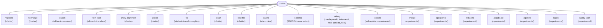

# CLI Reference

**Status:** Current
**Last modified:** 2026-08-12 22:20 EDT

The `chatter` CLI is the primary command-line surface for the TalkBank CHAT toolchain.

The following diagram shows the command dispatch structure. Each
top-level command dispatches to a handler in the corresponding crate.


```mermaid
flowchart TD
    chatter(["chatter"])

    chatter --> validate["validate\n(chatter)"]
    chatter --> normalize["normalize\n(chatter)"]
    chatter --> tojson["to-json\n(talkbank-transform)"]
    chatter --> fromjson["from-json\n(talkbank-transform)"]
    chatter --> showalign["show-alignment\n(chatter)"]
    chatter --> watch["watch\n(chatter)"]
    chatter --> fix["fix\n(talkbank-transform splice)"]
    chatter --> clean["clean\n(chatter)"]
    chatter --> newfile["new-file\n(chatter)"]
    chatter --> cache["cache\n(stats, clear)"]
    chatter --> schema["schema\n(JSON Schema output)"]
    chatter --> debug["debug\n(overlap-audit, linker-audit,\nfind, sanitize, fix-s)"]
    chatter --> update["update\n(self-update, experimental)"]

    chatter --> merge["merge\n(experimental)"]
    chatter --> speakerid["speaker-id\n(experimental)"]
    chatter --> rediarize["rediarize\n(experimental)"]
    chatter --> adjudicate["adjudicate\n(experimental)"]
    chatter --> pipeline["pipeline\n(experimental)"]
    chatter --> batch["batch\n(experimental)"]
    chatter --> sanityscan["sanity-scan\n(experimental)"]
```

## Top-Level Commands

```bash
chatter validate PATH...
chatter normalize INPUT
chatter to-json INPUT
chatter from-json INPUT
chatter show-alignment INPUT
chatter watch PATH
chatter fix PATH... --apply
chatter clean PATH
chatter new-file
chatter cache stats
chatter cache clear --prefix PATH
chatter schema
chatter debug ...
chatter update                     # experimental: self-update to the latest release
chatter merge FILE1 FILE2          # experimental: combine two transcripts
chatter speaker-id INPUT           # experimental
chatter rediarize INPUT --turns T  # experimental
chatter adjudicate ...             # experimental
chatter pipeline ...               # experimental
chatter batch ...                  # experimental
chatter sanity-scan ...            # experimental
```

Use `chatter --help` or `chatter <command> --help` for the exact live surface.

## `validate`

Validate CHAT file(s) or directory tree(s). Accepts multiple paths.

```text
Usage: chatter validate [OPTIONS] <PATH>...
```

```bash
chatter validate file.cha                         # single file
chatter validate file1.cha file2.cha file3.cha    # multiple files
chatter validate corpus/                          # directory (recursive, parallel)
chatter validate file.cha corpus/ other.cha       # mix of files and directories
chatter validate corpus/ -f json                  # structured JSON output
chatter validate corpus/ --force                  # ignore cache, revalidate everything
chatter validate corpus/ --force --audit out.jsonl # bulk audit to JSONL file
chatter validate corpus/ --suppress xphon         # suppress named error group
chatter validate corpus/ --suppress E726,E727     # suppress specific error codes
chatter validate corpus/ -j 8                     # use 8 parallel workers
chatter validate corpus/ --max-errors 50          # stop after 50 errors
```

Options:

| Flag | Description |
|------|-------------|
| `-f, --format text\|json` | Output format (default: text) |
| `--list-checks` | Print every validation check with Active/Planned status, then exit (no `<PATH>` required) |
| `--skip-alignment` | Skip dependent-tier alignment checks |
| `--force` | Ignore cache, revalidate all files |
| `-j, --jobs N` | Parallel workers for directory mode (default: CPU count) |
| `--quiet` | Only emit errors, suppress success messages |
| `--max-errors N` | Stop after N errors across all files |
| `--roundtrip` | Test serialization idempotency (developer tool) |
| `--parser tree-sitter\|re2c` | Parser backend (default: tree-sitter; re2c is opt-in for faster batch validation). **Diagnostic line and column numbers are not reliable under `re2c`**, see the note below |
| `--strict-linkers` | Enable strict cross-utterance linker pairing checks (E351-E355); off by default |
| `--suppress xphon` | Silence the Phon `%x` dependent-tier checks (E725-E728, E735-E746), which run by default |
| `--audit FILE` | Stream errors to JSONL file (bulk audit mode) |
| `--suppress CODES` | Suppress error codes or groups (comma-separated) |

> **`--parser re2c` reports unreliable diagnostic positions.**
>
> The re2c lexer DOES produce a source span for every token; the parser
> discards it (`parser/mod.rs`, `lexer.map(|(tok, _span)| tok)`), so the
> converter assigns every model node a dummy span and diagnostics that compute
> a position from those spans point somewhere arbitrary. The same file
> validated both ways:
>
> ```text
> tree-sitter   error[E370] ... (line 7, column 13)     <- the offending tier
> re2c          error[E370] ... (line 2, column 7)      <- points at @Begin
> ```
>
> The VERDICT is trustworthy on both backends and the two are held to
> structural equivalence by the parity oracle; only the reported location is
> not. A wrong position that looks plausible is worse than none, so treat
> `--parser re2c` as suitable for batch pass/fail and use the default backend
> when you need to find the error in the file.
>
> Restoring the positions means carrying the lexer's spans through the token
> slice rather than re-deriving them, which is bounded work rather than a
> redesign.

**Suppress groups:** `xphon` expands to the whole Phon `%x`
dependent-tier validation surface (%xmodsyl/%xphosyl/%xphoaln/%xphoint,
codes E725-E728 and E735-E746). These checks **run by default**; pass
`--suppress xphon` to silence the group. (The old `--check-xphon` flag
is a deprecated no-op kept only so existing scripts do not break.) The
`--suppress` flag can mix groups and codes: `--suppress xphon,E316`.

**Suppression does not cost you the cache.** It changes what is printed, not
what is validated, so runs that differ only in `--suppress` share cached
results: `chatter validate corpus/` followed by `chatter validate corpus/
--suppress xphon` reuses the first run's work. `--strict-linkers` is the other
kind of flag, since it turns extra checks on, so it validates afresh.

## `normalize`

Serialize a CHAT file into canonical formatting.

```bash
chatter normalize input.cha
chatter normalize input.cha -o normalized.cha
chatter normalize input.cha --validate
chatter normalize input.cha --validate --skip-alignment
```

Flags:

- `-o, --output <PATH>`: write to a file instead of stdout.
- `--validate`: validate (including alignment by default) before
  writing the normalized output.
- `--skip-alignment`: when paired with `--validate`, skip the
  dependent-tier alignment checks (still validates the rest).

`normalize` writes to stdout unless you pass `-o/--output`. There is no `--in-place` flag.

## JSON Conversion

```bash
# Single file
chatter to-json input.cha                          # pretty-printed JSON to stdout
chatter to-json input.cha --compact                # minified JSON to stdout
chatter to-json input.cha -o output.json           # JSON to file

# Directory (recursive, preserves structure)
chatter to-json corpus/ --output-dir json/          # incremental by default (mtime check)
chatter to-json corpus/ --output-dir json/ --compact # minified output (saves disk)
chatter to-json corpus/ --output-dir json/ --force   # full rebuild
chatter to-json corpus/ --output-dir json/ --prune   # remove orphaned .json files
chatter to-json corpus/ --output-dir json/ --jobs 4  # parallel workers

# Reverse and schema
chatter from-json input.json -o output.cha
chatter schema
chatter schema --url
```

**Single-file mode:** `to-json` validates by default. Use `--skip-validation`,
`--skip-alignment`, or `--skip-schema-validation` to bypass checks.

**Directory mode:** Walks recursively, converting each `.cha` to `.json` under `--output-dir`
with the same relative path. **Incremental by default**: skips files whose JSON is
already newer than the source. Use `--force` to rebuild all. Use `--prune` to remove
`.json` files with no matching `.cha` (handles renames/deletions). Use `--jobs N` for
parallel conversion (defaults to number of CPUs).

## Editing and Inspection Commands

### `show-alignment`

Print the dependent-tier alignment for a CHAT file (debugging aid).

```bash
chatter show-alignment file.cha
chatter show-alignment file.cha -t mor          # one tier type
chatter show-alignment file.cha -t gra -c       # compact one-line-per-alignment output
```

Flags: `-t/--tier <mor|gra|pho|sin>` (omit to show all available
tiers); `-c/--compact` (one line per alignment).

### `watch`

Watch a CHAT file or directory and re-validate on every save.

```bash
chatter watch file.cha
chatter watch corpus/
chatter watch corpus/ --skip-alignment --clear
```

Flags: `--skip-alignment` (faster reruns); `-c/--clear` (clear the
terminal between runs).

### `fix`

Apply catalog fixes to CHAT file(s) at exact byte spans. Every file is
parsed and validated, each diagnostic is resolved against a per-code fix
catalog, and the resulting edits are admitted only into utterances that
parsed clean (a broken region elsewhere in the file never blocks a fix, and
is never itself rewritten) before being spliced in.

```bash
chatter fix file.cha                      # report only, writes nothing
chatter fix corpus/ --apply               # write the mechanical fixes
chatter fix corpus/ --apply --dry-run     # preview without writing
chatter fix file.cha --apply --code E259  # opt a semantic fix into writing
```

Every catalog entry carries a batch-safety tier, and this command enforces
it rather than trusting the caller:

- **Mechanical** (one right answer, no semantic judgment): written by a
  bare `--apply`.
- **Semantic** (deterministic, but changes meaning enough to need a human
  naming it): written only when its code is named with `--code`.
- **Ambiguous** (several valid answers, no evidence in the file picks
  one): never written by this command, regardless of `--code`; only
  reported.

Flags: `--apply` (write; without it, `fix` only reports what it would do);
`--dry-run` (preview, requires `--apply`); `--code <CODE>` (repeatable;
narrows the diagnostics considered to exactly the named codes, and is how
a semantic-tier code opts into being written); `--skip-alignment`.

**Header-scoped fixes are currently reported, not applied.** Edits are
admitted only into utterances that parsed clean, so a catalog fix whose
edit lands in the header region (`E501`, `E502`, `E503`, `E504`, `E506`,
`E507`) never has an enclosing utterance to be admitted into; `fix`
reports it as skipped instead of writing it. This is today's limit of the
admission gate, not a missing catalog entry; a header-scoped admission
path is separate future work.

### `clean`

Show the cleaned text for each word (a debugging aid for the
text-normalization pipeline).

```bash
chatter clean file.cha
chatter clean file.cha --diff-only       # only words where raw differs from cleaned
chatter clean file.cha --format json
```

Flags: `--diff-only`; `--format text|json`.

### `new-file`

Create a new minimal valid CHAT file from defaults.

```bash
chatter new-file
chatter new-file -o starter.cha --speaker CHI --language eng
chatter new-file -o adult.cha -s MOT -l eng -r Mother
chatter new-file -c brown -u "hello world ."
```

Flags:

- `-o, --output <PATH>`: stdout if omitted
- `-s, --speaker <CODE>`: default `CHI`
- `-l, --language <ISO 639-3>`: default `eng`
- `-r, --role <ROLE>`: default `Target_Child`
- `-c, --corpus <CORPUS>`: corpus identifier in the `@ID` header (default `corpus`)
- `-u, --utterance <TEXT>`: optional initial main-tier utterance content

## Cache Commands

```bash
chatter cache stats
chatter cache stats --json
chatter cache clear --prefix /path/to/corpus
chatter cache clear --all --dry-run
```

The validation cache lives under the platform cache directory and stores per-file validation results. `validate --force` refreshes cache state for the specified path.

### What the cache does and does not speed up

**Files that passed are remembered; files with errors are re-checked every
time.** This is deliberate, and it is worth knowing because it decides how fast
a re-run feels.

A file that validated cleanly is skipped entirely on the next run, as long as
its contents have not changed. A file that had errors is validated again from
scratch, because the cache remembers only THAT a file had errors, never what
they were: the codes, the line numbers, the quoted source and the suggestions
have to be produced by actually reading the file. Storing them instead would
mean showing you an older release's wording for an error that has since been
improved, which is worse than waiting.

In practice this costs nothing on a corpus in good shape. A full run over the
~106,000 kept TalkBank transcripts takes about 6 seconds when cached, because
only ~141 files have errors to re-check. It is noticeable in the opposite
situation, part way through cleaning up a corpus where most files still fail, or
just after a new release tightens a rule. Two things help there: narrow the
target to the directory you are working in rather than the whole corpus, and fix
files as you go, since each one that passes joins the fast path permanently.

Two other things reset the cache, both expected:

- **Editing a file.** The cache follows file contents, so a changed file is
  always re-validated, and reverting a change restores the earlier result.
- **Upgrading Chatter.** A new release can change what counts as valid, so
  every cached result from an older version is retired and the first run after
  an upgrade is a full one. Later runs are fast again. The previous version's
  results are kept, so downgrading does not force another full run.

`--suppress` does not reset anything: it changes what is printed, not what is
checked, so runs differing only in `--suppress` share the same cached results.

## `debug`

Developer / debugging subcommands for CHAT analysis. Not intended
for routine end-user workflows; surface and behavior may change
between releases. Run `chatter debug --help` for the live list. Current
subcommands include:

- `overlap-audit`: analyze CA overlap markers (⌈⌉⌊⌋): pairing,
  temporal consistency, orphans.
- `linker-audit`: audit linker / special-terminator usage across a
  corpus (cross-utterance pairing for `+<`, `++`, `+^`, `+"`, `+,`,
  `+≋`, `+≈`, plus `+...`, `+/.`, `+//.`, `+"/.` etc.).
- `find`: filter CHAT files by `@Languages` and body content
  (token / substring counts) across a corpus tree; emits paths,
  JSONL, or CSV.
- `sanitize`: strip contributor lexical content while preserving
  structure, for protected-corpus debugging. See the
  [Sanitize](sanitize.md) user-guide page for the full workflow.
- `fix-s`: normalize whole-utterance same-language `@s` runs into a
  `[- lang]` precode, clear the per-word `@s` markers (including those
  on fillers and nonwords), and append any missing explicit `@s:LANG`
  codes to `@Languages`. Trigger conditions and safety rules:

  - Every word-bearing item in the utterance, including fillers
    (`&~`, `&-`, `&+`), nonwords, and retraced material, must carry an
    explicit language marker AND every marker must resolve to the same
    target language. If a single filler such as `&~dang3` lacks a
    marker, the utterance is left untouched (the predicate cannot prove
    it is monolingual).
  - **Bare `@s` shortcuts on fillers must be cleared** when the rewrite
    fires. A bare `@s` resolves relative to the surrounding tier
    language, so adding a `[- LANG]` precode without clearing the
    shortcut would *flip* the filler's language to the precode target.
    `fix-s` clears the shortcut to keep the original meaning intact.
  - The pre-validation rule that catches the unrewritten pattern is
    E255 (whole-utterance same-language `@s` run); `fix-s` is the
    canonical repair. The companion warn-only E254 reports `@s:LANG`
    codes missing from `@Languages`; `fix-s` appends them.
  - True no-op on already-correct files: a file is rewritten only when
    a `[- lang]` conversion or `@Languages` repair can be proved
    necessary.
- `join-retrace`: auto-repair dangling-retrace (E370) utterances. An
  utterance whose last main-tier content is a retrace marker with nothing
  after it is joined with the next same-speaker utterance. The `--scope`
  flag (value-enum, default `repetition`) selects which retrace kinds
  qualify:

  - **`--scope repetition` (default, Wave 1):** only `[/]`
    partial-repetition retraces qualify, and only when the successor's
    leading words repeat the retraced material. This is the conservative,
    OBVIOUS-only repair suitable for most automated use.
  - **`--scope corrections` (Wave 3a, opt-in):** also joins correction
    retraces: `[//]` (Full), `[///]` (Multiple), and `[/-]`
    (Reformulation). Corrections replace rather than repeat the retraced
    material, so the leading-words prefix check is skipped; same-speaker
    presence alone is the gate. Use `--dry-run` first to review every
    proposed correction-join before writing.
  - **`--scope all` (Wave 3b, broadest, opt-in):** joins ANY dangling
    retrace kind, including `[/]` Partial where the successor does NOT
    repeat the retraced material. This covers genuine child-language
    disfluencies: false starts, partial words, disfluent repetitions,
    expansions, and fillers where the transcriber correctly coded a `[/]`
    but the successor cannot repeat the abandoned material. Same-speaker
    presence alone is the gate. Always use `--dry-run` first when running
    this scope on new data.

  Shared behavior for all joined pairs:

  - The join produces one utterance: the first utterance's content
    (keeping the trailing retrace marker) followed by the successor's
    content, terminated by the successor's terminator. Main-tier time
    bullets are unioned (start from the first, end from the successor).
  - **Dependent tiers are dropped.** If either side carried `%mor`,
    `%gra`, or any other dependent tier, the joined utterance drops all
    of them (a naive `%gra` merge would yield two ROOT relations, which
    `chatter validate` rejects as E723). Such joins are reported as
    "needs re-morphotag" so the file can be re-run through morphotagging
    afterwards; the main tier alone remains valid CHAT.
  - `--dry-run` reports what would be joined without modifying files.

## Merge and Reconciliation Commands (experimental)

These commands combine, reconcile, and relabel CHAT transcripts of the
same recording, in the tradition of CLAN's reliability and comparison
tools (`rely`, `trnfix`). They are **experimental and in active
development**: flags and behavior may change, and several modes are not
yet complete. Work on copies and validate the output.

| Command | What it does |
|---------|--------------|
| `merge` | Merge two CHAT transcripts of the same media into one, interleaving by time with explicit per-speaker provenance. Structural only: no ASR, no forced alignment, no content rewriting. |
| `speaker-id` | Assign CHAT-conformant speaker codes to an anonymously-labeled file, from an explicit mapping or by text similarity against a reference transcript. |
| `rediarize` | Re-attribute utterance speakers from an external diarizer's timestamped turns (JSON), keeping the words: repairs transcripts whose ASR under-counted or mixed speakers. |
| `adjudicate` | Resolve pending decisions (currently speaker-id) interactively or from a scripted decision file, writing results to an override file. |
| `pipeline` | Per-session shortcut: run `speaker-id` in reference mode, then `merge`. |
| `batch` | Loop `pipeline` over matched donor / reference file pairs across two directories. |
| `sanity-scan` | Post-merge QA: flag sessions whose automatic decisions look suspicious by an out-of-band heuristic, for operator review via `adjudicate`. |

Full guides: [Merge](merge.md), [Speaker ID](speaker-id.md),
[Rediarize](rediarize.md), and the
[Merge Workflow](merge-workflow.md) walkthrough. The holistic-judgment
mode of `speaker-id` / `pipeline` / `batch` can call an LLM provider
(`talkbank-llm`) when configured via `--llm-endpoint` / `--llm-model`
(plus `--llm-timeout-secs`, `--llm-max-retries`, and a persistent
response cache via `--llm-cache` or `CHATTER_LLM_CACHE`); the
deterministic modes need no network access. Flag-level detail:
[Merge, LLM holistic judgment](merge.md#llm-holistic-judgment-pending-only).

## Exit Codes

| Code | Meaning |
| --- | --- |
| `0` | Success -- all files valid, or command completed without errors |
| `1` | Failure -- validation errors found, parse errors, or command failed |
| `2` | Usage error -- invalid arguments or missing required options (from clap) |

`chatter validate` exits with code 1 if **any** file has validation errors
or parse errors. This makes it safe to use in scripts and CI pipelines:

```bash
chatter validate corpus/ --quiet --tui-mode disable || echo "Validation failed"
```

Use `--quiet` to suppress per-file success output while still relying on
exit codes. Use `--format json` for machine-readable structured output
(JSON objects go to stdout; exit code still reflects pass/fail).

## Output Contracts

- Text output is intended for humans.
- JSON output is intended for automation and downstream tools.
- Error codes and the JSON Schema are documented public contracts; see the Integrating section of this book.
