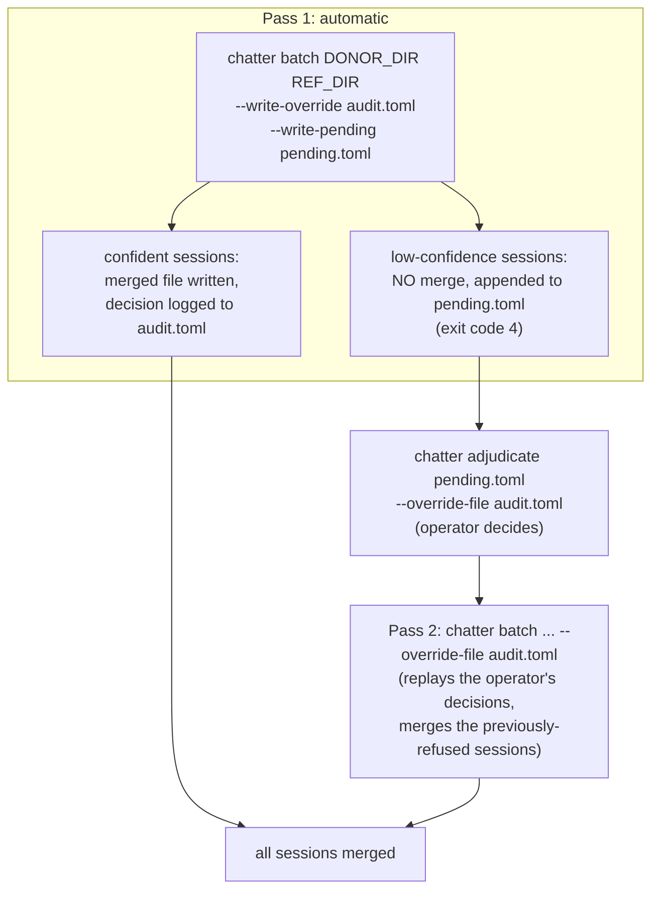

# The Merge Workflow (`pipeline`, `batch`, `adjudicate`, `sanity-scan`)

**Status:** Draft (experimental)
**Last modified:** 2026-06-15 10:39 EDT

The merge workflow combines, at scale, the two structural primitives
documented elsewhere, [`chatter speaker-id`](./speaker-id.md) (assign
CHAT-conformant speaker codes to an anonymous donor) and
[`chatter merge`](./merge.md) (combine two transcripts of the same
recording), and adds the operator loop needed when the automatic
speaker decision is not confident enough to trust.

Four commands make up the workflow. They are **experimental and in
active development**; flags and behavior may change.

| Command | Scope | Role |
|---|---|---|
| `chatter pipeline` | one session | speaker-id (reference mode) then merge, in a single invocation |
| `chatter batch` | a directory pair | loop `pipeline` over matched donor / reference files |
| `chatter adjudicate` | the operator | resolve the low-confidence sessions a pass left pending |
| `chatter sanity-scan` | merged output | flag confident auto-decisions that still look suspicious |

If you only have one pair of files and one clean answer, reach for
`pipeline`. Everything else here is about doing that safely across a
directory of sessions where some answers are not clean.

## The big picture: a two-pass loop

The hard part of merging at scale is not the merge; it is deciding,
per session, which anonymous ASR speaker is the child the reference
already covers. `speaker-id`'s multiset-Jaccard match (see its page)
answers that automatically when the winner clearly beats the
runner-up, and **refuses** (exit code 4) when it does not. The
workflow turns that refusal into a reviewable queue.



Pass 1 merges everything it is confident about and parks the rest. The
operator works the parked queue once. Pass 2 replays their decisions.
The same `chatter batch` (or `chatter pipeline`) command runs both
passes; what changes is whether an override file with entries exists
yet.

## `chatter pipeline` (one session)

The per-session shortcut: run `speaker-id` in reference mode to
relabel an anonymous donor, then `merge` the relabeled donor with the
reference, in one command instead of two.

```text
chatter pipeline <DONOR> <REFERENCE> \
  --anchor <SPEAKER> --inserted-role <CODE>:<ROLE> --output <PATH> [OPTIONS]

ARGUMENTS:
  <DONOR>      Donor CHAT file with anonymous speaker codes (the ASR output).
  <REFERENCE>  Reference CHAT file carrying the authoritative anchor speaker
               (typically the hand-coded child transcript).

REQUIRED:
  --anchor <SPEAKER>            Anchor code in the reference (typically CHI).
  --inserted-role <CODE>:<ROLE> Role for the donor's non-anchor speakers
                                (e.g. INV:Investigator).
  -o, --output <PATH>           Output path for the merged CHAT file.

KEY OPTIONS:
  --retain <SPEAKER>            Speaker(s) taken from the reference in the
                               final merge (typically the same as --anchor).
  --confidence-threshold <F>    Minimum winner/runner-up Jaccard margin to
                               auto-decide (default 2.0x).
  --write-override <FILE>       On a confident auto-decision, append a
                               mode = "auto" audit entry for this session.
  --write-pending <FILE>        On a low-confidence refusal, append a pending
                               entry (exit code 4 still fires).
  --override-file <FILE>        If the file has an entry for this session
                               (the donor's basename stem), replay that
                               decision instead of running reference mode.
```

The same command serves pass 1 (no override entry yet, run reference
mode) and pass 2 (entry present, replay it). Validation is a hard
precondition: a donor or reference that fails `chatter validate` is
never merged (exit 2, nothing written).

## `chatter batch` (a directory pair)

Loops `pipeline` over matched files: the reference for `DONOR_DIR/X.cha`
is `REFERENCE_DIR/X.cha`. Donors without a matching reference are warned
and skipped. It is **fail-closed and whole-batch on validity**: if any
input under either directory is invalid CHAT, the batch reports every
offending file and aborts without merging a single session.

```text
chatter batch <DONOR_DIR> <REFERENCE_DIR> \
  --anchor <SPEAKER> --inserted-role <CODE>:<ROLE> --output <DIR> [OPTIONS]

PASS-1 AUDIT + QUEUE:
  --write-override <FILE>  Append every confident auto-decision (mode =
                          "auto"). Required if you want --sanity-scan.
  --write-pending <FILE>   Aggregate every low-confidence refusal into one
                          pending file. One `chatter adjudicate` run resolves
                          them all. Refusals do NOT abort the batch.

PASS-2 REPLAY:
  --override-file <FILE>   Threaded to every per-session pipeline call.
                          Sessions with an entry replay it; the rest fall
                          through to reference mode.

POST-MERGE QA:
  --sanity-scan            Run `sanity-scan` after the loop. Requires
                          --write-override (it reads the auto-decisions) and
                          --write-pending (flagged sessions are appended).
                          Exit code 4 fires if it flags any session.
  --sanity-scan-threshold <F>  Heuristic ratio (default 1.5).

OPERATIONAL:
  --skip-existing          Skip donors whose merged output already exists, to
                          resume an interrupted batch.
```

`batch` also accepts the same `--judgment deterministic|holistic` and
LLM / `--session-context` options as `pipeline`; see
[Merge, LLM holistic judgment](./merge.md#llm-holistic-judgment-pending-only)
for that mode and the session-context JSON format.

## `chatter adjudicate` (the operator step)

Reads the pending file a pass produced, walks the operator through the
unresolved sessions, and appends the resolved decisions to the override
file. On success the pending file is rewritten to drop the entries that
were resolved, so re-running adjudicate only ever shows what is left.

```text
chatter adjudicate <PENDING> --override-file <FILE> [--interactive | --scripted <TOML>]

ARGUMENTS:
  <PENDING>  The pending-adjudications TOML a pass wrote.

REQUIRED:
  --override-file <FILE>  Override file to append resolved decisions to
                         (created if absent). This is the same file pass 2
                         reads back.

DECISION SOURCE (one of):
  --interactive           Prompt per pending entry on stdin. Currently
                         supports `accept` / `a` (accept the suggested
                         mapping).
  --scripted <TOML>       Pre-canned operator decisions, for replayable /
                         tested runs. Mutually exclusive with --interactive.

  --operator <NAME>       Recorded in each override entry (defaults to $USER).
```

This is the interactive review tool the `speaker-id` and `merge` pages
refer to: the audit trail (who decided, the scores, any note) lands in
the override file so a later reader can see *why* a session was labeled
the way it was. The decision schema is the same override-file format
used everywhere in the workflow; see
[Merge Override File Format](../integrating/merge-overrides.md), and the
[Adjudication Workflow](../../architecture/adjudication-workflow.md)
architecture page for the design.

## `chatter sanity-scan` (post-merge QA)

A confident auto-decision can still be wrong, the runner-up was simply
even further off. `sanity-scan` re-reads the merged output and the
pass-1 audit file and flags sessions that pass an out-of-band check: the
**mean utterance word count** of the anchor speaker versus the inserted
speaker. In a typical child-language recording the adult out-talks the
child, so an anchor (child) mean that is much *higher* than the inserted
(adult) mean is suspicious, possibly the two were swapped.

```text
chatter sanity-scan <MERGED_DIR> \
  --override-file <FILE> --anchor <SPEAKER> --write-pending <FILE> [OPTIONS]

REQUIRED:
  --override-file <FILE>  The pass-1 audit file. Only auto-decided sessions
                         are scanned; explicit-mode entries are skipped (the
                         operator already signed off).
  --anchor <SPEAKER>      Anchor code in the merged files (typically CHI).
  --write-pending <FILE>  Flagged sessions are appended here as
                         sanity-scan-misclassification pending entries for
                         `chatter adjudicate`. Required.

  --threshold <F>         Flag when anchor_mean >= inserted_mean * threshold
                         (default 1.5).
```

A flag is a question, not a verdict: the session goes back into the
adjudication queue for an operator to confirm or correct. Whether to run
the scan at all is a judgment about the corpus. It assumes the typical
"adult out-talks child" shape, and is unreliable where that inverts
(e.g. a clinical-interview corpus where children out-narrate the adult);
there, prefer the LLM holistic-pending review described on the merge
page.

## End-to-end worked example

A directory of ASR donors (`asr/`) and the matching hand-coded child
references (`ref/`), child anchor `CHI`, adults labeled `INV`:

```bash
# Pass 1: merge what we are sure of; queue the rest; keep an audit trail.
chatter batch asr/ ref/ \
  --anchor CHI --inserted-role INV:Investigator \
  --output merged/ \
  --write-override audit.toml \
  --write-pending pending.toml \
  --sanity-scan

# Exit 0: every session merged confidently and the scan was clean.
# Exit 4: some sessions are pending (low-confidence and/or scan-flagged).

# Operator resolves the queue once (audit trail recorded):
chatter adjudicate pending.toml --override-file audit.toml --interactive --operator alice

# Pass 2: replay the operator's decisions; the previously-pending
# sessions now merge.
chatter batch asr/ ref/ \
  --anchor CHI --inserted-role INV:Investigator \
  --output merged/ \
  --override-file audit.toml \
  --skip-existing
```

## Exit codes

The workflow commands share the convention used across the merge
surface:

| Code | Meaning |
|---|---|
| 0 | Success |
| 1 | Invalid input (parse error, missing file, unreadable) |
| 2 | Semantic precondition violated (e.g. invalid CHAT input, missing anchor) |
| 3 | Internal error |
| 4 | A pass parked work for the operator: a low-confidence speaker-id refusal, or a `sanity-scan` flag. Nothing was lost; the sessions are in the pending file |

Exit code 4 is the normal "there is operator work to do" signal, not an
error: a batch that parks ten sessions still merged the rest.

## See also

- [Speaker-ID](./speaker-id.md), the speaker-relabeling primitive and
  the Jaccard matching algorithm pass 1 uses.
- [Merge](./merge.md), the structural merge primitive and the LLM
  holistic-judgment mode.
- [Merge Override File Format](../integrating/merge-overrides.md), the
  shared decision schema.
- [Adjudication Workflow](../../architecture/adjudication-workflow.md)
  and [Merge Pipeline, Crate Architecture](../../architecture/merge-architecture.md),
  the developer-facing design.
