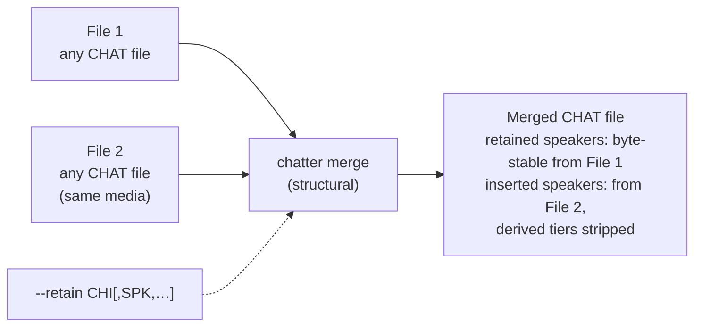
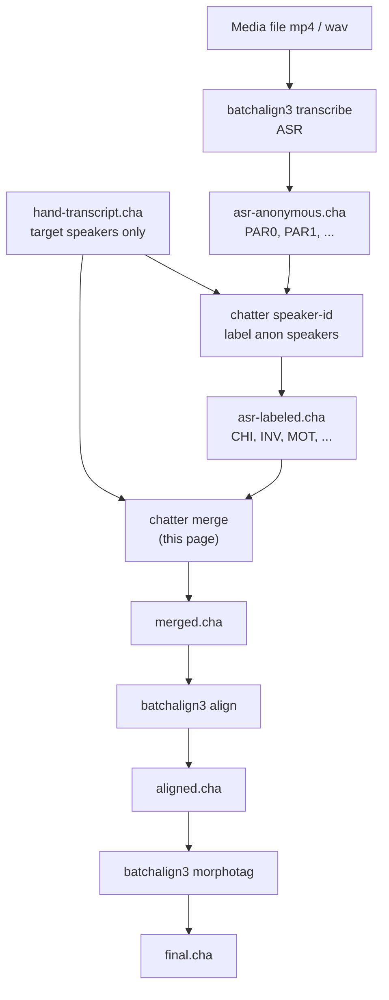

# Merge (`chatter merge`)

**Status:** Draft
**Last modified:** 2026-06-11 15:32 EDT

`chatter merge` combines two CHAT transcripts that cover the same media
recording into one. The caller designates which speakers' utterances are
authoritative in which file; the merged output interleaves them by time
while byte-preserving every utterance from its designated source.

The command is **structural**: it does not invent or rewrite utterance
content, does not run ASR, does not run forced alignment, does not
infer speaker identity. It is the moment in a multi-input CHAT
workflow where two parsed transcripts become one.

## When to use it

Whenever you have two valid CHAT files of the same recording and you
want a single combined CHAT file out, with explicit per-speaker
provenance.

Two recurring shapes from real TalkBank workflows:

- **Hand-coded target speaker + ASR everyone else.** A contributor has
  hand-transcribed only the target speaker (often the child in
  child-language research) with rich disfluency and error coding, and
  separately someone runs ASR on the same media to produce a
  rough-but-complete transcript with all speakers. `chatter merge`
  combines them with the hand-coded target speaker's utterances
  byte-preserved and the other speakers spliced in from the ASR file.
- **Older hand transcript + later supplementary transcription.** A
  legacy CHAT file covers most of the recording; a newer pass
  transcribes additional content (an investigator's turns, a parent's
  turns, a second target child). Merge with `--retain` listing the
  speakers whose content lives in the legacy file.

In both shapes the *speakers* are the unit of authority, not the
files. `chatter merge`'s job is to express that mapping cleanly.

## Conceptual model

A CHAT file describes utterances on a shared media timeline. Two CHAT
files of the same media share the same timeline; their utterance sets
may overlap (same speech transcribed twice) or be disjoint (each file
covers different speakers). The merged output is a single CHAT file
on the same timeline whose utterance set is the disjoint union of:

- the utterances of every speaker listed in `--retain` from the first
  input file, and
- the utterances of every speaker NOT listed in `--retain` from the
  second input file.

Retained-speaker utterances from the first file are kept **byte-for-byte
identical**, including every dependent tier they own (`%wor`, `%mor`,
`%gra`, `%com`, `%pho`, …). Inserted-speaker utterances from the
second file have their downstream-generated dependent tiers
(`%wor`/`%mor`/`%gra`/`%pho`, anything a later pipeline stage will
regenerate) stripped before insertion, so the merged file is in a
clean state for `batchalign3 align` and `batchalign3 morphotag` to
own those tiers authoritatively post-merge.



## CLI contract

```text
chatter merge <FILE1> <FILE2> --retain <SPEAKER_LIST> [OPTIONS]

ARGUMENTS:
  <FILE1>  Path to the first CHAT file. Speakers listed in --retain are
           taken from here, byte-preserved.
  <FILE2>  Path to the second CHAT file. All other speakers are taken
           from here.

REQUIRED OPTIONS:
  --retain <SPEAKER>[,<SPEAKER>...]
           Comma-separated list of speaker codes (e.g. CHI, or
           CHI,SI2). These speakers' utterances come from <FILE1>;
           everything else comes from <FILE2>.

OPTIONS:
  -o, --output <PATH>
           Write merged output to PATH. Default: stdout.

  --strip-tiers <TIER>[,<TIER>...]
           Dependent tier names to strip from inserted-speaker
           utterances before merging. Default: wor,mor,gra,pho.
           Use empty list (--strip-tiers '') to preserve all
           dependent tiers as-is.

  --allow-bullet-drift
           Permit small backward-time bullets in either input (where
           one utterance's end_ms is slightly greater than the next
           utterance's start_ms). Default behavior: warn but proceed.
           Set this flag to silence the warning.
```

Exit codes:

| Code | Meaning |
|---|---|
| 0 | Merge succeeded |
| 1 | Invalid input (parse error, missing file, unreadable) |
| 2 | Semantic precondition violated (e.g. retained speaker missing from File 1, conflicting `@Media`, no time bullets in File 1) |
| 3 | Internal error |

## What the merged output guarantees

These are testable invariants. Every release verifies them against the
reference corpus.

### Retained speakers are byte-stable

For every speaker code in `--retain`, every main-tier line and every
dependent-tier line attached to that speaker in `<FILE1>` appears
byte-for-byte identical in the merged output, in the same relative
order they appeared in `<FILE1>`. CHAT markup, NAK-delimited time
bullets, paralinguistic annotations, retracing scope, terminator
variants, special-form `@l`/`@n`/`@c` suffixes, all preserved.

This is the core semantic guarantee of merge: if you hand-coded
disfluency on the target speaker, the disfluency coding survives the
merge without any structural change.

### Inserted speakers' downstream-generated tiers are stripped

For every speaker code in `<FILE2>` that is NOT in `--retain`, the
utterance is included in the merged output with its main tier
preserved verbatim BUT with `%wor`, `%mor`, `%gra`, and `%pho`
removed (configurable via `--strip-tiers`). Other dependent tiers
(`%com`, `%spa`, `%act`, `%sit`, `%add`, contributor-specific tiers)
are preserved.

The rationale: `batchalign3 align` and `batchalign3 morphotag` are
the authoritative source stages for these tiers in the post-merge
pipeline. Carrying inserted-speaker `%wor` across the merge would
leave the merged file in a half-state, some utterances would have
`%wor`, others would not, and downstream behavior on mixed inputs
is undefined. The contract is: enter the post-merge stages in a
clean state, exit with the tier present and consistent across every
utterance.

### Utterance order is timeline order

Utterances in the merged output appear in ascending order by their
start time bullet (`\\x15START_END\\x15`, milliseconds). Where two
utterances have identical start times, the first-file utterance
comes first.

### Time bullets are pass-through

`chatter merge` does NOT recompute, smooth, or refresh time bullets.
The bullets in the merged output are exactly those that appeared in
the source files. If `<FILE2>` had `%wor` rows whose first/last word
times implied a slightly different utterance span than the main-tier
bullet, the main-tier bullet wins (it was the contract before merge).

If the merge stage detects an inserted-speaker utterance with no
main-tier bullet at all (Batchalign occasionally omits these),
it lifts a bullet from the corresponding `%wor` row's first-word
start and last-word end, appending it to the main tier so the
merged file has uniform bullet placement. The original `%wor` is
then stripped (per the per-tier rule above).

### Header reconciliation

The merged file's headers are constructed deterministically from the
two inputs:

| Header | Source | Notes |
|---|---|---|
| `@UTF8` | File 1 | always required to be `@UTF8` |
| `@Begin` / `@End` | File 1 | always present in merge output |
| `@Window` | File 1 if present | not generated if absent |
| `@Languages` | File 1 | must match File 2; mismatch is an error |
| `@Media` | File 1 | File 2's `@Media` is discarded; warning if mismatched media filename (NOT the modality field, see below) |
| `@Participants` | concatenation | File 1's entries first, then File 2's entries for non-retained speakers in their original order |
| `@ID` | concatenation | File 1's `@ID` rows first; File 2's `@ID` rows for non-retained speakers appended in their original order |
| `@Comment` | concatenation | File 1's `@Comment` rows first; File 2's `@Comment` rows appended in original order (preserves any provenance comments like ASR engine/run timestamp) |

The `@Media` modality field (`audio` vs `video`) is a known
divergence point: when ASR runs against an `mp4`, it may write
`video` on its input but emit `audio` on its output. File 1's
modality wins, as with all `@Media` content; no warning is
emitted for modality mismatch.

### Overlap markup is NOT injected

When an inserted-speaker utterance temporally overlaps a retained-speaker
utterance, `chatter merge` does NOT inject CHAT `[>]` / `[<]` /
angle-bracket-scoped overlap markers. The time bullets carry overlap
information; markers are a CLAN-era surface convention that the
output of `chatter merge` deliberately omits.

The retained speakers' existing overlap markers (if File 1 already
contains some) are preserved byte-stably under the byte-preservation
rule above.

## Preconditions

`chatter merge` refuses (exit code 2) if any of these hold:

- File 1 declares no utterances for any speaker in `--retain`.
- File 1 has no time-bulleted utterances at all (no shared timeline
  to merge against).
- The two files' `@Languages` headers disagree.
- A speaker code appears in both files but not in `--retain` (use
  `--retain` to disambiguate).
- File 2 is missing or unparseable.

`chatter merge` does NOT refuse on these (proceeds with warning):

- Small backward-time bullets in either input (one utterance ends
  slightly after the next starts), common in hand transcripts, not
  corrupting; downstream `batchalign3 align` cleans these.
- File 2's `@Media` modality disagrees with File 1's (`audio` vs
  `video`).
- File 1 has fewer utterances than File 2, or vice versa.

## Speaker identity in File 2 must already be coherent

`chatter merge` does NOT identify or rename speakers. If File 2 came
from ASR and carries anonymous codes like `PAR0`, `PAR1`, run
[`chatter speaker-id`](./speaker-id.md) first to assign CHAT-conformant
codes. The merge step trusts whatever speaker codes appear in its
inputs.

## What chatter merge is NOT

- Not ASR. Use `batchalign3 transcribe`.
- Not forced alignment. Use `batchalign3 align`.
- Not morphological tagging. Use `batchalign3 morphotag`.
- Not speaker identification. Use `chatter speaker-id`.
- Not content reconciliation. If two files disagree about what a
  speaker said at the same time, `chatter merge` does not adjudicate;
  it trusts `--retain` to designate one file as authoritative per
  speaker.
- Not three-way or n-way merge in this release. The 2-input case
  composes into the n-input case by chaining (`chatter merge a b
  --retain X -o tmp.cha && chatter merge tmp.cha c --retain Y -o
  out.cha`). A future release may add native n-ary merging if a
  workflow appears for which chained 2-way merges are awkward.

## Worked example

A speech-pathology lab hand-transcribed a child's spontaneous-speech
session, marking disfluency carefully, but did not transcribe the
clinician's turns. They send the media and the child-only transcript;
the project runs ASR on the media to produce a full-coverage
transcript with anonymous speaker codes; then `chatter speaker-id`
labels the ASR file's adult speaker as INV; then `chatter merge`
combines.

```bash
# After ASR labeling: asr.cha has speakers CHI and INV.
chatter merge child-only.cha asr.cha \
  --retain CHI \
  -o merged.cha

# Then alignment regenerates %wor cleanly across all speakers:
batchalign3 align merged.cha

# Then morphotag regenerates %mor and %gra:
batchalign3 morphotag merged.cha
```

The merged file contains:
- Every `*CHI` utterance byte-stable from `child-only.cha`,
  including every disfluency marker, every retracing scope,
  every paralinguistic annotation, every `%com` session-structural
  comment.
- Every `*INV` utterance from `asr.cha`, in their original time
  order, interleaved with the `*CHI` utterances by start time.
- One `@Participants` row listing CHI and INV; `@ID` rows for both;
  the union of `@Comment` rows including any ASR provenance
  comments from `asr.cha`.

## Relationship to other commands



`chatter merge` sits between speaker-identity resolution and
forced alignment. It assumes its inputs have coherent CHAT-conformant
speaker codes (no anonymous `PAR0`/`PAR1`) and emits a file ready for
`batchalign3 align` to refresh timing and produce `%wor`.

## Inputs must be valid CHAT (`pipeline` / `batch`)

The per-session `chatter pipeline` shortcut and the directory-level
`chatter batch` driver validate every input as CHAT **before** doing any
speaker-id or merge work. Each donor and the reference it is merged
against must pass the same validation `chatter validate` runs; an input
that fails is never merged. Clean invalid transcripts to valid CHAT
first (run `chatter validate <file>` to see the errors), then re-run.

- `chatter pipeline` refuses (exit 2, no output written) if its donor or
  reference is invalid CHAT.
- `chatter batch` is fail-closed and whole-batch: if *any* input under
  the donor/reference directories is invalid CHAT, it reports every
  offending file and aborts the entire run without merging a single
  session. "All inputs are chatter-valid" is a hard precondition of the
  batch, not something discovered session-by-session mid-run.

This gate catches validation-only invalidity (files that parse but fail
`chatter validate`, e.g. a malformed `@ID`), which the lower-level
`chatter merge` parse is otherwise lenient about.

### LLM holistic judgment (pending-only)

`--judgment holistic` is now reachable from `pipeline` and `batch` (not
just `speaker-id`). In holistic mode the command is pending-only: it
writes an `engine = "llm"` review-gated entry via `--write-pending` and
produces no merged file. The operator supplies the LLM connection with
`--llm-endpoint` / `--llm-model` (or the environment variables
`CHATTER_LLM_ENDPOINT` / `CHATTER_LLM_MODEL`); an optional
`--session-context <file.json>` provides per-session context that the
LLM prompt includes to sharpen its judgment.

#### Session-context JSON (`--session-context`)

The session-context file is a corpus-agnostic JSON object mapping
session IDs (the donor file's basename stem) to context records. Every
record field is optional, and the label fields are free vocabulary:
chatter imposes no closed set, the labels are surfaced verbatim into
the LLM prompt.

```json
{
  "SESSION-ID": {
    "sample_type": "clinician interview",
    "declared_roles": ["Investigator"],
    "consent_tier": "video+audio",
    "age_months": 52
  }
}
```

- `sample_type`: what kind of speech sample the session is (e.g.
  `"narrative retell"`).
- `declared_roles`: adult roles declared present in the session.
- `consent_tier`: media-consent tier governing what may be shared.
- `age_months`: child age in months at the session.

When `--session-context` is absent, the `CHATTER_SESSION_CONTEXT`
environment variable supplies the path (empty counts as unset). Per
session, each context field resolves in order: the explicit record
from the file; for the age only, the donor's CHAT `@ID` age header
(pure CHAT, no external metadata needed); otherwise unknown. Absent
sessions or fields are passed to the judgment as unknown, never
guessed. A configured-but-malformed file is a hard error, and labels
must contain at least one non-whitespace character. Configuring
session context on a non-holistic run prints a warning (the
deterministic judgment never consults it).

Conversion from a contributor's own records format (a spreadsheet, a
database export) to this JSON happens outside chatter.

The two-pass operator flow is:

1. `batch --judgment holistic --session-context context.json
   --write-pending P` accumulates one `engine = "llm"` pending entry
   per session in `P`.
2. Operator reviews `P`, accepts or corrects each entry.
3. `chatter adjudicate` promotes reviewed entries to the override file.
4. `batch` (deterministic, reading the override file) replays every
   confirmed mapping and writes the merged files.

Note: the MLU sanity-scan is unreliable for the FluencyBank clinical-interview
corpus (children out-narrate the adult, so MLU ratios invert relative to typical
child-language recordings). Holistic-pending review via `--judgment holistic`
is the trustworthy alternative there.

## Implementation notes (for contributors)

- Source: `crates/talkbank-transform/src/transcript_merge/` (proposed
  layout, see the design plan).
- CLI surface: `crates/talkbank-cli/src/commands/transcript_merge/`.
- Domain types (`SpeakerCode`, `RetainSet`, `MergeOverride`,
  `SpeakerMapping`) live in `talkbank-model` so the override-file
  format is sharable across the speaker-id stage, the orchestrator,
  and any future adjudication UI.
- The merge operates on `talkbank-model::ChatFile`; both inputs are
  parsed via `talkbank-parser`. The byte-preservation guarantee on
  retained-speaker utterances relies on the parser's existing
  round-trip serialization.
- Spec entries exercising the merge live in `spec/constructs/`,
  every behavioral invariant on this page has a spec; tests are
  regenerated via the current `spec/tools` workflow documented in
  [Spec Workflow](../../contributing/spec-workflow.md).
- This page is the user contract; `book/src/chatter/reference/`
  carries the override-file reference for the speaker-id stage that
  this merge consumes.
