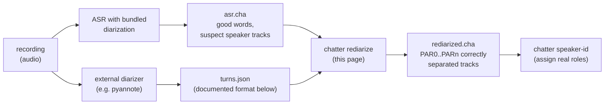

# Rediarize (`chatter rediarize`)

**Status:** Draft
**Last modified:** 2026-07-08 21:50 EDT

`chatter rediarize` re-attributes utterance speakers in a CHAT file
from an external diarization. Given a transcript whose utterances
carry media time bullets and a JSON file of timestamped speaker turns
produced by a dedicated diarizer (for example pyannote), it reassigns
each utterance's main-tier speaker to the diarization track that
covers the utterance's time span the most, keeping the utterance
content (the words) byte-stable.

The command exists for a specific, common failure shape: ASR systems
with bundled diarization (Rev.AI and others) auto-detect the speaker
count and can under-count on hard material such as child-adult
overlap, collapsing three or four real voices into two tracks. The
ASR *words* are usually fine; the *attribution* is what is wrong. A
dedicated diarizer recounts the voices correctly, and `rediarize`
reconciles its turns with the existing transcript so you keep the
good words and replace only the bad attribution.

The command is **structural and audio-free**: it never touches the
recording. The diarizer runs elsewhere (any tool, any model) and
hands its result across a documented JSON boundary.

## Pipeline position



`rediarize` fixes WHICH anonymous track owns each utterance; it does
not decide who each track *is*. Role assignment (child, mother,
investigator, ...) is [`chatter speaker-id`](speaker-id.md)'s job,
downstream.

## Usage

```bash
chatter rediarize INPUT.cha --turns TURNS.json -o OUTPUT.cha
```

Omitting `-o` prints the rewritten CHAT to stdout.

A summary is reported on stderr after the rewrite (stderr so that a
stdout CHAT stream stays clean when `-o` is omitted):

```text
rediarize: 214 reassigned, 671 unchanged, 7 flagged
```

Flagged utterances (see below) are listed individually with their
utterance index, kept speaker, and reason.

## Machine-readable summary (`--summary-json`)

Batch drivers looping `rediarize` over a corpus should not scrape the
stderr text. `--summary-json PATH` additionally writes the outcome as
JSON:

```bash
chatter rediarize INPUT.cha --turns TURNS.json \
    -o OUTPUT.cha --summary-json SUMMARY.json
```

```json
{
  "source": "pyannote/speaker-diarization-community-1",
  "reassigned": 747,
  "unchanged": 145,
  "flagged": [
    {"utterance_index": 12, "kept_speaker": "PAR1",
     "reason": "no_overlapping_turn"}
  ]
}
```

- `source`: the turns file's provenance, passed through (`null` if the
  turns file carried none).
- `reassigned` / `unchanged`: utterance counts. `unchanged` includes
  flagged utterances (they kept their speaker), so the file's total
  bulleted-tier utterance count is `reassigned + unchanged`.
- `flagged`: every declined reattribution, **never truncated** (the
  stderr listing caps at 20 detail lines; this list is complete).
  `utterance_index` is the 0-based position among main-tier lines;
  `reason` is `"no_bullet"` or `"no_overlapping_turn"`.

Field names and the `reason` strings are a stable output contract.
The summary is written only on exit 0, after the CHAT output.

## The turns JSON format

The `--turns` file is the corpus-agnostic seam between the diarizer
and chatter. Producing it from any given diarizer's native output is
the caller's concern; the format is:

```json
{
  "source": "pyannote/speaker-diarization-community-1",
  "turns": [
    {"track": "PAR0", "start_ms": 12063, "end_ms": 17024},
    {"track": "PAR1", "start_ms": 13379, "end_ms": 14375}
  ]
}
```

- `source` (optional): free-form provenance, typically the diarizer
  model name. Not interpreted, but useful in audit trails.
- `turns` (required): the timestamped segments. Each has:
  - `track`: the anonymous CHAT speaker code this segment belongs to
    (`PAR0`, `PAR1`, ...). The producer chooses the codes; a
    deterministic mapping from diarizer-native labels (for example
    pyannote's `SPEAKER_00`) is recommended.
  - `start_ms` / `end_ms`: the segment's media time span in integer
    milliseconds, half-open `[start_ms, end_ms)`, with
    `end_ms >= start_ms`.

Turns MAY overlap each other (diarizers that permit overlapping
speech produce such turns); max-overlap attribution handles that
naturally. Unknown fields anywhere in the file are rejected, so a
misspelled field fails loudly instead of being silently ignored.

## Behavior contract

- Every utterance with a time bullet is assigned to the turn track
  with the greatest millisecond overlap against the bullet's span.
  An utterance already on its max-overlap track counts as
  `unchanged`.
- An utterance with **no bullet**, or whose bullet **overlaps no
  turn at all**, keeps its existing speaker and is **flagged** in
  the summary. Ambiguity is surfaced, never silently guessed.
- `@Participants` and `@ID` headers are reconciled to declare
  exactly the set of tracks the output actually uses: new tracks get
  entries cloned from an existing participant (same role),
  declarations for tracks no longer used are dropped.
- Utterance content, dependent tiers, and all other headers are
  preserved as-is.

## Exit codes

| Code | Meaning |
|------|---------|
| 0 | Rewrite completed and output written. Flagged utterances do not fail the command; check the summary. |
| 1 | Invalid input: unreadable file, CHAT parse failure, malformed turns JSON. |
| 2 | Precondition violation: the turns JSON parsed but is semantically defective (for example a turn with `end_ms < start_ms`). |

On any non-zero exit, no output file is written.

## Worked example

A recording of one child and two parents, transcribed by an ASR
whose bundled diarization auto-detected two speakers (the two adults
were merged into one track). A dedicated diarizer found three voices
and produced `turns.json` with `PAR0`/`PAR1`/`PAR2`. Then:

```bash
chatter rediarize session.cha --turns turns.json -o session-3spk.cha
chatter validate session-3spk.cha
```

splits the merged adult track by time, declares `PAR2` in the
headers, and leaves every word as the ASR wrote it. The output then
flows into `chatter speaker-id` (or the merge workflow) to name the
three tracks.
