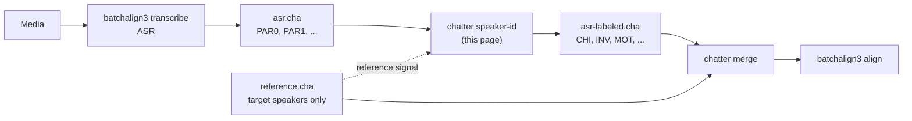

# Speaker-ID (`chatter speaker-id`)

**Status:** Draft
**Last modified:** 2026-06-15 12:18 EDT

`chatter speaker-id` assigns CHAT-conformant speaker codes and role
tags to a CHAT file whose speakers carry anonymous or placeholder
labels (typically the output of an ASR system that labels speakers
as `PAR0`, `PAR1`, …). It is the bridge between an ASR pipeline that
does not understand speaker roles and a CHAT pipeline that does.

The command is **structural**: it does not modify utterance content,
does not run audio analysis, does not infer speaker identity from
voice features. Its inputs are the CHAT file to relabel plus an
identification signal (reference transcript, explicit mapping, or
saved override record); its output is the same CHAT file with
speaker codes rewritten and `@Participants` / `@ID` headers
reconciled.

## When to use it

Whenever you have a CHAT file with placeholder speaker codes that
need to become CHAT-conformant codes before downstream tooling can
process the file meaningfully. The canonical case is an ASR system
that emits CHAT but does not know which speaker is the child,
parent, clinician, etc.

A complete pipeline that consumes ASR output and produces a
publishable CHAT file goes:



The speaker-id stage is the single point in the pipeline where
"which anonymous speaker corresponds to which CHAT role" is
decided. Downstream stages (`chatter merge`, `batchalign3 align`,
`batchalign3 morphotag`) all trust that the labels they receive
are correct.

## Identification modes

Three mutually-exclusive modes, exactly one of which must be
selected:

### 1. Reference mode

The most common case: a separate CHAT file already exists that
covers the same media and contains an authoritative speaker
(typically the hand-transcribed target speaker). The reference
file's anchor speaker tells us what that speaker's content looks
like; `speaker-id` finds the matching speaker in the input by
text similarity.

The matching algorithm is **multiset Jaccard over bags of content
tokens**, see "Algorithm" below for the full specification. The
ASR speaker whose bag-of-words best matches the reference anchor's
bag-of-words is taken as the same speaker, and is marked for
**drop** in the output (because the reference file authoritatively
covers them, the downstream `chatter merge` stage will pull
their utterances from the reference, not from this file). The
remaining speakers are renamed to the role specified by
`--inserted-role`.

If the Jaccard margin between the winning speaker and the
runner-up is below `--confidence-threshold`, the command refuses
to auto-decide. The operator must either lower the threshold
(not recommended without spot-checking), supply an explicit
mapping (`--mapping`), or load a previously-adjudicated override
(`--override-file`).

### 2. Explicit-mapping mode

The operator already knows the mapping (typically because they
listened to the audio, or because the contributor's data sheet
documents it). They supply it directly.

```bash
chatter speaker-id input.cha \
  --mapping "PAR0=INV:Investigator,PAR1=drop" \
  -o relabeled.cha
```

The grammar for `--mapping`:
- One or more comma-separated assignments.
- `OLD=CODE:ROLE` renames OLD to CODE with role tag ROLE.
- `OLD=drop` removes OLD's utterances entirely.
- Every speaker present in the input must be named in the mapping
  (no defaulting). This is intentional, we want operator decisions
  to be explicit.

### 3. Override-file mode

The operator has previously adjudicated this session (perhaps
through an interactive review tool) and saved the decision to a
shared override file. `speaker-id` reads the file, finds the entry
for this session, and applies it. See "Override file format"
below.

```bash
chatter speaker-id input.cha \
  --override-file batch-2026-05-27.overrides.toml \
  --session-id NF203-2 \
  -o relabeled.cha
```

This mode is the production substrate for batch workflows: the
orchestrator first runs `chatter speaker-id` in reference mode for
every session; for any session that exits with low-confidence, the
operator works through an adjudication tool that writes to the
override file; the orchestrator then re-runs `chatter speaker-id`
in override-file mode for those sessions.

## CLI contract

```text
chatter speaker-id <INPUT> [OPTIONS]

ARGUMENTS:
  <INPUT>  Path to the CHAT file to relabel.

OPERATION MODES (exactly one required):

  REFERENCE MODE:
    --reference <FILE>
    --anchor <SPEAKER>
    --inserted-role <CODE>:<TAG>[,<CODE>:<TAG>...]

  EXPLICIT-MAPPING MODE:
    --mapping <SPEC>

  OVERRIDE-FILE MODE:
    --override-file <FILE>
    --session-id <ID>

REFERENCE-MODE OPTIONS:
  --confidence-threshold <FLOAT>
      Minimum Jaccard margin (winner_score / loser_score) for the
      command to auto-decide. Below threshold: exit code 4. The
      command prints per-speaker scores to stderr so the operator
      can inspect. Default: 2.0.

  --write-override <FILE>
      When auto-decide succeeds, append the decision to FILE in
      override-file format (creates if missing). Captures the
      audit trail of a batch run.

COMMON OPTIONS:
  -o, --output <PATH>
      Write relabeled CHAT to PATH. Default: stdout.

The operator identity and any free-text note for a session are set
when an operator confirms it through `chatter adjudicate` (see the
merge workflow), not on this command.
```

Exit codes:

| Code | Meaning |
|---|---|
| 0 | Success, relabeled file written |
| 1 | Invalid input (parse error, missing file, unreadable) |
| 2 | Semantic precondition violated (reference has no utterances for anchor; mapping covers a speaker not in input; etc.) |
| 3 | Internal error |
| 4 | Reference mode: confidence threshold not met. Per-speaker scores printed to stderr; no output written |

## What the output guarantees

These are testable invariants. Every release verifies them against
the reference corpus.

### Speaker codes match the supplied mapping

For every speaker in the input file:
- If the mapping marks the speaker for **drop**, none of their
  utterances appear in the output, AND their `@ID` row (if any) is
  removed from the headers, AND their entry is removed from the
  `@Participants` header.
- If the mapping marks the speaker for **rename**, every main-tier
  line `*OLD:\t...` becomes `*NEW:\t...` byte-stable except for the
  speaker code prefix. The `@ID` row's third pipe-separated field
  (speaker code) and eighth field (role tag) are rewritten; other
  `@ID` fields are preserved. The `@Participants` entry's code and
  role-tag tokens are rewritten; any intervening tokens (corpus ID,
  participant name) are preserved.
- Speakers not in the mapping are passed through unchanged. (In
  modes 1 and 3, all speakers are assigned automatically; in mode
  2, "all speakers must be in the mapping" is a precondition.)

### Utterance content is byte-stable except for the speaker prefix

For every retained utterance, every byte EXCEPT the leading
`*CODE:\t` prefix is preserved verbatim. Dependent tiers attached
to the utterance are preserved exactly. NAK-delimited time
bullets, CHAT markup, special-form annotations, paralinguistic
codes, retracing scopes, all untouched.

### Headers reconcile per a fixed table

| Header | Behavior |
|---|---|
| `@UTF8`, `@Begin`, `@End`, `@Window`, `@Languages`, `@Media` | Pass-through unchanged |
| `@Participants` | Drop entries for dropped speakers; rewrite code + role-tag for renamed speakers; entries for unaffected speakers preserved |
| `@ID` | Drop rows for dropped speakers; rewrite field 3 (code) and field 8 (role) for renamed speakers; other fields preserved |
| `@Comment` | Pass-through unchanged (provenance-carrying comments survive) |

### Provenance is captured if `--write-override` is set

When `--write-override <FILE>` is supplied AND the command succeeds
in reference mode, an entry is appended to FILE recording the
session ID (derived from the input filename stem unless overridden),
the per-speaker Jaccard scores, the chosen mapping, the operator, and
an ISO 8601 timestamp. The format is specified in "Override file
format" below. The operator identity and any free-text note are set
later, when a session is confirmed via [`chatter adjudicate`](./merge-workflow.md).

This is the audit-trail mechanism: a year from now, a researcher
who asks "why was PAR0 labeled INV in this session?" can read
the override entry and see the scores, the operator, and any
notes the operator added.

## Algorithm (reference mode)

### Token cleaning

Both the reference anchor's bag of words and each input speaker's
bag of words are built by walking the typed CHAT AST and emitting
content tokens. The cleaner strips:

- NAK-delimited time bullets
- bracket-annotated markup `[*]`, `[//]`, `[/]`, `[=! ...]`, etc.
- angle-bracket retracing scope (`<...>`, unwrap, keep inner text)
- terminator variants `+//.`, `+...`, `+/.`, `+!?`, etc.
- filled-pause and phonological-fragment markers `&-...`, `&+...`
- unintelligible placeholders `xxx`, `yyy`, `www`
- zero-realization markers `0`
- special-form suffixes (`word@l` → `word`)
- CHAT compound underscores (`Valentine's_Day` → `Valentine s Day`)
- punctuation, then lowercase, then filter to alpha-only tokens of
  length ≥ 2

Both sides are cleaned identically so the comparison is
apples-to-apples. This is the same cleaner specified in the
reference corpus under `spec/constructs/speaker-id/token-cleaner/`.

### Multiset Jaccard

For two bags-of-words `A` and `B` (counted multisets):

```text
J(A, B) = sum_w min(A[w], B[w])  /  sum_w max(A[w], B[w])
```

Range `[0, 1]`. The multiset (rather than set) form rewards
speakers who say similar things to the anchor in similar volume,
not just speakers whose vocabulary happens to intersect.

### Decision

```text
scores  = { speaker: J(anchor_bag, speaker_bag) for speaker in input }
winner  = argmax(scores)
loser   = argmax(scores - {winner})
margin  = scores[winner] / scores[loser]    # ∞ when loser score = 0
```

- `winner` is the input speaker whose content matches the
  reference anchor's content best → marked for drop (the reference
  authoritatively covers them).
- `loser` (and any other lower-scoring speakers, in the multi-speaker
  case) → renamed to the role given by `--inserted-role`.

If `margin < --confidence-threshold` (default 2.0), the command
exits with code 4 and prints per-speaker scores to stderr. The
operator must inspect, adjudicate, and re-run with
`--mapping` or `--override-file`.

### Why this algorithm

The choice was empirical, not theoretical, and was made against a
calibration set of CHAT files paired with their corresponding ASR
output. Two earlier candidates were tested first and rejected:

- **Raw temporal-overlap** (sum of ms of an input speaker's
  activity inside the anchor's bullet windows): too weak on real
  data. Hand transcripts often place per-utterance time bullets
  as end-to-end segmentation boundaries covering 95-99% of the
  session timeline, rather than as tight "speaker active here"
  windows. Both input speakers fall almost entirely "inside" the
  anchor's bullet windows and the signal disappears.
- **Speaker purity** (fraction of each input speaker's activity
  falling inside anchor windows): same root cause, same failure.

**Multiset Jaccard over content tokens** succeeded on every
session of the calibration set. The borderline cases (margin
below 2.0x) clustered around tasks where the non-anchor speaker
shares vocabulary with the anchor by the structure of the task,
e.g. a clinician describing the same scene the child is also
describing in a picture-narrative task. These borderline cases
are the reason for the conservative threshold and the
`--mapping`/`--override-file` escape hatches; the algorithm
correctly *refuses* to auto-decide them rather than silently
picking wrong.

## Override file format

The override file is a UTF-8 TOML document with one
`[<session_id>]` table per decision. A minimal entry:

```toml
schema_version = 1

[session-101-t1]
mode = "auto"
inserted_role = { code = "INV", tag = "Investigator" }
mapping = { PAR0 = "rename", PAR1 = "drop" }
scores = { PAR0 = 0.1931, PAR1 = 0.7347 }
margin = 3.81
operator = "alice"
decided_at = 2026-05-27T08:41:00-04:00
```

The complete schema specification, every field, every type, every
mode-semantics rule, the strict refuse-with-clear-error versioning
policy, and worked examples for auto/explicit/replay/diarization-mixed
cases, is on the dedicated reference page:
[**Merge Override File Format**](../integrating/merge-overrides.md).

Highlights from the reference:

- `mode = "auto" | "explicit" | "override"` records how the decision
  was made (informational for audit trail; behavior at apply time
  is the same).
- `inserted_role.code` is the CHAT speaker code (`INV`, `MOT`, `FAT`,
  `PAR`, …); `inserted_role.tag` is the CHAT role-tag
  (`Investigator`, `Mother`, …). All renamed speakers in one
  entry share the same role.
- `mapping` must cover every speaker in the input, no defaulting.
- `scores` and `margin` are optional but the writer always records
  them when an auto attempt produced them (even when the final
  decision was operator-supplied).
- `flags` carries operator-supplied markers like `"diarization-mixed"`
  for unusual cases. Unknown strings are preserved verbatim.

## Preconditions

`chatter speaker-id` refuses (exit code 2) if any hold:

### Reference mode
- The reference file has no utterances for `--anchor`
- The reference file fails to parse
- The input file has fewer than 2 distinct speakers (no
  discrimination problem)

### Explicit-mapping mode
- A speaker in the mapping is not present in the input
- A speaker in the input is not covered by the mapping (no
  defaulting)

### Override-file mode
- The override file does not contain a `<session-id>` entry
- The entry's `mapping` references a speaker not in the input
- The entry's mapping does not cover every speaker in the input

## What chatter speaker-id is NOT

- Not voice diarization. Use Batchalign's ASR pipeline upstream;
  the labels this command consumes are the labels Batchalign
  emits.
- Not content correction. If the speaker the command identifies
  has been mis-transcribed by ASR, this command does not fix that
, re-run ASR with a better engine.
- Not a merge. This command operates on a single CHAT file. To
  combine the relabeled file with the reference, use
  [`chatter merge`](./merge.md).
- Not interactive. `chatter speaker-id` is batch-only: it succeeds,
  refuses, or fails. The interactive review that resolves a
  low-confidence refusal into an override-file entry is a separate
  command, [`chatter adjudicate`](./merge-workflow.md), run as part of
  [the merge workflow](./merge-workflow.md).

## Worked example

A typical fully-automated reference-mode call from an orchestrator
script:

```bash
chatter speaker-id asr-anonymous.cha \
  --reference hand-transcript.cha \
  --anchor CHI \
  --inserted-role INV:Investigator \
  --confidence-threshold 2.0 \
  --write-override batch.overrides.toml \
  -o asr-labeled.cha
```

For a session this refused (e.g., shared-vocabulary narrative
task with margin 1.82x), the orchestrator captures the failure
and the operator later resolves it:

```bash
# Inspect the scores the command emitted to stderr:
#   PAR0=0.6286  PAR1=0.3457  margin=1.82x  threshold=2.0
# Operator listens to a few seconds of audio and confirms PAR0 is
# the child:

chatter speaker-id asr-anonymous.cha \
  --mapping "PAR0=drop,PAR1=INV:Investigator" \
  --write-override batch.overrides.toml \
  -o asr-labeled.cha
```

Later, if anyone re-runs the batch, they use override-file mode:

```bash
chatter speaker-id asr-anonymous.cha \
  --override-file batch.overrides.toml \
  --session-id NF204-2 \
  -o asr-labeled.cha
```

The same `asr-labeled.cha` content is produced; the audit trail
remains intact.

## Implementation notes (for contributors)

- Source: `crates/talkbank-transform/src/speaker_id/` (proposed
  layout).
- CLI surface: `crates/chatter/src/commands/speaker_id/`.
- Domain types (`SpeakerCode`, `RoleTag`, `SpeakerMapping`,
  `MergeOverride`, `JaccardScore`, `ConfidenceThreshold`,
  `Margin`) live in `talkbank-model` and are shared with
  `chatter merge` plus any future adjudication UI.
- The Jaccard cleaner walks `talkbank-model::ChatFile` directly
  via the existing content walker
  (`talkbank-model::walk_words`); it does NOT re-implement CHAT
  parsing or use regex on raw bytes for tokenization.
- Spec entries for the cleaner and the algorithm live in
  `spec/constructs/speaker-id/`. Every invariant on this page has
  a spec; regenerate them with the current `spec/tools` commands from
  [Spec Workflow](../../contributing/spec-workflow.md).
- The override-file reader/writer is a typed `serde` round-trip on
  a TOML representation; the schema lives in `talkbank-model` so
  the format is one shared type across the codebase, not duplicated
  parsing logic in each consumer.
