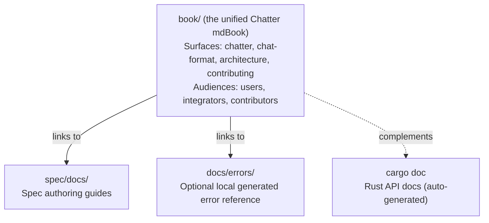

# Documentation Architecture

**Status:** Current
**Last modified:** 2026-06-15 15:00 EDT

## Principle: Centralized Book + Subsystem Satellites

User-facing and contributor-facing prose lives in **mdBook**
(`book/`). The repo-level `docs/` directory holds operator-facing
material (release contract, versioning, code-signing, platform
support, validation feature flags). Maintainers can also generate a
local error-reference tree under `docs/errors/` while working on
diagnostics, but that output is not the canonical checked-in docs
surface. Subsystem-specific working docs stay in place
only when tightly coupled to files in that directory.

## Where Documentation Goes

| Content type | Location | Examples |
|---|---|---|
| User guides, CHAT format reference | `book/src/chatter/user-guide/`, `book/src/chat-format/` | CLI usage, validation errors |
| Architecture and design | `book/src/architecture/` | Parsing, data model, concurrency, memory |
| Contributor workflows | `book/src/contributing/` | Grammar workflow, testing, coding standards |
| Integrator contracts | `book/src/chatter/integrating/` | JSON schema, diagnostic contract |
| Technical reference and audits | `book/src/` (Technical Reference section) | Parity audits, UTF-8 audit, risk register |
| Spec authoring guides | `spec/docs/` | Error spec format, curation workflow |
| Generated error docs | `docs/errors/` | Registry artifact, written by `just spec-gen` and gated by `just spec-check`; source of truth stays in `spec/errors/` |
| Historical/archived docs | project archive | Old audits, superseded proposals |
| AI assistant context | `CLAUDE.md` files (per repo/subdir) | Not documentation for humans |

## Rules

1. **One canonical page per topic.** No duplicate coverage across locations.
2. **No crate-level `docs/` directories.** Architectural explanations go in the book.
   Crate API docs come from `///` doc comments via `cargo doc`.
3. **Satellites stay only when the audience is editing files in that directory.**
   Spec authors need `WRITING_ERROR_SPECS.md` next to their specs. Everyone else
   reads the book.
4. **Generated docs are build artifacts.** Never hand-edit `docs/errors/`;
   `just spec-check` reports a hand-written file there as `extra` and fails.
   Regenerate with `just spec-gen`.
5. **Historical docs go to project archive.** Don't keep old audit logs,
   investigation notes, or superseded proposals in the public repo.

## One unified book

There is one mdBook for this repo at `book/`,
titled "Chatter, TalkBank CHAT Toolchain", organized by audience-first sections
under `book/src/`:

| Section | Audience | Content |
|---|---|---|
| `book/src/chatter/` | chatter CLI users + integrators | CLI reference, library usage, JSON contracts |
| `book/src/chat-format/` | All users + integrators | CHAT format reference (headers, tiers, symbols) |
| `book/src/architecture/` | All devs | Cross-surface architecture, parser/grammar/data-model design |
| `book/src/contributing/` | Contributors | Setup, testing, coding standards, dev checks |

One `book.toml` and one `SUMMARY.md` for the whole tree. Cross-section
links resolve as ordinary in-book paths.

## Diagram Authoring Rules (canonical)

**Architecture and design documentation MUST include Mermaid
diagrams.** GitHub renders Mermaid natively; all mdBook builds have
`mdbook-mermaid` enabled.

#### When to Create a Diagram

Add a diagram when documenting:
- Data flow pipelines (how data transforms through stages)
- Architecture boundaries (what owns what, who calls whom)
- State machines and lifecycles (valid transitions, terminal
  states)
- Decision trees (option routing, fallback paths)
- Type relationships (trait hierarchies, enum variants, ownership)
- Protocols (request/response sequences, IPC message flows)

**If a page describes a pipeline, boundary, or decision flow in
prose without a diagram, the page is incomplete.**

#### Diagram Type Selection

| Situation | Use | Not |
|-----------|-----|-----|
| Data flows through stages | `flowchart TD` or `flowchart LR` | `sequenceDiagram` (no named participants) |
| Request/response between components | `sequenceDiagram` | `flowchart` (hides back-and-forth) |
| Type hierarchies, trait impls | `classDiagram` | `flowchart` (wrong semantics) |
| State transitions, lifecycles | `stateDiagram-v2` | `flowchart` (no state semantics) |
| Decision trees, option routing | `flowchart TD` with diamond nodes | Text lists (hard to follow branches) |

#### The Seven Diagram Rules

These rules exist because a successor who has never met the team
will read these diagrams to understand the system. Every rule
directly addresses a documented failure mode that produces
misleading diagrams.

1. **Name every resource.** Every node must have a specific name
   AND its type/role. Not `"Cache"`, use
   `"SQLite cache\n(talkbank-cache crate)"`. A reader must be able
   to grep the codebase for the node label and find it.
2. **One concept per diagram.** Each diagram tells one coherent
   story. When in doubt, split.
3. **No conveyor belts for interactive flows.** If two components
   exchange messages (request/response, IPC, HTTP), use
   `sequenceDiagram`. Reserve `flowchart` for genuinely
   one-directional data pipelines.
4. **Show real decision points.** Decision diamonds must use real
   function names, flag names, and condition expressions, not
   `"check condition"`.
5. **Include error and fallback paths.** Every decision node must
   show what happens on failure. Mark optional paths with dashed
   lines (`-.->`).
6. **Anchor to source locations.** Architecture diagram nodes
   should include the crate, module, or file path in the label or
   in prose immediately below.
7. **Never generate diagrams from source code without
   verification.** Read the actual source files for every entity
   in the diagram; verify every node corresponds to a real module,
   function, or type; if you cannot verify a connection, omit it,
   gaps are better than lies.

#### Formatting Standards

- **Node labels:** `["Name\n(role or path)"]` for multi-line
- **Decision nodes:** `{"condition?\ndetail"}` diamond syntax
- **Edge labels:** `-->|"label"| target` for all non-trivial edges
- **Colors/styles:** Do not use custom colors. Default Mermaid
  themes ensure consistent rendering across GitHub and mdBook
- **Size limit:** Keep diagrams under about 30 nodes. If larger,
  split into focused diagrams.
- **Angle bracket escaping:** Raw angle brackets in Mermaid labels
  (`Arc<str>`, `Cow<str>`, `&str`) trigger mdBook "unclosed HTML
  tag" warnings. Escape as `&lt;str&gt;` inside labels.

#### Placement

- Place each diagram **inline**, immediately after the prose
  paragraph that introduces the concept it illustrates.
- Every diagram must have a prose introduction explaining what it
  shows and why the reader should care.
