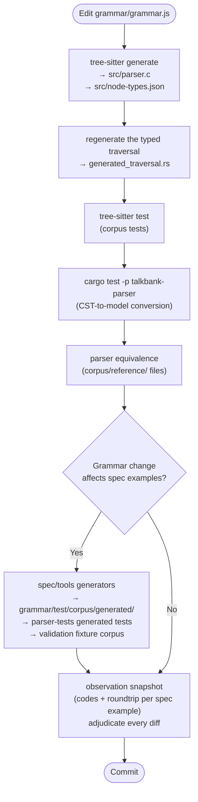

# Grammar Workflow

**Status:** Current
**Last modified:** 2026-09-24 00:21 EDT

The tree-sitter grammar at `grammar/grammar.js` is the formal definition of the CHAT format. Changes require careful validation.

The following diagram shows the complete regeneration pipeline. Every
step must pass before committing a grammar change.



## Step-by-Step Procedure

### 1. Edit the Grammar

Modify `grammar.js` in the `grammar/` directory. Key design principles:

- Explicit whitespace (no `extras`)
- Precedence annotations to resolve ambiguities
- Named rules for all semantically meaningful nodes

### 2. Generate the Parser

```bash
cd grammar
tree-sitter generate
```

This produces `src/parser.c` and `src/node-types.json`. Never edit these files by hand.

`tree-sitter test` does NOT detect a stale `parser.c`, so nothing downstream
can be trusted until this has run.

### 3. Regenerate the Typed Traversal

`crates/talkbank-parser/src/generated_traversal.rs` is the single generated
visitor the whole production parser dispatches through, produced from the
grammar's JSON by `tree-sitter-grammar-utils`. A grammar change that alters
node types or their positions makes it stale.

From the Chatter checkout, use its owning recipe:

```sh
TSGU_DIR=/path/to/tree-sitter-grammar-utils just traversal-gen
just conformance-gen
```

`TSGU_DIR` selects the generator checkout; the recipe defaults to the `tsgu`
directory in the user's home directory. It refuses a dirty generator checkout,
builds its `generate_typed_traversal` example, and reads edition and toolchain
from Chatter's own manifests rather than a copied command. The output header
records the generator's version and source identity.
The generator runs `rustfmt` on its output, so no separate `cargo fmt` step is
needed. Never hand-edit the file; if the output is wrong, fix the generator as
a general change and regenerate.

For a generator API change, first implement and verify the change in TSGU,
then commit that reviewed generator change locally so regeneration has clean
source identity. Regenerate Chatter, migrate the handwritten consumers of the
changed API, and exercise the affected spec/reference workflows. A local
generator commit is not publication. Grammar changes additionally require
`tree-sitter generate` before traversal regeneration; a generator-only change
does not require changing the grammar.

The generated module owns both CST shape and source-binding capabilities.
`ParsedSource` owns the tree/input association; its `bind_typed` transition
produces `SourceBound<T>` for supported generated wrappers. Consumers obtain
the node and its source from that binding, not separately supplied values.
Raw-node admission checks tree membership and canonical coordinates, because
independently editing a node copy can leave membership intact while shifting
its ranges. See [Parsing](../architecture/parsing.md) for the current migration
boundary and recovery policies. Binding proves source identity, not syntactic
completeness or semantic validity; do not remove recovery states merely because
the finite corpus has not reached them.

The generated source-bound extraction path is now available:
`bound.extract()` returns immutable `SourceChildren`, whose generated
`field_<minted_name>()` accessors retain source identity in `SourceField`.
Structural projections (`slot`, `iter`, `optional`, and `view`) preserve that
association through positional slots, sequence groups, choices, extras, and
recovery payloads. `SourceSlotView` retains every recovery state and preserves
uninhabited payloads; a leaf's `read()` admits its range without another root
membership search. Choice views preserve the already reconstructed variant.
`SourceSlice::extract_header()` retains association through supertype dispatch,
including Missing, Error, and Unexpected outcomes.

Document-root classification now retains associated carriers for both complete
documents and reconstructed ERROR roots. The latter uses
`SourceSlice::extract_full_document_from_error_recovery()`. Line and header
dispatch preserve association from those carriers; wrapped-header fragments
enter the same dispatcher with their already admitted source slice.
Participant lowering accepts a `SourceBound<ParticipantsHeaderNode>` and carries
association through its contents, repeated groups, speaker, name, and role.
Its text reads no longer accept a separately supplied source string.

Calling the free `extract_participant(bound.node())` still returns an ordinary
carrier. Other header families retain their transitional lowering APIs behind
the associated dispatcher; their checked decoding remains necessary until they
also migrate. Do not infer that every parser region is source-bound.
Do not replace it with raw kind-based child walks or repeated `bind_typed`
membership searches in an inner loop. Canonical descent avoids those searches,
but still reports invalid UTF-8 ranges from the runtime: source identity alone
does not prove every descendant's range is readable. Keep that refusal at the
admission boundary and retain all genuine recovery states. A bound root whose
children are immediately separated from their source is not a completed
consumer migration.

**The staleness guard proves less than it looks.**
`generated_traversal_is_current` recomputes the digests of `grammar.json` and
`node-types.json`, so it catches a forgotten regeneration after a GRAMMAR
change. Its inputs are those two files, so it cannot see the generator at all:
a module emitted by an older backend passes indefinitely, and the guard is not
wrong to pass it. It is answering a different question from the one its name
invites you to ask.

Which generator wrote the file is answered by the file, in its own header
comment. A bare semver does not identify a build, which is why the generator
stamps its source commit beside the version. When the question is which backend
produced the module, read that header rather than trusting a green suite.

After traversal regeneration, run `just conformance-gen`. It derives the test
inventory from the current traversal source. Its generator-only build omits
the default `conformance` feature so an outdated generated consumer cannot
prevent its own regeneration. Normal test builds keep that feature enabled;
the integration tests still require conformance support.

### 4. Run Grammar Tests

```bash
tree-sitter test
```

Every test under `grammar/test/corpus/` must pass. Tests live there
and are partially auto-generated from specs (primarily via
`just spec-gen`).

### 5. Run Parser Tests

```bash
cargo test -p talkbank-parser
```

This verifies the Rust parser wrapper handles all CST nodes correctly.

### 6. Run Parser Equivalence

```bash
cargo test -p talkbank-parser-re2c --test integration equivalence_reference_corpus
```

Every file in the reference corpus must parse correctly. Each `.cha` file is its own test, so failures are reported per file.

### 7. Regenerate Spec Tests

If the grammar change affects any spec examples:

```bash
just spec-gen

just spec-gen      # every artifact derived from spec/
just spec-check    # or: is the committed copy current?
```

This regenerates tree-sitter corpus tests and other generated outputs that
still depend on the spec pipeline.

Do this when the grammar change actually affects generated artifacts.

### 8. Adjudicate the observation snapshot

`just regen` rewrites `spec/observations/example-diagnostics.json`, which
records for every spec example the codes each stage emitted and whether the
parsed model serializes back byte-exact. Its currency test keeps it honest,
but the test is satisfied by any regenerated file, so the gate here is human:
read the diff. Every changed entry is either INTENDED (the behaviour change
was the point; commit the regenerated snapshot in the same change) or
UNINTENDED (a regression; fix the code, never the snapshot). A construct the
suite does not exercise is a missing spec example, and adding one is part of
the change, not a follow-up.

## The reference corpus is a regression signal, NOT a validity authority

`corpus/reference/` must stay green, but this page used to call it "the
ultimate arbiter of correctness" and tell you to revert immediately on a single
failure. That is wrong, and acting on it would entrench bad data.

The corpus is SYNTHESIZED. When a change makes it reject a file, adjudicate the
FILE against the real authorities (`spec/`, the grammar, and real corpus data)
and fix the data, or move it to `spec/errors/` if the construct is genuinely
invalid. Weakening the parser to keep a reference file green is the one
response that is always wrong. The roundtrip gate stays green either way.

## Common Patterns

### Adding a New Token

1. Define the token in `grammar.js`
2. Add handling in the Rust tier parser (match on the new node kind)
3. Add a spec construct example
4. Run the relevant generation and verification steps

For small, isolated syntax additions, the grammar workflow should stay local:

- one grammar change
- one grammar corpus example
- one full-file fixture if needed

### Changing a Rule

1. Modify the rule in `grammar.js`
2. `tree-sitter generate && tree-sitter test`
3. Update Rust parser if CST node structure changed
4. Update spec examples if the expected CST changed
5. Run the current local verification sweep from `contributing/dev-checks.md`
