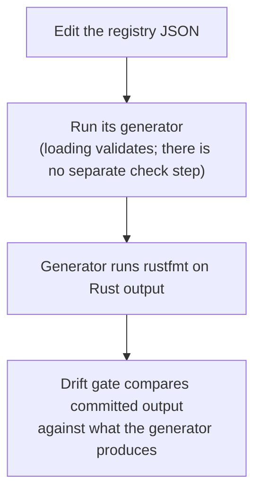

# Spec Workflow

**Status:** Current
**Last updated:** 2026-08-27 18:09 EDT

How to change `spec/` and leave the repository consistent. For what the fields
MEAN, read [Spec System](../architecture/spec-system.md) first; this page is
the procedure.

Every command here is written out. If a step here disagrees with what the
tools do, the tools are right and this page is a bug.

## Before and after any spec change

```bash
just spec-status      # what state the spec system is in, derived from the gates
```

Run it before you start, so you know what "unchanged" looks like, and again at
the end. A change that moves the "deferred" or "failing" counts in the
wrong direction is worth a second look.

## Adding a construct spec

A construct spec is a VALID fragment plus the tree it must parse to.

**1. Write the file** under the right `spec/constructs/` subdirectory
(`header/`, `main_tier/`, `tiers/`, `utterance/`, `word/`):

````markdown
# my_example

Description of what this example demonstrates.

## Input

```utterance
*CHI:	hello world .
```

## Expected CST

```cst
(utterance
  (main_tier
    ...))
```

## Metadata

- **Level**: utterance
- **Category**: main_tier
````

The fence label (`utterance` here) names a template in `spec/tools/templates/`
that wraps the fragment into a full CHAT file. If no template matches, create
one; the generator fails rather than guessing.

**2. Get the real CST** rather than writing one by hand:

```bash
cd grammar && tree-sitter parse <a file containing your input>
```

Copy the tree, dropping byte positions and field names.

**3. Regenerate and verify** (see "Regenerating" below).

## Adding an error spec

An error spec is INVALID CHAT plus the codes it must produce.

**1. Write the file** in `spec/errors/`, named `E###_<slug>.md`. Everything
declared goes in `+++` TOML frontmatter; the prose goes in the body.

````markdown
+++
code = 'E301'
name = 'Empty speaker code'

[[example]]
source = 'E3xx_main_tier_errors/E301_empty_speaker.cha'
level = 'utterance'
claim = 'violates'
chat = '''
@UTF8
@Begin
@Languages:	eng
@Participants:	CHI Target_Child
@ID:	eng|corpus|CHI|||||Target_Child|||
*:	hello .
@End
'''
+++

## Description

Empty speaker code.
````

A misspelled or unrecognised key is a LOAD ERROR, so you find out from
`just spec-check` rather than from a field that silently did nothing.

**Four things decide whether your spec asserts anything**, and each is easy to
get wrong. They are covered in full in
[Spec System](../architecture/spec-system.md); in short:

- **`claim` is the field that asserts, and it is REQUIRED.** `violates` (the
  spec's code must appear), `legal` (it must not), or `subsumed_by <code(s)>`
  (the targets appear and the spec's code does not). Extra emitted codes still
  pass; the exact per-stage sets are the snapshot's business.
- **There is no `layer` field.** Which stage catches a rule is observed, not
  declared: every example is a fixture whose runner checks both stages, and
  the per-stage record lives in the observation snapshot. (The field existed
  until R4, and deciding it wrongly produced tests that could never see their
  own code.)
- **`status` and `kind` are NOT yours to declare.** They are facts about the
  CODE, and they live in `spec/codes/error-codes.toml`, one entry per code
  (R1, 2026-08-26). A spec naming a code that file does not declare does not
  load, and `status = 'not_implemented'` THERE still defers every example of
  that code and `#[ignore]`s its generated tests. Writing either key in a spec
  file is a load error naming the key.
  (This bullet described `status` as a required spec field until R1, and
  before 2026-08-21 said omitting it "defaults to `implemented`". Both are
  gone: an invented answer to "is this rule live" is the kind of wrong value
  nothing notices, and a per-file copy of a per-code fact is the kind that
  eleven files could disagree about.)
- **`source`'s stem names the transcript**, which is what rules about the
  file's own name (E531) compare against.

**Write the failing case first.** A new error spec should fail before the rule
exists; that is what proves the fixture actually triggers it.

## Regenerating

One command, from anywhere in the checkout:

```bash
just spec-gen      # rewrite every generated artifact from the specs
just spec-check    # or ask whether the committed copies are current
```

It regenerates every artifact in the registry, in dependency order (the
observation snapshot first, since the tree-sitter corpus derives its
membership from it); the generated artifact
table included in the
[spec-system chapter](../architecture/spec-system.md) is the live list. There is nothing to choose and no path to type:
every destination is a constant in `spec/tools/src/artifacts.rs`, so a
generator cannot be aimed at the wrong tree.

`just spec-check` writes nothing and is exactly what the
`every_generated_artifact_is_current` gate runs, so a green check means a green
gate.

The published error-reference pages under `docs/errors/` are part of
`spec-gen` like every other artifact, and `spec-check` gates them.

Never hand-edit anything under a `generated/` directory. An artifact that owns
its directory wipes it wholesale and refuses to clear one lacking its
`.generated-output-dir` marker.

## Verifying

```bash
just spec-status                                  # the derived summary
cargo test --manifest-path spec/Cargo.toml --workspace   # every spec-side gate
just test                                         # the main workspace
```

If your change touched the grammar, follow the full
[Grammar Workflow](grammar-workflow.md) as well: a
`grammar.js` edit needs `tree-sitter generate` before any parser behaviour can
be trusted.

## Updating a registry

Two closed vocabularies live under `spec/`, each generating every site that
names it. Neither is edited anywhere but its registry.

```bash
just symbols-gen        # spec/symbols/symbol_registry.json
just form-markers-gen   # spec/form_markers/form_marker_registry.json
```



The generators format their own Rust output deliberately: otherwise `just fmt`
and the generator each rewrite the same bytes and the drift gate fails forever,
with both sides correct.

Each registry's README covers its authorities and the follow-ups its generator
cannot do:
[`spec/symbols/README.md`](https://github.com/TalkBank/chatter/blob/main/spec/symbols/README.md),
[`spec/form_markers/README.md`](https://github.com/TalkBank/chatter/blob/main/spec/form_markers/README.md).

## Common mistakes

- **Editing generated files.** Change the spec or the registry, then regenerate.
- **Wishing for an example that asserts nothing.** There is no such state:
  `claim` is required, and an example that cannot honestly say `violates` says
  `subsumed_by` (the worklist) or `legal` (the boundary).
- **Flipping `status` to `implemented` without regenerating.** The fixture
  manifest still carries the old status, so the runner keeps skipping what you
  just enabled. (A third mistake used to sit here, declaring a
  validation-layer code in a parser-layer spec; R4 deleted the `layer` field
  and with it the possibility.)
- **Regenerating reflexively.** Regeneration is for artifacts that genuinely
  changed, not a substitute for deciding what the change needs.
