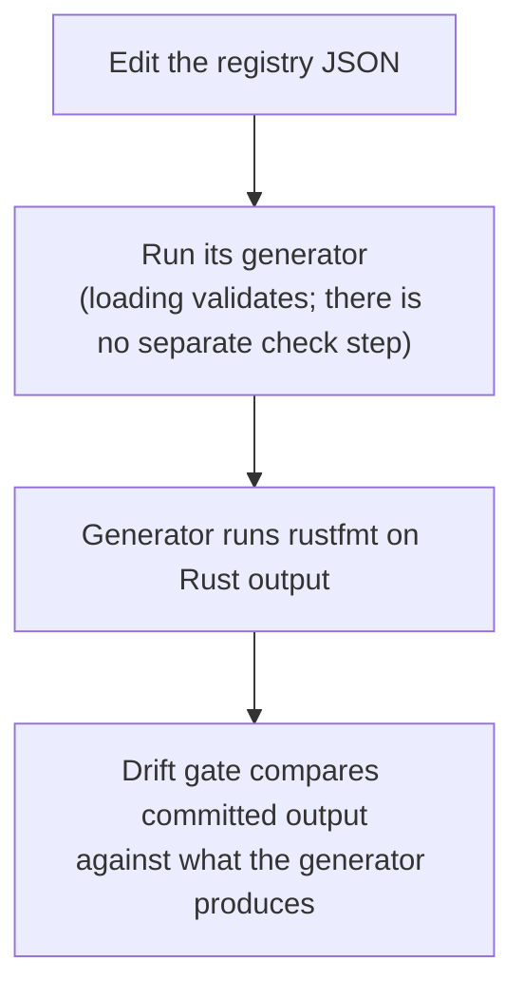

# Spec Workflow

**Status:** Current
**Last modified:** 2026-08-16 12:39 EDT

How to change `spec/` and leave the repository consistent. For what the fields
MEAN, read [Spec System](../architecture/spec-system.md) first; this page is
the procedure.

Every command here is written out. If a step here disagrees with what the
tools do, the tools are right and this page is a bug.

## Before and after any spec change

```bash
just spec-status      # what state the spec system is in, derived from the gates
```

Run it before you start, so you know what "unchanged" looks like, and again at
the end. A change that moves the "assert NOTHING" or "deferred" counts in the
wrong direction is worth a second look.

## Adding a construct spec

A construct spec is a VALID fragment plus the tree it must parse to.

**1. Write the file** under the right `spec/constructs/` subdirectory
(`header/`, `main_tier/`, `tiers/`, `utterance/`, `word/`):

````markdown
# my_example

Description of what this example demonstrates.

## Input

```utterance
*CHI:	hello world .
```

## Expected CST

```cst
(utterance
  (main_tier
    ...))
```

## Metadata

- **Level**: utterance
- **Category**: main_tier
````

The fence label (`utterance` here) names a template in `spec/tools/templates/`
that wraps the fragment into a full CHAT file. If no template matches, create
one; the generator fails rather than guessing.

**2. Get the real CST** rather than writing one by hand:

```bash
cd grammar && tree-sitter parse <a file containing your input>
```

Copy the tree, dropping byte positions and field names.

**3. Regenerate and verify** (see "Regenerating" below).

## Adding an error spec

An error spec is INVALID CHAT plus the codes it must produce.

**1. Write the file** in `spec/errors/`, named `E###_<slug>.md`:

````markdown
# E301: Empty speaker code

## Description

Empty speaker code.

## Metadata

- **Error Code**: E301
- **Category**: Main tier validation
- **Level**: utterance
- **Layer**: parser
- **Kind**: Invalidity
- **Status**: implemented

## Example 1

**Source**: `E3xx_main_tier_errors/E301_empty_speaker.cha`
**Trigger**: Main tier with * but no speaker code
**Expected Error Codes**: E301

```chat
@UTF8
@Begin
@Languages:	eng
@Participants:	CHI Target_Child
@ID:	eng|corpus|CHI|||||Target_Child|||
*:	hello .
@End
```
````

**Four things decide whether your spec asserts anything**, and each is easy to
get wrong. They are covered in full in
[Spec System](../architecture/spec-system.md); in short:

- **`Expected Error Codes` is the only field that asserts.** Omit it and the
  example can never fail. It is a SUBSET check, so extra emitted codes pass.
- **`Layer` decides what the generated test can see.** A `parser`-layer test
  sees parse diagnostics only, so a validation-layer code declared there can
  never be observed.
- **`Status: not_implemented` DEFERS the example** and `#[ignore]`s its
  generated tests. Omitting `Status` entirely defaults to `implemented`.
- **`Source`'s stem names the transcript**, which is what rules about the
  file's own name (E531) compare against.

**Write the failing case first.** A new error spec should fail before the rule
exists; that is what proves the fixture actually triggers it.

## Regenerating

One command, from anywhere in the checkout:

```bash
just spec-gen      # rewrite every generated artifact from the specs
just spec-check    # or ask whether the committed copies are current
```

It regenerates all four: the tree-sitter corpus tests, the Rust test bodies,
the validation fixture corpus and its `manifest.json`, and the `DiagnosticKind`
registry in `talkbank-model`. There is nothing to choose and no path to type:
every destination is a constant in `spec/tools/src/artifacts.rs`, so a
generator cannot be aimed at the wrong tree.

`just spec-check` writes nothing and is exactly what the
`every_generated_artifact_is_current` gate runs, so a green check means a green
gate.

The published error-reference pages under `docs/errors/` are part of
`spec-gen` like every other artifact, and `spec-check` gates them.

Never hand-edit anything under a `generated/` directory. An artifact that owns
its directory wipes it wholesale and refuses to clear one lacking its
`.generated-output-dir` marker.

## Verifying

```bash
just spec-status                                  # the derived summary
cargo test --manifest-path spec/Cargo.toml --workspace   # every spec-side gate
just test                                         # the main workspace
```

If your change touched the grammar, follow the full
[Grammar Workflow](grammar-workflow.md) as well: a
`grammar.js` edit needs `tree-sitter generate` before any parser behaviour can
be trusted.

## Updating a registry

Two closed vocabularies live under `spec/`, each generating every site that
names it. Neither is edited anywhere but its registry.

```bash
just symbols-gen        # spec/symbols/symbol_registry.json
just form-markers-gen   # spec/form_markers/form_marker_registry.json
```



The generators format their own Rust output deliberately: otherwise `just fmt`
and the generator each rewrite the same bytes and the drift gate fails forever,
with both sides correct.

Each registry's README covers its authorities and the follow-ups its generator
cannot do:
[`spec/symbols/README.md`](https://github.com/TalkBank/chatter/blob/main/spec/symbols/README.md),
[`spec/form_markers/README.md`](https://github.com/TalkBank/chatter/blob/main/spec/form_markers/README.md).

## Common mistakes

- **Editing generated files.** Change the spec or the registry, then regenerate.
- **Declaring no `Expected Error Codes`.** The example is then parsed and
  nothing more. `just spec-status` counts these.
- **Declaring a validation-layer code in a parser-layer spec.** The generated
  test cannot see it.
- **Flipping `Status` to `implemented` without regenerating.** The generated
  tests stay `#[ignore]`d, so nothing you just enabled actually runs.
- **Regenerating reflexively.** Regeneration is for artifacts that genuinely
  changed, not a substitute for deciding what the change needs.
