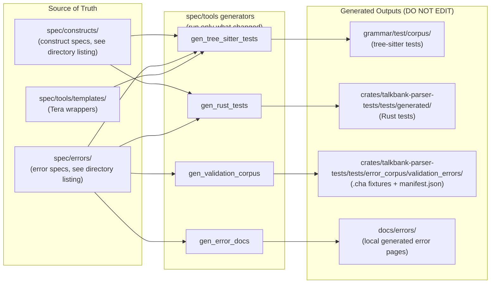
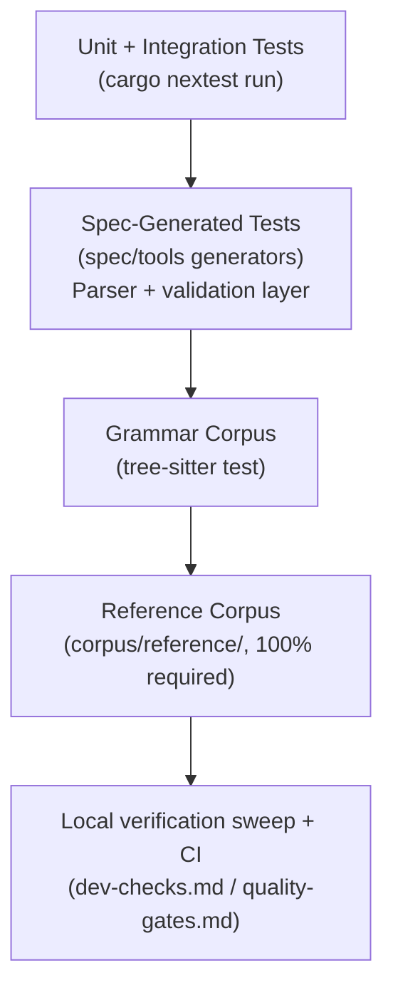

# Testing

**Status:** Current
**Last modified:** 2026-06-15 15:00 EDT

## Test Generation Pipeline

Specs are the source of truth. All grammar corpus tests, Rust parser tests,
and error docs are **generated** from specs. This repo does **not** currently
have the old monorepo-wide `make test-gen` wrapper; run the relevant
`spec/tools` binaries directly instead, and never hand-edit generated files.



To add a grammar test or error test, add a spec file in `spec/constructs/`
or `spec/errors/`, then run the current generator command(s) from
[Spec Workflow](spec-workflow.md). Use only the binaries that match the
artifacts you intentionally changed.

## Test Strategy

Testing is organized in layers, from fastest to most comprehensive.



### Never-Regress Gates

Four gates form the regression contract for the CHAT core. They guard the
behavior a successor cannot easily re-derive: parser correctness, lossless
serialization, full-corpus coverage, and error detection. Any commit
touching the relevant surface (grammar, parser, model, validation,
serialization, or alignment) MUST run the matching gate(s) and keep them
green. A red gate is a bug until proven otherwise (see the repo `CLAUDE.md`,
"Test Failures Are Bugs Until Proven Otherwise"), never a test expectation
to quietly update.

| Gate | Command | What it protects |
|------|---------|------------------|
| Parser equivalence | `cargo nextest run -p talkbank-parser-tests -E 'test(parser_equivalence)'` | The re2c oracle parser and the tree-sitter parser agree on every reference file. A divergence means one parser is wrong, or a construct spec is missing. |
| Roundtrip idempotency | `cargo nextest run -p talkbank-parser-tests --test roundtrip_reference_corpus` | parse, serialize, re-parse yields a semantically identical AST (`SemanticEq`) for every reference file. Catches any model or `WriteChat` change that silently loses information. |
| Reference corpus 100% | (the same `roundtrip_reference_corpus` test) | Every file under `corpus/reference/` parses and roundtrips with zero failures. The reference corpus is the ultimate arbiter of full-file correctness; it must be 100%, never "mostly". |
| Error-code spec tests | `cargo nextest run -p talkbank-parser-tests --test generated_tests --test validation_error_corpus --test error_coverage` | Every error spec under `spec/errors/` still fires its expected code: parser-layer errors reject as designed, validation-layer errors are detected, and every `ErrorCode` has a backing spec. These tests are generated from specs, never hand-written. |

Two of the four share one test: `roundtrip_reference_corpus` enforces both
roundtrip idempotency and the reference-corpus 100% guarantee, because it
iterates every reference file (the coverage guarantee) and checks roundtrip
semantic equality on each (the idempotency guarantee).

All four also run as part of the full workspace sweep
(`cargo nextest run --workspace`), so a complete local run before committing
covers them. The per-gate commands above are the fast, targeted way to
re-check one surface during the inner development loop. The sections below
describe each layer in more detail.

### Unit Tests (nextest)

```bash
cargo nextest run
```

Runs all unit and integration tests across all crates (~2300+ tests). These test individual functions, serialization roundtrips, and model invariants.

`cargo nextest` does not run doctests. Keep `cargo test --doc` as a separate
verification step when you change public API examples or doc comments.

### Parser Equivalence

```bash
cargo nextest run -p talkbank-parser-tests -E 'test(parser_equivalence)'
```

Runs the parser on each file in the `corpus/reference/` tree and validates
results. Each `.cha` file is its own test, enabling per-file parallelism and
failure isolation via nextest. The exact file count is whatever
`find corpus/reference -name '*.cha' -type f | wc -l` reports, do not
hard-code it here.

### Spec-Generated Tests

Part of `talkbank-parser-tests`. These are generated from specs via the
current `spec/tools` binaries and currently test:
- Construct specs: input parses correctly
- Parser-layer error specs: input fails to parse with expected error code
- Validation-layer error specs: input parses but validation reports expected error code

Common entrypoints from the repository root:

```bash
cargo run --manifest-path spec/tools/Cargo.toml --bin gen_tree_sitter_tests -- \
  --output-dir grammar/test/corpus \
  --template-dir spec/tools/templates

cargo run --manifest-path spec/tools/Cargo.toml --bin gen_rust_tests -- \
  --output-dir crates/talkbank-parser-tests/tests/generated

cargo run --manifest-path spec/tools/Cargo.toml --bin gen_validation_corpus -- \
  --corpus-dir crates/talkbank-parser-tests/tests/error_corpus/validation_errors
```

### Tree-Sitter Grammar Tests

```bash
cd grammar && tree-sitter test
```

Runs the tree-sitter grammar corpus tests. This is the right gate for
grammar structure changes.

### Error Corpus Tests

Error fixtures live in `spec/errors/`. Parser-layer error examples become Rust
tests via `gen_rust_tests`; validation-layer examples become a `.cha` fixture
corpus + `manifest.json` via `gen_validation_corpus`, under
`crates/talkbank-parser-tests/tests/error_corpus/validation_errors/`, which the
data-driven runner `validation_error_corpus.rs` consumes. Add a new error spec
under `spec/errors/E###_*.md` and regenerate.

### Tree-Sitter Tests

```bash
cd grammar
tree-sitter test
```

Verifies the grammar produces correct CSTs for known inputs. The
actual test count comes from `ls grammar/test/corpus/*.txt | wc -l`;
do not hard-code it.

## Reference Corpus

The reference corpus at `corpus/reference/` is organized into subdirs
(`annotation/`, `audio/`, `ca/`, `content/`, `core/`, `edge-cases/`,
`languages/`, `tiers/`, `word-features/`). The parser must handle
every file at 100%, the exact file count is whatever
`find corpus/reference -name '*.cha' -type f | wc -l` reports.

This corpus is the ultimate arbiter of correctness for full-file parsing.

## Local Verification Contract

There is no repo-local `make verify` wrapper in this checkout today.
Use the explicit command set from
[Developer Verification Checks](dev-checks.md) and
[Testing and Quality Gates](quality-gates.md) instead.

Core local sweep:

```bash
cargo fmt --all -- --check
cargo build --workspace --all-targets --locked
cargo nextest run --workspace
cargo test --doc
```

Then add the surface-specific checks that match your change:

- grammar changes: `cd grammar && tree-sitter generate && tree-sitter test`
- spec-tool changes: `cargo build --manifest-path spec/tools/Cargo.toml` and
  `cargo build --manifest-path spec/runtime-tools/Cargo.toml`
- parser / model / alignment / serialization changes:
  `cargo nextest run -p talkbank-parser-tests -E 'test(parser_equivalence)'`
  and
  `cargo nextest run -p talkbank-parser-tests --test roundtrip_reference_corpus`

## Running Specific Tests

```bash
# Single test by name
cargo nextest run test_name

# Tests in a specific crate
cargo nextest run -p talkbank-model

# Tests matching a pattern
cargo nextest run -- mor

# With output
cargo nextest run --no-capture
```

## What to Run When

| What you changed | Run |
|-----------------|-----|
| Grammar (`grammar.js`) | `cd grammar && tree-sitter generate && tree-sitter test`, then the relevant parser/spec-generator commands |
| Parser (CST-to-model) | `cargo nextest run -p talkbank-parser` |
| Model (types, validation, alignment) | `cargo nextest run -p talkbank-model` |
| CLI (chatter args, dispatch) | `cargo nextest run -p chatter` |
| LSP | `cargo nextest run -p talkbank-lsp` |
| Spec files | Run the relevant `gen_*` commands from `spec/tools`, then the local verification sweep from `dev-checks.md` |
| Pre-merge (any change) | The local verification sweep from `dev-checks.md` plus surface-specific additions |
| Pre-push (quick) | Re-run the narrowest commands that cover the surfaces you touched; there is no repo-local `make ci-local` wrapper |

## Mutation Testing

Use `cargo-mutants` to find code that can be changed without any test failing, the true coverage gaps.

```bash
# Install (once)
cargo install cargo-mutants

# Run against a specific crate (--jobs 1 to avoid OOM on 64 GB machines)
cargo mutants -p talkbank-parser --timeout 120 --jobs 1

# Review results
cat mutants.out/missed.txt    # Mutations no test caught
cat mutants.out/caught.txt    # Mutations properly detected
```

Mutation testing is not part of CI but should be run periodically (after major changes) to find untested logic paths. Results guide where to add new tests.

Configuration: `mutants.toml` at the repo root excludes trivial functions.

## Adding Tests

- **Model tests**: add to the relevant crate's `tests/` directory or `#[cfg(test)]` module
- **Parser tests**: if the change is about grammar shape or validation contracts,
  add or update specs and regenerate with the relevant `spec/tools` generator binaries
- **Error tests**: add a new spec under `spec/errors/E###_*.md` and run
  `gen_rust_tests` (parser-layer) or `gen_validation_corpus` (validation-layer);
  the generated Rust tests / fixture corpus + manifest are produced automatically
