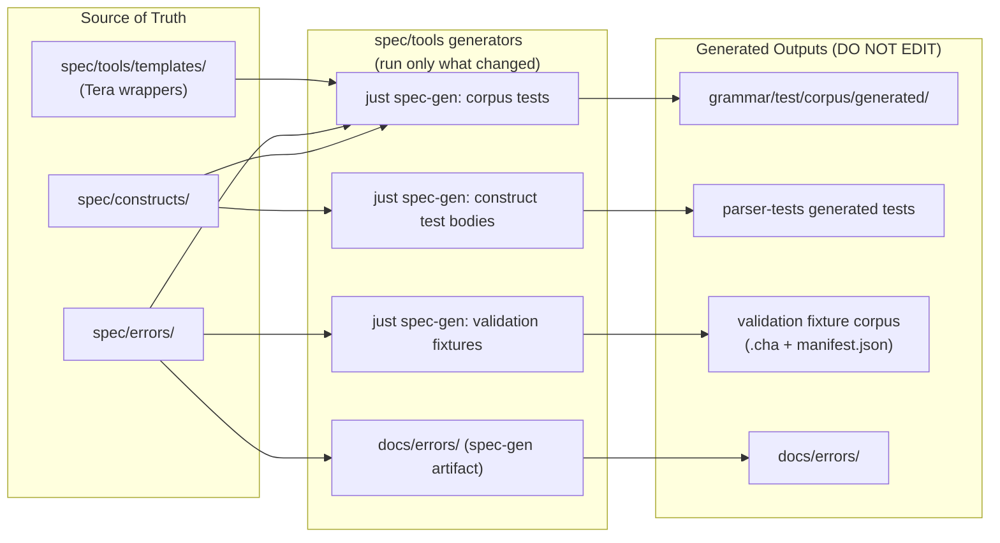
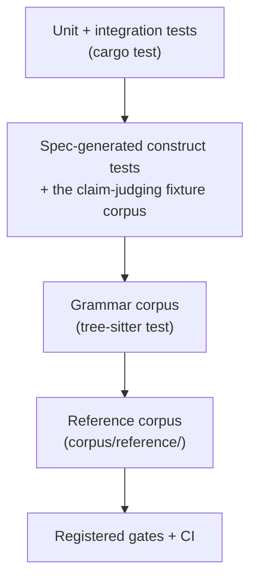

# Testing

**Status:** Current
**Last modified:** 2026-09-09 08:49 EDT

What the test layers are and which one to reach for. The commands to run
routinely, and what each costs, are in
[Developer Verification Checks](dev-checks.md); how they relate to CI is in
[Testing and Quality Gates](quality-gates.md).

## Build artifact hygiene and runner choice

Both Cargo workspaces set `split-debuginfo = "off"` for development and test
profiles. Line tables stay in the linked artifacts, so diagnostics and stack
traces retain source locations without macOS's default `unpacked` layout
leaving one `.rcgu.o` file per codegen unit in `target/debug/deps`.

The setting is based on a 2026-09-04 failure analysis, not a cosmetic
preference. The root workspace had 55,141 entries in `target/debug/deps`; the
generator-heavy specification workspace had 842,704 entries, occupied 40 GB,
and took 29.3 seconds merely to enumerate with `os.scandir`. The exact spec
test executable itself started, listed its tests and exited in 0.00 seconds,
while a warm `cargo test --manifest-path spec/Cargo.toml --workspace --quiet`
took 46.7 seconds. The file layout, rather than the test harness executable,
was the first bottleneck to remove.

To reproduce the diagnosis without running tests:

```bash
python3 - <<'PY'
import os
import time

for path in ("target/debug/deps", "spec/target/debug/deps"):
    started = time.perf_counter()
    entries = sum(1 for _ in os.scandir(path))
    elapsed = time.perf_counter() - started
    print(path, entries, f"{elapsed:.3f}s")
PY
du -sh target spec/target
```

After changing this setting, remove the old unpacked artifacts once with
`cargo clean` and `cargo clean --manifest-path spec/Cargo.toml`. Both commands
delete derived build output only. A warm run should then be measured with
`/usr/bin/time -p just test-spec` rather than inferred from the per-test times
printed by libtest.

The measured result after that cleanup was 586 entries, no `.rcgu.o` files and
1.3 GB in `spec/target`. The full spec suite took 20.14 seconds from an empty
target and 1.64 seconds warm. Its three generator commands and six runtime
commands are declared with `test = false`, because their behavior is already
covered by library and integration tests and their binary sources contain no
tests. This avoids compiling and launching nine empty harnesses.

The project continues to use plain `cargo test`. Whole-workspace nextest was
removed after its eager test enumeration launched dozens of new binaries at
once and repeatedly wedged macOS `syspolicyd`; the cache migration race that
had required process isolation was fixed at its source. A future runner change
needs measurements on a clean and a warm target and must demonstrate that it
does not recreate that first-execution burst. Full Disk Access is unrelated to
repository build artifacts, and Developer Tools permission is not a remedy for
an oversized Cargo target directory.

The 2026-09-05 follow-up tested nextest 0.9.143 on the generators library's
51 tests in one binary, with four workers. Two alternating warm runs took
0.437/0.385 seconds with Cargo and 0.658/0.614 seconds with nextest, including
Cargo startup. Both runners passed; neither rebuilt the tests. This small
suite gives no reason to change the default runner. It does not establish
performance for the full workspace or for newly compiled binaries. The trial
used a standalone downloaded executable and changed no repository runner
configuration. Reproduce the comparison by alternating:

```bash
/usr/bin/time -p cargo test --manifest-path spec/Cargo.toml -p generators --lib --locked
/usr/bin/time -p cargo nextest run --manifest-path spec/Cargo.toml -p generators --lib --locked --test-threads 4 --status-level fail --final-status-level fail
```

The [nextest macOS guide](https://www.nexte.st/docs/installation/macos/)
separately describes XProtect startup overhead and Developer Tools permission.
That mechanism matters when launching even trivial tests is slow; it does not
explain time spent enumerating hundreds of thousands of build artifacts.

## Exercise the owned behavior

Property tests must call the production operation whose contract they claim
to verify. The retired `cache_key_properties` module instead copied a
`DefaultHasher` algorithm for a `get_cache_key_with_suffix` function that no
longer exists. Its two tests could pass with the real cache completely broken;
one also treated absence of sampled hash collisions as a correctness property.
Removing those tests deletes redundant work without changing cache coverage.
The `cache_tests` integration module still exercises the real `CachePool`
with temporary files, including independent paths, parser identity, alignment
mode, overwrites, and clearing. This removes two property cases, not a test
binary: they already shared the transform integration harness.

## Regeneration must preserve unchanged outputs

The generators stage command output, publish only changed bytes and prune only
obsolete files in exclusively owned directories. An unchanged `just regen`
must leave generated Rust, C and fixture modification times alone, so Cargo
does not rebuild merely because a generator ran. On 2026-09-05, a no-op
regeneration preserved bytes and nanosecond modification times of all 3,815
tracked files, took 8.177 seconds and compiled nothing. The following
`just test` took 10.625 seconds with no compilation: 2,985 passed, 61 ignored,
across 34 test harnesses. These are warm measurements, not clean-build timings.

To reproduce the preservation check, snapshot tracked files before and after
`just regen` without editing or staging files between the snapshots:

```bash
python3 - <<'PY'
import hashlib
from pathlib import Path
import subprocess

paths = [Path(p) for p in subprocess.check_output(
    ["git", "ls-files", "-z"]).decode().split("\0") if p and Path(p).is_file()]
def snapshot():
    return {p: (hashlib.sha256(p.read_bytes()).digest(), p.stat().st_mtime_ns)
            for p in paths}
before = snapshot()
subprocess.run(["just", "regen"], check=True)
after = snapshot()
changed = [str(p) for p in paths if before[p] != after[p]]
assert not changed, changed
print(f"Preserved contents and modification times of {len(paths)} files")
PY
/usr/bin/time -p just test
```

## One integration binary per crate

Each crate has a SINGLE integration test binary (`tests/integration/`), so
tests are selected by NAME FILTER, never by target name:

```bash
cargo test -p talkbank-parser-tests --tests <filter>     # correct
cargo test -p talkbank-parser-tests --test  <name>       # fails: no such target
```

`--test <name>` names a compilation target, and the per-file targets it used to
name no longer exist. It does not fall back to filtering: it errors with
`available test targets: integration, parser_suite`. Every command on this page
was checked by running it.

## Test generation pipeline

Specs are the source of truth. Grammar corpus tests, Rust parser tests, the
validation fixture corpus and the local error pages are all **generated** from
specs and are never hand-edited.


```mermaid
flowchart LR
    subgraph sources["Source of Truth"]
        constructs["spec/constructs/"]
        errors["spec/errors/"]
        templates["spec/tools/templates/\n(Tera wrappers)"]
    end

    subgraph generators["spec/tools generators\n(run only what changed)"]
        gen_ts["just spec-gen: corpus tests"]
        gen_rust["just spec-gen: construct test bodies"]
        gen_validation["just spec-gen: validation fixtures"]
        gen_docs["docs/errors/ (spec-gen artifact)"]
    end

    subgraph outputs["Generated Outputs (DO NOT EDIT)"]
        ts_tests["grammar/test/corpus/generated/"]
        rust_tests["parser-tests generated tests"]
        val_corpus["validation fixture corpus\n(.cha + manifest.json)"]
        error_docs["docs/errors/"]
    end

    constructs & errors --> gen_ts
    templates --> gen_ts
    constructs --> gen_rust
    errors --> gen_validation
    errors --> gen_docs

    gen_ts --> ts_tests
    gen_rust --> rust_tests
    gen_validation --> val_corpus
    gen_docs --> error_docs
```

To add a grammar or error test, add a spec under `spec/constructs/` or
`spec/errors/` and regenerate. [Spec Workflow](spec-workflow.md) owns those
commands and writes each one out; they are not repeated here.

## Never-regress gates

These guard behaviour a successor cannot easily re-derive. Any commit touching
the grammar, parser, model, validation, serialization or alignment runs the
matching gates and keeps them green.

**A red gate is a bug until proven otherwise**, never a test expectation to
quietly update. That cuts both ways: a diagnostic that looks BETTER after a
change earns the same scrutiny as one that looks worse.

| Gate | Command | What it protects |
|---|---|---|
| Parser parity oracle | `cargo test -p talkbank-parser-re2c --test integration equivalence_reference_corpus` | The re2c oracle and the tree-sitter parser agree on every reference file, compared with `SemanticEq`. A divergence means one parser is wrong, or a construct spec is missing. |
| Reference corpus parses | `cargo test -p talkbank-parser-tests --tests reference_corpus_parses` | Every reference file parses cleanly with the tree-sitter parser. Compares nothing; this row claimed to be the parity oracle until 2026-08-26, and that crate cannot be one, since it does not depend on the re2c parser. |
| Roundtrip idempotency, and reference coverage | `cargo test -p talkbank-parser-tests --tests roundtrip_reference_corpus` | parse, serialize, re-parse yields a semantically identical AST (`SemanticEq`) for EVERY reference file. One test carries both guarantees: it iterates the whole corpus (coverage) and checks semantic equality on each (idempotency). |
| Generated spec tests | `cargo test -p talkbank-parser-tests --tests generated_tests` | Every construct spec still parses cleanly. (Error specs no longer feed this: R4 deleted the string-based error tests as strictly weaker than the fixture corpus plus the observation snapshot.) |
| Validation error corpus | `cargo test -p talkbank-parser-tests --tests validation_error_corpus` | Every ERROR-spec example (both stages, since R4) still satisfies its CLAIM against its generated `.cha` fixture, absences included. |
| The gate registry | `cargo test -p talkbank-parser-tests --tests gates` | Runs every gate registered in `gate::ALL`. Ask the registry what that is rather than a list here: `cargo run -p talkbank-parser-tests --bin audit_gate_probes` names each gate, runs every probe against it, and prints the rules no probe reaches. This row used to enumerate five gates: it named one that is not registered at all, and omitted five that are. |

File and test counts deliberately appear nowhere on this page. They change
weekly; ask the tree (`rg --files -g '*.cha' corpus/reference | wc -l`) rather
than trusting a number in prose.

## The gate registry

A repository-wide gate computes findings and must FAIL when there are any.
Written freehand that is two steps, and the second step kept going missing: a
check inside `main()` that CI never invoked, a `#[test]` that printed its
findings and asserted nothing, a `--check-only` mode that reported "Found N
invalid words" and returned `Ok(())`, a coverage percentage compared to
nothing. Every one of those type-checks, because `()` and `Ok(())` are
perfectly good return types for "I printed something".

So a gate now implements the `Gate` trait in
`crates/talkbank-parser-tests/src/gate.rs`, whose only output is a verdict:
there is no method that yields findings without one, so "compute the list and
forget to act on it" is not expressible. Registration in `ALL` is the whole
mechanism, and a second gate checks the registry against the `impl Gate for`
declarations in the sources, in both directions, so a gate that is written and
not listed is a failure rather than a silence.

**Two checks remain unconverted** and are named in that module so it does not
read as finished: `verify_error_coverage.rs` still prints a coverage percentage
and compares it to nothing, and `validate_golden_words.rs` keeps a path whose
only caller is its own `main`. A `[[bin]]` in that crate sets `test = false`,
which is target selection, so such a binary is excluded from `--tests` as well
as never being run by CI. If you are citing a check as a gate, run it, then
break it on purpose and watch it fail, before believing the citation.

### The ratchets among them, and how you lower one

Three gates hold a baseline that may only shrink: `fabricated_ast` (a per-crate
`CEILING` on `new_unchecked` and `Span::DUMMY`), `error_code_demonstration` (an
`UNDEMONSTRATED` list of codes with no example), and `content_catch_alls` (an
`UNPROTECTED` list). Each baseline is a `const` in its own module, so lowering
one is an edit in the commit that earned it, reviewed like any other line.
There is no `--write`: the previous Python ratchets had one, and what replaces
it is that **each gate names exactly what to edit**. The two list ratchets print
the entries that are now accounted for and must go; `fabricated_ast`, whose
baseline holds numbers, prints its replacement row verbatim, so banking a drop
is a paste rather than a retyped number. Retyping is what went wrong three
separate times on the meta-repo baseline this pattern came from.

They need a Rust build, which is the real cost of the move out of `scripts/`:

```bash
cargo test -p talkbank-parser-tests --tests gates   # every gate, verdicts only
cargo run  -p talkbank-parser-tests --bin audit_gate_probes   # + can each fail?
```

## The layers


```mermaid
flowchart TD
    unit["Unit + integration tests\n(cargo test)"]
    specgen["Spec-generated construct tests\n+ the claim-judging fixture corpus"]
    grammar["Grammar corpus\n(tree-sitter test)"]
    ref["Reference corpus\n(corpus/reference/)"]
    gates["Registered gates + CI"]

    unit --> specgen --> grammar --> ref --> gates
```

**Unit and integration.** `just test` (`cargo test --workspace --tests`).
Doctests are separate and are NOT run by `cargo test`; run
`cargo test --doc --workspace` when you change public API examples.

**Grammar corpus.** `cd grammar && tree-sitter test`, the right gate for
grammar structure changes. It does NOT detect a stale `parser.c`; see
[Grammar Workflow](grammar-workflow.md).

**Reference corpus.** `corpus/reference/`, organised by surface
(`annotation/`, `audio/`, `ca/`, `content/`, `core/`, `edge-cases/`,
`languages/`, `tiers/`, `word-features/`). It must stay at 100%, but it is a
SYNTHESIZED regression signal, not a validity authority. When a change rejects
a reference file, adjudicate the FILE against `spec/`, the grammar and real
corpus data, and fix the data or move it to `spec/errors/`. Weakening the
parser to keep a reference file green is the one response that is always wrong.
This page called the corpus "the ultimate arbiter of correctness" twice, which
is exactly the reasoning that would entrench a bad fixture.

## Running specific tests

```bash
cargo test -p talkbank-model                      # one crate
cargo test -p talkbank-parser-tests --tests mor   # by name filter
cargo test -p talkbank-model -- --nocapture       # show stdout from passing tests
```

`--nocapture` goes after `--`; it is an argument to the test harness, not to
cargo. This page used to give `cargo test --no-capture`, which is not a flag
either program accepts.

## What to run when

| What you changed | Run |
|---|---|
| Grammar (`grammar.js`) | the whole [Grammar Workflow](grammar-workflow.md), including the typed-traversal regeneration |
| Parser (CST to model) | `cargo test -p talkbank-parser`, plus parser equivalence and roundtrip |
| Model (types, validation, alignment) | `cargo test -p talkbank-model`, plus roundtrip |
| CLI | `cargo test -p chatter` |
| LSP | `cargo test -p talkbank-lsp` |
| Spec files | regenerate per [Spec Workflow](spec-workflow.md), then `just test-spec` and the gate registry |
| Either registry (symbols, form markers) | `just test-spec`, which includes the drift gates |
| Anything, before pushing | `just gate`, or `just push` which runs it |

## Mutation testing

`cargo-mutants` finds code that can be changed without any test failing, which
is the real coverage question. It is not part of CI; run it periodically after
significant changes.

```bash
cargo install cargo-mutants
cargo mutants -p talkbank-model --file 'src/validation/**' --timeout 180
cat mutants.out/missed.txt    # mutations no test caught
```

**Scope it, and read the result as a work list rather than a score.** The
validation tree is the highest-value target: `chatter validate` is the
authority on CHAT validity, so a mutant that survives there is a rule that can
be silently disabled. Running `-p talkbank-parser` unscoped, which this page
used to recommend, spends most of its budget on `src/generated_traversal.rs`,
over half that crate and generated, where a survivor indicts the generator
rather than this repository. To see the size of a target before committing an
evening to it, use `cargo mutants --list --file '<glob>'`.

Each job runs a full workspace build peaking around 8 GB, and the failure mode
is an out-of-memory kill during overlapping linker phases rather than steady
state, so measure peak memory at a small `--jobs` before raising it. A fixed
`--jobs 1` was this page's advice until 2026-09-07; it was written for one
machine and is not a property of the tool.

Configuration is `mutants.toml` at the repo root. It genuinely is now: until
2026-09-07 that file lived in the batchalign3 workspace, left behind when the
CHAT core was extracted from it, so this paragraph named a file this repo did
not have while the file itself excluded functions its own repo no longer
defined.

## Adding tests, and when not to

Before writing a test, ask whether a TYPE could make the bad value
unrepresentable instead. A test guarding an invariant is a standing admission
that nothing enforces it; changing the type deletes the test, covers callers
the test never enumerated, and fails at the point of the mistake rather than in
CI. Reducing the test count this way is an explicit pre-1.0 goal.

What legitimately survives that question: wire formats, roundtrips between a
formatter and a parser that are two separate functions, measurements, policy
choices with real alternatives, and behaviour a signature cannot describe. A
surviving test says which of those it is, in its own docstring.

When a test is the right answer:

- **Model behaviour**: the crate's `tests/` directory or a `#[cfg(test)]`
  module.
- **Grammar shape or validation contract**: add or update a SPEC and
  regenerate. A parser bug fixed without a spec will regress.
- **A repository-wide invariant**: implement `Gate` and register it, rather
  than writing a binary that prints findings.
