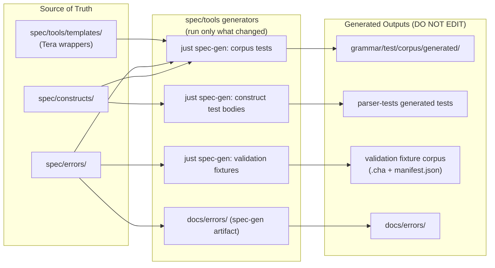
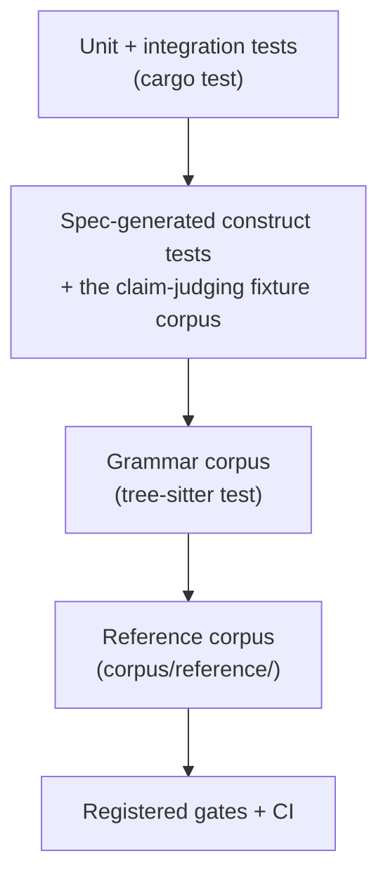

# Testing

**Status:** Current
**Last modified:** 2026-09-24 00:10 EDT

What the test layers are and which one to reach for. The commands to run
routinely, and what each costs, are in
[Developer Verification Checks](dev-checks.md); how they relate to CI is in
[Testing and Quality Gates](quality-gates.md).

## Build artifact hygiene and runner choice

The E344 paired specimens change only an intervening speaker code. They pin
the nearest-same-speaker boundary under opt-in strict quotation validation,
while a policy-boundary contract proves default validation emits no E344 and
the strict diagnostic points to the attribution turn. CHECK accepts both
specimens; its acceptance is recorded separately from Chatter's optional rule.
The same policy/location contract covers first-turn self-completion (E351) and
consumed interruption reuse (E352). Paired E352 specimens verify that a turn
can consume an earlier interruption and then issue a new one with its own
terminator, while an extra completion cannot reuse either consumed interruption.
The validator owns one per-speaker history: map occupancy establishes a prior
turn, and non-copyable interruption tokens are issued only from typed `+/.`
terminators. There is no second last-seen map or unused utterance index stack.
E354 adds an actual trailing-off control and ordinary/CA terminator deletions.
The contract confirms typed `None` for both deletions and checks strict-policy
diagnostics on the following completion. CA waives E305, not the requirement
for explicit trailing-off evidence under E354. These specimens reach the
missing-terminator path naturally; that path must not be removed as impossible.
The E545 empty birth-date control similarly reaches a real allowed-empty
boundary. Its contract requires a retained typed `Header::Birth` with empty
date text and no diagnostics, rather than inferring success from a missing
error code alone. CHECK accepts the control; no fabricated date or dropped
header is allowed to stand in for unknown information.
CA delimiter traversal uses the shared `ContentStructure` walk and typed
`WordRef::words` ordering rather than separate main-tier/bracketed variant
lists. Existing delimiter policy is unchanged, including replacement targets.
E230's paired replacement specimens retain this policy despite CHECK's opposite
results. Source analysis traces CHECK's duplicate scan of replacement text:
once inside its bracket token and once after re-entry into the target words.
Parity adjudication combines exact runtime witnesses with source-path analysis.
Assess both whether CHECK's apparent intent is logically sound and whether its
implementation fulfills that intent. CHECK is evidence, not a policy oracle:
preserve useful validity requirements while improving flawed intent or execution.
Output comparison alone cannot establish intent. Underline traversal remains
separate because it requires leaf marker payloads that this view does not carry.
Word validation also uses one structural dispatcher at every depth, establishing
each item's annotation-selected language scope before validating its payload.
Replaced words retain their own validation rather than being flattened. Group
and retrace payloads provide enclosed content infallibly; nested-quotation
search similarly receives known enclosed content, not a possibly leaf node.
The E542/E546 specimens also exercise typed unsupported header values. Header
dispatch selects `Unsupported` once and passes its payload to the diagnostic
reporter; reporters do not reclassify an already-selected enum. Valid and absent
values remain distinct from unsupported text, which is preserved for roundtrip.
E546's absent-field/comma-only pair proves that distinction through the parsed
`Option<SesValue>`, not just diagnostic presence. CHECK source review explains
its different token-list policy: commas and whitespace are skipped, so a field
containing only separators has no token to reject. This is distinct from the
duplicate-traversal execution defect in the CA example above.
E725's complete two-word control and final-source-word deletion cover the
opposite cardinality direction from its original example. The deletion reports
E725 and the independent main-to-model count error E733, not E737: an absent
source word cannot be compared with reconstructed text. This is a reachable
absence guard, not a candidate for removal based on clean-input coverage.
E256's shortening mutations place each curly single quote inside a larger CST
error region. The generated CST and stage observations pin recovery's specific
E256 report; only the legal shortening control is byte-exact. Current CHECK's
runtime results and `isBadQuotes` source path agree on the character-validity
policy without serving as Chatter's parsing architecture.
E220's adjacent-fault specimens additionally keep digit validation independent
of quote recovery. CHECK's three-byte quote advance plus its loop increment
skips the following byte: it misses the digit in `hello’3`, but catches it in
`hello’x3`. Chatter reports E256 and E220 in both. This source-derived mutation
family records an execution defect rather than treating CHECK silence as a
new legal language context.
The E761 subtype pair changes one character in the universal dependency head
while retaining a multi-part subtype. Its contract inspects the typed relation
and checks the diagnostic's triple, separated head, severity and tier span.
CHECK accepts both; that observation does not redefine the stricter UD rule.

The canonical `incremental_corpus` family compares producer-owned revisions
against cold parsing across the finite reference and diagnostic populations,
including complete deletion and restoration. Both models (including spans) and
ordered diagnostics must match. A separate raw-tree misuse witness retains
the range-refusal boundary: an unedited stale tree is not a revision proof.
The LSP consumes the same revision owner; its focused tests cover editor
changes and source-bound diagnostic presentation. Its manual phase benchmark
now measures edit, parse, and lowering together instead of reconstructing that
transition independently.

### Retired external corpus

`TalkBank/testchat` belongs to the retired Java Chatter workflow. Do not use it
as the current Rust Chatter conformance target, update it for new rules, or
infer validity from its `good`, `bad` or `check-good` directories. Preserve it
as historical evidence, not an executable authority.

Current expectations belong in `spec/constructs/`, `spec/errors/` and
`corpus/reference/`, with reviewed claims and owner-generated fixtures. If an
old example exposes a missing case, adjudicate it against current rules and
promote the justified case into those canonical sources; do not copy its old
good/bad label as the expected verdict. This policy does not claim the current
finite corpus is already complete or that the external repository is archived.

The recursive validation-event test uses owned root/nested copies of a
canonical error spec and checks both paths and diagnostics. It no longer
depends on a developer's external corpus or silently skips when it is absent.

### Corpus-backed contracts

E541's clock-boundary family pairs valid two-/three-component start times with
single-component overflows and a bare-seconds shape. It reproduced five values
that CHECK rejected but Chatter silently accepted. Time-start assessment now
uses the shared clock-range predicate as well as shape admission and issues a
borrowed refusal capability; the E541 renderer cannot accept unassessed text.
Invalid parsed values remain available for byte-exact roundtrip, rather than
being discarded or relabeled as syntactic recovery.

E540 duration assessment likewise issues a borrowed refusal before diagnostic
rendering. Its canonical duration examples exercise unsupported values, shape
refusals, clock bounds and legal controls through header-only validation. A
separate public-model boundary check clears only the duration in each parsed
spec model using its constructor, then roundtrips JSON and retains the existing
optional-empty policy. That API/wire check does not claim an empty raw CHAT
header parses cleanly or certify its serialization as a valid transcript.

The E537/E538/E539 vocabulary families enumerate supported `@Number`,
`@Recording Quality` and `@Transcription` tokens, alongside near-miss numeric,
case and punctuation variants. Controls are diagnostic-free; malformed values
are preserved byte-exactly and refused during validation. CHECK rejects eight
of the nine mutations with code 11, but accepts `eye-dialect`, which Chatter's
existing exact-token rule rejects. Exhausting these vocabularies improves their
parse/serialization coverage; it does not exhaust header recovery states.

E546's SES vocabulary control exercises every declared ethnicity and all four
socioeconomic codes through real `@ID` headers. Component substitutions and
deletions retain the comma, separating unknown vocabulary from missing parts.
Both unknown components are rejected by CHECK (144) and Chatter (E546);
the incomplete pairs are an existing stricter Chatter boundary. A separate
space-delimited control records accepted normalization to comma, not byte-exact
roundtrip. This family adds measured source coverage in SES classification
and serialization without changing the implementation or denominator.

E246's lengthening-category matrix pairs two and three colons in ordinary
words, fillers and phonetic `@u` fillers. All six parse without diagnostics
and roundtrip byte-exactly. CHECK (21-Sep-2026) rejects only the three-colon
ordinary filler with code 48. Preserve this shape-specific difference rather
than imposing CHECK's category-dependent colon limit on Chatter's existing
repeated-lengthening rule. These examples improve the finite behavioral
inventory but added no line, region or branch coverage in the measured run.

E209's CA-shortening pairs contrast a single `(ab)` with adjacent `(a)(b)`,
both directly and inside a replacement annotation. All four parse and roundtrip
byte-exactly. Only the single-shortening shapes normalize to CA omissions;
the double-shortening variants reach E209, including replacement-specific
spoken-content validation. CHECK accepts all four, so these are coverage
witnesses for an existing behavior difference, not a CHECK-parity gain.

E203's embedded-marker mutations reuse its legal shortening controls. Inserting
two markers inside a shortening, or inserting one inside a word that already
has a valid outer suffix, reaches the model's repeated-marker recovery check.
Both malformed sources produce parse E316 and validation E203; CHECK rejects
both too. An undeclared outer suffix and an embedded marker are different
producer states: coverage of one does not justify deleting recovery for the other.

E243's word-control family inserts U+0007, U+007F and U+0085 into a printable
word control. Bell is rejected during parsing; delete and next-line controls
are retained and rejected during validation as well. U+0085 witnesses the
word-whitespace validation path directly from CHAT source, so that path must
not be dismissed as requiring synthetic model construction. CHECK's acceptance
of the latter two variants is recorded separately from Chatter's validity rule.

E342's empty-scoped-content pairs remove the sole word from a retraced or
explained group while preserving subsequent speech. They pin E342 recovery
and the empty retrace's additional E378. Source emptiness must not be confused
with an empty model collection: these cases do not demonstrate the serializer's
empty `BracketedContent` path, which remains a separate coverage residual.

The E305 bullet-retention specimens separately assert timing preservation:
internal plus terminal bullets, consecutive bullets without a terminator, and
an internal bullet immediately before a terminator. The regression checks each
model position and byte-exact serialization even for the invalid specimen.
Lowering installs the grammar-owned terminal slot first; fallback extraction
transfers at most one owned bullet only when no terminator or terminal bullet
already establishes the boundary. A non-bullet tail is returned unchanged.
CHECK's separate error 73 for empty inter-bullet scopes is not adjudicated by
these E305 claims; preserving evidence is not certification of every rule.
Additional paired controls isolate `multi` versus `multiple` options (both
unsupported E534 in Chatter), explicit `0` between timing scopes, and a leading
bullet. The CHECK witness for a bracket-first code does not establish parity
for these bullet-specific paths; keep each observation tied to its shape.

E770 now covers the leading-bullet shape. Its canonical contract checks exact
diagnostic counts and original bullet spans, nested retrace traversal, explicit
zero/event/pause controls, linker non-material, and recovery uncertainty.
The state machine distinguishes awaiting material, established material and
unknown preceding material after main-tier recovery. It does not reset after
each bullet or implement the separate inter-bullet option policy. The invalid
leading-bullet retrace also roundtrips byte-exactly: the container's first/rest
split owns separators, and a bullet leaf no longer adds its own leading space.
The recovered stray-bracket example retains its parse refusal and is excluded
from byte-exact roundtrip claims.

The E305 timed-terminator specs pair the unchanged media-bullets reference with
two source-bound single-token deletions. They retain dependent-tier timing,
pictures and continuation text. Both mutations parse cleanly but fail the
missing-terminator validation rule; they also exercise terminal-bullet extraction
at the parse-to-model boundary. A runtime-tool contract checks that the promoted
fixtures are byte-identical to the admitted seed and its generated deletions.
This provenance check is separate from the canonical fixture runner's claims.

The repetition-recovery E375 specs intentionally combine retired `[x N]`
notation with missing terminators, with and without spoken material. They
complement single-fault cases; their claims do not imply a particular CST
recovery location or a new coverage gain. Keep observed recovery and intended
validity separate when promoting mutation candidates.

E330's free-text recovery specs retain a shared `%eng`/`%com`/`%xnote` control
and bare-bullet-opener mutations in each dispatch family. Their typed
clean/recovered test cases distinguish valid roundtrip from refusal evidence:
recovered tiers must report E316/E330 at the damaged line and preserve healthy
siblings. `%com` retains an empty tier (also E756); `%xnote` is omitted after
its parse refusal. These witnesses do not justify removing other recovery arms.

Disk validation obtains its named context from `StoredTranscript`, not the
argument's Unicode spelling. `StoredNameResolver` reuses directory snapshots
within a run and invalidates them when the directory timestamp changes;
resolution failures are explicit I/O failures, never anonymous validation.
The snapshot is retained through map-entry ownership, with no fallible second
lookup. Canonical media-control bytes also exercise directory-entry admission,
snapshot refresh after a rename, missing-name refusals, and symlink identity.
The symlink test checks the link's own basename, not its target's name. Linux
additionally exercises non-UTF-8 filesystem names; normalization-sensitive
filesystems must refuse nonexistent aliases rather than inventing a match.
CLI filesystem tests compare NFC and NFD aliases with directory traversal on
normalization-insensitive filesystems. They also verify that fixing content
does not rename a file or normalize a media URL.

The W109 catalog uses the generated, source-bound `MediaHeaderNode` fields to
admit one clean filename token. Its private header-edit capability does not
license arbitrary header edits or recovered headers. Canonical corpus tests
compare the repaired bytes with the authored NFC control, then revalidate
under the same transcript identity: a remaining file-only warning is expected
when the stored basename still needs normalization.

W109's named canonical specs cover media-only, transcript-only and both-side
Unicode normalization, canonical controls, identical-decomposed warnings, and a real
filename mismatch after normalization. The diagnostic contract consumes the
manifest's authored transcript identity, not the generated storage filename,
and checks side-specific advice and unchanged CHAT serialization. Explicit
comparison outcomes rule out a warning with no noncanonical side.

The E307 speaker boundary matrix separates length and ASCII constraints, then
combines their mutations. Its diagnostic contract checks that each reported
source site retains both applicable findings, including recovered prefixes.
A multibyte seventh character must not be mistaken for two characters. CHECK
observations are recorded separately: agreement about non-ASCII rejection does
not establish agreement about the existing seven-character length limit.

The E243 punctuation specs pair valid CHAT controls with deliberate mutations:
Unicode ellipses and standalone slash words, including nested and replacement
positions. Their shared boundary contract checks exact diagnostic multiplicity,
source spans and unchanged serialization. The slash controls retain repetition
annotations and free-text `%com:` slashes, so a broad slash ban cannot satisfy
the contract. CHECK observations establish rejection, not diagnostic-count
identity: Chatter reports each invalid word once.

The canonical parse, fragment, incremental, validation and roundtrip families
exercise source-preserving document/header dispatch and participant/media lowering.
The scalar/text family and three single-value option headers use generated
associated payload projections too. Existing valid and malformed header specs
exercise those entry points across full-file, fragment and incremental APIs;
the shared reader retains missing/error/absent and range-refusal handling.
Participant/value headers use the same source reader with a generated
speaker-kind constraint and named admitted fields. Canonical fragments retain
their recovery diagnostics. The reader still refuses on the speaker before
attempting the value; semantic date/language checks remain separate from source
admission.
Comment bodies also retain generated association through admission, with
non-present content still retained as an Unknown header. Their bullet-text
adapter is an explicitly separate boundary; source binding does not license
discarding its recovery segments. The unbound `HeaderSite` constructor is gone.
Media filename/type/status and whitespace-before-comma specimens retain their
diagnostics and typed payloads through full-file, fragment and incremental APIs;
source-bound payload reads do not replace recovery or filename admission.
The media-field deletion specimens in E342 and E535 distinguish source
association from lexical admission: a present, zero-width generic media value
can reach an `Unsupported` model variant without a parse diagnostic. An omitted
optional status and an empty status introduced by a comma are different states.
Keep both their authored controls and mutations; neither a typed CST identity
nor absence of MISSING recovery proves a nonempty, supported value. CHECK's
token-skipping policy is documented separately from Chatter's validity policy
in the E535/E536 reference pages.

The E303 multiword-header control/deletion pair also guards the structural
MISSING-tab route. The generated `header_sep` slot proves which token is
missing, permitting E303 instead of generic E342 without guessing from ERROR
text. The backstop retains other missing-token diagnostics and does not treat
the recovered, separator-inserting serialization as valid authored CHAT.
The companion `@Tape Location` pair instead produces a whole ERROR header:
the same missing-separator policy needs both shapes, not a fixture assumption
that every malformed header receives an identical CST.

Underline validation now consumes `ContentStructure` throughout. Its leaf view
retains opening/closing identity and optional source span, while group/retrace
variants carry their contents without an optional-container check. Existing
E356/E357 specimens cover word-internal, nested standalone and replacement-target
markers; their canonical contract additionally checks the exact authored marker
span in each unmatched diagnostic. These are pairing/location policy tests, not
tests that duplicate the structural invariant enforced by the enum variants.

Prefix-marker diagnostics similarly require an admitted illegal position,
rather than accepting a legal position and relying on a preceding boolean
check. E762/E763 specifications continue to own the position/language policy;
no fixture should be invented to reach a diagnostic description for a legal
position that the admitted type cannot represent.

The E763 language-header deletion deck caught a different error despite full
local coverage: unresolved language was treated as "no language allows this"
and emitted E763 alongside the genuine missing-header E504. Its admitted
language-refusal value now requires at least one candidate and no permissive
candidate. The finite deck preserves both sides: missing evidence suppresses
only the language-specific diagnosis, while an explicit `@s:eng` word marker
still establishes that diagnosis without a file language header. Coverage
closure does not replace these policy counterexamples.
The ambiguous-language E763 pair additionally distinguishes `eng&heb` (one
permitting alternative) from `eng&fra` (neither permits the marker). Both parse
and roundtrip cleanly; only the second emits E763. Owned governing marks now
dispatch their actual marked payload directly to the borrowed resolver, leaving
the utterance-default variant on its separate no-marker path rather than
reclassifying an already matched value.

Overlap anchors retain the main-tier span captured during extraction. Orphan
validation consumes that origin directly rather than reconstructing it with
an index into a second utterance view. The seven E347 specimens pin the exact
diagnostic tier for top/bottom/index-mismatched orphans and retain matched,
unindexed and one-to-many controls. The producer-owned span is a snapshot of
model provenance, not certification that arbitrary model spans are valid
ranges in a separately supplied source string.

Existing participant recovery specs remain the witnesses for missing speaker
placeholders and doubled-comma ERROR groups; source association does not justify
removing them. Generator reconstruction tests separately verify source-bound
choices, groups, extras and ERROR-root extraction against real parsed trees.

Conformance inventory admission distinguishes concrete positional carriers from
generic runtime wrappers by their declared shape, not a `Children` name suffix.
The boundary regression also retains collision-suffixed carrier names. This
generator-input check is not a new CHAT specimen or a canonical coverage gain.

The authored `edge-cases/bracketed-content-combinations.cha` reference combines
existing constructs inside groups, including annotated and retraced quotations.
It is not a new production attestation. It exercises both serialization and
generic transform consumers; cross-parser semantic comparison additionally
guards marker attachment and ordering. Parser admission checks separately
ensure quotation markers do not consume word replacements or tier-level codes.
The same fixture includes an internal timing bullet and a nested replacement.

The same refusing-sink contract also runs over every canonical error-spec
fixture, including its recovered model. These outputs are not treated as valid
CHAT or as byte-exact reconstructions of invalid source. The contract checks
only prefix preservation and immediate error propagation at every actual write
boundary, with separate witnesses for clean and recovered parsing. Existing
spec claims and roundtrip observations remain the semantic authorities.

The canonical validation-proof workflow exercises accepted and rejected models
from both reference and error-spec fixtures. Accepted proofs serialize to the
same CHAT and JSON as their payloads; neither wire format carries validation
authority. JSON-decoded utterances retain unknown parser provenance and cannot
be admitted merely because the original model was accepted. Consuming a proof
before editing preserves the content, while consuming a rejection makes that
content available for repair. Rejection presentation retains all diagnostics
and distinguishes incomplete parsing from ordinary model-validation failure.
These are model-boundary contracts, not permission to ignore source parsing
diagnostics in a file pipeline.

Accepted-proof CHAT output and rejected-model diagnostic presentation also
pass through the one-way refusing sink. Each observed write boundary is refused
once; the formatter must stop immediately and preserve the accepted prefix.
Canonical specs supply separate witnesses for accepted models, ordinary model
rejections and incomplete parsing. This tests fallible reporting without
turning any rejected model into a valid transcript.

Same-speaker overlap validation consumes the extractor's closed top/bottom
region kind, not a pair of arbitrary marker kinds with an ignored end marker.
Endpoint completeness still comes from the extracted region's `is_well_paired`
check: this type restriction does not authorize dropping malformed overlap
recovery. Existing E704 specs and CA reference workflows retain the behavioral
obligation. Removing an impossible input branch is recorded as a denominator
change, not as new fixture coverage or new CHECK parity.

`reference_serialization_propagates_every_writer_refusal` parses each reference
file and records its normal serialization writes. It then refuses each observed
write boundary once, requiring error propagation and preservation of the
already-accepted output prefix. A refused sink cannot resume writing. This is
reference-backed output-boundary coverage, not an invalid-CHAT golden corpus or
evidence of operating-system I/O behavior; spelling and semantic preservation
remain the responsibility of the independent roundtrip checks.

The scoped-annotation display contract traverses both canonical populations
through `ContentStructure::walk`, including nested and replaced annotations.
It requires diagnostic `Display` to agree with CHAT serialization and propagates
every observed writer refusal through the same irreversible sink state. This
exercises a separate formatting boundary without inventing AST values or
mistaking a recovered model's printable annotations for valid source.

The authored `word/pos-hint-vocabulary.cha` reference covers transcriber `$POS`
hints. A parsed-reference test pins the public CLAN-to-UD helper's conservative
mapping, including proper-noun refinement and unknown-tag refusal. These are
API compatibility expectations, not automatic linguistic gold annotations or
evidence that every downstream tagger uses this helper. The direct API tests
retain boundary inputs, such as an empty tag, that do not require CHAT fixtures.

Language-metadata queries use the language-switching reference, E504's
missing-header spec, and E249's bilingual control and context mutations.
They pin counts, switching decisions and unresolved-word
counts after the explicit Uncomputed-to-Computed transition, without changing
CHAT text or language declarations. The single-word ambiguous reference
control distinguishes ambiguity itself from switching between separate words.
The E249 variants remove the declaration, remove its secondary member, or
replace the secondary precode with an undeclared language. Ordinary words may
still inherit a precode while bare shortcuts remain explicitly unresolved;
metadata computation must not invent an alternate language or repair headers.

Spec diagnostics also exercise fragment-coordinate projection through single,
vector and inline-batch sink delivery. Primary and secondary document spans
must use the same clipped projection; snippet text and snippet-relative spans
remain unchanged. These checks retain the diagnostic's code, message and other
payload rather than treating a rendered string as the golden authority.
Forward/inverse document-rebasing tests derive cached coordinates from actual
spec sources, require those caches to be cleared on translation, and preserve
the documented dummy-span policy for unlocated diagnostics.

E347's authored overlap controls start with matching indexed speakers and
deliberately remove a marker pair or substitute an index. Unindexed orphan
controls pin the rule's exclusion, and a third speaker pins one-to-many
matching. The spec claims own diagnostic presence/absence; the corpus boundary
test additionally checks exact diagnostic multiplicity and utterance spans.
These are reviewed, finite mutations with retained valid controls, not goldens
inferred from whatever diagnostics the current implementation emits.

E756's namespace controls distinguish retained empty unsupported tiers from
intentional `%x` tiers. They assert the existing E605-over-E756 suppression
policy, Unicode-whitespace emptiness, optional payload presence, tier labels
and diagnostic spans. Unsupported-tier trimming may normalize whitespace;
the contract does not falsely promise byte-exact spelling for that case.

The options-based validation helper is exercised over parsed reference and
error-spec models with every combination of validation, alignment and strict
linker options. Its diagnostics and derived alignment state must match the
explicit rule-selected validator. `ParseValidateOptions::validation_policy`
admits either no validation phase or an explicit typed policy, shared by the
model helper and transform pipeline. Strict linkers alone remain parse-only;
alignment implies validation. An admitted policy is a request, not proof that
the document is valid; the separate accepted-document API owns that proof.

E243's Unicode boundary specs replace one scalar inside an otherwise unchanged
word. They retain below-block and supplementary-plane controls, both ends of
each exemption range and rejected neighboring characters. The diagnostic
contract checks retained word text, source spans and one error per rejected
word; a deduplicated error-code set alone would miss lost diagnostics. The
recorded U+10000 disagreement with CHECK does not change the independent
Chatter claim or turn one private-use parity fixture into universal parity.

Semantic-report contracts compare both reference documents and individual
parsed reference words. Word-level comparisons exercise nested content without
earlier document metadata deciding the first mismatch. They compare semantic
equality in both directions, preserve bounded report prefixes and source/path
context, and check zero, exact, spare and maximum capacity. The report budget
uses explicit Available, AtCapacity and Truncated states: filling the last slot
does not prove truncation until another difference is found. The original
display limit is derived from stored entries plus remaining capacity. These
are reporting-API contracts, not generated CHAT-validity goldens or a new
production-corpus differential-testing process.

Participant-map reports additionally compare unchanged conversation, overlap,
and speaker-metadata reference transcripts. They pin the first declared speaker
key, map length differences, both comparison directions, and report truncation
inside keys and values. Container traversal consumes paired borrowed entries
from zipped iterators, so an indexed lookup cannot silently abort an otherwise
complete comparison. Sequence tail differences remain reported after value
differences unless the report has actually been truncated.

The user-defined-tier reference contains authored labels around a legacy reader
length boundary and a longer descriptive `%xcommunicativefunction` label.
Validation and roundtrip tests must preserve their full labels and payloads;
acceptance by these tests is not itself a runtime CLAN CHECK observation.

Terminator classification uses canonical spellings of terminators parsed from
the reference corpus, comparing recovered typed meaning and requiring absent
source provenance for free-string conversion. Parsed content separators supply
the refusal cases. This complements file roundtripping without maintaining a
second hand-written inventory of terminator spellings in the test.

Both Cargo workspaces set `split-debuginfo = "off"` for development and test
profiles. Line tables stay in the linked artifacts, so diagnostics and stack
traces retain source locations without macOS's default `unpacked` layout
leaving one `.rcgu.o` file per codegen unit in `target/debug/deps`.

The setting is based on a 2026-09-04 failure analysis, not a cosmetic
preference. The root workspace had 55,141 entries in `target/debug/deps`; the
generator-heavy specification workspace had 842,704 entries, occupied 40 GB,
and took 29.3 seconds merely to enumerate with `os.scandir`. The exact spec
test executable itself started, listed its tests and exited in 0.00 seconds,
while a warm `cargo test --manifest-path spec/Cargo.toml --workspace --quiet`
took 46.7 seconds. The file layout, rather than the test harness executable,
was the first bottleneck to remove.

To reproduce the diagnosis without running tests:

```bash
python3 - <<'PY'
import os
import time

for path in ("target/debug/deps", "spec/target/debug/deps"):
    started = time.perf_counter()
    entries = sum(1 for _ in os.scandir(path))
    elapsed = time.perf_counter() - started
    print(path, entries, f"{elapsed:.3f}s")
PY
du -sh target spec/target
```

After changing this setting, remove the old unpacked artifacts once with
`cargo clean` and `cargo clean --manifest-path spec/Cargo.toml`. Both commands
delete derived build output only. A warm run should then be measured with
`/usr/bin/time -p just test-spec` rather than inferred from the per-test times
printed by libtest.

The measured result after that cleanup was 586 entries, no `.rcgu.o` files and
1.3 GB in `spec/target`. The full spec suite took 20.14 seconds from an empty
target and 1.64 seconds warm. Its three generator commands and six runtime
commands are declared with `test = false`, because their behavior is already
covered by library and integration tests and their binary sources contain no
tests. This avoids compiling and launching nine empty harnesses.

The project continues to use plain `cargo test`. Whole-workspace nextest was
removed after its eager test enumeration launched dozens of new binaries at
once and repeatedly wedged macOS `syspolicyd`; the cache migration race that
had required process isolation was fixed at its source. A future runner change
needs measurements on a clean and a warm target and must demonstrate that it
does not recreate that first-execution burst. Full Disk Access is unrelated to
repository build artifacts, and Developer Tools permission is not a remedy for
an oversized Cargo target directory.

The 2026-09-05 follow-up tested nextest 0.9.143 on the generators library's
51 tests in one binary, with four workers. Two alternating warm runs took
0.437/0.385 seconds with Cargo and 0.658/0.614 seconds with nextest, including
Cargo startup. Both runners passed; neither rebuilt the tests. This small
suite gives no reason to change the default runner. It does not establish
performance for the full workspace or for newly compiled binaries. The trial
used a standalone downloaded executable and changed no repository runner
configuration. Reproduce the comparison by alternating:

```bash
/usr/bin/time -p cargo test --manifest-path spec/Cargo.toml -p generators --lib --locked
/usr/bin/time -p cargo nextest run --manifest-path spec/Cargo.toml -p generators --lib --locked --test-threads 4 --status-level fail --final-status-level fail
```

The [nextest macOS guide](https://www.nexte.st/docs/installation/macos/)
separately describes XProtect startup overhead and Developer Tools permission.
That mechanism matters when launching even trivial tests is slow; it does not
explain time spent enumerating hundreds of thousands of build artifacts.

## Exercise the owned behavior

Property tests must call the production operation whose contract they claim
to verify. The retired `cache_key_properties` module instead copied a
`DefaultHasher` algorithm for a `get_cache_key_with_suffix` function that no
longer exists. Its two tests could pass with the real cache completely broken;
one also treated absence of sampled hash collisions as a correctness property.
Removing those tests deletes redundant work without changing cache coverage.
The `cache_tests` integration module still exercises the real `CachePool`
with temporary files, including independent paths, parser identity, alignment
mode, overwrites, and clearing. This removes two property cases, not a test
binary: they already shared the transform integration harness.

## Regeneration must preserve unchanged outputs

The generators stage command output, publish only changed bytes and prune only
obsolete files in exclusively owned directories. An unchanged `just regen`
must leave generated Rust, C and fixture modification times alone, so Cargo
does not rebuild merely because a generator ran. On 2026-09-05, a no-op
regeneration preserved bytes and nanosecond modification times of all 3,815
tracked files, took 8.177 seconds and compiled nothing. The following
`just test` took 10.625 seconds with no compilation: 2,985 passed, 61 ignored,
across 34 test harnesses. These are warm measurements, not clean-build timings.

To reproduce the preservation check, snapshot tracked files before and after
`just regen` without editing or staging files between the snapshots:

```bash
python3 - <<'PY'
import hashlib
from pathlib import Path
import subprocess

paths = [Path(p) for p in subprocess.check_output(
    ["git", "ls-files", "-z"]).decode().split("\0") if p and Path(p).is_file()]
def snapshot():
    return {p: (hashlib.sha256(p.read_bytes()).digest(), p.stat().st_mtime_ns)
            for p in paths}
before = snapshot()
subprocess.run(["just", "regen"], check=True)
after = snapshot()
changed = [str(p) for p in paths if before[p] != after[p]]
assert not changed, changed
print(f"Preserved contents and modification times of {len(paths)} files")
PY
/usr/bin/time -p just test
```

## One integration binary per crate

Each crate has a SINGLE integration test binary (`tests/integration/`), so
tests are selected by NAME FILTER, never by target name:

```bash
cargo test -p talkbank-parser-tests --tests <filter>     # correct
cargo test -p talkbank-parser-tests --test  <name>       # fails: no such target
```

`--test <name>` names a compilation target, and the per-file targets it used to
name no longer exist. It does not fall back to filtering: it errors with
`available test targets: integration, parser_suite`. Every command on this page
was checked by running it.

## Test generation pipeline

Specs are the source of truth. Grammar corpus tests, Rust parser tests, the
validation fixture corpus and the local error pages are all **generated** from
specs and are never hand-edited.


```mermaid
flowchart LR
    subgraph sources["Source of Truth"]
        constructs["spec/constructs/"]
        errors["spec/errors/"]
        templates["spec/tools/templates/\n(Tera wrappers)"]
    end

    subgraph generators["spec/tools generators\n(run only what changed)"]
        gen_ts["just spec-gen: corpus tests"]
        gen_rust["just spec-gen: construct test bodies"]
        gen_validation["just spec-gen: validation fixtures"]
        gen_docs["docs/errors/ (spec-gen artifact)"]
    end

    subgraph outputs["Generated Outputs (DO NOT EDIT)"]
        ts_tests["grammar/test/corpus/generated/"]
        rust_tests["parser-tests generated tests"]
        val_corpus["validation fixture corpus\n(.cha + manifest.json)"]
        error_docs["docs/errors/"]
    end

    constructs & errors --> gen_ts
    templates --> gen_ts
    constructs --> gen_rust
    errors --> gen_validation
    errors --> gen_docs

    gen_ts --> ts_tests
    gen_rust --> rust_tests
    gen_validation --> val_corpus
    gen_docs --> error_docs
```

To add a grammar or error test, add a spec under `spec/constructs/` or
`spec/errors/` and regenerate. [Spec Workflow](spec-workflow.md) owns those
commands and writes each one out; they are not repeated here.

## Never-regress gates

These guard behaviour a successor cannot easily re-derive. Any commit touching
the grammar, parser, model, validation, serialization or alignment runs the
matching gates and keeps them green.

**A red gate is a bug until proven otherwise**, never a test expectation to
quietly update. That cuts both ways: a diagnostic that looks BETTER after a
change earns the same scrutiny as one that looks worse.

| Gate | Command | What it protects |
|---|---|---|
| Experimental backend comparison | `cargo test -p talkbank-parser-re2c --test integration equivalence_reference_corpus` | Compares re2c and tree-sitter reference models using `SemanticEq`. re2c is experimental and incomplete, not a specification oracle. Investigate disagreements against independent specs; canonical-suite success does not prove cross-backend equivalence. Completing re2c is lower priority than CHECK parity and representative spec/reference coverage. |
| Reference corpus parses | `cargo test -p talkbank-parser-tests --tests reference_corpus_parses` | Every reference file parses cleanly with the tree-sitter parser. Checks parser acceptance, not cross-parser equivalence. |
| Reference transform workflows | `cargo test -p talkbank-parser-tests --test integration transform_corpus::` | Public normalization admits a loss-checked `Rewrite`, preserves typed semantics and is idempotent. Compact and pretty CHAT-to-JSON output deserialize into semantically equivalent typed models. These wire tests do not imply optional model validation or JSON-schema admission. |
| Roundtrip idempotency, and reference coverage | `cargo test -p talkbank-parser-tests --tests roundtrip_reference_corpus` | parse, serialize, re-parse yields a semantically identical AST (`SemanticEq`) for EVERY reference file. One test carries both guarantees: it iterates the whole corpus (coverage) and checks semantic equality on each (idempotency). |
| Generated spec tests | `cargo test -p talkbank-parser-tests --tests generated_tests` | Every construct spec still parses cleanly. (Error specs no longer feed this: R4 deleted the string-based error tests as strictly weaker than the fixture corpus plus the observation snapshot.) |
| Validation error corpus | `cargo test -p talkbank-parser-tests --tests validation_error_corpus` | Every ERROR-spec example (both stages, since R4) still satisfies its CLAIM against its generated `.cha` fixture, absences included. |
| The gate registry | `cargo test -p talkbank-parser-tests --tests gates` | Runs every gate registered in `gate::ALL`. Ask the registry what that is rather than a list here: `cargo run -p talkbank-parser-tests --bin audit_gate_probes` names each gate, runs every probe against it, and prints the rules no probe reaches. This row used to enumerate five gates: it named one that is not registered at all, and omitted five that are. |

The transform corpus tests also send canonical error-spec inputs through
required validation under structural and alignment policies. They compare
typed `ValidChatFile` admission, parse/validation refusal and streamed
diagnostics with the compatibility API. This checks a public boundary contract
under anonymous/default-rule settings; the validation-corpus runner separately
owns each authored claim, transcript name and opt-in rule selection. Acceptance
or rejection under one policy is not a substitute for those claims.

The media-name workflow additionally passes the E531 specs' authored transcript
identity and rule selection through required validation, checking their claims
and the identity retained by both admitted and rejected products. Matching,
case-only, mismatching and anonymous controls distinguish transcript identity
from the generated fixture's storage filename.

Media-timing workflows reuse E544, E552 and E752 examples to check typed
untimed/linked admission and missing-media refusal. Internal main-tier bullets
and recorded `%wor` bullets count as timing; a `%wor` tier without bullets does
not. Reconciliation also checks untimed preservation, serialization semantics
and idempotence using canonical spec inputs.
Timed E535/E536 controls and single-field mutations additionally check that
unsupported media types and statuses produce distinct typed refusals retaining
the authored value, rather than a linked-media capability.
E501's timed duplicate-header mutation also checks refusal with the exact
declaration count. A unique declaration is retained by exclusive borrow during
reconciliation rather than located again after a separate count.

Reference language-retagging tests establish a collision-free temporary code,
then rename each declared language and reverse the operation. They check model
semantics and per-notation counts, and require unsupported-span refusal to leave
the model unchanged. Both success and refusal must be witnessed by the corpus.
Identity retagging must preserve the language-list owner's declarations and
return unchanged transform statistics, even on files with span notation.
This inverse-property test complements, rather than replaces, authored examples
of exact forward retagging output.
The authored `word-features/retag-source.cha` and `retag-expected.cha` pair
checks exact forward serialization, declaration deduplication, utterance scopes,
nested and replacement word markers, and unchanged ordinary words. Both files
must pass required validation. Direct transformed-model equality is inappropriate
here because words retain original `raw_text` provenance; semantic comparison
is made after reparsing the serialized result at the wire boundary.

The `async_corpus` workflow enables the model's async feature in the test
dependency graph. Cleanly parsed canonical spec documents are admitted through
both synchronous and async default-policy validation with their authored names.
Proof/refusal models, policies and diagnostics must agree, even when the async
streaming sink discards diagnostics. Both acceptance and refusal must occur.
This is a transport/admission contract, not an oracle for optional-rule claims;
the canonical validation-corpus runner continues to own those claims.
The same workflow sends each manifest's rule selection through
`validate_with_rules_async` and the real unbounded channel sink, requiring its
complete diagnostic stream to match synchronous rule-selected validation.
Successful task completion is not confused with document validity.

Dependent-tier regeneration uses parsed reference entries for every supported
family (`%mor`, `%gra`, `%wor`, user-defined). Identity replacement must preserve
order and separator provenance; remove-and-append must retain other entries and
create a clean separator. E758's non-CA `%mor` fixture separately proves payload
replacement retains the original spacing evidence and resulting diagnostic.
A separate contract uses semantically distinct parsed reference donors with a
matching typed regeneration key (including the user-defined label). The exact
expected tier sequence changes only that payload, and every family must have
a distinct donor. This tests the regeneration helper's boundary, not whole-file
alignment validity after combining tiers from different reference utterances.

Whole-utterance language-switch rewrites compare E255's per-word violations
against independently authored legal precode controls, including exact output,
change counts and post-rewrite admission. The reference corpus also checks that
one rewrite reaches a stable serialized form. This exercises the shared typed
switch decision; it is not authorization to run parser-based corpus cleaning.
The E255 deck also includes grouped, replacement and filler words in one
authored before/after pair. Its governing-span control must yield no
`UnspannedSwitchTarget` and remain unchanged, pinning the capability's safety
boundary rather than merely checking the absence of E255.
E504's mixed-language control and missing-language-header mutation both remain
unchanged by this rewrite. The transform may extend an existing declaration;
it must not fabricate a missing header or report an append it did not perform.

The fragment corpus also exercises public age-token parsing from E517's typed
`@ID` fields. Lexical token acceptance is deliberately distinct from complete
CHAT date-pattern validity: the public validator must still emit E517 for the
authored violations, including values the token API accepts.
The age deck includes legal full, omitted-day and year-only forms plus missing
or non-digit component mutations. In particular, legal year-only CHAT is not
misclassified as an E517 violation merely because this token API rejects it.

Reference-derived fragment boundaries cover the inverse of successful header
parsing: two adjacent headers cannot become one header, and a speech tier cannot
be admitted as a header. Their rejection diagnostics must remain within caller
bytes and rebase with the requested offset. The ID-only adapter is a typed
selection: a valid non-ID header returns no ID value without inventing a syntax
diagnostic. These cases use parsed source spans, not fabricated CST nodes.

The validation corpus exercises header-only and alignment-only public entry
points over reference/spec models, including actual parser recovery. Header-only
diagnostics form the initial phase of full validation; anonymous trait validation
preserves the complete stream. JSON serialization/deserialization preserves
semantic content but deliberately loses parser provenance. Alignment-only
validation must warn for each relevant pair in that unknown state, rather than
certify alignment or report speculative count errors. This is a real wire-state
transition, not a test that manually assigns a parse-health flag.

Coordinated morphological/grammatical replacements use parsed reference tiers.
Reversed, empty and out-of-range replacement requests must refuse without
mutating either tier. Admitted lexical-block replacements preserve donor heads
and apply the documented collapse of outside dependents onto the block's first
chunk; they are not assumed to be whole-tier identity operations. The model's
private admitted host range exclusively borrows both tiers before mutation, and
single-item replacement shares the same admission and rewrite path.
Two admitted reference donor blocks with different chunk counts exercise both
growth and shrinkage, preserving index validity and the declared head mapping.
Single-item cases cover admission without a root override as well as atomic
refusal of unrebased donor heads and wrong relation counts. Donor admission
retains the actual parsed tier pair with its checked lexical-block extent.

Word-timing sequence tests follow the full capability chain: count binding,
lexical corroboration, then complete positive timing assessment. E544's timing
deck supplies gaps, touching intervals, overlaps, backward starts, a partially
timed/non-positive sequence and an empty projection. All sequence states and
adjacency classes require corpus witnesses. Hulls must equal the minimum onset
and maximum offset of their admitted slots; every refusal retains all missing
or non-positive timing issues. Neither linkage evidence nor a complete timing
hull certifies acoustic accuracy, and lexical ownership stays on the main tier.

Sanitizer corpus tests run every reference document through deterministic
redaction, fresh parsing and a second redaction for byte-idempotence. Speaker
codes, main-tier timing and grammatical relations must survive. These wire
contracts found delimiter collisions in inline placeholder output; they do not
certify complete privacy coverage or authorize disclosure of sanitized data.
The same population witnesses all nine additional free-text header payloads:
each must become the redaction marker without changing header kind or its
speaker reference, while unrelated preserved headers remain semantically equal.

Builder corpus tests project reference headers and main tiers into the public
transcript-description schema, preserving all representable ID demographics.
They compare the built main tiers and participant join with serialized output,
and require missing-language refusal. This found omitted CA parsing context:
the builder emitted `@Options: CA` but initially interpreted parentheticals as
shortenings. Its admitted context now owns nonempty languages and contextual
fragment parsing. Header and utterance construction obtain their inputs from
the description borrowed by that capability, rather than accepting a second
description. Participant names and first-language headers are also preserved
where represented by the input schema. These are explicit projections, not a claim that the builder
can reconstruct every source header or dependent tier, or that a returned
mutable model carries full validation evidence.
Recorded reference bullets also supply the builder's separate start/end fields.
The complete pair must preserve main-tier semantics; deliberately removing
either endpoint or removing the timed text must refuse, not silently erase
timing. A private admitted text input separates empty, untimed and completely
timed cases before rendering. These mutations concern the description API,
not newly authored CHAT invalidity claims.
Reference media declarations also exercise exact type preservation and the
documented absent-type audio default. Replacing the type with the authored
unsupported E535 value must refuse. Media is admitted once into the bound
construction context, making header rendering infallible instead of allowing
it to silently change an unknown declared type to audio.

Morphological co-construction tests admit parsed reference `%mor`/`%gra` pairs
through the canonical alignment owner, then reconstruct their actual items,
relations and paired terminator. Semantic identity and the constructor's shared
span policy are checked separately. Clitic witnesses distinguish chunks from
items. Deliberately omitting a relation or double-including the terminal relation
must produce the documented typed count mismatch. These are API error variants
derived from corpus data, not newly adjudicated golden CHAT or a certificate of
dependency-tree validity. Direct constructor boundary tests remain necessary.
E720 separately supplies authored CHAT claims: a reference-derived clitic
control and mutations removing or appending one terminal relation. These run
through ordinary parsing and validation, checking both count-mismatch directions
without changing the control's morphology. Their observations are reviewed
separately from the claims.
Mismatch rendering consumes the typed `MorChunk` variants directly; there is
no second kind classifier with an uncalled main-chunk fallback.

The clitic reference also pins authored projection results: `it~be a cookie`
has five chunks including punctuation, but only three word items. Both clitic
chunks retain the same borrowed host; item starts and dependency heads use
their distinct typed index spaces, including ROOT. Out-of-range item/chunk
requests refuse without inventing a host, and error-spec tiers witness missing
relation slots. These projections do not certify an invalid dependency graph.
Content-only `%mor` serialization is checked against full-tier framing and
the same one-way refusing sink, with real empty and post-clitic tier witnesses.
Recovered-tier output remains boundary evidence, not a valid-CHAT golden.

Replacement serialization has one payload owner: `ReplacedWord` emits its
original word and separator, delegates `[: ...]` to its typed `Replacement`,
then emits trailing scoped annotations. Canonical reference and error-spec
replacements exercise both standalone payload output and enclosing `Display`,
including multiword and annotated cases. The one-way refusing sink checks every
observed write boundary; successful output must agree with CHAT serialization.
Recovered annotation output is not treated as proof of source validity.

E711's post-clitic feature matrix retains flat and keyed valid controls, then
deletes the main-word value, the clitic value, and both. All five remain
syntactically parseable. The corpus contract checks zero/one/two diagnostics,
retained feature keys and host structure, public feature-constructor roundtrip,
JSON preservation and unchanged CHAT spelling. CHECK accepted these variants
in the recorded observation; its silence does not weaken Chatter's existing
nonempty-feature rule. Claims and code-set observations remain separate from
the diagnostic-multiplicity assertion.

E220's bare-numeral matrix distinguishes digit-bearing words from numerals:
tone and homonym digits keep their resolved-language exemption, but a mixed
language candidate cannot license a word consisting only of ASCII digits.
Omission and unresolved-language policies remain separate. CHECK observations
and the manual's number-spelling rule support this boundary. The written
Mandarin reference supplies authored spelling controls for the numeral spec;
the generation API must match them without rewriting either source document.
Its skipped-group case exposed duplicate zero emission. One group-prefix state
now carries first/adjacent/skipped context to the sole zero-emission path.
This is a generation contract, not automatic repair or pronunciation inference.

The English number-spelling reference extends that contract to irregular and
compound ordinals, short-scale cardinals, decade shorthand and century decades.
Thirty-two authored written controls pair with the E220 numeric-form specimen.
The contract admits the written document through validation, requires E220 for
every numeric token, compares generation output with the authored word sequence,
and verifies that neither source was edited. These selected pronunciations are
explicit policy examples, not an inference about an unseen recording.
The cardinal cases include multiplied scales, skipped groups and the `u64`
maximum. They exposed generic concatenation of complete phrases (2000 became
"two one thousand"). English now admits a nonzero decimal scale and its unit
from the existing lexical table before composing the multiplier. Other-language
generic decomposition remains a separate policy-review target; this English
contract does not certify its linguistic correctness.

The splice corpus contract proposes source-span identity edits in reverse order,
then verifies sorted mappings, distinct edit provenance and exact byte identity.
Canonical main-tier serialization supplies non-identity replacements whose
mapped regions and reparsed semantics must agree; original line framing stays
intact. Empty edit sets, unrecorded tails/truncation, duplicate targets and
mid-UTF-8 insertion points exercise protocol boundaries. None of these checks
certifies arbitrary semantic edits, and the tests never write corpus files.
Source-derived cross-utterance replacements must refuse even when their start
is clean; replacements spanning tiers of the same utterance remain admissible.
An internal utterance-scoped edit binds the insertion point or both replacement
endpoints before health admission. This does not certify arbitrary mutable
model spans or bind the external source string to that model.
The catalog contract additionally observes real parse/validation diagnostics
from canonical error-spec inputs, keeping each recovery model and diagnostic
set with its exact source. Only deterministic mechanical proposals enter edit
admission; a partially refused proposal is not applied piecemeal. Admitted
proposals must preserve bytes outside their edits and reduce the triggering
diagnostic count after reparse/validation. Semantic and ambiguous proposals
remain review-only. These checks do not establish whole-file validity, prove
the semantic correctness of every proposed repair, or replace authored spec
claims and their rule-selection-aware runner.

The timed-gem reference additionally supplies complementary speaker projections
with speech strictly before and after a named, fully timed gem. Source-bound
exterior admission must reconstruct the original speech/gem order, preserve
payload and timing, and return both placement receipts. An equal-content clone
cannot substitute for the bound reference. Existing untimed gems must refuse
the timed-exterior capability. These are structural timing contracts, not
evidence of acoustic accuracy or permission to omit speech. The E526–E530
authored controls and mutations also enter this boundary: unpaired, mismatched,
duplicate and lazy markers cannot issue timed placement evidence. Legal
untimed, nested or unlabelled examples still cannot provide that capability;
refusing the operation does not change their CHAT validity claims.

Structural merge corpus tests bind unchanged reference documents to their
original donor coordinates and refuse extra, out-of-bounds or reversed parent
mappings. Gem boundary specs also exercise repeated ends after a scope has
closed, with and without a different scope still open, and unlabelled versions
of unmatched/nested begins. Bare `@G` has a legal reference control; inserting
it inside an explicit scope violates E530. A colon without its required label
is a separate malformed-input claim, not the legal bare form.
Sequential reuse of a closed label and multiple unclosed begins exercise the
active-scope transition. Validation retains a nonempty set of actual begin
locations per active label; consuming the last begin removes the entry. Closed
labels cannot survive as zero-count pseudo-scopes, and begin multiplicity is
derived from retained locations rather than a separately mutable counter.
Fully validated, nonempty reference documents without section-placement
ambiguity exercise retain-all assembly, total reference/donor fates, unchanged
speech and dependent tiers, mandatory reporting, and output wire semantics.
Empty retain sets and overlapping unretained speakers must refuse. This does
not establish cross-source acoustic correspondence or authority to omit speech;
section placement and distinct-donor integration remain separate contracts.
The same documents supply typed header-only projections for donor insertion,
with both no stripping and the default donor-tier stripping policy. Every
inserted origin and stripping receipt must agree with the source; main tiers
and unstripped dependent tiers retain their semantics and order. An empty donor
speech selection still retains its participant declarations: collisions with
live non-retained reference speakers must refuse, even when roles match.
Complementary speaker projections reconstruct each eligible multi-speaker
reference's original utterance sequence. Cross-source adjacency constraints
come from that same original sequence, not fabricated timing. Exact origins,
speech, dependent tiers and recorded bullets survive; contradictory order and
an equal-content but differently owned reference cannot obtain admission.

Rediarization corpus tests use absent timelines and single-track timelines
derived from the reference documents' recorded bullets, with both existing and
new anonymous track labels. They check exact attribution/flag accounting,
preservation of everything except speaker attribution, reconciled participant
and ID sets, and full model wire equivalence. This caught a returned model with
an empty participant map despite populated headers. Rediarization now travels
the canonical participant-join reporting transition before returning the model;
the tests do not certify acoustic truth or invent source timestamps.
Contested ownership tests duplicate source-backed turns for one track and
retain simultaneous turns for another. Same-track duplication cannot inflate
held time; cross-track overlap remains in both shares. Threshold and turn-order
changes affect neither attribution nor payload. Header-only references must
preserve declarations without inventing an empty participant list.
E524's timed legal control and one-field birth-reference mutation exercise the
content wrapper's admission boundary. Identity attribution retains the valid
birth reference; replacing its sole speaker preserves the birth header, reports
the resulting orphan through the required join sink, and refuses serialized
output. Invalid input is refused before attribution rather than silently repaired.

Alignment metadata tests recompute derived state over both parser-produced
models (including real recovery) and their JSON-decoded counterparts. All eight
structural alignment families require unknown-provenance witnesses with no
trusted pairs and one warning each; `%wor` cannot gain a timing binding from
unknown provenance. Recalculation preserves content and parse health, produces
stable metadata, and replaces rather than accumulates diagnostics.
The wire contract also includes already-computed alignment metadata: decoded
cached pairs do not restore parse provenance, and recomputation replaces them
with warnings. This caught diagnostic contexts that serialized an empty
expectation list by omission but incorrectly required that field on decoding.
The legacy wire payload remains inspectable; its presence is not validation
evidence, and consumers must use the provenance-aware computation boundary.

Semantic-report corpus tests compare adjacent reference models and parsed
models with their JSON-decoded equivalents. All five difference kinds require
witnesses. Bounded reports retain exact prefixes of uncapped reports, including
source locations, and traversal restores its caller's path and span context.
A zero-capacity report may be empty but truncated; emptiness alone is not an
equality verdict. Wire-only provenance loss must not appear as semantic edits.

Reference JSON roundtrips cover both the schema-skipping and default
schema-checked pipelines, in compact and pretty forms, with identical output.
The underline marker wire type is shared by decoding and schema generation;
in-memory source metadata must not make the schema reject serialized markers.
E531's authored name controls and mutations also run through both schema
policies: skipping JSON Schema never skips requested CHAT validation.
E356/E357 controls and deliberate word-internal/grouped marker mutations also
run through JSON roundtrips. Parsed markers retain optional source locations;
decoded markers explicitly have none, rather than a fabricated zero span.
Semantic equality ignores that provenance transition, while validation must
still satisfy each authored underline claim using the available enclosing span.
This includes standalone markers inside groups and markers inside replacement
text. The marker inspection exhaustively handles content variants and visits
both original and replacement words; ignoring the replacement wrapper would
leave the wire-location contract untested for its editorial text.
The balanced controls keep standalone markers away from angle-bracket edges:
CHECK strips the controls before its edge-spacing check. CHECK accepts the
isolated opening/closing-marker deletions too; Chatter retains its paired-marker
rule rather than treating that silence as a validity guarantee.

The diagnostic corpus runs spec-derived parser/validation errors through
source-location contracts for nested commas as well: E259 controls and
event/omission variants require the exact comma span, one diagnostic for a
violation, and unchanged CHAT. A later word in the group cannot license an
earlier comma; editorial replacement text cannot turn an omission into speech.
The validator consumes the shared in-order content traversal, with explicit
awaiting-content/licensed states instead of a separate recursive look-ahead.

The diagnostic corpus also runs spec-derived parser/validation errors through
source-indexed rendering. It preserves diagnostic codes, severity, messages
and help while checking byte-based line/column coordinates independently and
requiring primary/secondary highlights to be valid slices of display text.
Empty contexts retain zero-width positions, not fabricated one-byte spans.
The same raw diagnostics run through shared plain and ANSI rendering, requiring
the same enhanced evidence in each result and leaving raw evidence untouched.
Display-relative diagnostics are not fed back into the one-shot source
enhancement API; repeated enhancement is not an idempotence contract.

Selected diagnostic contracts also check more than code presence. E532's
canonical-role control, paired misspellings and lowercase substitutions require two diagnostics per
invalid role (one per header occurrence), exact corrective advice, and unchanged
serialized spelling. This distinguishes role admission from suggestion text:
a heuristic hint must not become an accepted alias or a silent model rewrite.
The invalid-case variant owns its expected advice, so a canonical control
cannot accidentally inherit another case's correction table. The suggestion
matcher uses only the shortest equivalent substring predicates; longer
substrings already implied by them do not need separate runtime branches.

E518/E545 date contracts distinguish fixed-width ASCII digits from general
integer syntax. Paired recording/birth controls and signed or nonnumeric
components require the header-specific diagnostic and unchanged serialization.
The model-owned private digit-admission type is shared by date construction,
JSON decoding, and header validation. It proves width and alphabet before day
or year is interpreted numerically; the corpus still owns the 01–31 policy and
wire-format behavior. These tests do not certify full calendar validation.
The same canonical fixtures require invalid spellings to remain `Unsupported`
through parsing and JSON roundtrip, not merely receive a validation diagnostic.

Timed-pause boundary specs distinguish admitted CHAT spelling from a bounded
numeric projection. Minutes-to-seconds multiplication and addition are checked
before entering `PauseTimedDuration::Parsed`; overflow retains the spelling in
`Unsupported`, with no fabricated wrapped duration. Canonical boundary cases
exercise parsing, validation, JSON decoding, numeric projection and unchanged
CHAT serialization. These are robustness witnesses, not production-frequency
claims. Submillisecond text remains intact even when its numeric projection
truncates to milliseconds under the existing policy.

The validation-runner corpus sends canonical reference and spec paths through
the worker pool with caching disabled. Per-file event states require exact
diagnostics before completion, reject duplicate or missing events, and reconcile
the terminal statistics against the complete input. It tests actual storage
filename identity, not the manifest-authored names used for spec claims.
Recursive reference discovery additionally requests roundtrips: admitted files
must report successful serialization roundtrips before completion, and terminal
roundtrip counts must agree with those events. Invalid files skip that phase.
The cache workflow uses an isolated in-memory SQLite cache with the runner's
actual parser/rule identity. Only a cold reference-file run populates it; the
warm read-only run must preserve verdicts, diagnostics and roundtrip totals
while reporting the learned hits. No cache verdicts are preloaded as answers.
Validation-only entries first demonstrate that no roundtrip result exists;
requesting roundtrips then performs and stores the missing work, followed by a
warm roundtrip reuse pass. Validation success alone cannot certify roundtrips.

The file-pipeline corpus checks disk parsing against the typed reference models
and compares spec-file admission/refusal evidence with the named in-memory
entry point, including strict-linker and alignment policies. Both sides use
the actual storage filename; authored manifest names remain the responsibility
of the separate spec-claim runner. A directory must produce an I/O refusal,
never an empty CHAT model.

Strict quotation/completion validators receive a `UtterancePosition` issued
by the complete `FileUtterances` view. Its private current/before/after fields
bind one real utterance to its own neighbourhood; callers cannot supply an
out-of-range or cross-file index. First-position absence of a predecessor is
still a real diagnostic case, not an impossible-index fallback. Canonical
strict-linker specs retain policy and diagnostic coverage across this boundary.
External overlap-analysis indices still use the separate fallible lookup.

Reserved bullet-rule specs are not evidence that stricter timing policy is
implemented or required. Their real bullet-bearing controls also run through
default validation: cross-speaker overlap, gaps, untimed turns, and exact-500-ms
self-overlap retain the adopted policy. CHECK's optional continuity flags are
observed separately. A paired E316 delimiter-deletion case distinguishes real
media bullets from bare timestamp text after an utterance terminator.

E744's phone-interval matrix covers both sides of the 1 ms media-boundary
tolerance, absent media timing, and the unsigned timestamp limit. Maximum
integer cases are robustness boundaries, not claims about real recording
durations. A borrowed `PhoneExtent` couples the first and latest observed
intervals; its presence certifies observation only, never valid ordering.
Bounds use saturating differences rather than overflowing tolerance addition.
The canonical contract keeps E742 interval-order evidence independent of E744
and proves validation preserves even invalid timestamps byte-for-byte.

Grouped E714/E718 controls and single-target deletions exercise the diagnostic
side of alignment: phonological/sign groups stay atomic in their own domains,
pauses appear in phonological positions, and action markers and their annotations
appear in sign positions. The contract pins displayed positions, descriptions,
the missing-target marker, and unchanged CHAT. It does not introduce another
counter or restate count/extraction equality: `PositionalDomain`, `AtomicUnit`
and the shared traversal remain the single policy owners. These authored pairs
specialize existing reference-corpus shapes rather than inventing model trees.

The E704 untranscribed-timing matrix pins the adopted CHECK133 rule: a timed
`xxx`, `yyy` or `www` turn constrains the same speaker's following speech just
as a lexical turn does. Transcription availability is not timing eligibility.
The canonical contract checks that lexical classification differs while all
four cases report exactly one E704 at the following bullet, preserve their
source, and accept the middle turn's exact-500-ms overlap. Retained real CHECK
observations agree with these four rejection claims.

E220's mixed and ambiguous language cases pair a digit-permitting candidate
with a candidate substitution that removes that permission. Both `+` and `&`
forms exercise the resolved candidate set: any permitting language suffices;
otherwise the diagnostic must retain the corresponding language interpretation.
These are parsed spec fixtures, not hand-constructed language resolutions.

Scoped E220 controls also run through NLP extraction in Mor, Pho, and Sin
domains. The enclosing language governs unmarked words and the Mor comma;
the word's own marker still wins. Extracted words resolve through their opaque
governing mark, preserving the source position captured during traversal.
CHECK rejects the Chinese-span digit control, so that observation is retained
as a scoped discrepancy rather than reported as parity.

Existing replacement and retrace reference files also have authored extraction
sequences for each domain. Mor selects replacement text and excludes retraced
or `[e]`-marked material; Pho/Sin retain the eligible spoken originals. Expected
sequences are not computed with the same selection helper as the implementation.

Replacement-category spec pairs exercise omitted, untranscribed, fragment,
nonword, and filler filtering. Invalid examples retain their validation
diagnostics even when the extraction API can produce a sequence; extraction
does not certify validity or repair the source. Ordinary annotated-word
exclusion belongs to the shared scoped walker, while replacements carry their
own annotations into the replacement-specific selection path.

E769 pairs a comma control with a semicolon substitution, including nested
and retraced variants. The semicolon remains a typed separator for lossless
legacy parsing, but modern CHAT validation rejects it at its own span. The
extraction contract also verifies that this non-tag punctuation is not an NLP
word; that does not make the input valid. Current CHECK evidence supports the
rejection, unlike older descriptions of limited semicolon use.

E243 ellipsis specs retain valid trailing-off and nested/replacement controls,
then insert U+2026 into word text. The diagnostic contract checks each rejected
word's full source span, exact multiplicity, and byte-preserving serialization.
CHECK accepts both controls and rejects both mutations; this grounds another
specific CHECK 48 shape, not every branch of that broad diagnostic.

Compound-part specs delete lexical material while retaining stress markers
before, between, or after compound joins. A typed progress state tracks whether
the current part has spoken material and whether a join has been crossed;
each join resets that evidence. E232/E233 can no longer be bypassed by placing
prosody in an otherwise empty part. The corpus contract verifies exact codes,
source spans, and unchanged serialization. CHECK catches the leading case but
accepts the empty middle/final cases; its silence does not establish validity.

Prosodic measurement exhaustively matches the closed stress-marker enum.
Primary and secondary stress are the only representable variants; there is no
third, uncounted fallback. Existing E244/E247/E250 controls and mutations remain
policy tests, while extending the marker enum requires handling it at compile
time rather than relying on another boolean-predicate test.

Roundtrip text-report tests use canonical transcript lines to check the
five-difference limit, actual truncation, missing trailing lines, and identical
text. Missing lines remain optional values until rendering; present lines are
quoted, so literal `<missing>` text cannot masquerade as absence. These are
report-format boundaries, not a claim that valid reference CHAT fails roundtrip.

File and test counts deliberately appear nowhere on this page. They change
weekly; ask the tree (`rg --files -g '*.cha' corpus/reference | wc -l`) rather
than trusting a number in prose.

## The gate registry

A repository-wide gate computes findings and must FAIL when there are any.
Written freehand that is two steps, and the second step kept going missing: a
check inside `main()` that CI never invoked, a `#[test]` that printed its
findings and asserted nothing, a `--check-only` mode that reported "Found N
invalid words" and returned `Ok(())`, a coverage percentage compared to
nothing. Every one of those type-checks, because `()` and `Ok(())` are
perfectly good return types for "I printed something".

So a gate now implements the `Gate` trait in
`crates/talkbank-parser-tests/src/gate.rs`, whose only output is a verdict:
there is no method that yields findings without one, so "compute the list and
forget to act on it" is not expressible. Registration in `ALL` is the whole
mechanism, and a second gate checks the registry against the `impl Gate for`
declarations in the sources, in both directions, so a gate that is written and
not listed is a failure rather than a silence.

**Two checks remain unconverted** and are named in that module so it does not
read as finished: `verify_error_coverage.rs` still prints a coverage percentage
and compares it to nothing, and `validate_golden_words.rs` keeps a path whose
only caller is its own `main`. A `[[bin]]` in that crate sets `test = false`,
which is target selection, so such a binary is excluded from `--tests` as well
as never being run by CI. If you are citing a check as a gate, run it, then
break it on purpose and watch it fail, before believing the citation.

### The ratchets among them, and how you lower one

Three gates hold a baseline that may only shrink: `fabricated_ast` (a per-crate
`CEILING` on `new_unchecked` and `Span::DUMMY`), `error_code_demonstration` (an
`UNDEMONSTRATED` list of codes with no example), and `content_catch_alls` (an
`UNPROTECTED` list). Each baseline is a `const` in its own module, so lowering
one is an edit in the commit that earned it, reviewed like any other line.
There is no `--write`: the previous Python ratchets had one, and what replaces
it is that **each gate names exactly what to edit**. The two list ratchets print
the entries that are now accounted for and must go; `fabricated_ast`, whose
baseline holds numbers, prints its replacement row verbatim, so banking a drop
is a paste rather than a retyped number. Retyping is what went wrong three
separate times on the meta-repo baseline this pattern came from.

They need a Rust build, which is the real cost of the move out of `scripts/`:

```bash
cargo test -p talkbank-parser-tests --tests gates   # every gate, verdicts only
cargo run  -p talkbank-parser-tests --bin audit_gate_probes   # + can each fail?
```

## The layers


```mermaid
flowchart TD
    unit["Unit + integration tests\n(cargo test)"]
    specgen["Spec-generated construct tests\n+ the claim-judging fixture corpus"]
    grammar["Grammar corpus\n(tree-sitter test)"]
    ref["Reference corpus\n(corpus/reference/)"]
    gates["Registered gates + CI"]

    unit --> specgen --> grammar --> ref --> gates
```

**Unit and integration.** `just test` (`cargo test --workspace --tests`).
Doctests are separate and are NOT run by `cargo test`; run
`cargo test --doc --workspace` when you change public API examples.

**Grammar corpus.** `cd grammar && tree-sitter test`, the right gate for
grammar structure changes. It does NOT detect a stale `parser.c`; see
[Grammar Workflow](grammar-workflow.md).

**Reference corpus.** `corpus/reference/`, organised by surface
(`annotation/`, `audio/`, `ca/`, `content/`, `core/`, `edge-cases/`,
`languages/`, `tiers/`, `word-features/`). It must stay at 100%, but it is a
SYNTHESIZED regression signal, not a validity authority. When a change rejects
a reference file, adjudicate the FILE against `spec/`, the grammar and real
corpus data, and fix the data or move it to `spec/errors/`. Weakening the
parser to keep a reference file green is the one response that is always wrong.
This page called the corpus "the ultimate arbiter of correctness" twice, which
is exactly the reasoning that would entrench a bad fixture.

## Running specific tests

```bash
cargo test -p talkbank-model                      # one crate
cargo test -p talkbank-parser-tests --tests mor   # by name filter
cargo test -p talkbank-model -- --nocapture       # show stdout from passing tests
```

`--nocapture` goes after `--`; it is an argument to the test harness, not to
cargo. This page used to give `cargo test --no-capture`, which is not a flag
either program accepts.

## What to run when

| What you changed | Run |
|---|---|
| Grammar (`grammar.js`) | the whole [Grammar Workflow](grammar-workflow.md), including the typed-traversal regeneration |
| Parser (CST to model) | `cargo test -p talkbank-parser`, plus parser equivalence and roundtrip |
| Model (types, validation, alignment) | `cargo test -p talkbank-model`, plus roundtrip |
| CLI | `cargo test -p chatter` |
| LSP | `cargo test -p talkbank-lsp` |
| Spec files | regenerate per [Spec Workflow](spec-workflow.md), then `just test-spec` and the gate registry |
| Either registry (symbols, form markers) | `just test-spec`, which includes the drift gates |
| Anything, before pushing | `just gate`, or `just push` which runs it |

## Mutation testing

`cargo-mutants` finds code that can be changed without any test failing, which
is the real coverage question. It is not part of CI; run it periodically after
significant changes.

```bash
cargo install cargo-mutants
cargo mutants -p talkbank-model --file 'src/validation/**' --timeout 180
cat mutants.out/missed.txt    # mutations no test caught
```

**Scope it, and read the result as a work list rather than a score.** The
validation tree is the highest-value target: `chatter validate` is the
authority on CHAT validity, so a mutant that survives there is a rule that can
be silently disabled. Running `-p talkbank-parser` unscoped, which this page
used to recommend, spends most of its budget on `src/generated_traversal.rs`,
over half that crate and generated, where a survivor indicts the generator
rather than this repository. To see the size of a target before committing an
evening to it, use `cargo mutants --list --file '<glob>'`.

Each job runs a full workspace build peaking around 8 GB, and the failure mode
is an out-of-memory kill during overlapping linker phases rather than steady
state, so measure peak memory at a small `--jobs` before raising it. A fixed
`--jobs 1` was this page's advice until 2026-09-07; it was written for one
machine and is not a property of the tool.

Configuration is `mutants.toml` at the repo root. It genuinely is now: until
2026-09-07 that file lived in the batchalign3 workspace, left behind when the
CHAT core was extracted from it, so this paragraph named a file this repo did
not have while the file itself excluded functions its own repo no longer
defined.

## Adding tests, and when not to

Before writing a test, ask whether a TYPE could make the bad value
unrepresentable instead. A test guarding an invariant is a standing admission
that nothing enforces it; changing the type deletes the test, covers callers
the test never enumerated, and fails at the point of the mistake rather than in
CI. Reducing the test count this way is an explicit pre-1.0 goal.

What legitimately survives that question: wire formats, roundtrips between a
formatter and a parser that are two separate functions, measurements, policy
choices with real alternatives, and behaviour a signature cannot describe. A
surviving test says which of those it is, in its own docstring.

When a test is the right answer:

- **Model behaviour**: the crate's `tests/` directory or a `#[cfg(test)]`
  module.
- **Grammar shape or validation contract**: add or update a SPEC and
  regenerate. A parser bug fixed without a spec will regress.
- **A repository-wide invariant**: implement `Gate` and register it, rather
  than writing a binary that prints findings.
