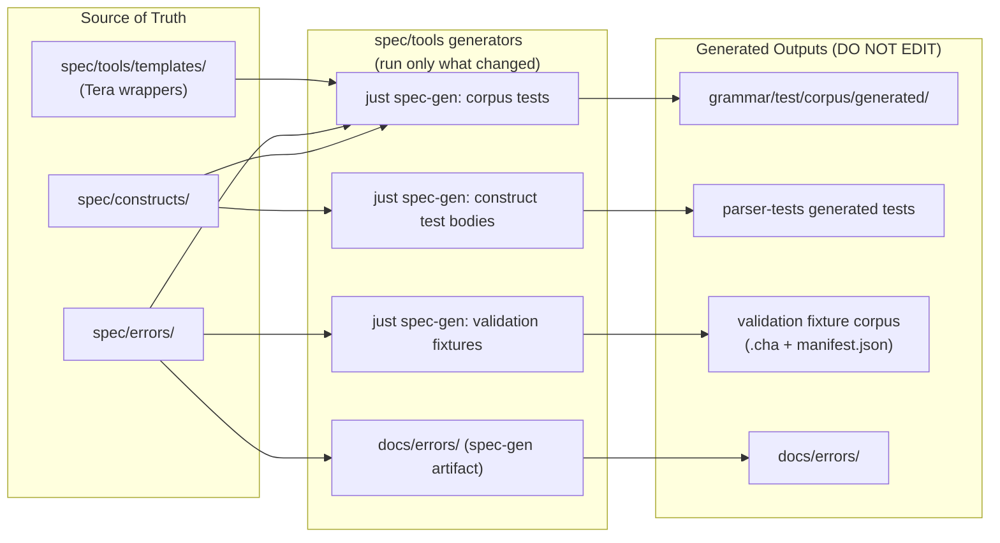
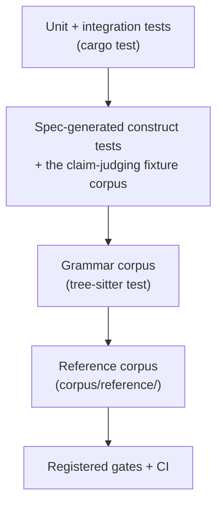

# Testing

**Status:** Current
**Last modified:** 2026-08-27 00:33 EDT

What the test layers are and which one to reach for. The commands to run
routinely, and what each costs, are in
[Developer Verification Checks](dev-checks.md); how they relate to CI is in
[Testing and Quality Gates](quality-gates.md).

## One integration binary per crate

Each crate has a SINGLE integration test binary (`tests/integration/`), so
tests are selected by NAME FILTER, never by target name:

```bash
cargo test -p talkbank-parser-tests --tests <filter>     # correct
cargo test -p talkbank-parser-tests --test  <name>       # fails: no such target
```

`--test <name>` names a compilation target, and the per-file targets it used to
name no longer exist. It does not fall back to filtering: it errors with
`available test targets: integration, parser_suite`. Every command on this page
was checked by running it.

## Test generation pipeline

Specs are the source of truth. Grammar corpus tests, Rust parser tests, the
validation fixture corpus and the local error pages are all **generated** from
specs and are never hand-edited.


```mermaid
flowchart LR
    subgraph sources["Source of Truth"]
        constructs["spec/constructs/"]
        errors["spec/errors/"]
        templates["spec/tools/templates/\n(Tera wrappers)"]
    end

    subgraph generators["spec/tools generators\n(run only what changed)"]
        gen_ts["just spec-gen: corpus tests"]
        gen_rust["just spec-gen: construct test bodies"]
        gen_validation["just spec-gen: validation fixtures"]
        gen_docs["docs/errors/ (spec-gen artifact)"]
    end

    subgraph outputs["Generated Outputs (DO NOT EDIT)"]
        ts_tests["grammar/test/corpus/generated/"]
        rust_tests["parser-tests generated tests"]
        val_corpus["validation fixture corpus\n(.cha + manifest.json)"]
        error_docs["docs/errors/"]
    end

    constructs & errors --> gen_ts
    templates --> gen_ts
    constructs --> gen_rust
    errors --> gen_validation
    errors --> gen_docs

    gen_ts --> ts_tests
    gen_rust --> rust_tests
    gen_validation --> val_corpus
    gen_docs --> error_docs
```

To add a grammar or error test, add a spec under `spec/constructs/` or
`spec/errors/` and regenerate. [Spec Workflow](spec-workflow.md) owns those
commands and writes each one out; they are not repeated here.

## Never-regress gates

These guard behaviour a successor cannot easily re-derive. Any commit touching
the grammar, parser, model, validation, serialization or alignment runs the
matching gates and keeps them green.

**A red gate is a bug until proven otherwise**, never a test expectation to
quietly update. That cuts both ways: a diagnostic that looks BETTER after a
change earns the same scrutiny as one that looks worse.

| Gate | Command | What it protects |
|---|---|---|
| Parser parity oracle | `cargo test -p talkbank-parser-re2c --test integration equivalence_reference_corpus` | The re2c oracle and the tree-sitter parser agree on every reference file, compared with `SemanticEq`. A divergence means one parser is wrong, or a construct spec is missing. |
| Reference corpus parses | `cargo test -p talkbank-parser-tests --tests reference_corpus_parses` | Every reference file parses cleanly with the tree-sitter parser. Compares nothing; this row claimed to be the parity oracle until 2026-08-26, and that crate cannot be one, since it does not depend on the re2c parser. |
| Roundtrip idempotency, and reference coverage | `cargo test -p talkbank-parser-tests --tests roundtrip_reference_corpus` | parse, serialize, re-parse yields a semantically identical AST (`SemanticEq`) for EVERY reference file. One test carries both guarantees: it iterates the whole corpus (coverage) and checks semantic equality on each (idempotency). |
| Generated spec tests | `cargo test -p talkbank-parser-tests --tests generated_tests` | Every construct spec still parses cleanly. (Error specs no longer feed this: R4 deleted the string-based error tests as strictly weaker than the fixture corpus plus the observation snapshot.) |
| Validation error corpus | `cargo test -p talkbank-parser-tests --tests validation_error_corpus` | Every ERROR-spec example (both stages, since R4) still satisfies its CLAIM against its generated `.cha` fixture, absences included. |
| The gate registry | `cargo test -p talkbank-parser-tests --tests gates` | Runs every registered repository-wide gate, including error-code spec coverage, construct coverage, catch-all protection, golden-word validity and spec status. |

File and test counts deliberately appear nowhere on this page. They change
weekly; ask the tree (`rg --files -g '*.cha' corpus/reference | wc -l`) rather
than trusting a number in prose.

## The gate registry

A repository-wide gate computes findings and must FAIL when there are any.
Written freehand that is two steps, and the second step kept going missing: a
check inside `main()` that CI never invoked, a `#[test]` that printed its
findings and asserted nothing, a `--check-only` mode that reported "Found N
invalid words" and returned `Ok(())`, a coverage percentage compared to
nothing. Every one of those type-checks, because `()` and `Ok(())` are
perfectly good return types for "I printed something".

So a gate now implements the `Gate` trait in
`crates/talkbank-parser-tests/src/gate.rs`, whose only output is a verdict:
there is no method that yields findings without one, so "compute the list and
forget to act on it" is not expressible. Registration in `ALL` is the whole
mechanism, and a second gate checks the registry against the `impl Gate for`
declarations in the sources, in both directions, so a gate that is written and
not listed is a failure rather than a silence.

**Two checks remain unconverted** and are named in that module so it does not
read as finished: `verify_error_coverage.rs` still prints a coverage percentage
and compares it to nothing, and `validate_golden_words.rs` keeps a path whose
only caller is its own `main`. A `[[bin]]` in that crate sets `test = false`,
which is target selection, so such a binary is excluded from `--tests` as well
as never being run by CI. If you are citing a check as a gate, run it, then
break it on purpose and watch it fail, before believing the citation.

## The layers


```mermaid
flowchart TD
    unit["Unit + integration tests\n(cargo test)"]
    specgen["Spec-generated construct tests\n+ the claim-judging fixture corpus"]
    grammar["Grammar corpus\n(tree-sitter test)"]
    ref["Reference corpus\n(corpus/reference/)"]
    gates["Registered gates + CI"]

    unit --> specgen --> grammar --> ref --> gates
```

**Unit and integration.** `just test` (`cargo test --workspace --tests`).
Doctests are separate and are NOT run by `cargo test`; run
`cargo test --doc --workspace` when you change public API examples.

**Grammar corpus.** `cd grammar && tree-sitter test`, the right gate for
grammar structure changes. It does NOT detect a stale `parser.c`; see
[Grammar Workflow](grammar-workflow.md).

**Reference corpus.** `corpus/reference/`, organised by surface
(`annotation/`, `audio/`, `ca/`, `content/`, `core/`, `edge-cases/`,
`languages/`, `tiers/`, `word-features/`). It must stay at 100%, but it is a
SYNTHESIZED regression signal, not a validity authority. When a change rejects
a reference file, adjudicate the FILE against `spec/`, the grammar and real
corpus data, and fix the data or move it to `spec/errors/`. Weakening the
parser to keep a reference file green is the one response that is always wrong.
This page called the corpus "the ultimate arbiter of correctness" twice, which
is exactly the reasoning that would entrench a bad fixture.

## Running specific tests

```bash
cargo test -p talkbank-model                      # one crate
cargo test -p talkbank-parser-tests --tests mor   # by name filter
cargo test -p talkbank-model -- --nocapture       # show stdout from passing tests
```

`--nocapture` goes after `--`; it is an argument to the test harness, not to
cargo. This page used to give `cargo test --no-capture`, which is not a flag
either program accepts.

## What to run when

| What you changed | Run |
|---|---|
| Grammar (`grammar.js`) | the whole [Grammar Workflow](grammar-workflow.md), including the typed-traversal regeneration |
| Parser (CST to model) | `cargo test -p talkbank-parser`, plus parser equivalence and roundtrip |
| Model (types, validation, alignment) | `cargo test -p talkbank-model`, plus roundtrip |
| CLI | `cargo test -p chatter` |
| LSP | `cargo test -p talkbank-lsp` |
| Spec files | regenerate per [Spec Workflow](spec-workflow.md), then `just test-spec` and the gate registry |
| Either registry (symbols, form markers) | `just test-spec`, which includes the drift gates |
| Anything, before pushing | `just gate`, or `just push` which runs it |

## Mutation testing

`cargo-mutants` finds code that can be changed without any test failing, which
is the real coverage question. It is not part of CI; run it periodically after
significant changes.

```bash
cargo install cargo-mutants
cargo mutants -p talkbank-parser --timeout 120 --jobs 1
cat mutants.out/missed.txt    # mutations no test caught
```

`--jobs 1` keeps memory bounded. Configuration is `mutants.toml` at the repo
root, which excludes trivial functions.

## Adding tests, and when not to

Before writing a test, ask whether a TYPE could make the bad value
unrepresentable instead. A test guarding an invariant is a standing admission
that nothing enforces it; changing the type deletes the test, covers callers
the test never enumerated, and fails at the point of the mistake rather than in
CI. Reducing the test count this way is an explicit pre-1.0 goal.

What legitimately survives that question: wire formats, roundtrips between a
formatter and a parser that are two separate functions, measurements, policy
choices with real alternatives, and behaviour a signature cannot describe. A
surviving test says which of those it is, in its own docstring.

When a test is the right answer:

- **Model behaviour**: the crate's `tests/` directory or a `#[cfg(test)]`
  module.
- **Grammar shape or validation contract**: add or update a SPEC and
  regenerate. A parser bug fixed without a spec will regress.
- **A repository-wide invariant**: implement `Gate` and register it, rather
  than writing a binary that prints findings.
