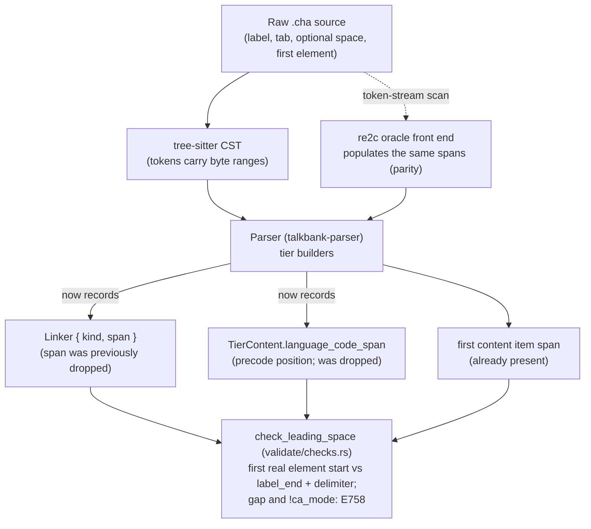

# Source-spacing validation on ground truth: removing the E758 constant-offset proxy

**Status:** Draft (main-tier phase implemented; header/dependent-tier phase awaiting a design nod)
**Last modified:** 2026-07-18 18:14 EDT

## Summary

E758 (leading space after the tier separator, CLAN CHECK 123) is
currently detected by a constant-offset span calculation with opt-out
hacks for span-less leading tokens. The root cause is a lossy model:
discourse linkers and the `[- code]` language precode are real source
tokens stored WITHOUT their positions. This proposal fixes that root
cause, give those tokens their spans (maintainer direction,
2026-07-18), and then detects E758 by the SAME exact-span comparison
the rest of the source-spacing family already uses. That removes the
opt-out hack, makes E758 exact, retires the constructed-offset proxy
(and a bespoke leading-whitespace field considered as an alternative),
and lets E758 extend uniformly to `@headers` and `%`-tiers (ruling
H.1). No release is pending; this is done deliberately, gated by the
corpus differential.

## Problem

`check_leading_space_on_main_tier` (in
`crates/talkbank-model/src/model/file/chat_file/validate/checks.rs`)
detects the leading space like this:

```rust
const COLON_AND_TAB: u32 = 2;
// ... skip if speaker_span is DUMMY ...
if !main.content.linkers.0.is_empty() || main.content.language_code.is_some() {
    continue; // <-- the opt-out hack
}
let expected = main.speaker_span.end + COLON_AND_TAB;
if first_content_start > expected { /* report E758 over the gap */ }
```

Two things make this a hack, not a measurement:

1. **It reconstructs a source fact from a constructed position.** There
   is no second real span to compare against (leading whitespace is the
   *absence* of a token), so the check invents an expected content
   position as `speaker_span.end + COLON_AND_TAB` and treats any later
   start as whitespace.
2. **It must opt out when a span-less leading token is present.**
   Discourse linkers (`+,`, `++`, `+"`, ...) and the `[- code]`
   utterance-language precode sit between the tab and the first content
   item, but the model stores them WITHOUT source positions, so their
   bytes are indistinguishable from whitespace in the gap arithmetic.
   The check therefore skips any tier that has a linker or precode. That
   is a deliberate false-negative: a genuine `*CHI:<tab><space>+, text`
   is silently accepted.

Extending this proxy to `@headers` and `%`-tiers (H.1) would mean
replicating constant-offset arithmetic and its opt-out reasoning for
each heterogeneous tier type. That multiplies the hack rather than
fixing it.

## The family context (what is NOT a hack)

E758 is one of a family of source-spacing rules. The others detect
*glued* tokens (two items with no separating space) by EXACT span
adjacency, comparing two real spans:

- E757 code-glued-to-following-word: `next_start == retrace.span.end`
- E751 pause-glued-to-word: `pause.span.start == prev_word_end`
- E258 / E259 / E749 comma spacing: `start == comma_span.end`, etc.

These are ground truth: if span B starts exactly where span A ends, the
two tokens were literally adjacent in the source. They compare two real
spans and need no constructed position and no opt-out. **They are
correct and out of scope for this proposal.** E758 is the sole outlier
because leading whitespace has no second token to anchor to.

## Root cause

The opt-out exists because real source tokens are stored without their
positions:

- `Linker` (`crates/talkbank-model/src/model/content/linker.rs`) is a
  fieldless enum: it records WHICH linker, never WHERE.
- The utterance-language precode is a position-less
  `language_code: Option<LanguageCode>` on `TierContent`.

The model discards a layout fact that the leading-space rule needs.
Reconstructing it downstream is what forces the proxy.

## Options

### A. Give every real leading token a source span (recommended)

Make `Linker` carry a span, and give the `[- code]` language precode a
span. Crucially, the precode span does NOT go on the shared
`LanguageCode` newtype (`LanguageCode(pub Arc<str>)`), which is also
used by the `@Languages` and `@ID` headers where a precode position is
meaningless; it goes at the `TierContent` field level (a
`language_code_span: Option<Span>` beside `language_code`, or a small
precode wrapper struct). With every leading element spanned, E758 is
the same EXACT-span comparison the rest of the family already uses: the
tier's first real element (linker, precode, or content) either starts
immediately after the tab delimiter, or there is a gap. No constructed
offset, no opt-out, no bespoke field.

- Pro: fixes the actual root defect (a lossy model that drops real
  token positions); unifies E758 with E751/E757/comma on one paradigm;
  removes the linker/precode false-negative; and the same first-element
  span carries the header/`%`-tier extension. Other features (precise
  linker diagnostics, span-shift on edits, roundtrip fidelity) benefit.
- Con: a real but bounded ripple, `Linker` grows a span (touching its
  `SpanShift`/`SemanticEq` derives and every `match` on it), the parser
  and the re2c oracle must populate the new spans, and a
  span-less-token audit should confirm linkers/precode are the only
  real tokens missing positions. The span is `#[serde(skip)]`, so no
  JSON-schema change. Larger than option B, but it is the correct fix,
  not a workaround.

### B. Capture the leading-whitespace fact at parse time (considered; not chosen)

The property E758 checks is purely local to a tier's prefix: "in the
raw source, is there whitespace immediately after the tab delimiter,
before any tier content (including linkers/precodes)?" That fact is
visible exactly once, when the parser builds the tier from the CST
(the grammar keeps `WHITESPACES` nodes). Record it as a typed field:

```rust
/// Source span of illegal whitespace between the tier's tab delimiter
/// and its first element, or None. Set by the parser from the CST;
/// skipped in JSON (layout, not content), like `content_span`.
pub leading_whitespace: Option<Span>
```

E758 validation becomes a trivial, exact read, uniform across every
tier family:

```rust
if !ca_mode && let Some(ws) = tier.leading_whitespace {
    report E758 at ws
}
```

- Pro: exact ground truth; no constructed position; NO opt-out (works
  with linkers/precodes present); uniform for main, header, and
  dependent tiers; captured at the one place that sees the source, read
  trivially where the file-level check already runs; no `validate()`
  signature change and no raw-source plumbing.
- Con: adds one narrow field to the tier-carrying types and requires the
  parser (and the re2c oracle's front end) to populate it. A
  purpose-built field rather than a general span improvement.

### C. Source/CST lexical pass at validation time

Thread the raw source (or CST) into the validator and scan tier lines.

- Con: the model-level validator has no source today; plumbing it
  ripples every `validate()` call site, and it introduces a SECOND
  detection paradigm for one code while the rest of the family uses span
  comparison. Rejected: fragments the architecture.

## Recommendation

**Option A** (maintainer direction, 2026-07-18). The right fix is to
repair the lossy model, not to route around it. Linkers and the
language precode are real source tokens; giving them spans is correct
independent of E758 (it is the same invariant every other token in the
model already satisfies), and once they have spans, E758 collapses into
the exact-span comparison the rest of the source-spacing family already
uses, so the whole family runs on one paradigm with no proxy, no
opt-out, and no bespoke field. Option B (a purpose-built
leading-whitespace field) is a smaller change and would also be exact,
but it treats the symptom (adds a field so E758 can avoid the missing
spans) rather than the cause (the missing spans), and leaves the model
still dropping real token positions; it is recorded above only as the
considered alternative. Option C is rejected (plumbing + a second
paradigm).

## Data flow



## Placement

- **`Linker`** (`crates/talkbank-model/src/model/content/linker.rs`)
  gains a span. Preferred shape: `struct Linker { kind: LinkerKind,
  span: Span }` (extract the current fieldless enum into `LinkerKind`),
  so every `match` moves to `linker.kind` and the span rides alongside.
  Mark the span `#[semantic_eq(skip)]` (position is not semantic) and
  let `SpanShift` shift it.
- **The `[- code]` precode** gets its position via a
  `language_code_span: Option<Span>` field on `TierContent` beside the
  existing `language_code`, NOT by changing the shared `LanguageCode`
  newtype (which the `@Languages` / `@ID` headers reuse). Skip it in
  serde/semantic-eq like `content_span`.
- **First-element accessor.** Add a helper that returns the source start
  of a tier's first real element in document order, checking linker span,
  then precode span, then first content item span. E758 uses it for
  main, header, and dependent tiers uniformly; the header/`%`-tier value
  start reuses the same idea against each tier's own first element.
- The parser (and re2c oracle) populate the new spans from the CST byte
  ranges. CA-gating stays where it is (file-level, in the validate
  orchestrator).

## TDD and gating plan

1. **RED.** Generalize `spec/errors/E758_*` to the tier-agnostic rule
   and add examples: an `@header` leading space, a `%`-tier leading
   space, AND the previously-impossible `*SPK:<tab><space>+, ...`
   (linker + leading space) case the opt-out silently accepted.
   Regenerate the validation corpus; confirm the new fixtures fail.
2. **Model + parser (spans on real tokens).** Add the span to `Linker`
   (via `LinkerKind`) and the `language_code_span` to `TierContent`;
   populate both in the tree-sitter parser and mirror in the re2c oracle
   front end. This is its own red/green sub-cycle with parser-equivalence
   and roundtrip as the gate, isolatable from E758.
3. **GREEN.** Rewrite `check_leading_space_on_main_tier` (rename to drop
   `_on_main_tier`) to compare the first-real-element start to
   `label_end + delimiter` over main, header, and dependent tiers;
   delete the linker/precode opt-out and the `COLON_AND_TAB`-style
   constant assumption.
4. **Regression.** `parser_equivalence` and
   `roundtrip_reference_corpus` stay green; the new spans are
   `#[serde(skip)]`, so no schema change. Confirm no `match` on the old
   `Linker` enum was left unported.
5. **Corpus differential.** Run
   `scripts/release/chatter_corpus_differential.sh` against the fleet's
   archived binary. The exact check will now fire on non-CA
   linker/precode + leading-space cases the proxy skipped; per the
   2026-07-18 scan (zero non-CA leading-space `@header`/`%`-tier files)
   the expected new-hit count is zero, but any new instance is
   adjudicated INTENDED (clean the data) vs UNINTENDED (regression) per
   the standing tripwire rule.

## Non-goals

- E751 / E757 / comma spacing: already exact; unchanged.
- Option A (spans on all linkers/tokens): a separate, optional model
  improvement; explicitly not bundled here.
- No release is triggered by this work (the freeze holds); it lands on
  `main` and ships whenever the next release is cut.

## Implementation status (2026-07-18)

### Phase 1 (main tier): DONE, Option A as recommended

- Linkers carry spans (commit `0a2b0c6a`, `Linker { kind, span }`).
- The `[- code]` precode carries a span: a new
  `TierContent::language_code_span: Option<Span>` (serde / schemars /
  semantic_eq skipped, so the JSON wire and schema are byte-identical),
  populated in the tree-sitter main-tier body parser from the `langcode`
  node (whose `.start` is the opening `[`).
- `check_leading_space_on_main_tier` was rewritten to compare
  `first_element_start(main)` (the earliest non-dummy start among leading
  linker, precode, and first content item) against the byte after the tab,
  and the linker/precode opt-out plus the `COLON_AND_TAB` proxy framing
  were removed.
- Verified: `linkers.cha` and `language-switching.cha` (clean
  linker/precode lines, previously SKIPPED by the opt-out, now CHECKED)
  stay valid; the main-tier fixture still fires E758.

Empirical refinement to the plan: a leading space directly BEFORE a linker
or precode (`*CHI:<tab><space>+, ...`, `*CHI:<tab><space>[- spa] ...`) does
NOT parse as a clean linker/precode; the grammar recovers and surfaces
**E316** (parse recovery), not E758, for BOTH. So dropping the main-tier
opt-out is behavior-preserving for reachable cases (the hidden cases were
already flagged, as E316) and is a pure hack-removal + model-fidelity win.
Closing the E316 case as E758 needs grammar work to accept leading
whitespace before a linker/precode; it is deliberately deferred (open
question for the maintainer: is E316 an acceptable flag there?).

### Phase 2 (headers + `%`-dependent tiers, ruling H.1): DESIGN DECISION PENDING

Extending E758 to `@headers` and `%`-tiers (Example 2 / Example 3 in the
generalized spec, both currently RED with `got []`, i.e. the grammar
TOLERATES the leading space and parses clean spans, so this is purely a
validation gap, no grammar work) needs each dependent-tier line and each
header to expose two source bytes: the byte after its `label:` colon, and
the start of its first real content element. The model does NOT expose the
latter today: every dependent tier stores only a WHOLE-LINE span
(`DependentTier::span().start` is the `%`), and headers likewise come to
validation as `(&Header, whole-line Span)` pairs. So Phase 2 requires new
per-line after-separator span storage.

**The design choice (flagged in the prior handoff as "a real refactor;
confirm before starting").** Two shapes give every dependent tier a
uniform after-separator span:

- **(recommended) a line wrapper.** Change the utterance field from
  `SmallVec<[DependentTier; 3]>` to `SmallVec<[DependentTierEntry; 3]>`
  where `DependentTierEntry { tier: DependentTier, content_span:
  Option<Span> }`, with `#[serde(transparent)]` + `#[schemars(transparent)]`
  over `tier` (content_span serde/schemars/semantic_eq skipped). This is
  the SAME provenance-only pattern the linker-spans commit used: the JSON
  wire and the JSON Schema stay byte-identical, so `committed_schema_matches_model`
  stays green and the entire blast radius is compile-time-checked Rust
  reader churn, not a data change. One clean span home; mirrors how the
  main tier carries `content_span` on `TierContent`.
  - Blast radius (surveyed 2026-07-18): 1 field declaration
    (`crates/talkbank-model/src/model/file/utterance/core.rs:107`),
    4 construction sites, ~110 read/iterate sites across talkbank-model
    (accessors.rs alone is 31 mechanical `entry.tier` unwraps),
    talkbank-parser (dispatch `push` sites), talkbank-transform,
    talkbank-lsp, and tests, plus the `replace_or_add_tier` helper whose
    signature mirrors the field's container type. All mechanical and
    compiler-enforced.

- **per-type field.** Add a `separator_span` to each of ~20 distinct tier
  structs (Mor/Gra/Pho/Sin/Wor/Act/Cod, the 7 bullet-tier structs,
  TextTier, UserDefined, Tim, Syl, Phoaln, Xphoint) plus a
  `DependentTier::separator_span()` accessor mirroring the existing
  `DependentTier::span()`. Zero reader churn (enum shape unchanged), but
  duplicates the field across ~20 types and touches ~15 parser sites.

Both then feed a uniform E758 helper `leading_gap(colon_end,
first_element_start)`; headers get the same after-separator span in the
header dispatch (`header_dispatch/parse.rs`).

**Recommendation: the wrapper** (DRY single home, mirrors the
main-tier/linker patterns, wire/schema unchanged via serde-transparent).
The per-type alternative avoids reader churn but duplicates the concept
across ~20 structs, which reads worse against the "one home for a concept"
house rule.

**Why this phase is not auto-committed here:** it is a core-model field
change across five crates, it was explicitly flagged for confirmation, and
it has ZERO current data impact (the 2026-07-18 scan found no non-CA
leading-space header/`%`-tier files in the kept corpus, so no wild file
changes verdict either way). It is queued for a design nod rather than
committed unreviewed; on approval it is a mechanical, well-scoped
implementation driven by the two RED fixtures.
